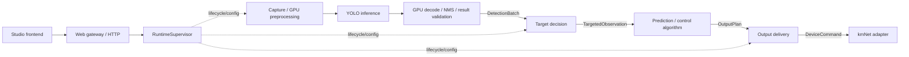

# NovaSight Project Health Ledger

Last reviewed: 2026-09-21

Visual-path correction, 2026-09-20: the current image-processing authority is
[the GPU image pipeline contract](docs/gpu-image-pipeline.md). The older health
and test snapshot below remains revision-bound, not a new hardware receipt.

This file is the current engineering-health authority for NovaSight. It records
the maintained product path, known risks, ownership boundaries, and the next
safe development work. Historical plans under `docs/superpowers/` are context,
not instructions, and must not override the current code or this ledger.

## Current Product Authority

NovaSight is a Jetson-first Rust application with a React Studio management UI.
The supported production path is:

```text
NVIDIA hardware media capture/decode
-> NVMM ROI crop/resize
-> CUDA RGB/BGR NCHW preprocessing
-> direct TensorRT device inference
-> CUDA decode/filter/sort/NMS
-> validated DetectionBatch (image-pipeline delivery boundary)
-> target selection/tracking/prediction
-> continuous angular control
-> bounded device command
-> native kmNet output
```

Production behavior is owned by the Rust process. Python is not part of the
tracked product source or runtime. `novasightd` enables its `deepstream` feature
by default; non-Linux builds are development/reference environments and do not
prove the Jetson production composition.

The normal deliverable is the portable directory produced by
`novasight-packager`. Direct daemon startup, Vite development, reference native
libraries, and host-side tests are diagnostic/development paths.

## Recorded Workspace Baseline

The hosted reference available when this review began was `cab7b53`, verified
by quality workflow run `32351850209` on 2026-08-20. The candidate evaluated in
this review included the changes after `c3d4057` and passed the host gates below
before submission. For every newer revision, the Actions run bound to its exact
SHA—not a mutable "latest run" copied into this file—is the current hosted
receipt. A later source revision must pass the same gates before inheriting the
baseline:

| Area | Current state | Health signal |
| --- | --- | --- |
| Rust workspace | 15 packages | Mainline is fully Rust-owned; locked workspace tests pass |
| React Studio | TypeScript/CSS application | Typecheck, unit/contract, mocked browser, visual, and production-build gates pass |
| Tracked Python | 0 files | Legacy Python audit advice is retired |
| Rust host checks | Full locked workspace suite passed | Strong domain/reference evidence, not Jetson proof |
| Portable native contracts | 9 C++ tests passed | Latest-only and reference ABI contracts are covered |
| Frontend checks | 35 unit/contract and 30 mocked browser cases passed, plus static/build gates | Interaction and presentation contracts are automated |
| Hosted automation | macOS Rust, Studio, browser, and dependency-audit gates are active; Linux ARM64 portable gate is configured | Jetson hardware jobs remain separately gated; Actions history supplies per-SHA results |

This snapshot is revision-bound evidence, not a promise that later unverified
edits pass the same gates. At the start of the 2026-09-21 maintenance review,
the local `develop-alpha` checkout was at `57b1923`. The target-decision
replacement in that commit has its own test notes under
`docs/superpowers/plans/2026-09-21-target-decision-policy-replacement.md`;
neither the August baseline nor this document proves that the commit was pushed,
deployed, or exercised with live camera and physical output. Verify each claim
against the exact commit and environment before promoting it to a release
receipt.

Local checks during this 2026-09-21 maintenance review: the
`novasight-core` `tracking_contract` test target passed 37/37, the
`novasight-pipeline` detection-to-output test target passed 13/13, and the Web
unit/contract run passed 63/63 with TypeScript typecheck passing. These checks
exercised the local source at `57b1923` plus the uncommitted frontend module
move; they do not replace full workspace, hosted CI, Jetson, or physical-device
receipts.

## Maintenance and Authorization Boundaries

- Investigation and architecture review are read-only. A recommendation or a
  plan is not permission to rename modules, delete compatibility code, commit,
  push, deploy, or operate hardware.
- A request to implement a feature permits the scoped local edits and relevant
  non-actuating checks. Commit, push, SSH synchronization, release deployment,
  and physical movement are separate actions; do not infer them from a general
  request to "maintain" or "clean up" the project.
- Document assumptions that change target choice, authorization, capture
  format, or physical output before treating defaults as accepted product
  policy. The six target-selection weights in `57b1923` are implementation
  defaults, not an empirically established optimum or a user-approved game
  fairness criterion.
- Preserve compatibility and fail-closed safety code unless a caller audit,
  migration path, and relevant tests show it is safe to remove. File length,
  number of crates, and a small module are investigation signals, not deletion
  evidence.
- Report local source checks, hosted CI, Jetson execution, and physical-device
  behavior as distinct receipts. An unrun check is `UNKNOWN`, never a pass.

## Maintained Ownership Boundaries

| Module | Primary ownership | Boundary to preserve |
| --- | --- | --- |
| `novasight-core` | Domain types, freshness, targeting, tracking, prediction, control laws | No HTTP, GStreamer, TensorRT, database, or device transport knowledge |
| `novasight-pipeline` | Owned worker threads, latest-only slots, preview/crosshair hubs, control execution | Accept validated domain observations; keep queues bounded |
| `novasight-runtime` | Sole lifecycle actor, configuration transactions, model activation, immutable snapshots | One authority for start/stop/update and fail-closed output |
| `novasight-api` | HTTP/WebSocket projection and control surface | Delegate mutations to `RuntimeHandle`; do not become a second runtime |
| `novasight-store` | Config persistence, model catalog/deployments, license persistence | Keep filesystem/database authority explicit; avoid leaking broad store dependencies |
| `novasight-platform-jetson` | V4L2, DeepStream session, kmNet native transport, Jetson clock | Vendor/platform types stop before `DetectionBatch` |
| `novasight-tensorrt` | Narrow TensorRT C ABI and output decoding | Validate shapes/dtypes before unsafe/native execution |
| `novasight-deepstream-bridge` | Narrow owned metadata copy across the C ABI | Never retain vendor-owned metadata pointers |
| `apps/novasightd` | Production composition root | Linux + default DeepStream is the real product composition |
| `web` | Studio management and diagnostics | Never enter the real-time control loop |

## Product Module Areas and Seams



The arrows are typed handoffs, not permission for every area to import every
other area's implementation. `novasight-pipeline` owns the worker handoffs and
their epoch, freshness, generation, and output-gate checks; splitting those
workers into extra public crates would expose more state without weakening a
real dependency.

| Area | Current implementation and interface | Must not own |
| --- | --- | --- |
| Frontend | `web/src/contracts/` decodes transport data; `web/src/features/` owns presentation and operator actions. Internal class policy lives under `features/targeting/`. | GPU tensors, frame loops, device safety decisions |
| Capture and YOLO inference | `novasight-platform-jetson`, `novasight-tensorrt`, and `native/` own frame preparation and model execution. | Target ranking, class-role interpretation, movement demand |
| Detection-result production | TensorRT/CUDA decode and NMS plus `novasight-tensorrt/src/gpu.rs` validate a bounded final result and publish `novasight-core::DetectionBatch` through `PipelineIngress`. | CPU tensor reinterpretation, internal target policy, physical output |
| Target and control algorithms | `novasight-core::tracking`, `prediction`, and `controller` consume validated detections and produce a target choice and `AimResult`. `raw class_id` remains detector fact; internal preferences are separate policy. | TensorRT, HTTP, database, kmNet transport |
| Algorithm-output receiver | The private `TargetedObservation` and `OutputPlan` handoffs and device worker in `novasight-pipeline` combine recoil, limits, current gates, and freshness before `PointerDevice::send`. | YOLO parsing, target-class scoring, frontend state |
| Runtime authority | `novasight-runtime::RuntimeSupervisor` composes the above areas and owns lifecycle/configuration transactions. | A second selection algorithm or a second physical-output authority |

Keep the existing `DetectionBatch`, `TargetSelection`, `AimResult`, and
`DeviceCommand` interfaces. Introduce a new adapter only when a real second
implementation or test seam requires it; do not create a generic message bus
or duplicate the runtime's configuration model merely to make the diagram
look disconnected.

Remaining locality work is explicit, not silently treated as complete:
`web/src/features/studio/algorithmParameterModel.ts` still groups both target
and control settings for one Studio screen, and the Jetson adapter still uses
the model manifest from `novasight-store`. Change either only with its callers
and tests in scope; neither justifies a new crate by itself.

## Current Safeguards

- Runtime commands are typed and owned by one supervisor actor.
- Runtime status is published as immutable watch snapshots.
- Urgent stop and supervisor drop latch physical output closed.
- Latest-only slots and runtime epochs reject stale replacement and old-session
  data.
- Detection freshness, target identity, device commissioning, and output enable
  state gate physical commands.
- The production image path copies only bounded final CUDA detection results
  into Rust; legacy DeepStream metadata snapshots are isolated comparison seams.
- TensorRT and preprocess native code are isolated behind versioned C ABI
  contracts.
- Configuration loading rejects unknown control fields and unsafe path identity
  changes.
- TCP API/WebSocket callers must establish a Web/API-process-local operator session;
  the owner-only launcher access file is separate from license authorization.
- Runtime and hardware license requirements are decided from the effective
  output configuration, not the transient output gate.
- Cargo, web, package, logs, models, and local runtime outputs stay ignored.

## Active Findings

### Closed locally: Strict lint and workspace tests

On 2026-08-20, manifest/lockfile validation, formatting, strict workspace
Clippy, and the full workspace test suite completed successfully. The workspace
test command needed normal localhost UDP permission for the kmNet loopback
contract; the restricted sandbox failure was not a product failure. One stale
prediction test had inherited the production default lead and was made explicit
with `prediction_lead_ms: 0.0`, preserving the test's intended isolation.

### P1: Complete the Jetson quality gates

The tracked `.github/workflows/quality.yml` runs portable checks on GitHub-hosted
macOS, x64 Ubuntu, and ARM64 Ubuntu runners, explicitly verifies
manifest/lockfile agreement, and keeps the generic ARM64 build independent from
NVIDIA hardware. It separates those hosted contracts from the Jetson release
build and hardware production acceptance. The two hardware jobs remain disabled
until a Jetson runner and repository variables are configured, so production
automation remains `PARTIAL`.

Portable host gate (macOS; production Linux modules remain Jetson-gated):

```bash
cargo fmt --all -- --check
cargo clippy --workspace --all-targets --locked -- -D warnings
cargo test --workspace --locked
pnpm --dir web typecheck
pnpm --dir web visual:audit
pnpm --dir web build
```

Jetson build/safe-start gate:

```bash
NOVASIGHT_WEB_ACCESS_CODE=<64-hex-job-local-code> \
  scripts/ci/jetson-production-acceptance.sh build
```

Protected production receipt:

```bash
NOVASIGHT_WEB_ACCESS_CODE=<64-hex-job-local-code> \
NOVASIGHT_JETSON_MODEL_FIXTURE_DIR=<runner-provisioned-model-directory> \
  scripts/ci/jetson-production-acceptance.sh production
```

The production receipt validates caller rejection/authenticated session/CSRF, signed license
activation, model registration/publish and `novasightd --check`, real DeepStream
metadata, freshness/latency, capture start/stop/restart, emergency stop, and
zero kmNet receipts while output is deliberately disabled. Physical kmNet
actuation remains a separately supervised commissioning receipt; CI must not
move operator hardware merely to make a build green.

### P1: Keep production truth separate from portable reference evidence

macOS can validate domain logic, pipeline ownership, DeepStream pipeline-string
contracts, TensorRT reference ABI, and preprocess reference ABI. It cannot prove
DeepStream SDK loading, NVMM import, real TensorRT execution, V4L2 capture, or
kmNet hardware behavior. Those remain `UNKNOWN` until a Jetson receipt exists.
A successful GitHub-hosted ARM64 gate proves for that SHA that the portable
Rust/Linux composition compiles and its no-hardware tests pass on aarch64; it
does not change the NVIDIA and physical-device boundary.

### Closed locally: Authenticated Web/API/daemon composition

The host composition contract starts the real host-preview daemon and Web/API
processes, then crosses the public HTTP interface and private Unix socket. It
verifies anonymous and invalid-code rejection, server-side login, CSRF,
process-random temporary activation through the same endpoint as a formal
license, fail-closed runtime state, emergency stop, configuration revision
conflict, configuration write-failure containment, local-only shutdown denial,
daemon-disconnect projection, and logout revocation. A separate public-interface
WebSocket test proves logout closes an already-established status connection
with code 4403.

The contract runs in the GitHub-hosted ARM64 job. It proves portable process
composition for the successful SHA, not DeepStream, TensorRT, camera, or kmNet
hardware behavior.

### P2: Extend behavior coverage at real hardware boundaries

Current Rust coverage is strongest in domain, configuration, pipeline, runtime,
and native-contract logic. Studio unit/contract tests and mocked Playwright
journeys cover its critical interaction states. Authenticated Web/API/daemon
composition is now exercised on a portable host. The remaining gap is
hardware-backed behavior. Add coverage when test work is explicitly in scope;
do not inflate production modules with test-only seams.

Covered external boundaries:

1. panel identity, license, and trusted-local-control middleware;
2. start/stop/emergency-stop HTTP behavior;
3. established WebSocket shutdown on Session logout;
4. configuration revision conflict plus unchanged file and in-memory state after
   an injected persistence failure;
5. Studio launch, save, retry, and runtime-disconnect flows.

The first four have host-side public-interface receipts; Studio behavior stays
covered by unit/contract and mocked browser journeys. Real
camera, NVIDIA runtime, and physical-device receipts remain Jetson-gated.

### P2: Reduce concentrated ownership when related code is next touched

Do not split files solely to reduce line counts. Extract only around existing
semantic ownership:

- `StudioConsoleView.tsx`: page-level state hooks, runtime projection helpers,
  launch orchestration, and preview overlay;
- `novasight-runtime/src/supervisor.rs`: lifecycle transitions, model activation
  transaction, device diagnostics, and pipeline notice handling;
- `novasight-store/src/model_catalog.rs`: SQLite repository, filesystem scanner,
  deployment transaction, and response projection;
- `novasight-api/src/control.rs`: router construction, middleware, HTTP handlers,
  and WebSocket session handling.

Each extraction must preserve one runtime authority and avoid parallel sources
of truth.

### P2: Close supply-chain maintenance gaps

- Keep `Cargo.lock` and `web/pnpm-lock.yaml` tracked.
- Keep npm production audit and RustSec audit in automation.
- Add license/source policy only after the allowed proprietary dependency policy
  is written down.
- Replace deprecated `serde_yaml 0.9` through a dedicated config-compatibility
  migration; do not swap serializers without preserving existing YAML behavior.
- Audit oversized dependency boundaries with `cargo tree` and source usage
  before removing dependencies. No direct dependency is currently proven unused.

## Deferred Work

- Broad Studio or CSS rewrites without an active product requirement.
- Splitting crates only for aesthetic size targets.
- Removing DeepStream, TensorRT, kmNet, or native reference seams without current
  dependency and Jetson evidence.
- Renaming persisted configuration fields without a migration.
- Claiming zero-copy, latency, FPS, or production readiness from reference builds.
- Deleting local generated directories without an explicit cleanup request.

## Hard Stop Rules

- Do not reintroduce a Python runtime/backend beside the Rust authority.
- Do not let HTTP, WebSocket, or React state become a second runtime authority.
- Do not let vendor pointers or raw backend tensors escape the native/platform
  boundary.
- Do not reopen output after supervisor loss, stale observations, invalid model
  state, uncommissioned hardware, or device failure.
- Do not treat historical `docs/superpowers` plans as current requirements.
- Do not report a check as passed until its command has completed with exit code
  zero on the relevant platform.

## Decision Status

| Dimension | Status | Current conclusion |
| --- | --- | --- |
| Rust domain/runtime design | YES | Typed ownership and fail-closed seams are present |
| Host development baseline | YES | Locked metadata, formatting, strict Clippy, workspace tests, and Studio build pass locally |
| Studio static health | YES | Typecheck, visual audit, and build passed at the recorded baseline |
| Studio behavior coverage | YES | Unit/contract and mocked browser suites cover critical interaction states |
| Automated host CI | YES | Existing hosted gates are active; Linux ARM64 is configured and Actions history records each SHA's result |
| Jetson production readiness | UNKNOWN | Requires current hardware receipts |
| Dependency vulnerability status | YES | npm production and RustSec lockfile audits pass in hosted automation; RUSTSEC-2023-0071 is scope-reviewed and explicitly ignored |
| Documentation authority | YES | This ledger supersedes the deleted Python-era audit content |
