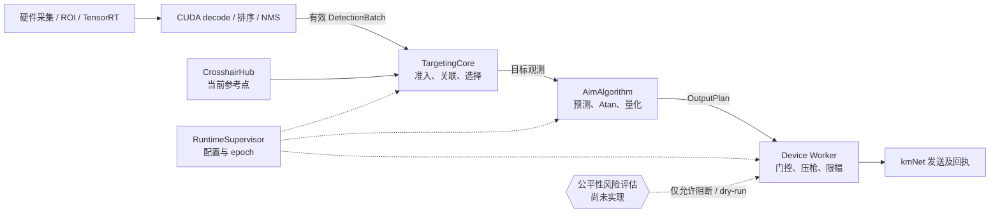

# 算法责任与安全自检地图

本图随工作空间源码维护，不代表某个旧提交的运行收据。每次自检先记录 `git rev-parse HEAD`，再检查下方链接对应的当前实现。`YES` 只表示代码契约或指定测试通过；真实画面、Jetson 和物理输出单独验收。

| 检查点 | 责任、当前证据和结论 | 验收级别 |
| --- | --- | --- |
| 感知到有效结果 | [GPU 结果校验](../crates/novasight-tensorrt/src/gpu.rs)只接受有界最终结果；[正式构造](../apps/novasightd/src/live_perception.rs)选择 TensorRT。`PARTIAL`：支持的模型契约已实现，真实非空检测与全格式通用性未通过。 | 旧 Jetson 收据；当前 SHA 待验 |
| 准星超时 | [CrosshairHub](../crates/novasight-pipeline/src/crosshair.rs)的 `observation_stale` 必须回退几何中心，不得继续持有过期视觉点；定向主机回归已通过。 | 源码 + 主机测试；实机待验 |
| 多目标与不同 cls | [关联](../crates/novasight-core/src/tracking/association.rs)把 raw cls 变化作为软代价；[选择](../crates/novasight-core/src/tracking/selection.rs)综合距离、大小、类别、置信度、连续性和运动；[拥挤帧](../crates/novasight-core/src/tracking/mod.rs)先按业务分数排序再限 16 个并保留当前锁定。`PARTIAL`：域测试不等于真实高速遮挡手感。 | 40 项主机合同；Jetson 待验 |
| 目标丢失 | [TargetingCore](../crates/novasight-core/src/tracking/mod.rs)保留短期身份，但丢失目标不发控制目标；不要把“等待身份”画成继续移动。 | 主机合同；现场待验 |
| 预测与控制 | [AimAlgorithm](../crates/novasight-core/src/controller/algorithm.rs)只处理当前观测的预测、Atan 和量化；[交付 worker](../crates/novasight-pipeline/src/runtime.rs)重新检查 generation / gate 并在压枪后限幅。`PARTIAL`：自身运动、检测噪声和动作延迟未由真实数据标定。 | 源码 + 主机合同；设备待验 |
| 瞄点热更新 | [目标配置更新](../crates/novasight-core/src/tracking/mod.rs)在瞄点比例变化时重建身份和预测历史；普通评分调参不重建。定向主机回归已通过。 | 源码 + 主机测试；非空目标实机待验 |
| 状态有效性传递 | [TargetingCore](../crates/novasight-core/src/tracking/mod.rs)的 Kalman 只参与身份关联；控制用当前 raw aim 和自己的短窗预测。未被 [交付](../crates/novasight-pipeline/src/runtime.rs)消费的 `target_state_valid` 已删除，避免把 Kalman 可靠性误称为控制预测开关。 | 源码 + 主机合同；设备待验 |
| 物理输出 | [Device Worker](../crates/novasight-pipeline/src/runtime.rs)是唯一发送点；触发、当前代、输出门与回执须在设备侧证明，不能用 UI“已生效”代替回执。 | 主机合同；实机未知 |
| 公平性异常 | “光标持续粘附目标”属于外部规则/产品合规风险，不能由检测准确率证明无异常。`NOT IMPLEMENTED`：若评估成立，只能阻断输出并记录 dry-run；不得引入伪装人类操作或规避检测的运动生成。 | 需求与安全边界；待实现/验收 |

## 前后责任与冲突核对

| 边界 | 当前代码事实 | 判断及后续检查 |
| --- | --- | --- |
| YOLO raw cls → 身份关联 → 业务类别偏好 | [关联成本](../crates/novasight-core/src/tracking/association.rs)用类别变化的软代价；[业务评分](../crates/novasight-core/src/tracking/selection.rs)另算类别优先级。允许类别集合仍是准入硬门。 | 未发现“必须同 cls 才关联”的冲突；需用真实跨类误识别轨迹标定权重，而非把 raw cls 改写为内部身份。 |
| 短暂保留身份 → 当前控制目标 | [目标选择](../crates/novasight-core/src/tracking/mod.rs)可保留丢失的锁定身份，但只从本帧确认且在 FOV 内的目标产出瞄点；[控制算法](../crates/novasight-core/src/controller/algorithm.rs)在 `target_valid=false` 时阻断并清除预测。 | 身份可等待，旧目标不得继续驱动物理命令；仍需真实遮挡/快移轨迹验证恢复与切换行为。 |
| 跟踪 Kalman → 控制短窗预测 | [目标评分](../crates/novasight-core/src/tracking/selection.rs)用 Kalman 速度只评价候选运动趋势；[AimAlgorithm](../crates/novasight-core/src/controller/algorithm.rs)用当前观测和独立的 `SingleTargetPredictor` 求瞄准偏移。 | 两者职责不同，未见 Kalman 预测位置再次叠加到控制误差；真实时间戳与噪声未标定，不推断数学最优。 |
| GPU 最终框 → CPU 结果校验 | [正式 GPU 边界](gpu-image-pipeline.md)只回传有界最终框；[结果校验](../crates/novasight-tensorrt/src/gpu.rs)拒绝越界/非法结果，不在 CPU 重做 decode、NMS 或修框。 | 合同方向一致；当前缺非空真实目标对照，不能由空帧证明排序/NMS 正确。 |
| 已保存输出许可 → 本次运行同意 → 最终发送 | [daemon 启动](../apps/novasightd/src/application.rs)先持久化暂停上次保存的输出许可，失败则拒绝启动；[Supervisor 初始状态](../crates/novasight-runtime/src/supervisor.rs)只按暂停后的配置建立输出门。[控制 API](../crates/novasight-api/src/control.rs)要求输出可能生效时的启动、重启、kmNet 连接、运行中模型发布/回滚/探测、配置 epoch 重载、开启输出及控制/流水线热更新请求显式确认，否则返回 428；关闭输出免确认。Studio 和本地 CLI 可传递该标记；[设备 worker](../crates/novasight-pipeline/src/runtime.rs)在发送前复核门控、代数、触发和设备连接。 | **仍未闭环**：静态调用链已核查已知内部重启入口，但请求标记不证明真人在场；新版 Jetson 服务和实机回执未验，不能据此宣称物理路径全部验收。 |

自检顺序：先核实输入和结果有效，再核实目标选择与缺失期间零旧命令，再核实预测/控制与输出回执；出现异常时保留同一帧的 `epoch / generation / captured_at`、目标 ID、门控决定和原始错误。禁止拿旧提交收据、空检测或模拟前端页面证明当前物理行为。

历史交互地图 `2026-08-31/develop-alpha@350a38f` 仅是当时的讨论快照；其中 `tracking.rs` 等路径与“已确认冲突”标签不能沿用为当前工作区事实。
