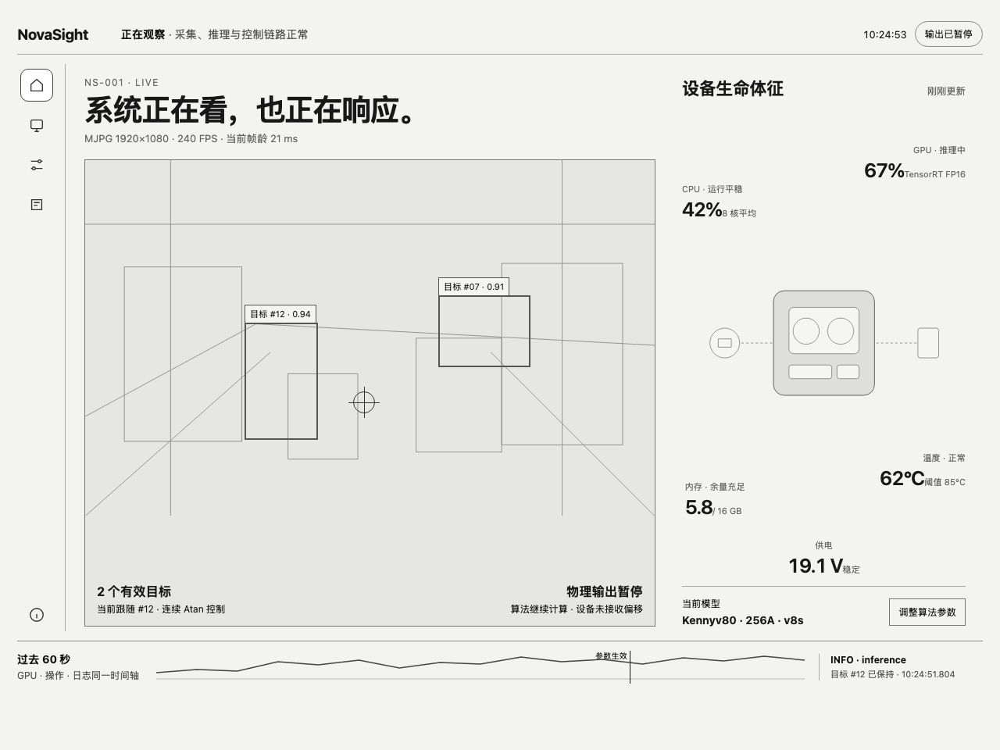

# Design: NovaSight Continuous Living Instrument

Generated by `/office-hours` on 2026-09-23
Branch: `develop-alpha`
Repo: `xi0yu/NovaSight`
Status: APPROVED
Mode: Builder

First-release scope authority: **`CEO Review — Accepted First-Release Scope` and the latest post-CEO Engineering Review override earlier review history where they differ.** Earlier option tables remain as decision evidence, not implementation requirements.

## Problem Statement

NovaSight Studio currently exposes capable Edge AI machinery through a presentation that still behaves like an administrative workstation. Repeated visual changes have not solved the underlying problem because the page structure, interaction rhythm, and information ownership still resemble the old product.

The redesign must start from a different product model: NovaSight is one continuously operating visual machine. The interface must let its owner see what the machine sees, understand how its body is behaving, change how it thinks, and trace what happened without translating internal concepts such as pipeline stages into a traditional dashboard.

This is an interaction-system redesign, not a theme pass. Reliable API contracts, runtime state, error evidence, and backend ownership remain; the old layout and card composition do not constrain the new interface.

## What Makes This Cool

The product's defining moment is a visible closed loop:

`live image → selected target → algorithm response → output state → resulting event`

The user should feel that NovaSight is alive because the interface continuously expresses cause and effect:

- The live image is the machine's **eye**.
- The device diagram and hardware metrics are its **body**.
- A shared 60-second timeline is its **nerve strip**.
- Parameter changes travel into that timeline and resolve as effective, failed, or waiting for restart.
- Logs, metrics, actions, and target events share time instead of living in unrelated pages.

The interface is quiet when the system is stable. Motion is reserved for connection, change, application progress, and abnormal state. “Alive” must never become glowing game-HUD noise.

## Constraints

- Jetson-first local product; the daemon remains the source of truth for runtime, configuration, licensing, model, capture, and hardware state.
- Trusted-LAN access and the existing local delivery path remain in scope; this design does not create a separate Cloud application.
- Five primary spaces: **首页 / 设备管理 / 算法参数 / 实时日志 / 关于**.
- The five spaces retain independent URLs and browser history, but share one visual world.
- Algorithm execution and physical delivery use one user-facing main run switch. Internal prerequisites and safety interlocks remain automatic state, not additional switches or acknowledgement gates.
- Temporary authorization remains one-code entry; the UI must not invent additional access-code layers.
- Desired, applying, effective, restart-required, and failed states must never be collapsed into one “saved” state.
- Human-readable errors are first; raw developer evidence remains available one level deeper.
- Existing frontend API/state/error code may be reused only where it already expresses correct product truth. Existing page composition is not reused as a template.
- The first release ships only **灰黄 · Graphite Signal**. Pulse White and Track Livery remain documented follow-up contracts and do not ship as chooser options, placeholders, or inactive assets.

## Premises

1. **Home is a living instrument, not a metric dashboard.** Hardware values are placed around one device-body SVG instead of rendered as KPI cards.
2. **The live image remains the primary object.** Diagnostics support the image; they do not compete with it.
3. **Five routable spaces can still feel continuous.** Home is the persistent base; Parameters and Logs can enter contextually and expand into full pages.
4. **Immediate feedback does not mean false immediacy.** Only hot-update fields may become effective immediately. Restart-required fields stay explicitly pending.
5. **A log is a user-facing event before it is a developer payload.** Summary, severity, source tag, time, and suggested action precede raw evidence.
6. **Stable space creates expertise.** CPU, GPU, memory, temperature, voltage, output state, and the current model retain stable positions across updates.
7. **Visual themes cannot redefine runtime truth.** Success, failure, applying, and restart-required remain distinguishable through text, icon shape, and state behavior even when a theme uses a similar accent color.

## Landscape Signals

- Frigate makes live view the default surface, attaches runtime controls to the camera context, and exposes diagnostics without making them the primary interface: <https://docs.frigate.video/usage/live/>.
- Frigate configuration distinguishes pending edits, effective values, overrides, and restart-required fields: <https://docs.frigate.video/configuration/config/>.
- Apple recommends placing feedback near the affected object and communicating it through more than color alone: <https://developer.apple.com/design/human-interface-guidelines/feedback>.

The conventional guidance is sound, but NovaSight should go further by putting image, machine state, parameter actions, and logs on one shared time axis.

## Cross-Model Perspective

The independent cold read identified “生命力” as the design north star and proposed treating Home as a position rather than a disposable page. Its strongest additions were the device-body SVG, a single shared nerve strip, and a visible trail from a parameter edit to its runtime result.

The outside design voices agreed on a quiet, dark precision-instrument foundation with cardless composition, stable metric positions, restrained status color, and reduced-motion support. Their most useful warning was that constant pulsing, glow, and flowing lines would turn vitality into a cheap HUD. This design therefore keeps only one subtle LIVE rhythm and event-driven transitions.

## Approaches Considered

### Approach A: 生命图谱

Rebuild five conventional pages around a new device SVG and editorial layout. Fastest and lowest risk, but page transitions would still weaken the sense of one living system.

### Approach B: 连续生命体 — selected

Keep five routable spaces while sharing the same eye, body, nerve strip, state grammar, and spatial memory. Parameters and Logs can enter as contextual depths without losing full-page operation.

### Approach C: 状态剧场

Morph the same visual objects into radically different scene compositions for every task. Highest identity, but too much transition and implementation risk for the first redesign.

## Recommended Approach

### Product model: one room, different depths

The interface is one continuous instrument room. A narrow navigation rail changes the user's depth in the machine rather than moving between unrelated administration modules.

Desktop composition at 1280px and above:

- Left navigation rail: `72px` at every fully supported operational viewport (`≥768px`). Each destination keeps a `22px` icon plus a permanently visible short Chinese label: `首页 / 设备 / 参数 / 日志 / 关于`. Full destination names remain in the page heading and accessible name; tooltips are supplementary, never the only explanation.
- Outer spacing: `24px`; `32px` on wide displays.
- Main gap: `20–24px`.
- Home eye/body ratio: approximately `62 / 38`.
- Nerve strip: `72px` collapsed, up to `160px` expanded.
- Large working surfaces may use `12px` radius; controls `8px`; tags `6px`. Content is not automatically wrapped in a card.

First-screen hierarchy and navigation flow:

```text
Welcome/onboarding ──complete──► / Home
                                  ├── /device      input and effective capture truth
72px labeled rail                 ├── /parameters  model and algorithm behavior
首页 / 设备 / 参数 / 日志 / 关于   ├── /logs        events, reason and recovery
                                  └── /about       build, platform and license

Home
  1. human runtime conclusion + one main run switch
  2. Eye (largest object, ~62%) | Body (~38%)
                                  ├── fixed hero slot
                                  ├── stable SVG metrics
                                  └── current model/capture identity
  3. Nerve strip (recent causal evidence)
```



Design-review correction DR-1: the wireframe remains the approved structural reference for Eye / Body / Nerve proportions, but its icon-only rail is superseded. Implementation uses the `72px` icon-plus-label rail above and does not add a collapsible or second-level navigation system.

Design-review correction DR-2: the wireframe's similarly prominent scattered Body values are superseded. A bounded hero slot sits directly below the `设备生命体征` heading; stable Body metrics keep their own smaller positions around the SVG and never resize or exchange positions with the hero.

Design-review correction DR-3: the wireframe's passive `输出已暂停` pill is superseded by one visibly interactive run switch plus a persistent adjacent state receipt. The product does not add a second output control or acknowledgement dialog.

### Global anatomy

#### Brand signature

- The global header begins with the existing NovaSight mark plus the visible `NovaSight` wordmark; it is product identity, not a marketing hero or subtitle. At narrow supported widths the mark may compact, but `NovaSight` remains available as visible or adjacent accessible text.
- Selected targets reuse the brand's four-corner vision geometry rather than a generic full rectangle. Unselected detections use quieter evidence lines and never compete with the current target.
- The Body SVG contains one N-shaped causal path linking input, compute, and output. It is structural geometry, not a decorative background.
- Nerve selection reuses the same lower-left-to-upper-right trajectory geometry at timeline scale. The repeated shape makes target selection, machine flow, and causal history recognizably one product.
- Graphite Signal yellow appears only on the currently selected or active path. Inactive structure uses graphite hairlines; faults keep their separate red icon/text grammar.

These three signature moves are the entire first-release brand-graphic vocabulary. They do not justify decorative grids, repeated logos, glowing outlines, sponsor marks, or shape-filled empty space.

#### Eye

- Live visual plane is the largest object and has no card header.
- Top-left: device/scene name and capture format.
- Top-right: one primary real-time indicator plus frame age.
- Target overlay uses thin SVG corners or a restrained box, class/ID, and selection state.
- Confidence and full target rows live in a deeper diagnostic layer, not permanently over the image.
- Paused or stale video preserves the last valid frame and reports its age; it does not replace evidence with a spinner.

The visual state model is exhaustive:

- `NO_SOURCE`: no configured or available input; no target overlay is shown.
- `CONNECTING`: an input exists but no valid frame has arrived; show connection progress and the selected source identity.
- `LIVE`: the latest frame is within the daemon-supplied `freshness_limit_ms` and its epoch/generation is current.
- `LIVE_NO_TARGET`: a `LIVE` substate. Keep the fresh frame and normal LIVE treatment, remove target overlays, and show `画面正常，暂未发现符合条件的目标`. This is ordinary waiting, not an empty-state illustration, warning, or fault.
- `LIVE_WAITING_TRIGGER`: a `LIVE` substate. A valid target may be visible, but the configured trigger condition is not active; show `目标已就绪，等待触发` and keep physical output in `已就绪`, not `正在输出`.
- `STALE`: the last frame is retained with `captured_at` and frame age. Frame-bound overlays are retained only when they carry the exact same epoch, generation, and capture timestamp; otherwise overlays are removed.
- `RECONNECTING`: the last trustworthy frame may remain, but is visibly marked historical while reconnect attempts and elapsed time are shown.
- `PAUSED`: capture was intentionally paused; retain the last frame and matching overlays as a frozen snapshot.
- `FAULT`: the source or decoder cannot produce a trustworthy frame. Show the last valid timestamp, remove current overlays, and attach the human error plus expandable developer detail.

The frontend does not invent stale thresholds. It uses the freshness limit and current epoch/generation supplied by the daemon. A current target is never drawn over an old frame.

Normal target absence never suggests that the user should loosen confidence, change classes, or repair the model unless a separate validated diagnostic identifies that condition. The accessible target list mirrors `LIVE_NO_TARGET` and `LIVE_WAITING_TRIGGER` in text instead of disappearing without explanation.

#### Body

- One abstract SVG represents camera/input, compute, and output relationships.
- CPU: a static utilization ring whose arc updates discretely with the current readback; it never pulses continuously.
- GPU: parallel compute paths.
- Memory: contained fill level.
- Voltage: thin waveform.
- Temperature: local thermal contour.
- Output: a physically separate terminal with explicit enabled/paused state.
- Metrics have stable spatial positions and one current value each. Detail appears on focus or selection.

Every Body metric keeps its reserved position through one shared state grammar:

| Metric state | Fixed-position presentation | Selection behavior |
| --- | --- | --- |
| `loading` | metric name remains visible with `读取中` and a restrained placeholder arc/line; no fake zero | not selectable until one trustworthy sample exists |
| `fresh` | current tabular value, semantic shape, and optional short normal/warning label | selectable and may drive the one Nerve trace |
| `stale` | retain the last trusted value with sample age and a dashed/stopped shape | selectable only to inspect the stale interval; never described as current |
| `unavailable` | preserve the position and show `不可用` plus the capability reason; never show `0` or remove the metric | not selectable; focus exposes the full reason |
| `fault` | retain the last trusted value when available, add a fault icon and concise reason | selecting opens the related incident rather than pretending to plot live data |

Voltage, temperature, and other platform-dependent sensors use daemon capability/readback truth. Missing hardware support is `unavailable`, not a simulated value and not a layout change.

#### Nerve strip

- One shared 60-second axis for a selected metric, parameter changes, output actions, warnings, and tagged log events.
- Scrubbing a timestamp highlights related metric and log state when retained data exists. The live Eye remains current-only in the first release.
- The daemon retains redacted structured activity and 2 Hz metric samples for 60 seconds. It does not retain JPEG bytes, event-linked images, or activate a historical image encoder in the first release.
- Every retained event and metric sample carries daemon instance, runtime epoch, daemon monotonic timestamp, and stream-local sequence. Missing or expired evidence is displayed as an explicit gap.
- Frame age is the default trace. Selecting or keyboard-activating CPU, memory, GPU, voltage, temperature, FPS, or latency in Body changes the one timeline trace and gives that metric an explicit selected state. The choice persists across routes and reconnects for the current browser session and resets to frame age in a new session.
- There is no second competing timeline elsewhere in the product.
- When historical video is unavailable, the UI says which evidence exists instead of fabricating synchronized playback.

The Nerve strip has one complete visual state grammar. It never draws an interpolated line through missing evidence and never uses an endless skeleton as a substitute for an empty state.

| Nerve state | What the user sees | Evidence rule | Available action |
| --- | --- | --- | --- |
| `正在回填` | known time axis, connection/backfill label, and only the last trusted trace if one exists | no new segment appears until its cursor and daemon identity are accepted | `回到现在` remains visible but disabled until a current anchor exists |
| `实时 · 无选择` | selected metric name/value, live trace, ordinary event markers, and a fixed `现在` anchor | zero events is a calm valid state; metric absence is labeled independently | `上一条 / 下一条 / 回到现在` |
| `已选事件` | one vertical focus line, emphasized event marker, source/severity/summary, and only identity-matched related evidence | timestamp proximity alone does not highlight an unrelated metric or operation | previous/next event and open the corresponding Logs detail |
| `部分证据 / 留存缺口` | a visible break with the missing stream and time or sequence range, for example `指标缺失 12.5s` | event-only and metric-only intervals remain distinguishable; no interpolation or false continuity | move across the gap or open the owning incident |
| `所选记录已过期` | the former selection position becomes an explicit expired marker with `记录已超过 60 秒留存范围` | the UI does not silently select a neighboring event | previous/next retained event or `回到现在` |
| `守护进程重启边界` | a strong divider labeled `服务已重启`; the old and new axes keep separate sequence ranges | causality, selection, and traces never connect across daemon instances | continue on the new live side or inspect the restart event |

Height behavior is deterministic:

- `56px`: retain the state label, selected metric trace, event markers, gaps/restart dividers, current focus marker, and visible Previous/Next/Now controls; selected-event detail remains one concise line.
- `72px`: add the current metric value and the selected event's source/severity/summary without adding a second chart.
- `160px`: add the ordered correlated-event list and available evidence labels; this is expansion of the same axis, not another timeline.

Loading, empty, gap, expiry, and restart states use text and distinct line/marker shapes in addition to color. Keyboard focus follows the selected marker, and returning to live focuses the fixed `现在` anchor.

The strip remains visible in every operational space:

- Home: `72px`, full eye/body/action/log context.
- Device Management: `56px`, capture and connection events emphasized.
- Algorithm Parameters: `72px` while contextual or full-page, with apply/restart events emphasized.
- Live Logs: `56px` collapsed and `160px` when the user expands the correlated event list.
- About: intentionally absent; a static build/version line replaces it because About is not an operational surface.

The selected event remains selected when moving among Home, Parameters, and Logs. When a related event is unavailable after retention expiry, the strip keeps an explicit gap/expired marker instead of silently moving selection.

### Five spaces

#### 1. 首页

Primary question: **现在是否正常，NovaSight 正在看什么、做什么？**

Content order:

1. Human sentence: `正在观察 · 采集、推理与控制链路正常`.
2. Live visual plane with active target and current control/output state.
3. Device-body SVG with CPU, memory, GPU, voltage, and temperature.
4. Current model and capture specification as supporting identity.
5. Nerve strip with the most recent causal events.

Only one fixed hero slot may use the largest numeric scale. It is the first bounded region below the `设备生命体征` heading in Body and displays one `44/48px` tabular value, its state name, and a short reason when an abnormal value is promoted. It never moves or resizes the underlying `30/34px` Body metrics. Its deterministic priority is: blocking fault or safety-lock reason; temperature or voltage warning; frame age approaching or exceeding the daemon freshness limit; otherwise FPS when available. When no trustworthy FPS exists, the slot shows the current Eye state such as `等待首帧` or `画面不可用` instead of promoting an arbitrary Body metric. A restrained crossfade changes only the contents of this slot. Timeline metric selection does not change the hero slot.

Physical output is always visible using one exhaustive state vocabulary:

- `不可用`: hardware, authorization, input, or control prerequisites are not trustworthy.
- `已停用`: safe state; the user-run algorithm loop is stopped and no physical command is delivered. Configuration validation and device health observation may continue in the background.
- `正在启用`: the main run switch is on and device handshake/readback is in progress.
- `已就绪`: hardware output is enabled, but no command is currently being delivered.
- `正在输出`: a fresh command is currently being delivered.
- `正在停用`: stop has been requested and device readback is pending.
- `安全锁止`: a loss-of-trust interlock has inhibited output; the reason is mandatory.
- `故障`: the disable/readback path itself failed or device state is unknown.

The control is one standard switch labeled `运行`, followed by a persistent receipt containing a state icon, the physical-output state name, and at most one line explaining the current consequence or blocker. The switch expresses desired run intent; the receipt expresses authoritative physical truth. They occupy one fixed top-status region and never collapse into an unlabeled status pill.

| Physical state | Switch presentation | Persistent receipt | Interaction |
| --- | --- | --- | --- |
| `不可用` | OFF, disabled | blocker icon + exact missing prerequisite | focus/link may lead to the owning page; no second control |
| `已停用` | OFF, enabled | safe/off icon + `算法与物理输出已停用` | one activation requests ON |
| `正在启用` | ON intent, temporarily disabled, `aria-busy=true` | progress icon + the current validation/handshake phase | repeated activation is ignored |
| `已就绪` | ON, enabled | ready icon + `等待有效目标或触发条件` | activation requests OFF |
| `正在输出` | ON, enabled | active-path icon + `正在交付新鲜偏移量` | activation requests OFF |
| `正在停用` | OFF intent, temporarily disabled, `aria-busy=true` | progress icon + `正在关闭输出并核对设备` | repeated activation is ignored |
| `安全锁止` | OFF, disabled until the blocker clears | assertive lock icon + mandatory reason | after recovery, the same switch becomes available for retry |
| `故障` | OFF, disabled while physical truth is unknown | assertive fault icon + safe consequence + recovery action | no ON request until authoritative readback returns |
| `结果待确认` | retain the last submitted intent, disabled, visually indeterminate without claiming success | amber uncertainty icon + operation lookup/readback progress | reconcile by operation ID; never blind-retry |

Color supports but never replaces the icon and wording. Graphite Signal yellow marks deliberate ON intent and the active path; green may communicate confirmed healthy/effective state; amber is reserved for progress or uncertainty; red is reserved for fault or physical risk. Screen readers receive the switch label and intent through `role="switch"` / `aria-checked`, while receipt changes announce concise physical-state results separately.

`已就绪` and `正在输出` are never collapsed into “已启用”. The switch remains fixed in the top status area: switching it off synchronously closes physical delivery first and never requires confirmation; switching it on starts the configured algorithm and permits physical delivery only after automatic prerequisite checks pass. The ON gesture is the user's physical-output acknowledgement: the frontend sends the existing acknowledgement header automatically with that request, while the backend continues to require the header from non-UI clients. No second dialog or second output switch is shown. Other pages may link to or focus this control, but do not render duplicate algorithm, output-gate, connection, or arming switches.

Turning the switch on is the user's explicit intent; there is no second acknowledgement step. After daemon restart, hardware reconnect, authorization renewal, input-source replacement, model replacement, configuration restart, or recovery from safety lock/fault, the daemon fails closed and the switch reads off with the blocking reason. The user retries with the same one switch after the reason is resolved. Transient target loss moves `正在输出 → 已就绪` without changing the switch.

The daemon must inhibit future output packets immediately when any of these occur: device disconnect, controlled shutdown/restart, authorization becoming invalid, input freshness exceeding the daemon limit, capture epoch/generation replacement, source/model replacement, configuration restart, control-loop fault, or an unknown device readback. Current kmNet output is a discrete relative-movement packet: process death stops future sends, while an already-entered vendor call cannot be recalled. The shared device-lane lock, latest-only slot, output gate, trigger check, freshness check, and generation fence prevent queued or superseded commands from escaping while the daemon is alive. Browser disconnect alone does not claim to stop hardware; after a daemon-instance change the UI reports the new authoritative state and never presents the previous stop/start result as causally confirmed.

#### 2. 设备管理

Primary question: **图像从哪里来，当前真正采用了什么规格？**

The page is an input chain, not a settings form:

`输入设备 → 采集卡/驱动 → 像素格式 → 分辨率/FPS → ROI → 当前有效规格`

- `/dev` inputs and capture-card sources are shown as discovered physical objects.
- Unsupported or unavailable modes remain visible with the reason they cannot be selected.
- The chosen format, requested format, and effective format are shown together only when they differ.
- Applying a new specification shows `协商中 → 已生效` or a concrete capture error.
- A small live preview remains visible while editing so the user does not configure blind.
- Reconnection and destructive source replacement require confirmation; ordinary format changes do not add unnecessary dialogs.

#### 3. 算法参数

Primary question: **NovaSight 现在如何判断和选择目标？**

- Current model and version appear first as part of the algorithm, not as a separate database registry.
- Model selection supports folder grouping, readable names, name/time sorting, current-version marking, compatibility status, and a preview of the affected runtime.
- Common controls are directly visible in a responsive 12-column field layout; there is no accordion warehouse.
- Sections provide scanning structure but do not hide every field: Detection, Target selection, Tracking/hold, Prediction, Control response, Output limits.
- Each field owns its status line: `当前值`, `正在应用`, `已生效`, `应用失败`, or `重新启动后生效`.
- Hot-update changes use an Apply Trail: the field emits a small marker into the nerve strip and resolves at the backend-confirmed timestamp.
- Restart-required changes use a hollow amber marker and remain pending; they never play the success animation.
- A failed edit restores the effective value visually and keeps the attempted value available for correction.

Parameters page hierarchy is fixed:

```text
current model identity + version + compatibility + visible `选择或管理模型`
parameter consequence summary (effective / pending restart / failed)
Detection
Target selection
Tracking / hold
Prediction
Control response
Output limits
```

`选择或管理模型` opens the model workspace as a URL-addressable contextual depth of `/parameters`, never as a hidden tab or hover-only affordance. At `≥1280px` it uses one three-region work surface: a narrow folder tree, a flexible model list with name/time sorting and current markers, and a selected-model detail/compatibility region. At `768–1279px` the same regions become ordered full-width steps without losing folder context. The primary action is `使用此模型`; rename, move, import, and destructive removal remain secondary actions beside the selected object. Closing returns focus to `选择或管理模型` and preserves unsent parameter drafts.

An empty folder explains that no model exists in this folder and offers the visible import/add action; an empty catalog explains how to add the first compatible model. Loading preserves the three region headings, incompatible models remain visible with the reason, and a failed model switch keeps the previous runtime-loaded model explicitly current.

Each parameter has distinct value slots:

- `draft`: browser-local unsent edit; editable and labeled `尚未发送`.
- `desired`: daemon-accepted and persisted configuration value, with `desired_revision`.
- `effective`: runtime readback currently in use, with `effective_revision`.
- `pending_restart`: desired value accepted but not effective until restart.
- `last_attempt`: most recent rejected or uncertain value plus operation ID and error.

The primary control displays `draft` while editing and `effective` otherwise. When values differ, a compact comparison appears immediately below, for example `运行中 0.60 · 已保存 0.65 · 等待重启`. The words “当前值” are not used when more than one truth exists.

Every user-visible runtime, capture, model, and configuration mutation includes a browser-generated UUID in `X-NovaSight-Operation-Id`; configuration events additionally carry `field_key`, `base_desired_revision`, and a monotonically increasing browser mutation sequence. The daemon validates the UUID, keeps the existing lifecycle/config locks as the serialization authority, and copies the operation ID into the response context and the retained activity event. A response may update the visible operation only when its operation ID and base revision match the latest accepted request; late responses are recorded in Logs but cannot overwrite newer desired/effective state or move the wrong Apply Trail marker. Revision conflict returns a conflict result, triggers authoritative readback, and leaves the user's draft available to reapply.

The bounded activity ring exposes recent lookup by operation ID for the same daemon instance and 60-second retention window; it is the only recent-operation index and is not a second registry service. Desired/effective revisions and pending-restart values remain owned by `ConfigService`. Browser-owned drafts and the latest submitted operation ID remain local to that tab. After refresh or reconnect, the browser looks up that ID and rereads authoritative runtime/config state. If the event expired or the daemon instance changed, the UI may show the current state but must label the old operation `结果无法追溯` rather than claim causal success. Multiple tabs use the same revision check; the losing tab shows `配置已在另一窗口更新`, reloads daemon truth, and preserves its unsent draft separately.

Restart-required edits accumulate in one pending-change summary keyed by desired revision. In the first release, cancelling a pending value uses the normal schema editor to restore its effective value and save; dedicated per-field and batch revert actions are deferred. `立即重启并应用` first requests output-safe disable and waits for safe readback, then restarts the daemon, shows the expected connection interruption, reconnects, and compares effective readback with every pending field. All matched fields become effective together; mismatches or restart failure remain listed with their actual desired/effective values and developer detail. Restart never occurs implicitly after an ordinary field edit.

#### 4. 实时日志

Primary question: **刚才发生了什么，我需要做什么？**

Default event structure:

`time · severity · source tag · human summary · current consequence`

- Severity: Debug, Info, Notice, Warning, Error, Critical.
- Automatic source tags: capture, inference, model, targeting, control, kmnet, license, frontend, daemon.
- Severity affects a narrow rail, icon, and text label; the entire row is not filled with warning color.
- Clicking an event reveals request ID, source, HTTP status where relevant, raw error, developer detail, and copy/export actions.
- Selecting a nerve-strip event focuses the same event in Logs and vice versa.
- Active filters remain truthful. Warning, Error, or Critical events outside the filter appear in a separate pinned incident rail labeled `不在当前筛选 · N`; opening an incident does not mutate the selected filters.
- Web formatting is richer than terminal formatting, but both originate from the same structured event fields.
- Empty state explains whether there are no events or the live connection is unavailable.

NovaSight extends the existing WebSocket status transport with a structured `activity` envelope multiplexed beside runtime snapshots and heartbeats. It does not create a parallel socket or replace the selected runtime-status topic. Each event includes:

```text
event_id, daemon_instance_id, sequence, occurred_at_ns, wall_time,
epoch, generation, source, severity, kind, human_message,
request_id?, operation_id?, correlation_id?, raw_detail?, payload?, redacted_fields
```

`occurred_at_ns` uses the daemon monotonic clock for ordering within one daemon instance; `wall_time` is display/export context only. `daemon_instance_id + sequence` forms the reconnect cursor. Causal links require an explicit request, operation, or correlation ID; timestamp proximity alone is never described as proof.

The daemon owns one bounded activity/metric ring for the first release: 60 seconds, at most 512 structured events, at most 4 MiB of serialized activity payload, and 2 Hz samples for each approved metric. The browser retains at most the same 512 decoded events and uses ordinary keyed rows with native rendering containment before considering a dependency. Repeated identical Debug/Info events may be coalesced by source/kind with a count and time range. Warning/Error/Critical events are prioritized and never sampled in live delivery, although old events still expire from bounded retention. On overload, transport loss, or an unavailable reconnect cursor, the daemon sends an explicit `gap` event with the missing sequence range; the UI paints that gap on the nerve strip and never implies continuity.

Reconnect requests events after the last accepted sequence. A daemon instance change terminates the old sequence, adds a restart boundary, and begins a new sequence. Malformed or unknown event kinds render as `unknown` with their safe text fields and create one compatibility warning rather than crashing or disappearing.

The trusted source may retain complete raw evidence, but values sent to the browser, copied, or exported pass a shared redaction policy first. At minimum it covers authorization/license codes, passwords/tokens, sensitive headers, device credentials, user-containing paths, and configured secret fields. Redacted entries show `[REDACTED_SECRET]` and list the affected field names. Developer-detail access remains available to an authorized local session; export always uses the redacted form. The sensitive-field inventory and redaction tests are reviewed whenever a new event source or payload field is added.

#### 5. 关于

Primary question: **我正在运行什么版本，它由哪些部分组成？**

- Product identity and selected appearance.
- Studio frontend version, daemon version/revision, model version, platform and Jetson/runtime information.
- License state in human language; one-code authorization entry when action is required.
- Export diagnostics and open support information.
- Quiet composition, generous space, no live breathing animation, and no marketing copy.

About keeps its static composition while distinguishing source truth:

| State | User-visible treatment |
| --- | --- |
| `identifying` | keep every version/platform label in place and show `正在读取`; do not replace the page with a spinner |
| `complete` | show frontend, daemon, platform, model, license and Graphite Signal identity with their evidence source |
| `partial` | retain known frontend/build facts and mark unavailable daemon/platform/model fields `未确认`; one reconnect action appears beside the affected group |
| `version mismatch` | show both versions and the compatibility consequence; a mismatch is a warning unless the contract proves it blocks operation |
| `license action required` | show the one authorization-code entry with the human reason; never invent a second access-code step |
| `diagnostic export` | keep the action in place through preparing, completed and failed states; failure includes a retry plus redacted developer detail |

Historical or unknown license markers may be displayed as unrecognized evidence without granting features or hiding reactivation. A page-level connection failure never erases the one-code recovery entry.

### Routing and depth behavior

Canonical full-page routes are `/`, `/device`, `/parameters`, `/logs`, and `/about`.

- Opening Parameters or Logs from Home pushes `/parameters?view=overlay&return=%2F` or `/logs?view=overlay&return=%2F` and renders Home as the visual base.
- Browser Back closes the contextual depth and returns focus to the exact trigger. Forward reopens it.
- Refresh reconstructs the overlay from the URL; if `return` is absent or invalid, the route opens as a full page.
- `打开完整页面` removes `view=overlay` while preserving the selected field/event in the query string.
- The visible `选择或管理模型` action uses `/parameters?panel=models` and may add a safe catalog identity as `model=<id>` for the selected object. Browser Back closes this depth and restores focus without discarding parameter drafts; direct load opens the model workspace inside Parameters rather than creating a sixth primary page.
- Closing a deep-linked overlay without a valid in-app opener navigates to its canonical full-page route instead of assuming browser history.
- Device Management and About are full-page depths only.
- An operation remains daemon-owned while routes change. Returning to its field restores its current operation/readback state, not a frontend animation snapshot.

Contextual depths trap focus only while they behave as dialogs; `Escape` closes the top depth and restores focus. Expanded full pages use ordinary document focus order and browser history.

### First-run experience

First use is an overlay journey, not another permanent navigation item:

1. Enter the single authorization code.
2. Select and validate the image input.
3. Select a compatible model.
4. Confirm the first live frame and enter Home.

Returning users skip this flow. If interrupted, the product resumes at the incomplete step without discarding confirmed state.

A persistent four-step progress line names the current task and keeps completed steps visibly confirmed. It is orientation, not a clickable tab bar: users may return to a completed step through an explicit Back action, while future steps remain unavailable until their prerequisites are proven.

| Step | Loading / validating | Empty / unavailable | Error | Success | Interrupted / partial |
| --- | --- | --- | --- | --- | --- |
| Authorization | `正在验证授权码` with the submitted code masked | daemon unavailable shows connection status and Retry; it does not ask for another kind of code | invalid/expired code states what failed and keeps the input editable | `授权已确认` and advance once | retain no secret beyond the existing session contract; resume at authorization if it was not confirmed |
| Image input | `正在发现输入设备` or `正在验证所选规格` | `未发现可用输入` with Refresh and physical connection guidance | source disappeared or negotiation failed with the exact requested/effective facts | source identity plus effective format receives a confirmed marker | retain a confirmed source; an unconfirmed selection returns to this step |
| Model | `正在检查兼容性` with model name/version | `没有兼容模型` with the visible Add/Manage model action | validation/parser/engine failure keeps the candidate selected and exposes developer detail | compatible model and version are confirmed once | preserve the confirmed model and return to the unresolved validation result |
| First frame | `正在等待第一帧` with source/model identity | no frame by the daemon deadline becomes a named timeout, not an endless spinner | capture/decode/model readiness failure links to the owning Device or Parameters correction | show the first trustworthy frame, then perform one `180ms` opacity transition into Home | keep confirmed authorization/source/model; resume at first-frame verification |

The first trustworthy frame is the journey's single authored success moment: the setup surface recedes while the already-rendered Eye becomes the Home anchor. There is no confetti, splash screen, marketing copy, or additional confirmation. On resume, focus moves to the current step heading; returning from a correction page restores focus to the exact failed requirement.

### User journey storyboard

| Step | User does | Intended feeling | Visible support |
| --- | --- | --- | --- |
| 1 | Opens NovaSight | oriented, not overwhelmed | product identity, connection truth, and either the incomplete first-run step or Home appear without an interstitial |
| 2 | Enters the one authorization code | cautious but informed | masked validation, one reason, one recovery path, no second credential concept |
| 3 | Selects input and effective capture specification | increasing control | discovered physical objects, small preview, requested-versus-effective truth |
| 4 | Selects a compatible model | confident in the choice | readable model identity, compatibility result, affected-runtime preview |
| 5 | Receives the first trustworthy frame | relief and recognition | the Eye is already visible and becomes Home through the single `180ms` success transition |
| 6 | Scans Home | calm operating confidence | human conclusion first, Eye second, stable Body/hero, one run switch, recent Nerve evidence |
| 7 | Adjusts a parameter | precise agency | draft/desired/effective truth and an Apply Trail that resolves at backend confirmation |
| 8 | Starts or stops operation | deliberate control | one switch for intent, one adjacent receipt for physical truth, no duplicate acknowledgement |
| 9 | Encounters a fault or evidence gap | concerned but not lost | safe consequence, human reason, recovery action, correlated Nerve/Logs evidence |
| 10 | Recovers or safely stops | trust restored | the original control resolves in place, the recovery event remains inspectable, and the interface returns to quiet rather than celebrating |

Time-horizon contract:

- **First 5 seconds:** identify NovaSight, current device/input/model, live-versus-fault truth, physical-output state, and the one next action.
- **First 5 minutes:** complete or resume configuration, reach the first frame, make one parameter change, run or stop once, and correlate the result without learning backend architecture.
- **Long-term use:** rely on stable spatial positions, consistent state language, canonical routes, keyboard muscle memory, and honest bounded evidence; visual novelty never moves the controls the operator already knows.

Recovery uses one restrained transition from warning/fault treatment to confirmed safe or healthy treatment after authoritative readback. The reason remains available in Logs and Nerve; it does not disappear in a success toast.

### Visual system

#### First-release design authority

This active design plus its accepted design-review corrections is the first-release authority. Where it conflicts with `.interface-design/system.md`, `docs/novasight-frontend-visual-system.md`, current `web/src/design/tokens.css`, or `themeRegistry.ts`, the first-release contract here wins. The older documents and token blocks remain implementation evidence only until T8 updates or archives the conflicting clauses in the same change; they are not a second source of visual truth.

The first release has one runtime appearance ID: `graphite-signal`. The app does not render a one-option chooser. Legacy browser values including `studio`, `rose-white`, `graphite-red`, `light`, and `dark` migrate once to `graphite-signal`; they never resurrect an old theme or appear as unavailable options. `color-scheme: dark` is explicit.

Authoritative Graphite Signal foundation:

```css
--bg-app: #141515;
--bg-surface: #1c1d1c;
--bg-elevated: #242521;
--text-primary: #f4f0e5;
--text-secondary: #aaa79d;
--border-default: #35362f;
--signal-active: #f2c84b;
--signal-active-deep: #a97c16;
--state-live: #7ed989;
--state-compute: #5fd4e5;
--state-waiting: #f2b84b;
--state-fault: #ff727f;
--state-unavailable: #9b9d95;
--working-surface-shadow: none;
```

- Open working surfaces use spacing, typography, hairlines, and stable geometry; they never inherit the old card shadow by default.
- Dialogs and true overlays may use one downward-offset soft shadow. Zero-offset colored halos, glow borders, glass panels, and decorative gradients are removed.
- The existing `NovaIcon`, logo SVGs, Button, InlineError, EmptyState, LoadingSkeleton, status text semantics, and error-detail structure are reused after token alignment.
- `Panel` is reused only where a bounded panel is the interaction, not as the automatic wrapper for every metric, parameter section, or log group.
- Generic service-health status may keep the existing shared badge vocabulary. Physical-output states and parameter Apply Trail states use dedicated mappings because their state machines are richer; they are not coerced into the generic six-tone status enum.
- Status color is always paired with the state icon and exact wording. Signal yellow indicates deliberate selection or active path, not generic success; red remains fault/physical risk, not brand decoration.

T8 removes retired theme descriptors/assets/imports and updates the two older design documents so repository search yields one current first-release answer. Keeping old options hidden in CSS or a registry is not accepted cleanup.

#### Typography

The first release uses the existing platform-first stack and loads no remote font. Geist is not named as an implemented dependency until a licensed local asset is deliberately added and verified on both the Studio host and Jetson browser surface.

```css
--font-ui: "Avenir Next", "SF Pro Text", "Segoe UI Variable", "Noto Sans SC", "PingFang SC", "Microsoft YaHei", sans-serif;
--font-heading: "Avenir Next", "SF Pro Display", "Segoe UI Variable Display", "Noto Sans SC", "PingFang SC", sans-serif;
--font-mono: "SFMono-Regular", "JetBrains Mono", "Cascadia Code", Consolas, monospace;
```

- Hero/status statement: `32/38px`, weight `600`.
- One primary metric: `44/48px`, weight `600`.
- Device metrics: `30/34px`, weight `500`.
- Page title: `24/30px`, weight `600`.
- Depth title: `18/26px`, weight `600`.
- Body/control: `16/24px`, weight `400/500`.
- Status label: `13/18px`, weight `500`.
- Metadata: `12/17px`, weight `500`.
- Raw log: `13/20px`, weight `400`.
- All real-time numerals use tabular figures.
- Use only weights `400`, `500`, and `600`; avoid indiscriminate bold text.
- No user-facing body copy drops below `16px`; `12–13px` is reserved for short metadata, status labels, and raw technical evidence with at least `4.5:1` contrast.

#### Shared functional state

These meanings remain consistent in all appearances and are always paired with text/icon shape:

- Compute/information: cyan family.
- Healthy/live/effective: green family.
- Applying/waiting/restart-required: amber family, differentiated by filled versus hollow marker.
- Failure/danger: red family with explicit error icon and reason.
- Disabled/unavailable: neutral muted text and broken/dashed connection shape.

#### Appearance A: 白红 · Pulse White

Deferred from the first release by CEO decision D2. The specification below is retained as the follow-up acceptance contract and is not exposed as an unavailable chooser option.

A bright precision surface with racing-red structural accents.

- Canvas: `#F4F1EB`
- Working surface: `#FFFDFC`
- Raised surface: `#F0ECE6`
- Primary ink: `#181719`
- Secondary ink: `#6F6967`
- Hairline: `#D8D1CA`
- Structural red: `#E23B34`
- Deep structural red: `#8E1B17`

Red is used for navigation identity, selected structural lines, and restrained brand marks. Failure still requires an error glyph, explicit wording, and the failure state lifecycle; color alone is insufficient.

#### Appearance B: 灰黄 · Graphite Signal

A graphite instrument surface with warm signal-yellow landmarks.

- Canvas: `#141515`
- Working surface: `#1C1D1C`
- Raised surface: `#242521`
- Primary ink: `#F4F0E5`
- Secondary ink: `#AAA79D`
- Hairline: `#35362F`
- Signal yellow: `#F2C84B`
- Deep yellow: `#A97C16`

Yellow identifies navigation, selected equipment paths, and deliberate operator attention. Restart-required remains a hollow marker with text so it is not confused with the theme accent.

#### Appearance C: 拉花竞技 · Track Livery

Deferred from the first release by CEO decision D3. The specification below is retained as the follow-up acceptance contract and no inactive livery assets ship in the first release.

A dark performance surface carrying automotive competition graphics in the non-data shell.

- Canvas: `#0B0D0E`
- Working surface: `#15181A`
- Raised surface: `#202427`
- Primary ink: `#F5F3EA`
- Secondary ink: `#A9AFB0`
- Hairline: `#34383B`
- Livery white: `#F3EEE2`
- Race red: `#E74032`
- Signal yellow: `#F2CF44`
- Technical cyan: `#35C6DD`

Livery rules:

- Use 12–18° cuts, number plates, narrow speed bands, crop marks, and asymmetric balance.
- Decorative graphics occupy at most 12–15% of the visible shell.
- Livery may cross the navigation rail, page edge, and device-body surround; it never crosses live video, parameter labels, logs, charts, or error text.
- One vehicle-style identification number may represent the active device; it is identity, not a fake metric.
- No gradients, chrome simulation, carbon-fiber texture, glowing outlines, sponsor-logo clutter, or animated stripes.

#### Appearance selection

The first release ships only **灰黄 · Graphite Signal**, so it does not render a one-option chooser or unavailable appearance placeholders. `关于 → 外观` names the active appearance and links to no inactive controls. When a second complete appearance returns, this section becomes the chooser owner and uses one representative eye/body/nerve miniature before applying a stable browser-local appearance ID.

First use and invalid legacy preference data resolve to **灰黄 · Graphite Signal**. Removing the deferred appearances must not change routes, control positions, output state, active filters, or semantic state labels.

#### SVG and icons

- Reuse one already-installed coherent line-icon set where it meets the required shapes; do not hand-build a parallel general icon library.
- Custom SVG is reserved for the device body, input chain, target overlay, nerve strip, and appearance-specific livery.
- Default stroke `1.5px`; selected/fault stroke `2px`; round caps and joins.
- Navigation icons `22px`; ordinary icons `20px`; critical controls `24px`.
- Never mix emoji, filled icons, and unrelated outline styles.

#### Motion

- Control response: `120ms`.
- State transition: `180ms`.
- Panel entry: `240ms`.
- Depth transition: `280ms`.
- Apply Trail: approximately `320ms`, then resolve to backend-confirmed state.
- LIVE freshness response: an accepted fresh-frame or heartbeat event may lift one small indicator to full opacity and let it settle over approximately `450ms` with exponential ease-out, capped at `2 Hz`. The indicator is visible in its default state before motion begins; it does not run from an unconditional timer.
- `STALE`, `PAUSED`, `RECONNECTING`, and `FAULT` freeze the freshness response immediately and replace it with the corresponding state icon/text. Motion never continues when evidence is not advancing.
- No independent perpetual pulsing for CPU/GPU/memory organs.
- No animated blur, glow, box-shadow, or scaling on live elements.
- `prefers-reduced-motion` removes the freshness response and all travel motion while preserving an immediately visible state, text, and final markers.

#### Browser-surface contract

- Text selection uses `#F2C84B` behind `#141515`; the caret uses signal yellow without glow.
- Keyboard focus uses a visible `2px` signal-yellow outline with at least `2px` offset and remains visible against canvas, working surfaces, video surrounds, and fault treatments.
- Ordinary links use technical cyan with a visible underline and approximately `0.18em` underline offset; visited links use a distinct muted green-gray treatment rather than becoming indistinguishable.
- Scrollbar track/thumb colors derive from canvas, raised surface, and secondary text; native scrollbars remain when custom styling would reduce platform accessibility.
- Real-time values, timestamps, revisions, frame IDs, durations, and log columns use tabular numerals. Ordinary prose does not switch to monospace as decoration.
- Every field keeps a visible external label; placeholders show examples or format hints only and never become the sole label.
- Section spacing is asymmetric: more space above a heading than below it, so headings remain attached to the content they introduce.

### Interaction state machine

```text
EFFECTIVE
   ↓ user edit
EDITING
   ├─ hot update → APPLYING → EFFECTIVE
   │                         └→ FAILED → effective value restored + attempted value retained
   └─ restart field → RESTART_REQUIRED → restarting → EFFECTIVE / FAILED
```

Rules:

- Frontend success requires backend readback or explicit acknowledged effective state.
- A toast may summarize, but it cannot be the only location of status or failure.
- Errors remain attached to the operation and are also emitted into Logs.
- Raw developer detail is preserved at the trusted source; browser display, copy, and export use the defined redaction policy.
- Navigation away and back rehydrates the daemon-owned operation state by operation/revision ID.
- A frontend-only timer is never treated as evidence that a write, restart, or physical stop succeeded.

### Accessibility and keyboard behavior

- The ordinary focus order is: navigation rail → global status/main run switch → page heading and primary content → contextual actions → nerve strip/event list.
- The rail uses roving `tabindex`; Up/Down changes the focused destination and Enter activates it. The five short labels remain visible at rest, while every button exposes the full destination name to assistive technology. The product does not add a global command palette; visible navigation, local search/filter, and direct URLs remain the discoverable entry points.
- Contextual depths and first-run dialogs trap focus, `Escape` cancels or closes them, and focus returns to the opening control. `Escape` never changes physical output state.
- The persistent stop action is reachable by ordinary Tab and by `Ctrl/Cmd+Shift+X`. The shortcut always opens the same immediate stop request and never toggles output on.
- When the nerve strip has focus, Left/Right moves by event, Shift+Left/Right moves by time step, Home returns to the oldest retained event, and End returns to now. Equivalent Previous/Next/Now buttons remain visible for touch and assistive technology.
- Hover-only metric detail is duplicated on focus. Expanded log detail remains in document order and returns focus to its row when closed.
- The device SVG has one accessible title and summary; its metric nodes are separately focusable only when they provide an action. A text metric list is the equivalent representation.
- Target overlays have an adjacent accessible target list with class, ID, selection state, and frame timestamp.
- The nerve strip has an ordered event-list equivalent. Routine metric ticks are not announced.
- `aria-live="polite"` announces completed/failed operations and connection recovery. Output safety lock, unknown physical state, and Critical events use one concise assertive announcement. Continuous FPS, temperature, target motion, and ordinary log arrival are never streamed to screen readers.

### Responsive behavior

- `≥1280px`: the fixed `72px` labeled rail remains visible; eye/body are side-by-side and the nerve strip is full width inside the workspace.
- `1024–1279px`: the fixed `72px` labeled rail remains visible; eye remains dominant, body narrows, the hero keeps its first position below the Body heading, and secondary metric labels compact.
- `768–1023px`: minimum fully supported operational layout. The fixed `72px` rail keeps the five short labels visible; Eye and Body stack, the hero becomes a full-width line directly above the Body SVG, device-body labels become a text list beneath the SVG, contextual panels become full-width routes, and parameters use one or two columns.
- The nerve strip keeps its time scale in a horizontally scrollable viewport. Drag/trackpad gestures are optional conveniences; Previous/Next/Now buttons and keyboard navigation are always available.
- Raw log payloads wrap by default and may use an explicitly labeled horizontal code scroller. Long parameter labels move above their controls.
- `<768px`: configuration and switch-on operations are not supported. The safe status view keeps the same switch-plus-receipt component: an ON intent may be switched OFF, while an OFF switch remains disabled for ON and the receipt links to the minimum `768×600` viewport explanation. Critical events remain visible.
- Touch targets are at least `44px`; desktop controls are not made oversized merely to imitate mobile UI.
- Long model names, device paths, and raw errors wrap or truncate with accessible full-value disclosure.

Page-specific reflow is intentional:

| Surface | `≥1280px` | `1024–1279px` | `768–1023px` | `<768px` |
| --- | --- | --- | --- | --- |
| Home | Eye/Body `62/38`, Body hero and SVG together, Nerve below | Eye remains dominant and Body labels compact | Eye, then Body hero/SVG/text list, then Nerve | safe status, current output receipt, Critical events, and OFF action only |
| Device | input chain and small preview share the workspace; effective summary closes the chain | chain wraps by physical stage without changing order | preview first, then one vertical ordered chain; requested/effective difference stays adjacent to the affected stage | read-only source/effective summary and viewport explanation |
| Parameters | visible 12-column grid; common controls span 3–4 columns and long model/path controls span 6–12 | two or three fields per row according to their label/control width | two columns at `900px+`, one column below; sections remain visible and never collapse into an accordion | read-only current model and pending/error summary; editing is unavailable |
| Logs | event list plus adjacent selected-event detail; Nerve may expand to `160px` | detail remains beside the list only when both keep readable measure | selected detail expands inline after its event; filters wrap into a horizontal named group | Critical incidents and their human recovery text only; raw evidence requires the supported viewport |
| About | one quiet reading column, maximum approximately `720px` | same reading column | same reading column with full-width actions | version/license essentials and one-code recovery remain readable; unsupported operational actions are absent |

At `200%` browser zoom on a supported desktop viewport, content reflows without hiding the main OFF action, the current page label, field error text, or selected log detail. Increased-contrast mode strengthens hairlines, markers, focus rings, and icon shapes without changing state wording. Motion, transparency, and color preferences never remove functional evidence.

## Open Questions

None in the active first-release visual contract. Platform-dependent sensor availability is resolved by the Body metric state grammar above.

## Success Criteria

- A first-time user identifies live/paused/fault, current input, current model, and physical output state within five seconds.
- A fresh frame with no selected target or an unmet trigger remains visibly LIVE and calm; neither state is styled or announced as an error.
- A first-time user can identify and open all five primary spaces from visible text without hovering, expanding a hidden group, or interpreting an unlabeled icon.
- Home contains no KPI-card grid and no always-visible advanced-control row.
- Every mutating control exposes applying, effective, restart-required, or failed state at the control location.
- Frontend never reports a capture specification, model, or output state as effective before backend confirmation.
- A parameter edit and its resulting log/runtime event can be correlated on the nerve strip.
- Loss of authorization, fresh input, device connection, or daemon continuity automatically inhibits physical output, turns the authoritative run intent off, and exposes the blocking reason beside the single main switch.
- The main switch is visibly interactive when available, cannot be activated repeatedly during a transition, and never uses its checked position as proof that physical output is already effective; the adjacent receipt carries that truth.
- Late or conflicting mutation responses cannot overwrite newer desired/effective state.
- Reconnect and retention gaps are visible; the interface never draws current overlays over an old frame or claims an uninterrupted event history.
- Nerve distinguishes loading, a valid zero-event interval, partial evidence, retention expiry, and daemon restart; neither a missing stream nor an expired selection is silently replaced by neighboring data.
- All five primary spaces remain keyboard accessible, routable, and understandable with reduced motion enabled.
- At supported viewports and `200%` zoom, the page label, main OFF action, field errors, recovery actions, and selected log detail remain reachable without unintended page-level horizontal scrolling.
- Graphite Signal passes contrast review and preserves status meaning without relying on hue alone; deferred appearances must pass the same matrix when they return.
- Complete raw errors remain at the trusted source; the default message explains what happened and browser-visible developer detail is redacted before display/export.
- At 1280px, the live visual plane remains the largest single object.
- The hero value changes only inside its fixed Body header slot; CPU, GPU, memory, temperature, voltage, and output positions do not move or resize when priority changes.
- Body metrics retain their spatial positions through loading, fresh, stale, unavailable, and fault states; unsupported sensors never appear as zero or disappear from the machine diagram.
- The old page composition is not retained behind new colors or typography.

## Distribution Plan

This redesign ships through NovaSight's existing local Studio frontend and Jetson deployment path. It does not add a new package, service, or application. Build and deployment automation should continue to publish the same product artifact; the visual assets and frontend bundle travel with it.

## Next Steps

1. Freeze the approved wireframe and state grammar as the implementation acceptance reference, including DR-1's `72px` icon-plus-label navigation and DR-2's fixed Body hero-slot corrections.
2. Inventory the current frontend by responsibility: retain API/state/error code; mark old presentation-only structures for replacement.
3. Extend the existing WebSocket/status model with operation IDs, revision reconciliation, structured activity events, reconnect cursors, and redaction before building the nerve strip.
4. Make the daemon-owned output safety state and interlock readback complete; verify with physical output disabled.
5. Implement shared typography, semantic state tokens, spacing, and Graphite Signal first.
6. Build the Home eye/body/nerve composition using live daemon data.
7. Implement one representative hot-update field and one restart-required field end-to-end before migrating all parameters.
8. Build structured Logs from the same redacted event schema used by terminal output.
9. Build Device Management around effective capture readback, then integrate model selection into Algorithm Parameters.
10. Keep Pulse White and Track Livery in `TODO.md`; add them only in a separately reviewed follow-up after the base interaction, geometry, and contrast checks pass.
11. Run browser QA at 768px, 1024px, 1280px, and a wide desktop viewport, including stale video, missing sensor, output interlock, conflicting tab, failed apply, reconnect gap, and long-name cases.

## What I Noticed About How You Think

- You rejected “换汤不换药” repeatedly and then supplied a concrete object model: 首页、设备管理、算法参数、实时日志、关于. That changed the conversation from styling to product structure.
- You used “有生命力” instead of asking for generic polish. That made time, cause-and-effect, and truthful state more important than decorative modernity.
- You did not accept the first proposed scope choices; you introduced option E and defined what each page must actually help you do.
- When “拉花” was misunderstood as a color, you clarified that it means an automotive competition skin. That distinction prevents the expressive appearance from becoming an arbitrary palette.

<!-- gstack:office-hours:concerns:start -->
## Reviewer Concerns

Disposition: CONCERNS_RECORDED

Stop: CONVERGENCE

### R2-1 — feasibility

**Problem**

> The nerve strip promises one 60-second axis that scrubs related visual, metric, and log state, but the shared clock and retention contract is defined only for structured activity events. Frames expose an undefined captured_at, overlays use capture identity, and metric samples have no timestamp, daemon-instance identity, sequence, retention owner, or lookup contract. The frontend therefore cannot deterministically align or rehydrate the three streams, distinguish their independent gaps, or prove that a highlighted metric/frame belongs to the selected event.

**Remedy**

> Define one daemon monotonic timebase or an explicit clock-mapping contract for activity events, frames, overlays, and metric samples; give each retained sample the required daemon instance, epoch/generation, timestamp, and identity; and specify retention ownership, lookup, nearest-sample rules, and per-stream gap behavior for scrubbing and reconnect.

### R2-2 — feasibility

**Problem**

> Automatic output inhibition on daemon death or restart is assigned to a daemon/device watchdog, but the design does not identify which component remains alive to enforce it, define a heartbeat or expiring lease, bound stop latency, or state what safe behavior is possible when the device cannot acknowledge the stop. A daemon cannot itself guarantee a stop after it has crashed, so this safety claim remains unsupported by an enforceable contract.

**Remedy**

> Specify the concrete fail-safe owner and protocol: preferably a device-side expiring command lease or hardware watchdog with heartbeat interval, timeout, safe default, and readback semantics. Confirm the target output device supports that contract; otherwise narrow the automatic-inhibit claim and define the independent hard-stop mechanism required before enabling output.

### R2-3 — scope

**Problem**

> The accessibility section introduces a Ctrl/Cmd+K command palette even though no earlier requirement, approach, route model, content model, or success criterion calls for one. It creates an additional global interaction surface whose commands, permissions, mutation safety, and focus behavior are unspecified.

**Remedy**

> Remove the command palette from this redesign unless it is an existing required capability. If it must remain, explicitly scope its commands and navigation/focus behavior and state whether mutating or output actions are excluded.

### R2-4 — clarity

**Problem**

> The nerve strip is defined around a selected metric, but the document never says which metric is selected by default, how mouse, touch, and keyboard users change it, whether selecting a body metric changes it, or how that selection persists across routes and reconnects. The main causal visualization therefore lacks a required interaction rule.

**Remedy**

> Choose the default metric and define the accessible selection interaction, its relationship to Body metric focus/selection, and its persistence or reset rules across Home, Parameters, Logs, refresh, and reconnect.

### R2-5 — consistency

**Problem**

> The premises require CPU, GPU, memory, temperature, voltage, output state, and model to retain stable positions, but Home also says one value should receive the largest numeric scale according to the most important current question. No fixed hero slot, priority order, or operator choice is defined, so dynamic promotion can resize or move values and break the spatial memory the design treats as a premise.

**Remedy**

> Either keep every metric at its stable size and remove dynamic promotion, or define a fixed hero-value slot with deterministic priority and transition rules that never move the underlying body metrics.

### Prior finding evidence

**R1-1 → R2-2 (unverified)**

> Home now lists loss-of-trust conditions, acknowledgement renewal, persistent stop controls, and daemon-owned output states, but its daemon/device watchdog assertion does not define or establish the surviving enforcement mechanism needed when the daemon is dead.

**R1-7 → R2-1 (persisting)**

> The activity topic now has daemon monotonic ordering, correlation IDs, cursors, retention, and gap events, but frames and metric samples still lack the shared clock, identity, retention, and lookup contract required by the same visual/metric/log axis.
<!-- gstack:office-hours:concerns:end -->

## Engineering Review — Historical pre-CEO pass

> Historical record only. CEO decisions D2–D5 later removed Pulse White, Track Livery, retained historical images, and dedicated pending-restart undo controls from the first release. The post-CEO Engineering Review near the end of this document is the active engineering contract.

Target: `docs/designs/novasight-continuous-living-instrument.md`

### Scope Challenge

The approved product scope is retained. Implementation uses the smaller arrangement:

- `web/src/App.tsx` remains the single realtime transport and authoritative session-state owner.
- Existing browser History API routing is retained; no router dependency is added.
- The five primary spaces become separate view modules instead of adding more presentation branches to `StudioConsoleView.tsx`.
- One shared operational-timeline module owns the nerve-strip projection and selection state.
- The existing `/ws/status` contract is extended; no parallel live protocol or frontend global-state library is introduced.
- The backend adds one bounded activity-ring owner and extends existing runtime/config owners instead of creating separate activity, operation-registry, and safety-coordinator services.

Pending remedies not decided by this structure choice: R2-1 shared timebase and retention contract; R2-2 surviving output fail-safe owner; R2-3 command-palette scope; R2-4 nerve-strip metric selection; R2-5 fixed hero-metric placement.

## Decision ledger

### S1: Implementation arrangement

Finding: Scope Challenge complexity gate; the approved redesign spans more than eight files and would otherwise introduce at least four new state/service owners.

Plan baseline: the approved feature list and five-space product model in this document remain unchanged.

Runtime evidence: `App.tsx` already owns the authenticated realtime connection and snapshot gate; `StudioConsoleView.tsx` already uses the native History API and currently centralizes thirteen product pages; `ConfigService`, `RuntimeStatusState`, and `SafetyOperationContext` already own configuration, runtime truth, and stop readback respectively.

Feature answers: no feature cuts or deferrals proposed.

Structure: B, Smaller arrangement. User answer: `B` in the 2026-09-23 `/plan-eng-review` complexity gate.

Accepted scope: retain all approved user-facing behavior while reusing the existing transport, History API, revision, configuration, and safety owners; split the five views; add one shared operational timeline and one bounded backend activity ring; add no router library, parallel realtime protocol, frontend global-state library, standalone operation-registry service, or standalone safety-coordinator service.

Pending remedies: R2-1, R2-2, R2-3, R2-4, R2-5.

### Architecture review

#### A1 — Correct the output fail-safe model before adding a watchdog

Priority: P1. Confidence: high.

The current kmNet boundary sends one relative `CMD_MOUSE_MOVE` packet per accepted `DeviceCommand`; the command contains bounded X/Y counts and no persistent velocity, hold state, expiry, or device lease. The runtime already uses a capacity-one latest slot, shares a device-lane lock between generation publication, output-gate closure, and the final vendor call, rejects retired trigger/config cycles, fences pre-open generations, requires the command generation to remain latest, and clears the command slot on pause/close. A clean shutdown also closes the output gate before joining workers and disconnecting the device.

Therefore the design must not imply that an already-sent relative movement can be recalled, nor that a newly invented daemon heartbeat can stop a daemon after it has died. The enforceable current contract is narrower: daemon/process death stops future packets; while alive, the runtime prevents queued or superseded packets from entering the device call; a command already inside the vendor exchange cannot be recalled; the browser never claims causal confirmation after a daemon-instance change. A device-side expiring lease is required only if protocol or hardware inspection proves a persistent, queued, macro, or autonomous output mode.

Evidence: `DeviceCommand` in `crates/novasight-core/src/output/mod.rs`; `CMD_MOUSE_MOVE` exchange in `crates/novasight-platform-jetson/src/kmnet_native.rs`; gate, generation, trigger, latest-only, and shutdown guards in `crates/novasight-pipeline/src/runtime.rs`.

#### A2 — One visual axis still lacks one identity and time contract

Priority: P1. Confidence: high.

R2-1 remains valid. Runtime snapshots have daemon identity and monotonic snapshot sequence, but the proposed 60-second scrubber also correlates preview frames, overlays, metric samples, and structured activity. The plan does not yet give every retained sample the same minimum identity tuple or define nearest-sample and gap behavior. The smallest correct design is one shared `TimelineIdentity` shape reused by retained activity, metric, and preview/overlay metadata: daemon instance, runtime epoch, optional frame generation, daemon monotonic timestamp, and stream-local sequence. The backend owns bounded retention; the frontend only projects and selects retained data.

#### A3 — Configuration progress must extend `ConfigService`, not create a registry service

Priority: P1. Confidence: high.

The current configuration owner already distinguishes desired and effective revisions and fail-closes inconsistent output. The web response does not yet expose a durable operation identity or reconnect lookup, so a page refresh can lose an in-progress apply. Extend the existing config result/status with an operation ID and terminal outcome, publish the same operation into the bounded activity ring, and allow lookup by operation ID. Do not add a standalone operation-registry service.

#### A4 — `/ws/status` needs multiplexed envelopes, not a second socket or an `activity` topic replacement

Priority: P1. Confidence: high.

The current browser opens one `/ws/status?topic=...` connection and the runtime decoder accepts heartbeat or runtime-snapshot envelopes. Making `activity` another mutually exclusive topic would cause the Logs route to lose the runtime truth needed by the persistent status strip. Keep one socket and add a distinct activity envelope that may be emitted alongside the selected runtime snapshot stream. Define cursor, bounded replay, explicit gap events, and a rate cap; browser `WebSocket` has no transport backpressure, so logs must not be forwarded as an unbounded firehose.

#### A5 — Preserve native History routing, but make routes canonical

Priority: P2. Confidence: high.

The frontend already owns URL parsing, `pushState`, `replaceState`, and `popstate`; no router dependency is justified. The plan must specify canonical URLs for the five spaces, unknown-route fallback, legacy `?page=` migration, and direct-load server fallback. Detail sheets and confirmations remain focus-managed modal surfaces rather than becoming hidden sub-tabs.

#### A6 — Redact once, before retention and fan-out

Priority: P1. Confidence: medium-high.

The same structured activity is intended for terminal output, WebSocket replay, browser display, and export. Redaction must happen when the backend constructs the event, before the bounded ring retains it or any sink receives it. Frontend-only masking is insufficient because replay/export would already contain the secret. Reuse one small redaction function in the activity constructor; do not create a separate logging service.

### D2: Physical-output fail-safe contract

Status: accepted.

Finding: R2-2 assumes a persistent device output that must be actively cancelled after daemon death. Current code and kmNet native protocol instead show discrete relative-movement packets with no persistent-output or lease field.

| Option | Contract | Advantages | Cost / limitation | Estimate |
| --- | --- | --- | --- | --- |
| A — Discrete-output contract (recommended) | Specify that process death stops future packets; retain latest-only, gate, trigger, generation, freshness, and device-lane checks; test that close/restart cannot release a queued old command; never claim an in-flight vendor call was recalled. Add a lease only if hardware evidence later proves persistent behavior. | Matches the real protocol and existing owners; smallest verifiable safety claim; no new heartbeat or service. | Cannot recall a packet already inside the vendor call; does not cover undocumented firmware-side queues or macros. | Human: 0.5–1 day. Coding agent: 0.25–0.5 day. |
| B — Require a device-side expiring lease | Do not permit physical output until kmNet or a replacement device implements heartbeat, expiry, safe default, and readback. | Strong independent bound after daemon crash; covers a future persistent-output device. | No support is visible in the current protocol; likely requires firmware/protocol work and adds another failure mode. | Human: 3–8 days plus hardware validation. Coding agent: 1.5–4 days plus hardware access. |
| C — Keep output disabled pending protocol proof | Narrow the release to monitoring and algorithm computation; physical output stays fail-closed until the hardware contract is independently established. | Makes no unsupported safety claim; no speculative implementation. | Blocks physical-output acceptance and user workflow. | Human: 0.25 day. Coding agent: 0.1 day. |

Decision question: which physical-output contract should replace the current ambiguous “daemon/device watchdog” wording?

Decision: A, discrete-output contract, with one user-facing main run switch. User answer: initialization, parameter configuration, model configuration, and algorithm adjustment remain as designed; algorithm execution and physical output do not expose multiple gate controls.

Interaction consequence: the UI has one switch for the desired running state. Switching on is the explicit user action and does not open a second confirmation. The daemon automatically validates authorization, device, model, capture freshness, configuration revision, and runtime health; unmet prerequisites keep the switch authoritatively off and surface one concrete reason. Internal output gate, trigger state, generation fence, latest-only slot, and connection state remain implementation safeguards and observable status, not user-facing switches.

### D3: Sixty-second timeline retention

Status: accepted.

Finding: R2-1 requires a shared identity/time contract, but retaining every 240 FPS frame for interactive scrubbing would add large memory and bandwidth cost without improving the operational question the timeline answers.

| Option | Retention contract | Advantages | Cost / limitation | Estimate |
| --- | --- | --- | --- | --- |
| A — Sampled visual timeline (recommended) | Retain activity and 2 Hz metric samples for 60 seconds; retain a 1 Hz preview thumbnail plus event-linked thumbnails; use one daemon identity/time tuple and nearest-sample tolerance; mark every missing stream as a gap. | Preserves visual/metric/log correlation; bounded memory; useful at 240 FPS without pretending to be video replay. | Motion between thumbnails is not replayable video. | Human: 1–2 days. Coding agent: 0.75–1 day. |
| B — Full short video replay | Encode and retain a complete 60-second preview stream plus metrics and events. | Smooth visual scrubbing and detailed incident replay. | Adds an encoder, storage budget, cleanup policy, bandwidth pressure, and more Jetson load. | Human: 5–10 days. Coding agent: 3–6 days plus Jetson profiling. |
| C — Metrics and events only | Retain metrics and structured activity for 60 seconds; show only event-created still images when available. | Smallest backend and network footprint; easiest to make deterministic. | The visual plane cannot follow arbitrary timeline selection. | Human: 0.5–1 day. Coding agent: 0.25–0.5 day. |

Decision question: should the 60-second operational timeline use A, B, or C?

Decision: A, sampled visual timeline. User answer: `a`.

Accepted contract: retain activity and 2 Hz metric samples for 60 seconds; retain one preview thumbnail per second plus event-linked thumbnails; carry the shared timeline identity on every retained sample; use an explicit nearest-sample tolerance; render per-stream gaps instead of interpolating or claiming continuous video.

### D4: Global command palette

Status: accepted.

Finding: R2-3 identifies `Ctrl/Cmd+K` as a new global interaction surface that was not part of the user workflow. It would add hidden commands, permissions, focus behavior, and another way to reach actions that the five-space navigation is meant to make discoverable.

| Option | Scope | Advantages | Cost / limitation | Estimate |
| --- | --- | --- | --- | --- |
| A — Remove it (recommended) | Delete the command-palette requirement; keep visible navigation, page search/filter where needed, and direct URLs. | Keeps the product discoverable and removes an unrequested interaction system. | Expert users do not get global keyboard search. | Human: 0.1 day. Coding agent: negligible. |
| B — Navigation-only palette | `Ctrl/Cmd+K` can find and open the five spaces, devices, models, and log tags; it cannot change parameters or running state. | Faster keyboard navigation without creating a second mutation path. | Still adds indexing, overlay, focus, and empty/error states. | Human: 1–2 days. Coding agent: 0.5–1 day. |
| C — Full action palette | Include navigation and mutating commands. Physical start remains excluded; other mutations use their normal confirmation and readback. | Maximum keyboard reach. | Duplicates page actions, weakens discoverability, and greatly expands permission and safety testing. | Human: 3–5 days. Coding agent: 1.5–3 days. |

Decision question: should the redesign use A, B, or C for the global command palette?

Decision: A, remove the command palette. User answer: `a`.

Accepted contract: no `Ctrl/Cmd+K` overlay, hidden command index, or duplicate mutation surface. The five visible spaces, local page search/filter where the content needs it, and canonical direct URLs provide navigation and discovery.

### D5: Nerve-strip metric selection

Status: accepted.

Finding: R2-4 leaves the selected metric undefined. The timeline needs one deterministic default and one accessible way to change it without adding a permanent toolbar of metric controls.

| Option | Selection rule | Advantages | Cost / limitation | Estimate |
| --- | --- | --- | --- | --- |
| A — Context-linked single metric (recommended) | Default to frame age because it directly answers whether the live result is fresh. Selecting or keyboard-activating CPU, memory, GPU, voltage, temperature, FPS, or latency in Body makes that metric the timeline trace. Preserve the choice across routes and reconnects for the browser session; reset to frame age on a new session. | Reuses the visible device-body metrics; one trace stays readable; no extra selector panel. | Selecting a Body metric also changes timeline context, so focus/selection feedback must be explicit. | Human: 0.5–1 day. Coding agent: 0.25–0.5 day. |
| B — Fixed frame-age trace | Always show frame age; Body metrics open detail but never change the strip. | Maximum stability and simplest interaction. | Users cannot correlate temperature, GPU, or voltage with events on the shared axis. | Human: 0.25 day. Coding agent: 0.1 day. |
| C — Multi-metric overlay | Let users toggle several traces in the nerve strip. | Supports deeper comparison. | Adds legend, color, scale, persistence, keyboard, and small-screen complexity; risks becoming an analytics dashboard. | Human: 2–4 days. Coding agent: 1–2 days. |

Decision question: should metric selection use A, B, or C?

Decision: A, context-linked single metric. User answer: `a`.

Accepted contract: frame age is the deterministic default; selecting a visible Body metric changes the single timeline trace; the selection has explicit visual and accessible state; it persists across routes and reconnects in the current browser session and resets to frame age in a new session.

### D6: Home hero-value behavior

Status: accepted.

Finding: R2-5 conflicts with the requirement that CPU, GPU, memory, temperature, voltage, output state, and model keep stable positions. The largest value needs a fixed location and deterministic behavior, or it should be removed.

| Option | Hero rule | Advantages | Cost / limitation | Estimate |
| --- | --- | --- | --- | --- |
| A — Fixed automatic hero slot (recommended) | Reserve one fixed slot without moving Body metrics. Priority is: blocking fault or safety lock reason; temperature/voltage warning; frame age near or beyond freshness limit; otherwise FPS. Change with a restrained crossfade and label the reason for promotion. Timeline metric selection does not change the hero. | Surfaces what needs attention while preserving spatial memory; no user setting. | The value can change automatically, so priority and transition tests are required. | Human: 0.5–1 day. Coding agent: 0.25–0.5 day. |
| B — No hero value | Give all Body metrics stable equal emphasis; the human status sentence carries priority. | Most stable and quiet; smallest implementation. | Less immediate visual emphasis when one metric becomes urgent. | Human: 0.25 day. Coding agent: 0.1 day. |
| C — User-selected hero | Clicking a Body metric promotes it into the fixed hero slot until changed; faults still temporarily override it. | User controls what is emphasized. | Adds another persistent preference and couples ordinary metric selection to page hierarchy. | Human: 1–2 days. Coding agent: 0.5–1 day. |

Decision question: should Home use A, B, or C for the hero value?

Decision: A, fixed automatic hero slot. User answer: `a`.

Accepted contract: one fixed hero slot uses the deterministic fault/lock → temperature/voltage warning → frame-age risk → FPS priority. It changes content without moving or resizing Body metrics, labels abnormal promotion, and remains independent from timeline metric selection.

### Code quality review

#### CQ1 — Split by product space and delete the old composition as each route lands

`[P1] (confidence: 10/10) web/src/features/studio/StudioConsoleView.tsx:4171 — the current page composition is one long sequence of activePage conditionals beginning with “{activePage === "overview" ? (”, inside a 6,481-line component.`

Accepted plan amendment: keep `App.tsx` as transport/session owner, but replace the rendering body with one route registry and five lazy view modules: Home, Device Management, Algorithm Parameters, Live Logs, and About. Extract shared stateful hooks only when at least two views use them. Do not keep the thirteen-page conditional composition behind the new shell. Delete each superseded JSX branch, import, and route identifier in the same migration step that replaces it.

#### CQ2 — The single main switch must reuse the existing lifecycle endpoints

`[P1] (confidence: 10/10) web/src/features/studio/StudioRuntimeBar.tsx:87-113 — the runtime bar currently renders both the ordinary lifecycle button and a second “紧急停止” button, while StudioConsoleView.tsx:2750-2774 separately mutates control.output_enabled and opens another acknowledgement dialog.`

Accepted plan amendment: expose one main run switch only. Reuse `/api/runtime/start` and `/api/runtime/stop`; do not add a parallel run-intent endpoint. Switching on is itself the physical-output acknowledgement and the existing start transaction must validate prerequisites, set the desired output gate, and start the configured runtime as one backend-owned operation. Switching off uses the existing stop path, closes physical delivery before stopping workers, and sets authoritative run intent off. Keep the emergency-stop backend capability and keyboard-off path for recovery, but do not render them as a second normal switch. A failed or partially accepted request is reconciled from runtime state and operation ID, never from frontend optimism.

#### CQ3 — Build the parameter mutation plan from backend schema instead of key lists

`[P1] (confidence: 10/10) web/src/features/studio/StudioConsoleView.tsx:598-618 — parameterPageFieldChanges hardcodes allowed sections and supported control keys; StudioConsoleView.tsx:2814-2821 separately hardcodes inference and control.aim as document reload fields even though algorithmParameterModel.ts:97-105 already maps backend apply_mode.`

Accepted plan amendment: create one pure frontend mutation planner that takes baseline, draft, and the decoded config schema, then groups changed paths by the backend-provided `apply_mode`. Preserve the special coordinated runtime transactions already owned by `runtimeConfigPersistence`; remove the page-local lists for `aim`, inference, and pipeline. Unknown or schema-missing fields fail before any write and remain as a recoverable draft with one contract error. The UI label, allowed range, apply behavior, and restart message all come from the same schema record.

#### CQ4 — Use one activity contract instead of rebuilding errors inside the page

`[P1] (confidence: 9/10) web/src/features/activity/ActivityView.tsx:9-17 — ActivityItem is a frontend-only shape; StudioConsoleView.tsx:2183-2220 separately rebuilds and deduplicates runtime faults, transport notices, capture errors, and local errors into another anonymous item shape.`

Accepted plan amendment: define one decoded `ActivityEvent` contract used by the bounded backend ring, WebSocket replay, timeline, Logs view, error detail, and export. Backend events are redacted before retention. Browser-only transport and rendering failures enter through one small adapter that reuses the existing toast sanitization and marks `origin=browser`; do not synthesize the main activity history from component-local state. One event ID and correlation ID own deduplication.

#### CQ5 — New presentation CSS must be feature-local, with deletion in the same step

`[P2] (confidence: 10/10) web/src/features/studio/StudioConsoleView.tsx:132 — the monolith imports studio-settings.css, while the current global styles.css and studio-settings.css contain 5,480 and 3,802 lines respectively.`

Accepted plan amendment: keep semantic colors, type, spacing, motion, and three appearances in `design/tokens.css`; place shell, Home, Device, Parameters, Logs, About, and timeline styles beside those modules. Do not append the redesign to the existing global selector piles. When a migrated view no longer uses an old class, delete its old selector in the same change. The final cleanup includes an unused-selector/import pass and confirms no legacy thirteen-page layout remains mounted or styled.

#### CQ6 — Keep route parsing in one native registry

`[P2] (confidence: 9/10) web/src/features/studio/StudioConsoleView.tsx:258-269 — pageFromUrl and writePageToUrl already implement URL parsing with URLSearchParams plus pushState/replaceState.`

Accepted plan amendment: retain the browser History API, move parsing, canonical-path generation, legacy `?page=` migration, labels, and lazy view factories into one route registry, and render the matched route once. Unknown paths go to Home with a replace-state correction; direct loads require the existing web server fallback. No router dependency is added.

Code quality disposition: all six amendments are required implementation details of the already approved smaller arrangement and user-facing contracts; no new product choice remains pending in this section.

### Test review

Detected frameworks: Rust built-in unit/integration tests, Vitest with Testing Library, and Playwright. No new framework or LLM evaluation suite is required.

Current coverage map versus the approved plan:

```text
CODE PATHS                                             USER FLOWS
[+] Runtime transport                                  [+] Welcome and authorization
  ├── [★★★ EXISTING] heartbeat contract                  └── [★★★ EXISTING] one-code login and obsolete-link rejection
  ├── [★★★ EXISTING] daemon/sequence snapshot gate     [+] Five product spaces
  ├── [GAP] activity envelope + replay cursor             ├── [GAP] [→E2E] direct URL, Back/Forward, unknown route
  └── [GAP] bounded gap event after replay loss           └── [GAP] [→E2E] keyboard focus lands on each page heading
[+] One main run switch                               [+] Run and recover
  ├── [GAP] backend start transaction [→E2E]              ├── [GAP] [→E2E] one click starts algorithm/output intent
  ├── [GAP] stop closes output before workers              ├── [GAP] [→E2E] unmet prerequisite leaves switch off + reason
  └── [GAP] lost response reconciles by operation ID       └── [GAP] [→E2E] reconnect does not replay or falsely confirm
[+] Schema-driven parameter mutation                  [+] Configure and observe
  ├── [GAP] hot/reload/restart grouping                   ├── [★★★ EXISTING] capture desired/effective tuple
  ├── [★★★ EXISTING] class aim edit regression             ├── [★★★ EXISTING] model folder/sort/move behavior
  └── [GAP] partial failure retains only unsaved draft     └── [GAP] [→E2E] parameter result appears in timeline/logs
[+] Activity and timeline                             [+] Inspect and diagnose
  ├── [★★★ EXISTING] browser error redaction                ├── [GAP] [→E2E] log severity/tag/detail and recovery action
  ├── [GAP] 60 s / 2 Hz metrics / 1 Hz thumbnails          ├── [GAP] keyboard Previous/Next/Now and Body selection
  ├── [GAP] per-stream nearest sample and explicit gap     └── [GAP] 768/1024/1280/wide + 375px safe-off layout
  └── [GAP] deterministic hero priority

CURRENT DIRECT COVERAGE: 7/24 approved paths or flows have reusable regression proof.
REQUIRED GAPS: 17, including 9 Playwright-worthy cross-component flows.
Legend: ★★★ behavior + edge + error | [GAP] required | [→E2E] browser/API integration
```

Required test amendments:

1. **CRITICAL — one main switch transaction**
   - Extend `crates/novasight-api/src/control.rs` tests: start validates the same prerequisites as runtime start, records one operation ID, makes run/output intent effective together, and returns one concrete blocking error without partial enablement. Stop closes output before runtime shutdown, is idempotent, and remains safe when device disconnect fails.
   - Extend `crates/novasight-runtime/src/config_service.rs` tests: failed start rolls desired output back or reports the authoritative fail-closed revision; a daemon replacement never inherits a previous browser's pending operation.
   - Replace the old acknowledgement-dialog expectations in `web/src/features/studio/useMainlineLaunch.test.ts` and `StudioConfig.test.tsx`: one switch-on request, no second dialog, double activation sends once, switch-off interrupts an in-flight start, lost response reconciles by daemon instance + operation ID, and a restarted daemon cannot be presented as confirmation of the old request.

2. **CRITICAL — schema-driven parameter writes**
   - Add a pure `configMutationPlan.test.ts`: mixed hot-update and epoch-reload fields are ordered correctly; process-restart fields are saved but not presented as effective; unknown/missing schema fails before the first request; `control.aim`, class profiles, and future schema fields require no page-local allowlist edit; a failure after N writes preserves only the unapplied values in the draft.
   - Preserve existing capture, class-profile, aim-role, competing-tab revision, import, and failed-draft tests. Intentional change: output acknowledgement dialogs are removed and replaced by the single run-switch contract.

3. **CRITICAL — multiplexed status/activity contract**
   - Extend `web/src/contracts/runtimeStatusMessage.test.ts`: decode activity events without disturbing the runtime cursor; reject missing daemon identity, sequence, monotonic timestamp, severity, or event ID; accept explicit replay-gap envelopes; reject secrets in browser-visible developer fields.
   - Add bounded-ring tests beside the backend activity owner: time expiry, count/byte eviction, cursor replay, daemon replacement, concurrent publish/subscribe, redaction before retention, and exactly one gap event when a cursor predates retained history.

4. **Operational timeline**
   - Add pure timeline tests: 2 Hz metric thinning, 1 Hz preview sampling from existing hardware JPEG frames, event-linked thumbnail retention, nearest-sample tolerance, no cross-daemon/epoch match, per-stream gap, session metric-selection persistence, and deterministic hero priority.
   - Add component tests for mouse, keyboard, reduced motion, empty history, expired selection, unavailable voltage, stale preview without overlays, and screen-reader event-list equivalence.

5. **Routes and responsive shell**
   - Add route-registry tests for five canonical paths, legacy `?page=` replacement, unknown path, direct-load fallback, Back/Forward, title/focus restoration, and scroll restoration.
   - Add `web/e2e/novasight-product.spec.ts`: welcome → Home; Device capture selection; model folder/sort/select; parameter hot/reload/restart outcomes; one main switch; Logs correlation/recovery; About version; 768, 1024, 1280 and wide layouts; 375px status view permits off but not on; all three appearances retain status meaning and focus visibility.

#### Test Plan Artifact — not persisted to the legacy `~/.gstack` discovery path

The host write boundary does not permit the required legacy discovery destination. This complete copy remains in the review report for later `/qa` handoff.

```markdown
# Test Plan
Generated by /plan-eng-review on 2026-09-23
Branch: develop-alpha
Repo: local NovaSight checkout

## Affected Pages/Routes
- `/` or canonical Home route — live state, fixed hero, visual plane, Body metrics, nerve strip, one main run switch.
- Device Management route — discovered `/dev` sources, requested/effective capture tuple, unsupported modes, preview, apply failure.
- Algorithm Parameters route — model selection, schema-driven controls, hot/reload/restart outcomes, retained drafts.
- Live Logs route — severity/tag grouping, redacted developer detail, replay cursor, gap and recovery actions.
- About route — local version, build, license and platform information without operational controls.

## Key Interactions to Verify
- Switch on once, automatic prerequisite validation, immediate feedback, daemon-confirmed running/output state.
- Switch off during stable run and in-flight start; output closes before worker shutdown and no second control is needed.
- Select a Body metric and verify the single timeline trace follows across routes and reconnect.
- Scrub retained time and verify preview, metric and event share daemon/epoch/time identity or display independent gaps.
- Edit one hot field, one epoch-reload field and one restart field; verify truthful effective-state presentation.
- Filter Logs by severity/tag, open redacted developer detail and execute a valid recovery action.

## Edge Cases
- Daemon restarts during start/stop, parameter apply or timeline selection.
- WebSocket response is lost after backend acceptance; browser reconnects with an old cursor.
- Two tabs submit the same config revision; losing draft remains recoverable.
- No camera, stale frame, mismatched overlay generation, missing voltage sensor, empty model folder, long model/path/error text.
- Activity retention evicts the requested cursor; thumbnail exceeds byte cap; event burst exceeds count cap.
- Viewports 375px, 768px, 1024px, 1280px and wide desktop; reduced motion and keyboard-only operation.

## Critical Paths
- One-code authorization → configure source → choose model → adjust algorithm → single switch on → observe live result → switch off.
- Parameter mutation → backend operation ID → effective/restart/failure event → timeline and Logs correlation → refresh rehydration.
- Runtime fault → automatic fail-closed state → human explanation + developer detail → recovery → daemon-confirmed state.

## Pending Decisions
- None.
```

Test review disposition: required coverage is part of the approved contracts, not optional verification depth. No additional test-policy decision is pending.

### Performance review

#### PF1 — Do not silently turn preview history into an always-on encoder consumer

`[P1] (confidence: 10/10) crates/novasight-pipeline/src/preview.rs:131-137 — encoder_requested requires active=true and consumers>0; preview.rs:172-179 explicitly reports “preview paused to preserve inference performance” and “waiting for a browser viewer”.`

The approved 1 Hz thumbnail history needs an explicit policy for periods with no visible preview consumer. That policy is pending in D7 below.

#### PF2 — Bound every retained stream by time and resource size

`[P1] (confidence: 9/10) crates/novasight-pipeline/src/preview.rs:148-161 — published JPEG bytes are already stored as Arc-backed encoded data, so history can reuse encoded frames instead of decoding or re-encoding them.`

Accepted plan amendment: the backend history owner keeps 60 seconds with hard ceilings: 512 structured activity events and 4 MiB serialized activity payload; 2 Hz samples for each approved metric; 60 periodic thumbnails plus at most 32 event-linked references; 1 MiB per JPEG and 32 MiB total thumbnail bytes. Reuse the existing `Arc<[u8]>` hardware JPEG; never retain raw frames and never decode/re-encode on the activity path. On any count, age, or byte eviction, advance the cursor and produce one explicit gap for affected clients. These are initial safety ceilings; change them only after Jetson memory and encoder profiling.

#### PF3 — Multiplex in bounded batches and preserve runtime status priority

`[P1] (confidence: 9/10) crates/novasight-api/src/control.rs:1481-1539 — each status WebSocket currently serializes and awaits one snapshot or heartbeat send before returning to select, so an unbounded activity burst would delay status on that client.`

Accepted plan amendment: keep runtime snapshots and heartbeat as the priority lane. Activity uses cursor-addressed batches of at most 32 events and no more than one batch every 250 ms per socket. The ring, not a per-client unbounded queue, owns backlog. A slow client receives a gap/cursor and catches up from retained history; Critical events remain in the ring and are not silently converted into toast-only delivery. Browser rendering is capped to retained history and uses ordinary keyed rows; no virtualization dependency is added for at most 512 events.

#### PF4 — Keep timeline updates outside the inference/control lanes

`[P1] (confidence: 9/10) crates/novasight-pipeline/src/preview.rs:51 and 158-161 — PreviewHub already distributes the newest encoded frame through a watch channel, which permits a sampler to clone an Arc without blocking the producer.`

Accepted plan amendment: metrics/activity sampling and thumbnail retention run outside capture, inference, targeting, control, and device threads. Publication into history is non-blocking from runtime owners; overload drops history evidence with an explicit gap rather than delaying a frame or device command. Jetson acceptance compares the redesign against the same model/capture configuration with physical output disabled and reports inference FPS, capture-to-result age, GPU load, CPU load, encoder-active time, daemon RSS, WebSocket bytes, and dropped-history counts.

### D7: Background preview-history policy

Finding: `[P1] (confidence: 10/10) crates/novasight-pipeline/src/preview.rs:131-137 — a permanent history subscriber would keep the hardware JPEG encoder requested even when no browser is viewing the preview.` Reviewer: primary engineering review.

Plan baseline: D3 approved a 60-second timeline with 1 Hz preview thumbnails and event-linked thumbnails; whether this guarantee applies with no active preview viewer was unspecified.

Runtime evidence: PreviewHub activates the encoder only when preview is enabled, the epoch is running, preview is active, and at least one consumer exists. Encoded frames are already Arc-backed and can be sampled cheaply once produced.

Comparison grid:

| Choice | Current / fixed | A — Active-preview sampling | B — Always-on history | C — Event-only visual evidence |
| --- | --- | --- | --- | --- |
| Activity retention | D3 fixed: 60 s | 60 s | 60 s | 60 s |
| Metric retention | D3 fixed: 2 Hz / 60 s | unchanged | unchanged | unchanged |
| Periodic thumbnails | unspecified without viewer | 1 Hz only while an existing preview consumer already keeps encoding active | 1 Hz throughout every running epoch | none |
| Event-linked image | D3 fixed when evidence exists | retain when an encoded frame exists; otherwise explicit gap | retain nearest encoded frame | retain only an already available encoded frame; otherwise gap |
| Encoder when nobody views | current: off | stays off | stays on as one history consumer | stays off |
| Performance proof | PF4 fixed | verify no new encoder-active time outside viewing | Jetson profile continuous 1 Hz history load | verify no background encoder load |
| Effort | — | human: ~1–2 days / coding agent: ~0.75–1 day | human: ~2–4 days plus Jetson profiling / coding agent: ~1–2 days plus hardware | human: ~0.5–1 day / coding agent: ~0.25–0.5 day |

Question D7:

D7 — 无人查看页面时，是否仍持续生成 60 秒预览历史？

请回复 A、B 或 C。

Project/branch/task: NovaSight `develop-alpha` 消费级前端与实时活动时间轴工程计划。

ELI10: 当前预览链只有在浏览器正在观看时才启动硬件 JPEG 编码。若后台为了时间轴永久订阅它，即使没人打开 NovaSight，Jetson 也会持续做额外编码；若不这样做，无人查看期间的时间轴会有明确的画面空缺，但指标和日志仍然完整。

Stakes if we pick wrong: 可能为了很少查看的历史画面长期占用 Jetson 资源，或者让用户误以为无人查看期间也一定存在画面回放。

Recommendation: A because it preserves inference-first behavior, reuses already-produced hardware JPEGs, and represents unavailable visual evidence honestly instead of creating permanent hidden load.

Completeness: A=8/10, B=10/10, C=6/10.

Pros / cons:

A) 仅在现有预览已活跃时采样 (recommended)
  ✅ 不增加无人查看期间的编码负载，保持当前“预览为保护推理性能而暂停”的真实运行契约。
  ✅ 页面打开时仍能得到每秒缩略图、事件留图和完整指标日志，并且直接复用已经编码的 JPEG。
  ❌ 无人查看页面的时间段没有普通缩略图，只能显示指标、日志以及明确的视觉证据空缺。

B) 始终保留 60 秒缩略图
  ✅ 任何时候打开页面都能看到前 60 秒的连续采样缩略图，最完整地兑现视觉时间轴承诺。
  ✅ 故障发生在浏览器打开之前时，仍可能拥有最接近事件时刻的画面证据。
  ❌ 每个运行 epoch 都会常驻一个历史消费者并持续请求硬件 JPEG 编码，必须承担并验证额外 Jetson 负载。

C) 只保留事件时已有的画面
  ✅ 后台不新增周期缩略图工作，活动和指标时间轴的资源成本最低且行为最容易验证。
  ✅ 关键事件如果恰有现成编码帧仍可关联留图，不会为了截图启动另一条图像处理链。
  ❌ 放弃 D3 已选择的常规 1 Hz 视觉采样，时间轴大部分时刻只剩指标和日志，产品完整度最低。

Net: A 用明确的视觉空缺换取推理主链不增加隐性常驻负载；B 用持续编码成本换最完整历史；C 则进一步削减已批准的视觉能力。

Header: 预览留存

Options:

A) 仅活跃时采样
复用已有预览消费者产生的硬件 JPEG；没有浏览器预览消费者时不启动编码，时间轴保留完整指标和活动并显示画面空缺。完整度 8/10；human ~1–2 days / coding agent ~0.75–1 day。

B) 始终留存
运行期间常驻历史消费者并始终生成 1 Hz 缩略图，必须完成 Jetson 持续编码负载验证。完整度 10/10；human ~2–4 days plus profiling / coding agent ~1–2 days plus hardware。

C) 仅事件留图
取消常规 1 Hz 缩略图，只在事件发生时复用已经存在的编码帧，否则显示空缺。完整度 6/10；human ~0.5–1 day / coding agent ~0.25–0.5 day。

State: approved

Actual answer: A, 仅活跃时采样. User answer: `a`.

Accepted scope: retain activity and 2 Hz metrics for 60 seconds at all times; sample 1 Hz preview thumbnails and event-linked frame references only while an existing visible preview consumer already keeps hardware JPEG encoding active; keep the encoder off with no viewer and render explicit visual gaps.

History: D3 approved sampled visual history but did not define whether retention itself may activate the hardware preview encoder.

Performance review disposition: D7 resolves PF1 with active-preview sampling. PF2–PF4 are required bounds and proof for the approved design. No performance choice remains pending.

### Outside Voice

Status: unavailable; missing outside-review coverage.

Preflight result: `CODEX_MODE: under_codex`. The review harness correctly refused to start a nested Codex process. The required native fallback contract also cannot run because this host does not expose the bounded `TaskOutput` and `TaskStop` capabilities required by the skill. No outside process or replacement subagent was started, and no clean-review credit is claimed.

Repair for a future independent pass: run the review from a non-Codex host or repair the installed gstack host selection with `setup --host codex` so the outside provider is genuinely independent.

### TODO cross-reference

No new `TODO.md` proposal. The existing mainline TODO already requires one control chain, backend-owned semantic state and monotonic revision, latest-generation/output-gate proof, and Jetson hardware acceptance. This review implements those constraints and does not duplicate them as deferred work.

### Approval readiness

Approval readiness: PASS.

Checked decisions and answer references:

- S1 — smaller implementation arrangement: user answer `B`.
- D2 — discrete output contract plus one user-facing main run switch: user answer “初始化、配置参数、配置模型、算法调整都 ok…只需要一个开关”.
- D3 — sampled 60-second timeline: user answer `a`.
- D4 — remove global command palette: user answer `a`.
- D5 — frame-age default and context-linked single metric: user answer `a`.
- D6 — fixed automatic hero slot: user answer `a`.
- D7 — sample preview history only while an existing visible preview consumer is active: user answer `a`.

Required regression contract carried forward: one-code authorization; requested/effective capture truth; model folder, sorting, move and selection behavior; retained parameter drafts and complete error detail; daemon-instance/sequence snapshot fencing; fail-closed output and causal stop readback. No accepted remedy lacks an answer or prior contract.

## NOT in scope

- A separate NovaSight Cloud application; this remains the Jetson-first local product.
- React Router, a frontend global-state library, a second realtime socket, or a parallel activity protocol.
- A standalone activity service, operation-registry service, safety-coordinator service, or speculative device lease without protocol evidence.
- Full 60-second video replay, raw-frame retention, CPU decode/re-encode, or an always-on background preview encoder.
- A global command palette, duplicate algorithm/output/connection/arming switches, or a second output acknowledgement dialog.
- New tracking/control equations, dynamic output limiting, trajectory scheduling, or any second control chain.
- Configuration and switch-on below 768px; the narrow status surface remains able to switch off safely.

## What already exists

- `web/src/App.tsx` already owns authenticated realtime connection, reconnect, stale detection and daemon/snapshot gating. Reuse it as the only transport/session owner.
- `StudioConsoleView.tsx` already has native History API navigation. Reuse the browser mechanism, not the thirteen-page component composition.
- `ConfigService` already owns desired/effective revision, hot update, epoch reload, restart-required state and fail-closed output consistency. Extend it; do not build an operation registry beside it.
- `/api/runtime/start`, `/api/runtime/stop` and the supervisor already own lifecycle start/stop and readback. Make them the single-switch transaction rather than adding another endpoint family.
- `PreviewHub` already supplies latest-only Arc-backed hardware JPEG frames and only requests encoding for active consumers. Sample those frames; do not make another image pipeline.
- `runtimeSnapshotGate` already fences daemon replacement, sequence regression and obsolete browser requests. Extend the envelope without replacing the gate.
- `algorithmParameterModel` already consumes backend config schema for labels, ranges and apply-mode presentation. Move save planning onto that same schema contract.
- The toast/error path already sanitizes browser-visible developer detail. Reuse it for browser-origin activity while redacting backend activity before retention.
- Existing Vitest, Playwright and Rust tests already cover authentication, capture truth, model organization, parameter drafts, output safety, snapshot fencing and error redaction.

## Execution diagrams

### One main run switch

```text
User toggles Run ON
        │
        ▼
existing POST /api/runtime/start
        │
        ├─ validate license / model / source / config revision / device
        ├─ fail → one operation error + authoritative switch OFF
        │
        └─ accept as one backend-owned transaction
              ├─ desired run/output intent ON
              ├─ start runtime epoch
              ├─ connect device and open output only after prerequisites
              └─ publish operation + runtime readback
                         │
                         ▼
              browser reconciles by daemon_instance + operation_id

User toggles Run OFF
        │
        ▼
existing POST /api/runtime/stop
        ├─ close output gate under device-lane lock
        ├─ clear latest command
        ├─ stop workers / disconnect
        └─ publish authoritative OFF readback
```

Keep an inline version of the non-obvious stop ordering near the lifecycle transaction in `crates/novasight-api/src/control.rs` or its extracted existing-owner helper.

### Runtime and activity delivery

```text
runtime owners ──nonblocking──► bounded activity/history ring
      │                           ├─ redact before retain
      │                           ├─ 60 s + count/byte caps
      │                           ├─ metric samples 2 Hz
      │                           └─ available JPEG Arc samples 1 Hz
      │
      └────────► RuntimeStatusState
                         │
                         ▼
                 existing /ws/status
                  ├─ priority: snapshot / heartbeat
                  └─ bounded activity batch + cursor/gap
                         │
                         ▼
                    App.tsx gate
                         │
                ┌────────┴────────┐
                ▼                 ▼
          five product views   timeline/logs
```

Keep an inline envelope/cursor diagram beside the multiplexing loop in `crates/novasight-api/src/control.rs`; it should explain priority, cursor advance and gap emission.

### Schema-driven parameter apply

```text
baseline + draft + backend config schema
                  │
                  ▼
         pure mutation planner
          ├─ hot_update paths ──► existing field transaction
          ├─ epoch_reload set ──► existing document transaction
          └─ process_restart ───► persist + pending restart
                  │
        unknown path / failure
                  ▼
     stop before next write + retain unapplied draft
```

## Failure modes

| Path | Production failure | Required test | Handling and user result |
| --- | --- | --- | --- |
| Main switch ON | Request response is lost after backend accepts start | API + hook + E2E reconciliation test | Show `结果待确认`, look up operation/readback, never send a blind second start. |
| Main switch OFF | Device disconnect fails after gate closure | Rust stop-order test | Report device disconnect failure while authoritative output remains gate-closed. |
| Daemon continuity | Daemon restarts during any operation | Snapshot/activity identity tests | Reject old causality, reset cursor, show new authoritative state and one concrete explanation. |
| Config apply | Mixed hot/reload plan fails after N writes | Pure planner + integration test | Re-read canonical config and preserve only unapplied edits as a draft. |
| Activity replay | Cursor predates count/time/byte retention | Ring + WebSocket contract tests | Emit one explicit gap with oldest available cursor; no fabricated continuous history. |
| Activity burst | Client cannot consume events fast enough | Bounded batch/slow-client test | Runtime status retains priority; client catches up from ring without blocking runtime lanes. |
| Preview evidence | No browser consumer or JPEG exceeds cap | Sampler unit test | Encoder stays off; visual lane shows a gap while metrics/activity remain available. |
| Overlay identity | Selected historical frame and overlay generation differ | Timeline projection test | Remove the overlay and label evidence mismatch; never draw current targets on an old frame. |
| Redaction | Error contains license key, UUID or authorization token | Backend retention + frontend adapter tests | Secret is removed before ring, replay, display, copy and export. |
| Direct route | Old `?page=` or unknown path is loaded | Route + Playwright tests | Replace with canonical route or Home; focus and Back/Forward remain correct. |

Critical gaps: 0 after the required tests and handling above are implemented. No new path is allowed to ship with neither a test nor visible failure handling.

## Worktree parallelization strategy

Contract freeze is sequential: finalize the activity envelope, timeline identity, operation ID, canonical routes and schema mutation-plan inputs before parallel implementation.

| Step | Modules touched | Depends on |
| --- | --- | --- |
| Contract freeze | `crates/novasight-api`, `crates/novasight-runtime`, `web/src/contracts` | — |
| Lane A — backend lifecycle/activity/history | `crates/novasight-api`, `crates/novasight-runtime`, `crates/novasight-pipeline` | Contract freeze |
| Lane B — shell/Home/timeline/design system | `web/src/App`, `web/src/design`, `web/src/features/runtime`, new Home/timeline modules | Contract freeze |
| Lane C — Device/Parameters/Logs/About migration | `web/src/features/studio`, `web/src/features/models`, new product-space modules | Contract freeze |
| Integration and old-code deletion | shared frontend shell/contracts/styles, backend API | Lanes A–C |
| Browser and Jetson acceptance | tests, deployment checkout | Integrated branch |

Parallel lanes: Lane A, Lane B and Lane C may run in separate worktrees after the contract freeze. Within Lane A, lifecycle and activity changes remain sequential because they share API/runtime owners. Within frontend integration, `App.tsx`, route registry, contracts and tokens have one owner to avoid merge-by-guessing.

Execution order: complete contract freeze; launch A + B + C in parallel worktrees; merge A, then B/C through the integration owner; delete old composition/styles; run local tests; sync the resulting commit to Jetson and run output-disabled acceptance before any physical-output proof.

Conflict flags: `web/src/App.tsx`, shared contracts, `design/tokens.css`, `crates/novasight-api/src/control.rs` and `ConfigService` are shared boundaries and must not be independently redesigned in multiple lanes.

## Implementation Tasks

Synthesized from this review's findings. Each task derives from a specific finding above. Run with Codex; check each item as it ships.

- [ ] **T1 (P1, human: ~2d / CC: ~2h)** — Runtime lifecycle — Make the existing start/stop endpoints own the single main run/output transaction.
  - Surfaced by: CQ2 and A1 — duplicate lifecycle/output controls and discrete-output safety contract.
  - Files: `crates/novasight-api/src/control.rs`, `crates/novasight-runtime/src/config_service.rs`, runtime lifecycle tests.
  - Verify: Rust API/config tests for atomic start, fail-closed rollback, stop ordering, idempotency and lost-response readback.

- [ ] **T2 (P1, human: ~3d / CC: ~3h)** — Activity/history — Add one redacted, bounded activity and timeline owner with cursor replay and explicit gaps.
  - Surfaced by: A2, A4, A6, PF2 and PF3.
  - Files: `crates/novasight-api/src`, `crates/novasight-runtime/src`, runtime/activity contract tests.
  - Verify: retention age/count/byte, redaction, daemon replacement, slow client, cursor replay and gap tests.

- [ ] **T3 (P1, human: ~1.5d / CC: ~1.5h)** — Realtime frontend — Extend the existing App transport with multiplexed activity envelopes without weakening snapshot fencing.
  - Surfaced by: A4 and CQ4.
  - Files: `web/src/App.tsx`, `web/src/contracts/runtime.ts`, new activity contract/adapter, contract tests.
  - Verify: Vitest decoder/gate tests plus reconnect, stale request, old daemon and browser-origin sanitized error cases.

- [ ] **T4 (P1, human: ~1.5d / CC: ~1h)** — Configuration — Replace parameter-page allowlists with one schema-driven mutation planner.
  - Surfaced by: CQ3 and the prior `control.aim` regression.
  - Files: `web/src/features/studio/algorithmParameterModel.ts`, `runtimeConfigPersistence.ts`, new pure planner, config tests.
  - Verify: hot/reload/restart grouping, unknown schema fail-before-write, partial failure draft retention and class/aim regression tests.

- [ ] **T5 (P1, human: ~3d / CC: ~3h)** — Product shell — Build the five canonical routes and replace the thirteen-page conditional composition.
  - Surfaced by: S1, CQ1 and CQ6.
  - Files: `web/src/features/studio/StudioConsoleView.tsx`, navigation/shell/route modules, route tests.
  - Verify: canonical route, legacy migration, direct load, unknown route, Back/Forward, focus and scroll tests.

- [ ] **T6 (P1, human: ~3d / CC: ~3h)** — Home and timeline — Implement the current Eye plus a 60-second event/metric Nerve strip, stable Body metrics, and fixed hero priority without retaining image bytes.
  - Surfaced by: D5, D6, R2-1, R2-5 and CEO D4/R3.
  - Files: new Home/timeline modules, feature-local styles and tests.
  - Verify: metric selection, daemon/time identity, cursor gaps, stale live overlay, keyboard, reduced motion and event/metric memory ceilings; assert no history path stores JPEG bytes.

- [ ] **T7 (P1, human: ~5d / CC: ~5h)** — Product spaces — Migrate Device Management, Algorithm Parameters, Live Logs and About without losing existing workflows.
  - Surfaced by: approved five-space design, CQ3 and CQ4.
  - Files: device/model/parameter/activity/about feature modules and their existing API hooks.
  - Verify: capture desired/effective tuple, model folder/sort/move/select, schema apply states, log tags/severity/detail/recovery and version display.

- [ ] **T8 (P1, human: ~1.5d / CC: ~1.5h)** — Visual system cleanup — Implement Graphite Signal with feature-local CSS and delete superseded selectors/imports.
  - Surfaced by: CQ5 and CEO D2/D3, which defer Pulse White and Track Livery until the product geometry is stable.
  - Files: `web/src/design/tokens.css`, feature-local CSS, `web/src/styles.css`, `studio-settings.css`.
  - Verify: typecheck/build, visual audit, unused selector/import check and contrast/focus review in Graphite Signal; assert the UI exposes no unavailable appearance option.

- [ ] **T9 (P1, human: ~4d / CC: ~4h)** — Regression and browser QA — Implement the complete Test Review artifact and replace old-layout expectations intentionally.
  - Surfaced by: Test review — 17 uncovered approved paths/flows.
  - Files: Rust tests, Vitest suites, `web/e2e/novasight-product.spec.ts`, affected legacy tests.
  - Verify: `cargo test`, `pnpm test:unit:ci`, `pnpm typecheck`, `pnpm build`, Playwright desktop/mobile-safety projects.

- [ ] **T10 (P1, human: ~1–2d plus hardware / CC: ~1h plus hardware)** — Jetson acceptance — Measure the integrated redesign on the real deployment checkout with physical output disabled.
  - Surfaced by: PF4, existing `TODO.md` acceptance boundary and prior runtime proof limits.
  - Files: deployment/acceptance notes only if results require updates; no speculative runtime change.
  - Verify: same model/capture A/B comparison for FPS, frame age, CPU/GPU, RSS, WebSocket bytes and activity/metric history drops; confirm the first release adds no historical image encoding, then perform separately authorized physical-output checks only if requested.

JSONL task artifact: not persisted because the required `~/.gstack/projects/...` destination is outside this host's write boundary. The complete task list above is the authoritative copy for this review.

## Unresolved decisions that may bite you later

None in this review.

## Completion summary

- Step 0: Scope Challenge — feature scope accepted as-is; implementation arrangement reduced to existing owners plus five view modules, one timeline owner and one bounded activity ring.
- Architecture Review: 6 issues found and resolved into the plan.
- Code Quality Review: 6 issues found and resolved into the plan.
- Test Review: diagram produced, 17 gaps identified and made required coverage.
- Performance Review: 4 issues found; D7 selected active-preview-only sampling.
- NOT in scope: written.
- What already exists: written.
- TODOS.md updates: 0 items proposed; existing mainline TODO already covers the relevant constraints.
- Failure modes: 0 critical silent gaps after required handling/tests; 10 production scenarios mapped.
- Unresolved decisions: 0 in this review.
- Outside voice: Codex provider unavailable because the host is already Codex and bounded native fallback tools are absent; no clean outside-review credit.
- Parallelization: 3 implementation lanes after 1 sequential contract-freeze phase, followed by sequential integration and Jetson acceptance.
- Lake Score: 0/1. D7 chose the deliberate 8/10 performance-preserving contract instead of the 10/10 always-on visual-history option.

## Suppressed findings

None. All promoted findings quote concrete plan or code evidence at confidence 9–10/10.

## CEO Product Review

Review depth: implementation-ready. Working artifact: this design document. Base branch: `main`; review branch: `develop-alpha`. No CEO handoff note was found.

### Pre-review system audit

- The current branch contains the full Rust/React/Jetson product and differs from `main` across hundreds of files; this review is limited to the approved consumer-product redesign and its real owners.
- No Git stash is present. The working tree already contains untracked `.agents/` and this design document; they are preserved. No checkpoint commit is authorized for this review.
- Five recent frontend redesign commits (`8563cdd5`, `7deb162d`, `027ae18b`, `ebf7c5c4`, `a3ebd1f6`) added roughly 2,526 lines and removed roughly 761 lines while repeatedly touching `StudioConsoleView.tsx`, navigation, and global CSS. The product still has thirteen page identifiers, nested device sub-navigation, the old overview composition, and the same central monolith.
- `StudioConsoleView.tsx` remains 6,481 lines; `styles.css` and `studio-settings.css` remain multi-thousand-line selector piles. This is a recurring architecture problem, not a missing theme pass.
- The root `TODO.md` already protects one control chain, backend-owned semantic state/revisions, fail-closed output, and real Jetson acceptance. The CEO review must not invent a second control model or use UI completion as hardware proof.
- Prior learning applied: `legacy_license_contract_must_allow_reactivation` and `novasight_kmnet_diagnostic_semantics`. The redesign must preserve historical-license recovery and must not confuse one-shot kmNet diagnostics with the live mainline.

### Retrospective

Earlier work improved individual journeys, tests, error detail, model organization, and runtime truth. The repeated failure pattern is that each redesign added another surface to the existing page tree instead of replacing the product composition. The next implementation must therefore delete the superseded routes, controls, and styles as each replacement lands; another additive “new homepage” would recreate the same problem.

### Frontend and taste calibration

DESIGN_SCOPE: yes. This plan changes screens, navigation, interaction states, responsive behavior, accessibility, and the design system.

Good references to retain:

- `web/src/features/runtime/runtimeProjection.ts`: a pure, backend-truth projection instead of page-local status guessing.
- `web/src/features/studio/useMainlineLaunch.ts`: one existing lifecycle owner that can be simplified into the approved main run switch.
- `web/src/features/studio/algorithmParameterModel.ts` plus the backend config schema: one source for labels, limits, and apply behavior.

Patterns to replace rather than imitate:

- `web/src/features/studio/StudioConsoleView.tsx`: thirteen product pages, mutations, drafts, dialogs, and presentation branches centralized in one component.
- `StudioNavigation.tsx` and `themeRegistry.ts`: a visible five-item shell that still hides seven device pages behind a second navigation layer, plus theme names and materials that do not match the approved Pulse White, Graphite Signal, and Track Livery system.
- `RuntimeOverviewView.tsx`: useful runtime truth wrapped in another dashboard-like conclusion card, metric row, axes cards, chain card, and duplicate emergency control.

### Landscape synthesis

- **Layer 1, tried and true:** live vision products make the current image the default object, attach controls to its context, reveal diagnostics progressively, and show missing history honestly.
- **Layer 2, current references:** Frigate uses live-first navigation, smart streaming to conserve resources, a synchronized history/timeline, and explicit gaps when recordings do not exist (<https://docs.frigate.video/configuration/live/>, <https://docs.frigate.video/usage/history/>). Apple recommends placing status feedback beside the affected object and reserving interruption for consequential, actionable warnings (<https://developer.apple.com/design/human-interface-guidelines/feedback>). NVIDIA Metropolis exposes the opposite pole: scalable microservices, VMS, Kafka/Elasticsearch/Kibana, and reference UIs explicitly aimed at edge-to-cloud analytics rather than a small consumer instrument (<https://docs.nvidia.com/mms/text/MDX_Introduction.html>, <https://docs.nvidia.com/mms/text/MDX_Multi_Camera_Tracking_UI.html>).
- **Layer 3, first principles:** NovaSight should not compete by exposing more infrastructure. Its differentiator is the shortest trustworthy loop from live image to model decision, physical-output state, and recoverable explanation on one local device. The product becomes more distinctive by removing administrative surfaces, not by adding platform breadth.

### Step 0A — Premise challenge

The real problem is not “the interface looks old.” The user cannot form one stable mental model because the product exposes the same machine as thirteen pages, several overlapping controls, frontend-created activity, and repeated card-based summaries. The target outcome is that a first-time owner can answer three questions within seconds: what NovaSight sees, whether it is safe and healthy, and what action comes next.

The approved Eye / Body / Nerve model solves that pain directly. The engineering arrangement is credible because it reuses the actual runtime, config, preview, and WebSocket owners. The do-nothing cost is a sixth visual revision that leaves the old page tree and hidden interactions intact, further increasing code and user confusion.

### Step 0B — Existing-code leverage

| Product need | Existing owner to reuse | CEO boundary |
| --- | --- | --- |
| Authenticated live session | `App.tsx` WebSocket/session gate | One transport and one snapshot fence only. |
| Run/stop truth | existing runtime start/stop and `useMainlineLaunch` | One visible run switch; no parallel run-intent API. |
| Desired/effective configuration | `ConfigService`, config schema, parameter model | Schema-driven mutations; no page allowlists. |
| Live preview | `PreviewHub` latest encoded frame | Never create an always-on second image pipeline. |
| User-visible failures | existing API error, toast redaction, activity presentation | One redacted backend activity contract; status remains local to its object. |
| Routes | native History API already in Studio | Five canonical routes; delete the thirteen-page registry. |

No rebuild is justified for transport, configuration ownership, preview encoding, or runtime lifecycle. The necessary rewrite is the presentation composition that repeatedly prevented the product model from changing.

### Step 0C — Dream-state mapping

```text
CURRENT STATE                     THIS PLAN                         12-MONTH IDEAL
13-page admin-shaped Studio       five-space living instrument     one trusted local visual machine
duplicated status/actions   --->  Eye + Body + Nerve causality --> configure, run, understand, recover
styling layered on old layout     old composition deleted          depth without visible complexity
```

The plan moves toward the ideal only if replacement and deletion are one operation. If the new Home, timeline, or appearances are mounted beside the current page system, it moves backward.

No new approach decision was needed before mode selection. The selected office-hours approach, engineering arrangement, one-switch output contract, sampled timeline, accessible metric selection, fixed hero slot, and active-preview-only thumbnails are already approved for this exact scope.

## CEO Decision Ledger

| ID and owner | Contract and evidence | Current | Proposed | Status | Exact approval and scope |
| --- | --- | --- | --- | --- | --- |
| M1 — Step 0E | Choose the CEO review posture. Evidence: T1–T10 touch more than fifteen files and five recent redesign commits retained the same product skeleton. | Full approved feature scope with a smaller engineering arrangement. | A: reduction posture; B: hold; C: selective expansion; D: expansion. | approved | User answered `A` to D1. Use SCOPE REDUCTION; every actual deferral still requires its own answer. |
| R1 — Step 0G | Pulse White is a second complete appearance after the Graphite Signal foundation. | Approved for the complete redesign. | A: defer to `TODO.md`; B: keep in the first implementation. | deferred | User answered `A` to D2. Pulse White is removed from the first release and recorded in root `TODO.md`; no placeholder option is shown. |
| R2 — Step 0G | Track Livery is the most expressive appearance and requires custom shell graphics across responsive states. | Approved for the complete redesign. | A: defer to `TODO.md`; B: keep in the first implementation. | deferred | User answered `A` to D3. Track Livery is removed from the first release and recorded in root `TODO.md`; no placeholder option is shown. |
| R3 — Step 0G | The Nerve strip's retained image layer adds sampled JPEG retention and cross-stream historical alignment beyond its metric/event core. | D3/D7 approve active-preview-only sampled thumbnails with explicit gaps. | A: defer retained thumbnails to `TODO.md`; B: keep the approved sampled visual history in the first implementation. | deferred | User answered `A` to D4. First release completeness ceiling is 7/10; decision `f11e180d-7e9e-461e-99b8-ec87d85f26a9`; live Eye plus 60-second events/metrics remain required. |
| R4 — Step 0G | Restart-required parameters need a safe apply path; individual and batch undo controls are a separable convenience layer. | Approved design includes a pending list, per-field revert, batch revert, safe restart, and post-restart verification. | A: defer granular/batch undo while retaining safe restart-and-verify; B: keep the complete pending-change manager. | deferred | User answered `A` to D5. First release keeps truthful pending state and safe restart verification; dedicated undo actions are recorded in root `TODO.md`. |

## currentDecision (M1)

Commitment comparison:

| Commitment | Current / fixed | A — Scope reduction | B — Hold scope | C — Selective expansion | D — Scope expansion |
| --- | --- | --- | --- | --- | --- |
| Approved contracts | All S1 and D2–D7 contracts remain fixed until individually changed | unchanged | unchanged | unchanged | unchanged |
| Review posture | not selected | find the minimum valuable first release and ask separately before every deferral | retain every approved feature and harden delivery | retain scope and offer a few additions individually | search for a larger 10-star product and offer additions individually |
| Automatic scope authority | none | none | none | none | none |
| Likely implementation breadth | more than 15 files | smallest retained core after explicit keep/defer choices | current T1–T10 | current T1–T10 plus accepted additions | broadest accepted vision |
| Risk | repeated broad redesign | medium | high | high | very high |

Question: D1 — M1: 这次 CEO 评审应以哪种范围姿态推进？

Project/branch/task: NovaSight `develop-alpha` 消费级 Studio 重构，已完成 office-hours 和工程评审。

ELI10: 当前计划覆盖五个页面、实时历史、三套视觉、后端活动流、配置写入和实机验收，必然改动二十多个文件。过去五次前端重做都在旧结构上继续加代码，所以这次先决定是收敛到最小可交付核心、保持现有范围，还是继续寻找新功能；模式本身不会自动删除或增加任何功能。

Stakes if we pick wrong: 范围太大可能再次得到“换汤不换药”的第六版，范围太小则可能推迟你认为构成 NovaSight 身份的 Eye / Body / Nerve 体验。

Recommendation: A because the plan exceeds the skill's fifteen-file complexity threshold and the repository shows repeated additive redesigns; a reduction posture forces every retained capability to justify itself while preserving your final say on each deferral.

Note: options differ in kind, not coverage — no completeness score.

Header: 评审范围

A) SCOPE REDUCTION，收敛交付 (recommended)

Effort S for the review itself; implementation effort depends on later keep/defer answers. Risk medium, maintenance low. ✅ It directly attacks the proven failure mode: adding another shell around the same thirteen-page product and CSS piles. ✅ Every proposed deferral still returns to you as a separate decision, so the mode cannot silently remove Eye, Body, Nerve, models, parameters, logs, or appearances. ❌ Some valuable but non-core capabilities may move to a later delivery after explicit approval.

B) HOLD SCOPE，完整保留

Effort M for the review; implementation remains XL. Risk high, maintenance medium. ✅ It keeps every approved feature and all T1–T10 engineering work without another product-scope ceremony. ✅ It preserves the full causal timeline, three appearances, and all five product spaces in one delivery plan. ❌ More than fifteen files and three implementation lanes must converge before the old composition can be removed, which repeats the repo's broad-redesign risk.

C) SELECTIVE EXPANSION，保留并挑选新增

Effort L for the review; implementation remains XL plus accepted additions. Risk high, maintenance high. ✅ It can surface a small number of missing first-use, recovery, or delight ideas and let you accept them individually. ✅ It retains all current product contracts while testing whether one high-leverage addition makes the result materially more distinctive. ❌ The current plan already contains unresolved implementation volume, so even good additions can delay replacement of the old product skeleton.

D) SCOPE EXPANSION，重新追求十星产品

Effort XL for the review and implementation. Risk very high, maintenance high. ✅ It gives permission to rethink the product beyond the five spaces and pursue the strongest possible long-term experience. ✅ It may reveal a larger product direction that the current local single-device framing cannot express. ❌ It is the least compatible with the immediate evidence: repeated redesign work has accumulated faster than obsolete structure has been deleted.

Net: A optimizes for finally replacing the old product; B optimizes for honoring every approved capability now; C adds controlled ambition; D reopens the product vision broadly.

### Mode selection result

Mode: **SCOPE REDUCTION**. Answer reference: D1, user answer `A` on 2026-09-23.

Accepted scope of the mode decision: find the minimum valuable first release and ask separately before every deferral. It does not itself remove Eye, Body, Nerve, any of the five primary spaces, model or parameter management, structured error visibility, the one-switch lifecycle, or any safety and truthfulness contract.

### Step 0G — Minimum valuable core

The minimum valuable NovaSight release is not a smaller admin dashboard. It is the complete trusted journey below:

1. Welcome/onboarding establishes the current input, model, parameter readiness, and one explicit start action.
2. Home replaces the old overview with the live Eye, stable Body, human status sentence, one main run switch, and a Nerve strip built from real events and metrics.
3. Device Management owns discovery, capture format, ROI, preview, and requested-versus-effective readback.
4. Algorithm Parameters owns the selected model and schema-driven target/tracking/prediction/control settings without hidden page allowlists.
5. Live Logs owns structured severity/tag events, human recovery guidance, redacted developer evidence, and correlation with the Nerve strip.
6. About owns version/build/platform/license summary and appearance selection.
7. All five spaces replace and delete the corresponding thirteen-page composition; none is mounted as another layer beside it.
8. Runtime lifecycle, configuration revisions, activity identity, error rescue, keyboard access, responsive safe-off, tests, and output-disabled Jetson acceptance remain release requirements.

Reduction candidates are limited to separable depth or appearance work that does not weaken this journey: Pulse White, Track Livery, retained visual-thumbnail history, and the batch restart/revert convenience for restart-required parameters. Each remains pending until its own keep/defer answer.

## currentDecision (R1)

Commitment comparison:

| Commitment | Current / fixed | A — Defer Pulse White | B — Keep Pulse White |
| --- | --- | --- | --- |
| Graphite Signal | first foundation appearance | unchanged | unchanged |
| Pulse White | approved complete appearance | absent from first release and recorded in `TODO.md` | implemented and tested in first release |
| Track Livery | separately pending | unchanged | unchanged |
| Functional state meaning | text/icon/state grammar is fixed | unchanged | unchanged |
| Appearance chooser | must never show unavailable options | Graphite plus any separately retained appearance | includes a complete Pulse White preview and apply action |

Question: D2 — R1: 白红 · Pulse White 是否进入第一版实现？

Project/branch/task: NovaSight `develop-alpha` 的消费级 Studio 重构，模式为 SCOPE REDUCTION。

ELI10: 三套外观共享同一功能，但每一套仍要完成完整令牌、组件状态、对比度、预览、持久化和回归检查。Graphite Signal 已经是批准的默认基础；现在要决定白红外观是否必须和基础功能一起交付，还是等核心页面真正替换旧布局后再做。

Stakes if we pick wrong: 同时维护过多视觉变量会拖慢旧 CSS 的删除，但延期用户明确喜欢的白红外观也会降低第一版的个性表达。

Recommendation: A because Pulse White is separable from every functional and safety contract, and deferring it makes the first visual implementation prove one coherent system before multiplying theme states.

Note: options differ in delivery timing, not coverage — no completeness score.

Header: 白红外观

A) 延期到 TODO (recommended)

Effort S, risk low, maintenance low. Human implementation avoided now: ~0.5–1 day; coding-agent work avoided now: ~0.5 day. ✅ The first release has one fewer complete visual state matrix while the old global selectors are being deleted. ✅ The chooser will not expose a disabled placeholder; the TODO records tokens, contrast, preview, storage fallback, and cross-tab verification required when it returns. ❌ The first release will not include the white/red appearance the user explicitly identified as desirable.

B) 保留在第一版

Effort M, risk medium, maintenance medium. Human: ~0.5–1 day; coding agent: ~0.5 day. ✅ Users can choose the approved light racing-red appearance from day one, preserving one of the three requested identities. ✅ The shared token system is validated against both light and dark surfaces early, which can expose semantic-color mistakes before release. ❌ Every migrated component and state must be checked in two appearances while the product skeleton and CSS ownership are still changing.

Net: A protects the first structural replacement from theme multiplication; B treats white/red identity as part of the minimum product rather than later polish.

Decision: A, defer Pulse White. User answer: `A` to D2 on 2026-09-23.

Applied scope: the first release does not expose Pulse White in the appearance chooser and carries no inactive placeholder or unused appearance assets. Root `TODO.md` records the complete return contract. Graphite Signal, Track Livery, and every functional/state requirement remain unchanged.

## currentDecision (R2)

Commitment comparison:

| Commitment | Current / fixed | A — Defer Track Livery | B — Keep Track Livery |
| --- | --- | --- | --- |
| Graphite Signal | first foundation appearance | unchanged | unchanged |
| Pulse White | deferred by D2 | unchanged | unchanged |
| Track Livery | approved complete appearance | absent from first release and recorded in `TODO.md` | implemented and tested in first release |
| Functional state meaning | text/icon/state grammar is fixed | unchanged | unchanged |
| Decorative boundary | no graphic may cross video, parameters, logs, charts, or errors | retained in TODO acceptance | verified in every responsive first-release surface |

Question: D3 — R2: 拉花竞技 · Track Livery 是否进入第一版实现？

Project/branch/task: NovaSight `develop-alpha` 的消费级 Studio 重构，模式为 SCOPE REDUCTION；Pulse White 已延期。

ELI10: Track Livery 不是普通换色，它需要斜切、号码牌、速度带和非对称构图，同时必须保证装饰永远不越过视频、参数、日志和错误内容。它能最明显地建立 NovaSight 的个性，也最容易在页面结构尚未稳定时变成额外视觉负担。

Stakes if we pick wrong: 延期会让第一版只剩一套较克制的 Graphite Signal；现在实现则要求所有新页面同时证明装饰边界、响应式布局、可读性和 reduced-motion 都不会退化。

Recommendation: A because Track Livery is valuable identity work but is fully separable from the trusted configure-run-observe-recover journey, and it should be applied only after the final shell geometry stops moving.

Note: options differ in delivery timing, not coverage — no completeness score.

Header: 竞技拉花

A) 延期到 TODO (recommended)

Effort S, risk low, maintenance low. Human implementation avoided now: ~1–2 days; coding-agent work avoided now: ~1 day. ✅ The first release can delete the old composition and stabilize the final shell without maintaining custom graphics against moving geometry. ✅ The TODO retains the exact 12–18° cuts, 12–15% decoration ceiling, no-content-crossing rule, responsive checks, and accessibility verification. ❌ The first release loses the most distinctive visual identity and ships only the quieter Graphite Signal appearance.

B) 保留在第一版

Effort L, risk medium, maintenance medium. Human: ~1–2 days; coding agent: ~1 day. ✅ NovaSight ships with the requested automotive competition identity instead of looking like another restrained dark control product. ✅ Implementing it against real Home, Device, Parameters, Logs, and About surfaces proves that the design system supports expressive branding without corrupting state meaning. ❌ Every responsive geometry change must be rechecked against decoration boundaries while the old shell and CSS are being removed.

Net: A makes visual identity follow structural proof; B treats Track Livery as a defining part of the first consumer release.

Decision: A, defer Track Livery. User answer: `A` to D3 on 2026-09-23.

Applied scope: the first release does not expose Track Livery or ship inactive livery assets. Root `TODO.md` records the exact geometry, decoration ceiling, content-exclusion, responsive, and accessibility contract. Graphite Signal and every functional/state requirement remain unchanged.

## currentDecision (R3)

Commitment comparison:

| Commitment | Current / fixed | A — Defer retained thumbnails | B — Keep sampled visual history |
| --- | --- | --- | --- |
| Live Eye | current live preview and truthful stale/fault states | unchanged | unchanged |
| Activity retention | structured events for 60 seconds | unchanged | unchanged |
| Metric retention | 2 Hz metrics for 60 seconds | unchanged | unchanged |
| Periodic historical thumbnails | approved at 1 Hz only while an existing preview consumer is active | absent from first release | retained exactly as D3/D7 approved |
| Event-linked image | retain only when an encoded frame exists | absent from first release | retained with explicit gaps |
| Timeline interaction | events and selected metric share one axis | no historical image scrub | image/metric/event nearest-sample projection |

Question: D4 — R3: 第一版是否保留 Nerve 时间轴的历史缩略图？

Project/branch/task: NovaSight `develop-alpha` 的消费级 Studio 重构，模式为 SCOPE REDUCTION；两套追加外观已延期。

ELI10: Nerve 时间轴的核心是把参数、运行事件、故障和指标放在同一条 60 秒轴上。历史缩略图会再加入每秒 JPEG 留存、事件留图、时间身份匹配和空缺显示；它让用户能回看“当时看到了什么”，但不是实时使用和故障解释成立的必要条件。

Stakes if we pick wrong: 延期会让第一版只能回看事件与指标，无法沿时间轴查看过去画面；现在实现会增加后端内存、WebSocket、时间对齐和 Jetson 编码验收范围。

Recommendation: A because events plus metrics preserve the causal product model while removing the only retained-image subsystem from the first structural replacement; the live Eye remains fully functional.

Completeness: A=7/10, B=10/10.

Header: 历史画面

A) 延期历史缩略图 (recommended)

Completeness: 7/10. Effort M, risk low, maintenance low. Human work avoided now: ~1–2 days plus Jetson profiling; coding-agent work avoided now: ~0.75–1 day plus hardware. ✅ The first release still correlates real activity and 2 Hz metrics on a 60-second axis, preserving the main explanation loop without storing image bytes. ✅ It removes thumbnail byte caps, JPEG reference retention, nearest-frame lookup, visual-gap projection, and encoder-active-time acceptance from the first structural delivery. ❌ Users cannot scrub back to see historical visual evidence; the timeline can explain what happened but not show what the camera saw then.

B) 保留已批准的采样历史

Completeness: 10/10. Effort L, risk medium, maintenance medium. Human: ~1–2 days plus Jetson profiling; coding agent: ~0.75–1 day plus hardware. ✅ Users can correlate the image, selected metric, parameter action, and log event on the same retained time axis when encoded evidence exists. ✅ The approved active-preview-only rule avoids invisible always-on encoding and represents periods without a viewer as explicit gaps. ❌ It adds a new bounded image-retention and cross-stream alignment subsystem before the old frontend composition has been removed.

Net: A retains a causal Nerve strip without historical images; B delivers the full Eye / Body / Nerve time-travel concept in the first release.

Decision: A, defer retained historical thumbnails. User answer: `A` to D4 on 2026-09-23.

Applied scope: the first release keeps the current live Eye, 60 seconds of redacted structured activity, 2 Hz approved metrics, one selected metric trace, causal markers, cursor/gap behavior, and cross-route selection. It does not retain JPEG bytes, event-linked images, or offer historical image scrubbing. Root `TODO.md` records the 7/10 completeness ceiling, upgrade trigger, resource bounds, active-preview-only rule, and future shortcut marker. Decision log: `f11e180d-7e9e-461e-99b8-ec87d85f26a9`.

## currentDecision (R4)

Commitment comparison:

| Commitment | Current / fixed | A — Defer undo manager | B — Keep complete manager |
| --- | --- | --- | --- |
| desired/effective/pending truth | required | unchanged | unchanged |
| Restart-required summary | required | lists every pending field and revision | lists every pending field and revision |
| Safe restart action | output-safe disable, expected disconnect, reconnect, effective verification | unchanged | unchanged |
| Cancel one pending field | approved direct revert control | user edits the field back to its effective value and saves | one-click per-field revert |
| Cancel all pending fields | approved batch revert | no dedicated batch action | one-click batch revert with canonical reread |

Question: D5 — R4: 第一版是否需要完整的待重启撤销管理？

Project/branch/task: NovaSight `develop-alpha` 的消费级 Studio 重构，模式为 SCOPE REDUCTION；两套追加外观与历史缩略图已延期。

ELI10: 需要重启的参数必须真实显示“已保存但尚未生效”，并提供安全重启和重连核对，这些不能删。额外选择是要不要再做“单项撤销”和“全部撤销”按钮；没有这些按钮时，用户仍可把字段改回运行值来取消，只是步骤更多。

Stakes if we pick wrong: 省略撤销管理会让多项待重启修改的回退稍麻烦；现在实现则需要额外处理批量冲突、部分失败和按钮状态，扩大参数页的首版测试矩阵。

Recommendation: A because truthful pending state and safe restart close the user journey; dedicated undo controls improve convenience but do not change runtime correctness and can follow after the schema-driven apply path is proven.

Completeness: A=8/10, B=10/10.

Header: 待重启撤销

A) 延期专用撤销按钮 (recommended)

Completeness: 8/10. Effort S, risk low, maintenance low. Human work avoided now: ~0.5–1 day; coding-agent work avoided now: ~0.25–0.5 day. ✅ Every pending field, desired/effective difference, safe restart step, reconnect, and post-restart mismatch remains visible and tested. ✅ Cancellation still works through the ordinary schema-driven editor by restoring the effective value, so no backend truth or recovery path is removed. ❌ Reverting several pending fields takes repeated edits and saves instead of one batch action.

B) 保留完整撤销管理

Completeness: 10/10. Effort M, risk medium, maintenance medium. Human: ~0.5–1 day; coding agent: ~0.25–0.5 day. ✅ Users can remove one mistaken pending value or discard the entire pending revision without manually reconstructing effective values. ✅ The pending-change surface becomes a complete workflow for inspect, revise, revert, restart, and verify. ❌ Batch conflict, partial failure, canonical reread, focus, and disabled-state behavior must all be added to the first parameter-page regression matrix.

Net: A preserves correct restart behavior with less convenience; B makes pending restart management fully self-contained in the first release.

Decision: A, defer dedicated pending-change undo controls. User answer: `A` to D5 on 2026-09-23.

Applied scope: the first release still shows every restart-required field and its desired/effective difference, preserves the safe output-off restart, expected disconnect/reconnect, canonical reread, and post-restart effective verification. It does not add one-click per-field or batch revert actions; users cancel a pending value by restoring its effective value through the existing schema-driven editor and saving. Root `TODO.md` records the complete follow-up contract.

## CEO Review — Accepted First-Release Scope

Mode: **SCOPE REDUCTION**. The first release keeps Welcome/onboarding and the five canonical spaces: Home, Device Management, Algorithm Parameters, Live Logs, and About. It keeps the live Eye, stable Body, event/metric Nerve strip, one main run switch, model/device/capture workflows, schema-driven parameters, truthful errors, accessibility, and output-disabled Jetson acceptance.

Deferred by explicit answers: Pulse White (D2/A), Track Livery (D3/A), retained historical thumbnails (D4/A), and dedicated pending-restart undo actions (D5/A). These are absent, not disabled placeholders. The first release therefore has one Graphite Signal appearance, current-only video, 60 seconds of events and 2 Hz metrics, and manual restore-to-effective cancellation for pending restart values.

### Section 1 — Architecture Review

The accepted architecture reuses existing owners and replaces only the presentation composition.

```text
Browser
  App.tsx: auth + one WebSocket + daemon/sequence gate
      ├── canonical route registry
      │     ├── Home: live Eye + Body + event/metric Nerve
      │     ├── Device: source/capture/ROI/effective truth
      │     ├── Parameters: model + schema-driven edits
      │     ├── Logs: structured activity + recovery/detail
      │     └── About: version/platform/license/Graphite identity
      └── existing HTTP mutations: config + runtime start/stop
                         │
                         ▼
Daemon
  RuntimeStatusState ───────► multiplexed /ws/status
  ConfigService ────────────► desired/effective/pending revisions
  bounded activity ring ────► redacted events + 2 Hz metrics, 60 s
  PreviewHub ───────────────► current latest-only hardware JPEG
  runtime/pipeline ─────────► output gate + generation + device lane
```

Four-path contract for every retained stream:

```text
happy: value + identity → validate → retain/project → visible current state
nil:   no source/value  → named empty/unavailable state → no fabricated data
empty: valid envelope, zero items → truthful quiet state → cursor still advances
error: decode/upstream failure → structured redacted event → last trusted state + recovery
```

State machines remain backend-owned:

```text
RUN OFF → STARTING → READY ⇄ OUTPUTTING → STOPPING → OFF
             └──────── failure/loss of trust ───────► SAFE_LOCKED/FAULT → OFF
Invalid: OFF → OUTPUTTING, old daemon result → current success, stale generation → device send

CONFIG EFFECTIVE → EDITING → APPLYING → EFFECTIVE
                              ├→ FAILED + draft retained
                              └→ PENDING_RESTART → safe restart → EFFECTIVE/FAILED
Invalid: restart before output-safe readback, late response overwriting newer revision
```

Architecture disposition:

- Keep one WebSocket, one runtime/config owner, one current preview path, and one activity/metric ring. No router, frontend global store, operation registry, safety coordinator, or historical-image subsystem is added.
- The backend redacts before retention and fan-out. The browser never becomes the security boundary for raw evidence.
- At 10x event load, bounded retention/coalescing and cursor gaps protect runtime lanes. At 100x, evidence is dropped with an explicit gap before capture, inference, control, or device delivery can block.
- Rollback is one deploy reversal: restore the previous frontend bundle and daemon together. Because routes/contracts are extended rather than database-migrated, rollback needs no data migration; expected time is one normal local/Jetson redeploy.

Findings: 4 architecture concerns, all applied to the plan. No unresolved architecture decision.

### Section 2 — Error & Rescue Map

| Capability/codepath | Failure | Rescue action | User sees |
| --- | --- | --- | --- |
| Runtime start | prerequisite failure or lost response | authoritative operation/readback lookup; no blind retry | switch off plus one concrete reason or `结果待确认` |
| Runtime stop | disconnect fails after gate close | retain safe gate-closed truth and report disconnect detail | stopped output plus device cleanup warning |
| Realtime envelope | malformed/unknown kind | reject unsafe fields, render compatibility event, continue current truth | compatibility warning, not blank page |
| Daemon continuity | daemon identity changes | reset cursor/causality and reread authoritative state | restart boundary and current state |
| Config apply | conflict or partial write | stop next write, canonical reread, keep unapplied draft | exact applied/pending/failed fields |
| Safe restart | disable, restart, reconnect, or verification fails | stop at failed phase, remain fail-closed, preserve desired/effective facts | phase-specific error and recovery |
| Activity replay | expired cursor or slow client | bounded catch-up plus explicit gap | missing range marker |
| Live preview | no frame, stale frame, decode fault | retain only last trusted frame with age; remove mismatched overlay | named visual state and detail |
| Redaction | secret-bearing payload | redact before ring/WebSocket/export; reject unsafe new fields | `[REDACTED_SECRET]` and field names |
| Route/depth | bad route or invalid return URL | canonical Home/full-page fallback and focus restoration | usable page, no hidden dead end |

No catch-all is accepted as the final behavior. Each boundary must add request/operation/daemon context or return a specific user-visible result. Mapped paths: 10. Critical gaps after required implementation/tests: 0.

### Section 3 — Security & Threat Model

| Threat | Likelihood | Impact | Required mitigation |
| --- | --- | --- | --- |
| Unauthenticated LAN mutation | Medium | High | preserve authenticated local-session checks on HTTP and WebSocket; never place credentials in URL-visible logs |
| Direct object/path access in model operations | Medium | High | canonicalize under configured model roots; reject traversal, symlink escape, oversized names and unsupported extensions |
| Secret leakage through activity/detail/export | Medium | High | redact once before retention; copy/export uses the same redacted record |
| Stale tab changes current configuration | Medium | Medium | base revision and operation identity, conflict reread, unsent draft separation |
| Unsafe start after daemon/source/model change | Low | High | fail closed; start transaction revalidates license, model, source, config and device |

No new dependency or secret is justified. Sensitive mutations retain audit-quality structured events with request and operation IDs. High-likelihood/high-impact unmitigated findings: 0.

### Section 4 — Data Flow & Interaction Edge Cases

```text
USER INPUT
  → type/range/path/schema validation
  → operation + base revision
  → existing ConfigService/runtime mutation
  → canonical desired/effective readback
  → field-local status + redacted activity

shadow paths:
nil/empty → required-field message, no request
wrong type/range/length/path → reject at boundary, preserve draft
timeout/lost response → outcome unknown, operation lookup + reread
revision conflict → no overwrite, canonical reread + draft retained
daemon replacement → old result fenced, new authority displayed
```

Ordering invariant: only the newest accepted daemon identity, operation identity, and relevant revision may change visible authoritative state.

```text
Tab A                 Shared daemon/config             Tab B
submit rev 25 ──────► serialize/accept rev 26
                      ◄──── Tab B submits base 25
late A response ◄──── operation A, rev 26
                      ─────► B gets conflict + rev 26 reread
UI A may apply A only; UI B preserves its draft and cannot overwrite rev 26.
```

Required interaction handling covers double submit, navigation during apply, reconnect, empty/large model lists, source disappearance, stale filters, activity backlog, failed restart, and narrow-screen safe-off. Mapped edge cases: 12; unhandled after requirements: 0.

### Section 5 — Code Quality Review

Five quality risks remain explicit implementation constraints:

1. Delete `StudioConsoleView.tsx` branches as each canonical view lands; no compatibility shell around both trees.
2. Reuse `runtimeProjection`, `useMainlineLaunch`, `ConfigService`, `PreviewHub`, and `algorithmParameterModel`; do not duplicate truth in page hooks.
3. Keep route, activity, timeline, and mutation planning pure enough for direct tests; UI components render results instead of recomputing them.
4. Put styles beside the five product spaces and delete migrated global selectors/imports in the same change.
5. Fail unknown schema apply modes before any write; do not restore page-maintained allowlists.

No speculative interface, factory, router, state library, or image-retention abstraction is approved.

### Section 6 — Test Review

```text
contracts ─► Rust/unit: revisions, identity, redaction, retention, stop ordering
adapters  ─► Vitest: decode, projection, mutation plan, routing, gaps
views     ─► component/system: state matrices, focus, drafts, errors
journey   ─► Playwright: welcome → configure → run → observe → stop/recover
hardware  ─► Jetson: output disabled, real capture/model, performance/readback
```

Shipping proof must include happy, failure, and edge cases for: one run switch; lost start response; stop with disconnect failure; daemon replacement; source requested/effective mismatch; model folder/sort/move/select; hot/reload/restart parameter paths; safe restart mismatch; 60-second event/metric cursor gaps; secret redaction; direct routes and Back/Forward; 375px safe-off plus 768/1024/1280/wide layouts; Graphite contrast/focus/reduced motion; no retained JPEG history.

Friday-night test: run the full configure/run/stop/reconnect journey against a real daemon with output disabled. Hostile QA test: race two tabs, daemon restart, lost HTTP response and stale WebSocket envelope. Chaos test: restart the daemon during config apply while the activity cursor expires. Test gaps after this plan: 0; these are delivery requirements, not current implementation claims.

### Section 7 — Performance Review

- Activity and metrics have time/count/byte ceilings and never block capture, inference, targeting, control, or the device lane.
- First release retains no historical JPEG bytes and starts no background image encoding. Current live preview remains latest-only.
- Browser event retention stays bounded and the visible log list must be virtualized or windowed using existing capabilities before adding a dependency.
- Jetson output-disabled A/B proof reports FPS, capture-to-result age, CPU/GPU, RSS, WebSocket bytes, and dropped evidence under the same model/capture configuration.

Performance findings: 4. The first failure under load is evidence loss with an explicit gap, never inference or physical-output delay.

### Section 8 — Observability & Debuggability Review

The activity event is the shared evidence unit for terminal, WebSocket, Logs, field status, and the Nerve strip. Required fields are daemon identity, sequence, monotonic time, source, severity, kind, human message, request/operation/correlation IDs where present, and redaction metadata.

Day-one signals: runtime state/revision; config apply duration/outcome; activity ring size/eviction/gaps; WebSocket reconnect/slow-client drops; preview freshness; safe-stop duration/outcome. Each user-visible failure must carry a recovery step and expandable redacted detail. Separate analytics infrastructure and an admin dashboard are not approved.

Observability gaps to implement: 4; each is already owned by the activity/config/runtime tasks.

### Section 9 — Deployment & Rollout Review

```text
freeze contracts
   → backend identity/activity/config extensions
   → frontend five-space replacement behind the same authenticated entry
   → delete old routes/JSX/styles
   → local Rust/Vitest/build/Playwright
   → sync one commit to Jetson
   → output-disabled smoke + A/B performance
   → separately authorized physical-output check, if requested
```

```text
bad rollout?
  ├─ frontend-only defect → restore previous bundle
  ├─ contract mismatch → restore frontend + daemon from same commit
  └─ runtime/output uncertainty → keep output disabled, restore last known commit
```

There is no database migration. Main risks are mixed frontend/daemon versions, direct-route server fallback, and stale local assets. Verification must record commit identity on local and Jetson and exercise no-model startup, authenticated URL, direct routes, start/stop, config reread, activity gaps, and error detail.

### Section 10 — Long-Term Trajectory Review

Reversibility: 4/5. The architecture extends existing owners and can roll back as one version, but deleting the old shell intentionally removes a compatibility crutch. Debt accepted by the user: one visual appearance, no historical visual evidence, and manual pending-value cancellation. Each has a complete root `TODO.md` return contract.

Twelve-month direction remains a trustworthy local visual instrument, not a miniature cloud control plane. New engineers should see five product spaces, one session owner, one config owner, one activity contract, one current preview path, and one output safety chain.

### Section 11 — Design & UX Review

```text
Welcome
  → input ready? ─no→ Device correction
  → model ready? ─no→ Model selection in Parameters
  → parameters valid? ─no→ field-local correction
  → Home: see live Eye + health + next action
       ├→ Device: change source/capture, verify effective tuple
       ├→ Parameters: edit, see apply/pending/restart truth
       ├→ Logs: understand and recover from an event
       ├→ About: identify build/platform/license/appearance
       └→ one switch: start/stop with immediate authoritative feedback
```

| Feature | Loading | Empty | Error | Success | Partial/uncertain |
| --- | --- | --- | --- | --- | --- |
| Eye | connecting | no source | capture/decode fault | live | stale/reconnecting |
| Device apply | negotiating | no modes | concrete driver/capture error | effective tuple | requested differs from effective |
| Model/parameters | validating/applying | no compatible model | field/model error | effective | draft/pending restart/result unknown |
| Activity/logs | reconnecting | no events | transport/gap warning | live events | expired cursor/filtered incident |
| Run switch | starting/stopping | unavailable prerequisites | safe lock/fault | ready/outputting/off | outcome pending |

The visual hierarchy is status → reason → detail. The primary action stays discoverable; no essential control is hidden in a sub-tab. Graphite Signal is the only first-release appearance, so the UI must earn its life through live state, spatial stability, SVG relationships, precise type scale, restrained motion, and truthful transitions rather than theme variety. Keyboard, focus restoration, contrast, reduced motion, touch targets, and narrow-screen safe-off are release requirements.

Recommendation: run `/plan-design-review` before implementation and `/design-review` against the rendered site after implementation.

### Outside Voice

Outside review status: **unavailable**. Claude Code preflight was ready, but execution was rejected because it would send internal project architecture and plan content to an external reviewer without explicit user authorization. No workaround was attempted. The current host does not expose the skill's bounded native fallback, so no independent review ran and no clean outside-review credit is claimed.

## CEO Review Registries

### NOT in first-release scope

- Pulse White, by D2/A: return after the final shell and state matrix are stable.
- Track Livery, by D3/A: return after final responsive geometry can protect content boundaries.
- Historical thumbnails and event images, by D4/A: return after the event/metric timeline is stable and Jetson profiling proves bounded active-preview-only retention.
- Dedicated per-field and batch pending-restart undo, by D5/A: return after schema-driven apply and real restart handling are stable.
- Cloud/SaaS expansion, analytics dashboards, global command palette, extra lifecycle switches, new control equations, and a second image/realtime pipeline remain excluded.

### What already exists

- `App.tsx` session/WebSocket authority, native History routing, `RuntimeStatusState`, `ConfigService`, runtime start/stop, `PreviewHub`, `runtimeSnapshotGate`, `algorithmParameterModel`, and existing redacted error presentation are reused.
- The current thirteen-page composition, duplicate controls, theme registry, dashboard-shaped overview and global selector piles are replacement targets, not foundations for another skin.

### Dream state delta

This release reaches the shortest trustworthy local loop: configure → see → run → understand → stop/recover. It deliberately stops short of multi-appearance identity, visual time travel, and one-click pending-change management. Those gaps affect delight and convenience, not truth or safety.

### Error & Rescue Registry

| Capability | Failure mechanism | Safeguard/rescue | Verification owner |
| --- | --- | --- | --- |
| Session/realtime | auth loss, daemon replacement, malformed envelope | authenticate, fence identity/sequence, compatibility event | App/contracts tests |
| Runtime lifecycle | prerequisite, lost response, stop cleanup failure | operation/readback reconciliation, fail-closed gate | API/runtime tests |
| Configuration | invalid schema, conflict, partial apply, restart mismatch | fail-before-write, canonical reread, draft retention, phase error | ConfigService/planner tests |
| Preview | no/stale/mismatched frame | named state, last trusted evidence, overlay identity check | preview/projection tests |
| Activity/metrics | overload, cursor expiry, slow client | bounded retention, priority, explicit gap | ring/WebSocket tests |
| Routes/depth | bad path, refresh, invalid return | canonical fallback, focus restoration | route/Playwright tests |
| Redaction/export | secret-bearing payload | redact before retain/fan-out/export | backend security tests |
| Device output | disconnect, generation retirement, unknown readback | gate, latest-only, device lane, fail closed | runtime + Jetson proof |

### Failure Modes Registry

| CODEPATH | FAILURE MODE | RESCUED? | TEST? | USER SEES? | LOGGED? |
| --- | --- | --- | --- | --- | --- |
| start | lost response | required | required | result pending/readback | required |
| stop | disconnect cleanup error | required | required | stopped plus cleanup warning | required |
| config | conflict/partial apply | required | required | exact canonical differences | required |
| safe restart | disable/reconnect/mismatch | required | required | failed phase and recovery | required |
| realtime | malformed/stale/new daemon | required | required | compatibility/restart state | required |
| history | expired cursor/overload | required | required | explicit gap | required |
| preview | stale/missing/mismatched overlay | required | required | named visual state | required |
| route | unknown/direct/invalid return | required | required | canonical usable page | required |
| secret detail | token/license/path leakage | required | required | redacted detail | required |
| output | stale generation/closed gate | required | required | authoritative safe state | required |

Critical silent gaps: 0 after these required rescues and tests are implemented.

### Stale Diagram Audit

- Eye/Body/Nerve diagrams remain accurate after removing only the historical image lane.
- The earlier runtime/activity diagram is stale where it mentions 1 Hz JPEG samples; this CEO section supersedes it with events/metrics only.
- The one-switch and schema-driven apply diagrams remain accurate; the apply text is superseded only for dedicated undo controls.
- No diagram may be used as evidence that implementation or Jetson validation already exists.

### CEO Implementation Task Disposition

Existing T1–T5, T7, T9 and T10 remain required. T6 now implements live Eye plus event/metric history only. T8 now implements Graphite Signal only and deletes inactive theme options/assets. Parameter work keeps pending-restart truth and safe restart but omits dedicated undo buttons. The contract-freeze → backend/frontend lanes → deletion/integration → local tests → Jetson output-disabled sequence remains valid.

JSONL task artifact: not persisted because `~/.gstack/projects/...` is outside this task's writable boundary. The Markdown tasks in this document remain authoritative.

### Approval readiness

Approval readiness: **PASS**.

Checked rows: M1 = D1/A SCOPE REDUCTION; R1 = D2/A defer Pulse White; R2 = D3/A defer Track Livery; R3 = D4/A defer retained thumbnails; R4 = D5/A defer dedicated undo controls. Existing S1 and D2–D7 engineering contracts remain accepted except where these later CEO answers explicitly narrow delivery. Unanswered CEO choices: 0.

## CEO Completion Summary

```text
+====================================================================+
|            MEGA PLAN REVIEW — COMPLETION SUMMARY                   |
+====================================================================+
| Mode selected        | SCOPE REDUCTION                             |
| System Audit         | old 13-page shell persists after 5 redesigns|
| Step 0               | 4 separable capabilities deferred           |
| Section 1  (Arch)    | 4 issues found, 0 unresolved                |
| Section 2  (Errors)  | 10 error paths mapped, 0 GAPS               |
| Section 3  (Security)| 5 issues found, 0 unmitigated High          |
| Section 4  (Data/UX) | 12 edge cases mapped, 0 unhandled           |
| Section 5  (Quality) | 5 issues found                              |
| Section 6  (Tests)   | diagram produced, 0 requirement gaps        |
| Section 7  (Perf)    | 4 issues found                              |
| Section 8  (Observ)  | 4 implementation gaps found                |
| Section 9  (Deploy)  | 3 risks flagged                            |
| Section 10 (Future)  | reversibility 4/5, debt items 3             |
| Section 11 (Design)  | 5 state groups reviewed                     |
+--------------------------------------------------------------------+
| NOT in scope         | written (5 groups)                          |
| What already exists  | written                                     |
| Dream state delta    | written                                     |
| Error/rescue registry| 8 rows, 0 CRITICAL GAPS                    |
| Failure modes        | 10 total, 0 CRITICAL GAPS                  |
| TODO.md updates      | 4 items recorded                            |
| Scope proposals      | 0 proposed, 0 accepted (reduction mode)     |
| CEO plan             | skipped by reduction mode                   |
| Outside voice        | claude-code unavailable; policy rejected    |
| Lake Score           | 0/2 recommendations chose complete option   |
| Diagrams produced    | 8: architecture/data/state/error/order/     |
|                      | tests/deployment/rollback/user flow         |
| Stale diagrams found | 1 superseded image-history lane             |
| Unresolved decisions | 0                                           |
+====================================================================+
```

### Unresolved Decisions

None in this CEO review.

## Engineering Review — Post-CEO Scope Reconciliation (2026-09-24)

Target: `docs/designs/novasight-continuous-living-instrument.md`
Branch reviewed: `develop-alpha` at `1d2e6881`
Review boundary: plan and directly owned runtime/frontend contracts only; no product code was changed.

### Scope Challenge — closed

The earlier S1 answer remains authoritative: use the smaller implementation arrangement. The CEO review then removed four separable capabilities. No new feature choice is required.

- Keep Welcome plus Home, Device Management, Algorithm Parameters, Live Logs, and About.
- Keep one current live preview, one runtime/config authority, one status socket, one activity/metric ring, and one visible run switch.
- Defer Pulse White, Track Livery, historical image retention, and dedicated pending-change undo controls exactly as recorded in CEO D2–D5 and root `TODO.md`.
- Do not add React Router, a frontend store, a second WebSocket, an operation-registry service, a safety-coordinator service, or a historical-image subsystem.

Complexity gate: satisfied by the prior exact user answer `B` for the smaller arrangement. The remaining breadth is replacement work across existing owners, not permission to introduce new architectural layers.

### Active architecture

```text
Browser
  App.tsx
    ├─ auth/session + one /ws/status connection
    ├─ daemon-instance/snapshot-sequence gate
    ├─ canonical route registry using History API
    └─ operation ID kept only for the current tab
          │
          ├─ runtime/config/model/capture mutations over existing HTTP routes
          └─ recent operation lookup from the bounded activity ring
                              │
                              ▼
Daemon ControlState
    ├─ RuntimeStatusState         current authoritative runtime truth
    ├─ ConfigService              desired/effective/pending revisions
    ├─ ActivityHub                60 s events + 2 Hz metrics + cursor/gap
    ├─ PreviewHub                 current latest-only JPEG, no history
    └─ RuntimeSupervisor          output gate + generation + device lane
```

`ActivityHub` means one small bounded ring owned by the existing daemon composition and referenced by `ControlState`; it is not a service process or durable operation database. Business handlers construct a redacted activity record once, retain it, and emit the same safe fields to terminal tracing and WebSocket clients.

### Architecture findings and applied amendments

#### ER2-A1 — Scope authority was internally contradictory

Priority: P1. The top-level constraints and success criteria still required three appearances, while the older engineering test/performance history still described retained JPEG thumbnails. The active first-release text now names Graphite Signal only, current-only video, 60 seconds of structured events, and 2 Hz metrics. The historical review is explicitly labeled as history; this post-CEO section is the active engineering contract.

#### ER2-A2 — The single run switch needs one exact backend transaction

Priority: P1. Current code already provides the necessary safe pieces:

- `LoadedApplication::disarm_persisted_output` makes a previous process's output permission invalid for the new process.
- the supervisor starts every pipeline epoch suspended and opens the gate only after epoch preparation;
- `ConfigService::persist_output_gate(false)` closes the gate before filesystem work;
- `persist_output_gate(true)` commits the revision immediately before opening the gate, with no await between them;
- the runtime device lane rechecks gate, trigger, epoch, freshness, and latest generation before `device.send`.

The active one-switch transaction is therefore:

```text
ON click
  → send operation ID + existing physical-output acknowledgement header
  → hold existing lifecycle lock
  → validate license, config, source, model and commissioned device
  → start/reuse runtime with output closed
  → require capture/model/device readiness within existing configured deadlines
  → existing ConfigService output transaction persists true and opens the gate
  → publish one terminal operation event and authoritative runtime readback

failure at any step
  → gate closed, output preference false, runtime stopped or safely running without output
  → switch OFF + one blocking reason + developer detail

OFF click
  → hold existing lifecycle lock
  → existing output transaction closes the gate and persists false first
  → stop workers and disconnect
  → publish OFF readback; a disconnect error remains visible without reopening output
```

The ON click itself is the user's acknowledgement, so the frontend supplies the existing header automatically. The backend header check remains for scripts and non-UI clients. The emergency-stop endpoint and `SafetyOperationContext` remain as fail-safe plumbing and recovery evidence, but the normal product shell does not show a second emergency/output button; keyboard stop invokes the same OFF transaction and can never turn the system on.

#### ER2-A3 — Lost-response reconciliation lacked a bounded lookup contract

Priority: P1. Current `ConfigFieldUpdate`, `ConfigUpdate`, and runtime start responses do not carry an operation identity. The smallest complete contract is:

- generate a UUID in the browser for each user-visible mutation and send it in `X-NovaSight-Operation-Id`;
- validate it at the API boundary and copy it into errors, response context, and the activity record;
- if the same operation ID is seen again within retention, return its recorded terminal result or `operation_in_progress` without executing the mutation again;
- expose `GET /api/activity/operations/{operation_id}` against the same in-memory activity ring;
- retain lookup for the same daemon instance and the same 60-second ring window only;
- after expiry or daemon replacement, reconcile from canonical runtime/config state and label the old action `结果无法追溯` rather than claiming success;
- never retry a lost start/config mutation blindly.

This satisfies refresh/reconnect recovery without adding durable operation storage or a second registry owner.

#### ER2-A4 — Activity must be multiplexed, bounded, and lower priority than runtime truth

Priority: P1. Current `/ws/status?topic=...` selects one runtime projection and sends a snapshot or heartbeat serially. `activity` must therefore be a second envelope kind on the same socket, not another mutually exclusive topic.

- Runtime snapshot and heartbeat remain the priority lane.
- Activity catch-up is cursor-addressed, at most 32 events per batch and at most one batch per 250 ms per client.
- The shared ring owns backlog; no per-client unbounded queue exists.
- Retention is 60 seconds, 512 events, and 4 MiB serialized activity, plus 2 Hz approved metric samples.
- Overflow or cursor expiry advances the cursor and emits one explicit gap before it can delay runtime status.
- Unknown safe envelope kinds become one compatibility event; malformed identity or secret-bearing fields are rejected.

#### ER2-A5 — Parameter writes must stop depending on page-maintained field lists

Priority: P1. `algorithmParameterModel.ts` currently rejects any backend pipeline field not repeated in a frontend allowlist, which is the same ownership error behind the earlier unsupported `control.aim` failure. Keep the schema for labels, type, range, apply mode, and restart truth; replace page allowlists with one pure mutation planner. Validate the complete draft before the first request, group writes by backend apply mode, stop after the first failed group, reread canonical config, and retain only unapplied edits as browser draft.

#### ER2-A6 — Canonical route delivery already exists at the server boundary

Priority: P2. `apps/novasight-web/src/main.rs` already falls back from a missing non-API asset path to `index.html`. Route work is therefore limited to a pure five-route registry, legacy `?page=` replacement, History API focus/scroll behavior, and tests. Do not add a router dependency or another server fallback.

Architecture result: six findings applied, zero unresolved architecture decisions.

### Code quality review

1. `App.tsx` remains the only browser session/WebSocket owner. Product views receive decoded projections and actions; they do not open sockets.
2. `StudioConsoleView.tsx` loses old branches as each canonical view lands. No permanent compatibility shell renders old and new trees together.
3. `RuntimeOverviewView` loses the visible duplicate emergency button; `useMainlineLaunch` and `SafetyOperationContext` remain reused behind the one switch.
4. `algorithmParameterModel` keeps product grouping/presentation only. Mutation eligibility comes from the backend schema, not `CONTROL_PIPELINE_FIELDS` or `TARGETING_PIPELINE_FIELDS`.
5. Activity records are created at business boundaries and then traced; the implementation does not scrape formatted terminal strings back into product events.
6. Feature styles live beside Home, Device, Parameters, Logs, About, and the shell. Migrating a view deletes its superseded global selectors/imports in the same task.
7. The first release reuses the existing icon assets and current preview path; it adds no icon library, chart library, virtual-list dependency, or image-processing path.

Code-quality result: seven constraints, zero unresolved choices.

### Test review

Detected frameworks remain Rust unit/integration tests, Vitest with Testing Library, and Playwright. Existing reusable proof includes one-code authentication, runtime snapshot fencing, capture requested/effective display, model catalog organization, parameter draft retention, output-gate transaction tests, preview consumer gating, and SPA asset fallback.

```text
CONTRACT / UNIT
  [existing] ConfigService revision and output-gate cancellation/interleaving
  [existing] PreviewHub current-only consumer/epoch/JPEG validation
  [existing] runtimeSnapshotGate daemon/sequence/request-generation fencing
  [required] operation header validation + 60 s lookup/expiry/new-daemon result
  [required] activity redaction/count/byte/time/cursor/gap behavior
  [required] schema mutation planner: hot/reload/restart/unknown/partial failure

COMPONENT
  [existing] current navigation, runtime overview, parameter and model flows
  [required] one visible switch and no second acknowledgement dialog/button
  [required] Eye/Body/Nerve loading/empty/error/success/stale state matrices
  [required] route focus/scroll, field-local outcomes, log detail/recovery

E2E
  [existing] login, capture truth, model selection, retained drafts
  [required] welcome → source → model → parameters → run → observe → stop
  [required] lost response, daemon replacement, conflict, safe restart failure
  [required] direct routes, Back/Forward, 375 safe-off and 768/1024/1280/wide

JETSON
  [required] real capture/model with output disabled, same-config A/B metrics
  [required] no historical JPEG retention or background encoder activation
```

Required focused checks:

- Rust API/runtime: ON starts suspended, waits for prerequisites, persists/opens once, and rolls back fail-closed; OFF closes/persists before stop and remains safe on disconnect failure; duplicate operation IDs do not cause a blind second action.
- Rust activity: 60-second, 512-event, 4 MiB limits; 2 Hz metric thinning; redaction before retention; replay, exact gap range, slow client, daemon reset, and operation lookup expiry.
- Vitest: multiplexed envelopes do not disturb snapshot cursors; mutation plans are schema-driven; old-daemon/late-operation results cannot repaint; live Eye rejects mismatched overlays; unavailable sensors are not shown as zero.
- Component/Playwright: only one visible run switch; its ON request carries the existing acknowledgement header without a dialog; emergency plumbing is absent from ordinary layout; all five canonical routes restore focus and preserve drafts; Graphite contrast, reduced motion, long names, and error detail remain usable.
- Real-device acceptance: same model and capture specification before/after; report inference FPS, frame age, CPU/GPU, RSS, WebSocket bytes, activity gaps, startup/stop duration, and preview encoder-active time with physical output disabled.

Test result: no approved flow lacks a named test layer or a visible failure result. These are implementation requirements, not claims that the redesign already passes.

### Performance review

- Activity publication and metric sampling must be non-blocking from capture, inference, targeting, control, and device lanes. Evidence drops with a gap before runtime work waits.
- Current preview stays latest-only and consumer-driven. The first release retains no JPEG bytes and does not create a history subscriber.
- Runtime snapshots/heartbeats outrank activity batches on each WebSocket. The ring owns catch-up; no unbounded client queue is allowed.
- Browser retention is capped at 512 events. Use ordinary keyed rows plus native CSS rendering containment first; add a virtualization dependency only after measured evidence shows it is necessary.
- Jetson comparison uses the same model/capture configuration and output disabled. A regression is not accepted merely because the frontend is visually improved.

Performance result: four bounded risks, zero unresolved policy decisions.

### Observability and rescue contract

The shared activity record contains daemon instance, event sequence, monotonic time, source, severity, kind, human message, and optional request/operation/correlation IDs, epoch/generation, safe detail, payload, and redacted-field names. Terminal tracing, Web Logs, field status, and Nerve markers derive from that same record.

Day-one signals are activity ring occupancy/eviction/gaps, WebSocket reconnect/slow-client drops, config apply duration/outcome, main-switch phase/duration/outcome, preview freshness, and safe-stop duration/result. A toast may summarize, but the affected control and Logs must retain the reason and recovery action.

### Failure and rescue registry

| Path | Failure | Rescue | User-visible result |
| --- | --- | --- | --- |
| Switch ON | prerequisite or device deadline fails | gate stays closed, preference false, stop/retain safe runtime | switch OFF plus exact blocker |
| Switch ON | response lost after acceptance | operation lookup then authoritative reread | `结果待确认`, then proven state or `结果无法追溯` |
| Switch OFF | persistence or disconnect fails after gate close | never reopen; report divergence/cleanup failure | OFF/safe truth plus cleanup warning |
| Daemon continuity | instance changes mid-operation | discard old cursor and causality, reread | restart boundary and current state |
| Config apply | schema mismatch/conflict/partial group failure | stop before next group, reread, keep unapplied draft | exact applied/pending/failed fields |
| Safe restart | disable/restart/reconnect/readback phase fails | stop at the phase and remain fail-closed | named failed phase and recovery |
| Activity | slow client, expiry, overload | bounded replay and explicit gap | missing range marker, no false continuity |
| Preview | missing/stale/decode error or overlay mismatch | last trusted frame only; remove mismatched overlay | named Eye state and detail |
| Route | unknown path or invalid overlay return | canonical Home/full-page fallback | usable page and restored focus |
| Secret-bearing detail | token/license/device credential/path arrives | redact before ring, trace fan-out, copy, export | safe detail plus redacted field names |

Critical silent gaps after these contracts are implemented: 0.

### Active implementation plan

The following list supersedes the historical T1–T10 wording where it differs.

1. **T1 — Freeze contracts.** Define operation header/lookup, activity envelopes/cursors/gaps, five canonical routes, schema mutation-plan input/output, and the single-switch state machine in shared Rust/TypeScript contract tests.
2. **T2 — Add the bounded activity owner.** Add one small `ActivityHub` under the existing daemon/API composition, redaction before retention, 60-second/512-event/4 MiB bounds, 2 Hz metric sampling, lookup, replay, and explicit gaps.
3. **T3 — Complete the one-switch transaction.** Compose existing lifecycle lock, suspended runtime start, output-gate transaction, readiness deadline, rollback, and stop ordering. Keep backend acknowledgement enforcement; remove only the second visible prompt/button.
4. **T4 — Extend the one frontend transport.** Decode activity/gap envelopes in `App.tsx` without weakening `runtimeSnapshotGate`; keep one socket and bound browser retention.
5. **T5 — Replace parameter allowlists.** Add one pure schema-driven mutation planner, canonical reread, unapplied-draft retention, truthful desired/effective/pending state, and safe restart verification. Do not add dedicated undo controls.
6. **T6 — Replace the shell and Home.** Build the five-route History registry, fixed `72px` icon-plus-label Graphite rail, current live Eye, stable Body, the fixed header hero slot, the six-state event/metric Nerve at `56/72/160px`, and one visible switch-plus-receipt component covering the full state table above; delete superseded navigation/overview branches and styles as they move.
7. **T7 — Migrate Device, Parameters, Logs, and About.** Reuse existing capture/model/config/license APIs and preserve folder/sort/select, requested/effective truth, error detail, recovery actions, and newcomer guidance.
8. **T8 — Close local regression proof.** Update Rust/Vitest/Playwright expectations intentionally; run `cargo test`, `pnpm test:unit:ci`, `pnpm typecheck`, `pnpm build`, visual audit, and targeted Playwright viewports.
9. **T9 — Delete leftovers.** Remove the old thirteen-page composition, duplicate visible controls, retired theme options/assets, page-maintained mutation allowlists, and unused global selectors/imports. No compatibility tree remains mounted.
10. **T10 — Jetson acceptance.** Sync one identified commit, verify the matching commit on Jetson, run the real capture/model path with output disabled, record A/B performance and failure evidence, and perform physical-output proof only under separate explicit authorization.

Order: T1 → T2/T3/T5 in their existing owners → T4 → T6/T7 → T8/T9 → T10. `App.tsx`, `control.rs`, shared contracts, and design tokens have one integration owner at a time; other view work may proceed separately only after T1 freezes the contracts.

### NOT in first-release scope

- Pulse White, Track Livery, theme placeholders, or a one-option appearance chooser.
- Historical preview thumbnails, event images, raw-frame retention, CPU image decode/re-encode, or background preview encoding.
- Dedicated per-field/batch pending-restart undo controls.
- React Router, frontend global state, another WebSocket, a standalone activity/operation/safety service, or a new logging/virtualization/chart dependency.
- Cloud/SaaS management, analytics dashboards, new targeting/control equations, trajectory scheduling, dynamic output limits, or another device-output chain.
- A second visible emergency, algorithm, output, connection, or arming switch.

### What already exists and must be reused

- `App.tsx`: authentication, reconnect/stale handling, one status WebSocket, and daemon/sequence/request-generation fencing.
- `apps/novasight-web/src/main.rs`: authenticated gateway and direct-route `index.html` fallback.
- `ConfigService`: desired/effective revisions, update serialization, hot output transactions, epoch reload, restart-required truth, rollback, and divergence detection.
- `RuntimeSupervisor` and pipeline runtime: suspended start, latest-only command slot, gate, trigger, freshness/generation checks, device-lane lock, stop/disconnect, and runtime snapshots.
- `LoadedApplication::disarm_persisted_output`: process-start output disarm.
- `PreviewHub`: current latest-only consumer-gated hardware JPEG path.
- `runtimeProjection`, `runtimeSnapshotGate`, `useMainlineLaunch`, and `SafetyOperationContext`: current UI truth, fencing, lifecycle action, and stop causality foundations.
- Existing capture/model/license/config APIs and their regression suites.

### Closure validation pass

After the amendments above, a second pass found no new scope, ownership, safety, test-layer, performance-bound, or recovery decision. Historical thumbnail/theme material is labeled as history or follow-up; active first-release requirements consistently specify Graphite Signal, current-only preview, event/metric retention, and one visible run switch.

Approval readiness: **ENGINEERING CLEAR**. Remaining work is implementation and proof, not product or architecture decision-making. A design review remains recommended because the task is visually intensive.

## Engineering Review Completion Summary

```text
+====================================================================+
|        POST-CEO ENGINEERING REVIEW — COMPLETION SUMMARY            |
+====================================================================+
| Scope Challenge      | prior B + CEO D2-D5 honored                 |
| Architecture         | 6 conflicts found and corrected             |
| Code quality         | 7 ownership/deletion constraints            |
| Tests                | unit/component/E2E/Jetson map complete       |
| Performance          | 4 bounded risks, no image history           |
| Observability        | one redacted activity evidence unit          |
| Failure modes        | 10 paths, 0 critical silent gaps             |
| Active tasks         | T1-T10 rewritten for reduced scope           |
| New dependencies     | 0                                            |
| New services/sockets | 0                                            |
| Closure pass         | 0 new findings, 0 unresolved decisions       |
+====================================================================+
```

## Design Review — Continuous Living Instrument (2026-09-24)

### Pre-review system audit

- Review scope: the complete first-release interaction and visual plan, not product code.
- Surface classifier: **OPERATE**. NovaSight is primarily a live instrument for acting on and understanding a running vision system; read-only evidence supports that job but does not turn it into an analytics dashboard.
- No repository-level `DESIGN.md` exists. `.interface-design/system.md`, `docs/novasight-frontend-visual-system.md`, `web/src/design/tokens.css`, and `web/src/components/visual/themeRegistry.ts` previously gave conflicting answers. The active first-release authority is now the Graphite Signal contract in this plan, and T8/DRT1 must reconcile or archive the older sources.
- Existing structural reference: `docs/designs/assets/novasight-continuous-living-instrument-wireframe.png`. It remains useful for Eye / Body / Nerve proportions, while DR-1 through DR-3 explicitly supersede its hidden navigation, unstable metric hierarchy, and passive output pill.
- Designer rendering was unavailable in this environment, so the review used the existing wireframe, the live repository contracts, one completed external text review, and one native independent design review. No new mockup was generated or approved.

### Outside voices

The completed Claude Code wrapper review reported its actual external model as **MiniMax-M3**. A separate in-host native design reviewer had unknown model identity. Both treated the plan as design input, not as implementation authority.

| Litmus | Native voice | External voice | Reconciliation |
| --- | --- | --- | --- |
| Unmistakably NovaSight | no | yes | DR-9 limits the brand signature to target corners, the N-shaped Body path, and the Nerve trajectory |
| One visual anchor | yes | yes | Eye remains the largest object; Body gets one bounded hero slot |
| Scannable by headlines | yes | yes | status → reason → detail remains the hierarchy |
| Each section has one job | yes | yes | five visible spaces and one primary question per page |
| Cards are necessary | no | no | open working surfaces replace generic card grids |
| Motion improves hierarchy | no | yes | DR-10 permits only evidence-driven freshness and state transitions |
| Premium without shadow/glow | yes | yes | Graphite uses type, spacing, hairlines, and geometry |

Hard rejections: **none**. The strongest shared finding was that Graphite Signal could not be credible while old themes, tokens, and navigation contracts remained equally authoritative. That conflict is now an explicit deletion and migration task.

### Rated passes

| Pass | Before | After | Applied correction |
| --- | ---: | ---: | --- |
| 1 — Information architecture | 7/10 | 10/10 | fixed five-space labeled rail, first-screen order, stable hero slot, discoverable model workspace |
| 2 — States | 6/10 | 10/10 | exhaustive Eye, Body, Nerve, output, first-run, and About state matrices |
| 3 — Journey | 6/10 | 10/10 | ten-step storyboard, next-step guidance, first-frame arrival, recovery and resume rules |
| 4 — AI slop resistance | 7/10 | 9/10 | three-part brand vocabulary, no card grid/glow/decorative motion; final rendered proof remains implementation QA |
| 5 — Design system | 5/10 | 10/10 | one Graphite authority, explicit tokens, platform typography, browser-surface contract |
| 6 — Responsive/accessibility | 8/10 | 10/10 | page-specific reflow, safe-off below 768px, 200% zoom, keyboard and reduced-motion behavior |
| 7 — Decisions | unscored | 15 resolved / 0 deferred | DR-1 through DR-15 are recorded below |

Overall design score is the lowest rated pass: **5/10 → 9/10**. The remaining point is visual implementation proof, not an unresolved product choice.

### Design decision register

| Decision | Source | Accepted contract |
| --- | --- | --- |
| DR-1 | explicit user answer `a` | fixed `72px` rail with `22px` icons and always-visible short labels at every supported width |
| DR-2 | explicit user answer `a` | one fixed Body hero slot; stable metrics never move, resize, or trade prominence |
| DR-3 | explicit user answer `a` | one `运行` switch plus persistent authoritative physical-state receipt; no second output control |
| DR-4 | explicit user answer `a` | six-state Nerve grammar with gaps, expiry, restart boundaries, and visible Previous/Next/Now controls |
| DR-5 | auto-selected after `自动继续` | `LIVE_NO_TARGET` and `LIVE_WAITING_TRIGGER` are calm normal substates, not errors or empty illustrations |
| DR-6 | auto-selected after `自动继续` | Body metrics reserve position through loading/fresh/stale/unavailable/fault; missing sensors never become zero |
| DR-7 | auto-selected after `自动继续` | four-step first-run state matrix with a trustworthy first-frame transition and focus/resume rules |
| DR-8 | auto-selected after `自动继续` | About covers identifying, complete, partial, version mismatch, license recovery, and diagnostic export states |
| DR-9 | auto-selected after `自动继续` | brand graphics are limited to target corners, the N-shaped Body path, and matching Nerve trajectory geometry |
| DR-10 | auto-selected after `自动继续` | LIVE motion is driven by accepted evidence, capped at 2 Hz, and freezes on stale/paused/reconnecting/fault |
| DR-11 | auto-selected after `自动继续` | use the existing platform-first font stack and the specified 12–44px type scale; add no remote font |
| DR-12 | auto-selected after `自动继续` | `graphite-signal` is the sole first-release theme ID; retire legacy options and reconcile old authority sources |
| DR-13 | auto-selected after `自动继续` | selection, caret, focus, links, scrollbars, labels, and numeric typography have explicit browser contracts |
| DR-14 | auto-selected after `自动继续` | every page has named behavior at ≥1280, 1024–1279, 768–1023, <768, 200% zoom, and increased contrast |
| DR-15 | auto-selected after `自动继续` | Parameters exposes a model workspace with folder/list/detail hierarchy and `使用此模型` as the primary action |

No new `TODO.md` proposal is needed. Every accepted correction is first-release implementation or verification work; the already-deferred appearance, image-history, and dedicated-undo contracts remain outside this release.

### Contrast evidence

Against Graphite canvas `#141515`, the specified foreground ratios are: primary text `#f4f0e5` **16.07:1**, secondary text `#aaa79d` **7.60:1**, signal yellow `#f2c84b` **11.45:1**, live green `#7ed989` **10.61:1**, compute cyan `#5fd4e5` **10.49:1**, waiting amber `#f2b84b` **10.22:1**, fault red `#ff727f` **6.94:1**, and unavailable gray `#9b9d95` **6.67:1**. All pass the 4.5:1 text threshold; implementation still must verify focus, composited surfaces, icon shapes, and non-color state cues.

### What already exists for design implementation

- `App.tsx` already owns the browser session and transport; the redesign does not add another socket or global state system.
- `StudioNavigation`, `RuntimeOverviewView`, `ProductJourneyViews`, model workspace components, current icon assets, logo SVGs, Button, InlineError, EmptyState, LoadingSkeleton, and error-detail patterns are reuse candidates.
- Existing capture, model, configuration, license, runtime snapshot, stale fencing, draft retention, and output safety semantics stay authoritative underneath the new presentation.
- History API fallback already exists at the server boundary; five routes need a small registry, not a new router dependency.

### NOT in design-review scope

- Implementing or visually signing off the frontend in this review.
- Pulse White, Track Livery, a theme chooser, or inactive theme assets.
- Historical preview images or a second timeline.
- Cloud/SaaS administration, analytics dashboards, or a new design-system package.
- New targeting mathematics, control equations, or another physical-output chain.
- A new icon, chart, router, state, font, or animation dependency without measured need.

### Design Review Implementation Tasks

Synthesized from this review's findings. Each task derives from a specific finding above and complements, rather than replaces, the active engineering T1–T10 sequence.

- [ ] **DRT1 (P1, human: ~3h / CC: ~35min)** — Design system — Make Graphite Signal the single first-release visual authority.
  - Surfaced by: Pass 5 — conflicting design documents, tokens, and legacy theme registry entries.
  - Files: `.interface-design/system.md`, `docs/novasight-frontend-visual-system.md`, `web/src/design/tokens.css`, `web/src/components/visual/themeRegistry.ts`.
  - Verify: repository search returns one active first-release theme; typecheck/build; contrast and focus audit.
- [ ] **DRT2 (P1, human: ~1.5d / CC: ~2h)** — Shell and Home — Replace the legacy shell with the visible five-space instrument layout.
  - Surfaced by: Pass 1 — persistent labeled navigation, one visual anchor, fixed Body hero, and one run switch with receipt were missing.
  - Files: `web/src/App.tsx`, `web/src/features/studio/StudioNavigation.tsx`, `web/src/features/studio/studio-navigation.css`, `web/src/features/studio/RuntimeOverviewView.tsx`, `web/src/features/studio/runtime-overview.css`.
  - Verify: component tests and visual checks at 768, 1024, 1280, and wide viewports; exactly one visible run switch.
- [ ] **DRT3 (P1, human: ~1.5d / CC: ~2h)** — Product states — Implement the truthful Eye, Body, Nerve, onboarding, and About state matrices.
  - Surfaced by: Passes 2–3 — normal waiting, stale, unavailable, gap, restart, first-frame, and license/version states were incomplete.
  - Files: `web/src/features/studio/RuntimeOverviewView.tsx`, `web/src/features/studio/ProductJourneyViews.tsx`, `web/src/features/studio/StudioPresentation.tsx`, and their focused tests.
  - Verify: every named state renders human status, reason, next action, accessible text, and developer detail where applicable.
- [ ] **DRT4 (P1, human: ~1d / CC: ~90min)** — Models and parameters — Expose model management as a discoverable workspace inside Parameters.
  - Surfaced by: Passes 1 and 3 — folder, sort, selection, compatibility, and recovery flows were too hidden for first-time users.
  - Files: `web/src/features/models/ModelWorkspace.tsx`, `ModelCatalogTree.tsx`, `ModelSelectionPanel.tsx`, `model-workspace.css`, `web/src/features/studio/algorithmParameterModel.ts`.
  - Verify: folder/sort/move/select and empty/loading/incompatible/failure paths preserve parameter drafts and focus.
- [ ] **DRT5 (P1, human: ~1d / CC: ~75min)** — Responsive and accessibility QA — Prove all five spaces at supported widths, zoom, contrast, focus, and reduced motion.
  - Surfaced by: Pass 6 — page-specific reflow, safe-off below 768px, 200% zoom, keyboard parity, and evidence-driven motion needed explicit proof.
  - Files: focused tests for `App`, `StudioNavigation`, `RuntimeOverviewView`, `ProductJourneyViews`, and `ModelSelectionPanel`.
  - Verify: typecheck/build, Vitest, targeted Playwright, keyboard-only pass, 200% zoom, increased contrast, and reduced motion.

The machine-readable task artifact is stored at `/Users/zhangxiaoyu/.gstack/projects/xi0yu-NovaSight/tasks-design-review-20260924-000000.jsonl` with five entries.

### Design Review Completion Summary

```text
+====================================================================+
|         DESIGN PLAN REVIEW — COMPLETION SUMMARY                    |
+====================================================================+
| System Audit         | no DESIGN.md; Graphite authority reconciled |
| Step 0               | 7/10; hierarchy, states, authority at risk  |
| Pass 1  (Info Arch)  | 7/10 -> 10/10 after fixes                  |
| Pass 2  (States)     | 6/10 -> 10/10 after fixes                  |
| Pass 3  (Journey)    | 6/10 -> 10/10 after fixes                  |
| Pass 4  (AI Slop)    | 7/10 -> 9/10 after fixes                   |
| Pass 5  (Design Sys) | 5/10 -> 10/10 after fixes                  |
| Pass 6  (Responsive) | 8/10 -> 10/10 after fixes                  |
| Pass 7  (Decisions)  | 15 resolved, 0 deferred                    |
+--------------------------------------------------------------------+
| NOT in scope         | written (6 groups)                          |
| What already exists  | written                                    |
| TODO.md updates      | 0 items proposed                           |
| Approved Mockups     | 0 generated, 0 approved                    |
| Decisions made       | 15 added to plan                           |
| Decisions deferred   | 0 from this review                         |
| Overall design score | 5/10 -> 9/10                               |
+====================================================================+
```

Unresolved design decisions: **0**. The plan is design-complete. Run implementation visual QA after the first integrated frontend build; that proof is already part of DRT5 and is not a deferred scope choice.

## GSTACK REVIEW REPORT

| Review | Trigger | Why | Runs | Status | Findings |
|--------|---------|-----|------|--------|----------|
| CEO Review | `/plan-ceo-review` | Scope & strategy | 1 | CLEAR | mode: SCOPE_REDUCTION, 0 critical gaps |
| Outside Review | `claude-code` wrapper + native independent voice | Independent 2nd opinion | 2 | completed | external MiniMax-M3 plus native model unknown; 10 findings, strongest consensus on Graphite authority and navigation depth |
| Eng Review | `/plan-eng-review` | Architecture & tests (required) | 3 documented / 1 logged | CLEAR in saved plan; ledger stale | post-CEO closure corrected 6 conflicts with 0 unresolved decisions; `gstack-review-read` still exposes the older `issues_open` entry from 2026-09-23 |
| Design Review | `/plan-design-review` | UI/UX gaps | 1 | CLEAR | 5/10 → 9/10; 15 decisions resolved, 0 unresolved |
| DX Review | `/plan-devex-review` | Developer experience gaps | 1 | CLEAR (stale) | prior score 8.6/10; rerun only after implementation changes the workflow |

**OUTSIDE COVERAGE:** completed for the design phase through the Claude Code wrapper using MiniMax-M3, supplemented by one native independent design voice with unknown model identity. The ten findings were reconciled into DR-9, DR-10, DR-12, and the implementation tasks above.

**CROSS-MODEL:** both voices identified design-authority drift and excessive navigation depth as the highest risks. They differed on whether the existing plan already felt unmistakably NovaSight and whether its motion improved hierarchy; the accepted three-part brand vocabulary and evidence-driven motion contract resolve those disagreements without adding decorative systems.

**VERDICT:** CEO + DESIGN CLEARED. The saved post-CEO engineering closure is also clear and the first-release plan is ready to implement, but the review dashboard must not claim a fresh Eng CLEAR until that stale ledger row is re-run or re-logged. Visual sign-off follows the integrated frontend build through DRT5.

NO UNRESOLVED DECISIONS
