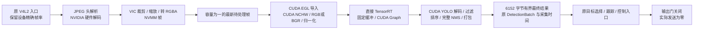

# 正式 TensorRT / CUDA 接入收据：2026-09-08

当前模型的 GPU 视觉链已接入正式 `novasightd`，复用原有会话、模型目录、`DetectionBatch`、目标选择和控制入口。三轮标称 240 FPS 模式实测约 **202 FPS**，跟上当前输入链的实际供帧。**240 FPS、非空场景控制性能、完整功能及 RK3588 对标仍未验收。** 未替换部署程序，所有实跑均关闭物理输出。

**2026-09-09 输入复核：当前 GC553G2 输出的是黑屏和“无信号源输入”提示。约 202 FPS 已在这些占位画面上复现，不能当作正常 HDMI 输入的采集上限或真实场景有效检测率。** 9 月 8 日没有保留原始画面供回查，不能追认当日全部输入也是无信号；此前空检测运行仍只证明相应执行路径，真实输入性能必须重测。

## 实际接入



- 正式实时构造选择 `InferenceStage::TensorRt`，不再创建 `nvinfer`、`nvstreammux` 或 CPU custom parser。旧 DeepStream 构造保留作显式隔离对照，严格模式没有自动回退。
- 复用既有 native TensorRT 设备输出接口和 CUDA YOLO 模块；本次增加 NVMM 帧组合层。GStreamer 回调只提交帧引用，GPU 执行留在现有 perception worker；一帧在执行、一帧可等待，过载替换等待帧。
- V4L2 的帧间隔分数不再提前取整。`5000000/20833` 经能力枚举、手动/自动选择、正式构造完整传入 GStreamer。界面仍可显示整数 240。
- 采集源 pad 写入 `GstReferenceTimestampMeta`，经过解析、解码和 VIC 后读取同一帧时间，传入 `FrameStamp`。当前 MJPG 实跑关联丢失为 0；这代表源缓冲到达时刻，不是传感器曝光或物理画面响应时刻。旧的 nvinfer 入口时间不再被当作新链路的采集时间。
- 模型指纹、engine SHA-256、实际 binding / shape / dtype 继续验证。CUDA 上处理原始输出，CPU 仅接收最终有界检测框并执行既有业务逻辑。
- GPU 失败立即使 `PipelineIngress` fault、关闭输出门和待处理槽、清除最新帧，再通知 supervisor 清理。测试确认不能通过重新开门继续发送；已进入底层调用的操作不能追溯撤销。

## 同条件实跑

Jetson Orin Nano Super 8GB；CUDA 12.6 / TensorRT 10.3 / DeepStream 7.1。沿用设备现有功耗和频率策略，没有改时钟、风扇或驱动。

同一原 engine SHA-256：`0d034825230d8c01a5a451428082cfa01b6e0ad877e812d5c99dc57835187034`。输入 FP32 `[1,3,256,256]`、输出 FP32 `[1,9,1344]`、5 类、阈值 0.65 / 0.45。1080p MJPG，ROI `(800,380,320,320)`。预览配置开启，但没有预览订阅者；准星按原配置关闭。画面没有检测目标。

正式 daemon 使用隔离 Cargo Debug 构建；CUDA 内核单独以优化方式编译，保留行号信息。初次集成发现 `cc` 在 Rust Debug 下为 nvcc 自动添加 `-G`，已取消该设备调试开关。没有改变模型精度或检测阈值。不能将这些结果与历史 release 视觉小程序直接计算整产品提升百分比。

稳态统计排除前两次状态采样，以 supervisor `updated_at_ms` 的间隔和累计计数差计算。时延列是约 1 Hz 采样的 GPU worker 耗时范围，**不是逐帧 P95/P99，也不含前面的硬件媒体处理**。

| 运行 | 请求 FPS | 实际采集 FPS | 检测提交 FPS | GPU worker 采样范围 ms | 结果 |
| --- | ---: | ---: | ---: | ---: | --- |
| `1788872766210845768`，20 秒 | 120 | 119.993 | 119.993 | 5.254–5.387 | 正常停止，退出 0 |
| `1788873128174734161`，20 秒 | 240 | 202.011 | 202.011 | 3.290–3.558 | 正常停止，退出 0 |
| `1788873153894940300`，20 秒 | 240 | 202.000 | 202.000 | 3.291–3.557 | 正常停止，退出 0 |
| `1788873179438422841`，20 秒 | 240 | 202.035 | 201.977 | 3.333–3.585 | 正常停止，退出 0 |

三轮 240 的稳态 admission 拒绝为 0，时间戳关联丢失为 0；第三轮存在少量最新帧替换，不能称零丢帧。启动阶段也存在覆盖和过期拒绝，原始收据保留全部计数。控制决策与设备发送均为 0：空检测及输出关闭意味着非空识别到控制计划尚未实证。

120 与 240 是不同负载，采样处理时间不同；没有据此断言具体调频原因。当前供帧约 202 的现象与此前纯采集检查一致，但 HDMI 信号源、采集器及 USB/驱动之间的细分原因尚未定位。

## 2026-09-09：采集卡未收到可用信号

直接使用系统 `v4l2-ctl`，不运行 NovaSight、解码或推理。1080p MJPG 模式在 120 和标称 240 FPS 下分别连续保存 360 / 800 帧；两批数据均只有以下两种 JPEG，逐帧 SHA-256 匹配：

- 全黑，33267 字节，SHA-256 `7e0fe2d70fa57f8ad4df6a5a32bdb99bd1470f831edc3f9c7755bf661e3018c2`；120 / 240 模式分别有 262 / 439 帧。
- 采集卡“无信号源输入”提示，145777 字节，SHA-256 `f0f2bfa8dfb8612cf5fe40b8590c63eb1bded74572bebacbab8d2c0759916b90`；分别有 98 / 361 帧。已直接查看[提示画面](../out/diagnostics/jetson-input-20260909/sample-2.jpg)。

独立计时日志排除前 200 个有效缓冲后：

| 模式 | 接收缓冲数 | 缓冲到达 FPS | JPEG 有效载荷 Mbps | 稳定段帧序号缺口 |
| --- | ---: | ---: | ---: | ---: |
| MJPG 120 | 4 | 120.024 | 112.706 | 0 |
| MJPG 240 | 4 | 202.030 | 155.702 | 0 |
| MJPG 240 | 16 | 202.030 | 156.066 | 0 |

这些是占位画面的缓冲速率；不能作为有效 HDMI 内容更新率。保留启动阶段的空错误缓冲、序号缺口及内核 `-71` 记录，不能据此声称整个会话零错误，也未证明启动错误造成稳定段约 202 FPS。

USB 主控及上游集线器为 10000M，采集卡为 5000M。增加接收缓冲没有提升；当前压缩载荷也不能支持“5Gbps 已被占满”的判断。[官方格式表](https://storage.avermedia.com/web_release_www/user_manual/GC553G2%20User%20Manual%202024.pdf)第 14 页列明 5Gbps 下 1080p MJPEG 仍有 240 FPS；[官方 FAQ](https://www.avermedia.com/support/faq/OEzPJyvq)限定其表格适用于 Windows，不能作为 Jetson/Linux 的性能保证。5Gbps 协商原因仍未解决，但它不是本次已证实的 202 FPS 根因。

接下来先恢复 RTX 5080 到 GC553G2 HDMI IN 的有效画面，再确认源端实际输出模式并重测。Jetson 上标准 V4L2 `VIDIOC_QUERY_DV_TIMINGS` 不受支持，现有控制项没有 HDMI 锁定/输入刷新率；目前不能从这些接口判断是源未输出、线缆连接还是 HDMI 协商问题。不能把采集端请求的 240 FPS 冒充源端实测刷新率。

原始证据：[本地目录](../out/diagnostics/jetson-input-20260909/)，远端 `/tmp/novasight-p0-input-1788918203092655757`。采集结束恢复原 MJPG 120 FPS，设备已释放；没有运行设备控制、改变部署程序或持久配置。本轮修正测量结论，没有性能提升百分比。

## 硬件执行与失败验收

Nsight 正式 daemon 运行 `1788872972932930462`：

- CUDA RGBA 预处理、YOLO decode、CUB 排序、NMS 和最终打包各执行 **1827 次**。
- TensorRT Graph 重放 **1826 次**，首帧预热。默认 Graph 级追踪没有逐节点列出所有重放内核，不能仅凭普通 kernel 汇总表计数判断 TensorRT 是否执行。
- SQLite memcpy 明细：`6152` 字节 D2H **1827 次**，另外 `64` 字节 D2H **4 次**；初始化 H2D `22293312` 字节 **1 次**。
- 未出现旧路径每帧 `48384` 字节 raw 输出 D2H。CPU 占用仍非零；这些证据证明具体视觉计算的数据路径，不是“任何 CPU 指令都能被发现”的保证。

运行 `1788873068955932789` 用独立 LD_PRELOAD 探针在第 501 次 CUDA EGL 注册返回错误。正式会话已先运行，再进入 `faulted`；错误为 `Strict GPU frame failed`，输出门保持关闭、设备发送为 0，随后 `stop` 与 daemon 退出均正常。故障注入仅存在于诊断探针，需要显式环境参数；产品没有注入开关。

本次还修复了正常控制接口关机被 `Application::shutdown` 当成 supervisor 意外退出的问题：仅最终 daemon 为 `ShuttingDown`、pipeline 为 `Stopped` 且 join 成功时接受已经完成的关机；其他退出仍报错。

## 可执行检查

- 本地：TensorRT FFI / 最终结果边界 17 项；GPU 模型契约 3 项；采集构造 8 项；控制 pipeline 回归 13 项；正常 API 关机回归 1 项；隔离脚本自检通过。
- Jetson：正式 daemon 构建、上述真实采集 / Nsight / 故障注入通过；修正测试中的 GStreamer 初始化后，帧生命周期 / 会话 / 模型契约 10 项、采集构造 8 项全部通过。
- 新增生产预处理内核覆盖 FP32/FP16、RGB/BGR、带行填充、251×127 非方形及非整线程块边界，数值检查通过。Compute Sanitizer 初次因缺少调试权限未执行成功；随后仅为诊断进程使用已有 `debug` 组，**memcheck 0 errors**。没有修改系统组成员或驱动设置。
- 原部署 daemon SHA-256 仍为 `39af10e1e0707eb5ef886b6a374facc6de00ff41a8f0e92c11f50a95686baaaa`；模型哈希不变；摄像设备已释放；远端原有 `config/`、`pyds-1.2.0-cp310-cp310-linux_aarch64.whl`、`run/` 未跟踪项保留。

## 代码与证据

源码同步提交：`5d034b9` 精确帧率，`2d83bb2` 正式 GPU 接入，`6220147` 预处理验证，`f3697c8` 故障立即关闭，`ba05646` CUDA 编译 / 正常关机修复，`5ed650e` 诊断工具。实跑 daemon 由 `ba05646` 构建，SHA-256 `660732a586580aa23fe7ffc35edad1a683dea05654361c036cd2fcfd340056fa`；之后 `5ed650e` 仅更新诊断脚本。最终 `8c8084e` 还修正了多分母帧率的距离比较及测试初始化；该版本重新构建并通过 5 秒启动/停止检查 `1788874067103488729`，二进制 SHA-256 为 `a0e60be66ad045406bf6e588d8b63ac3c914f0cef6b1d9d3246b5958c49b8d19`。这个短检查不计入三轮性能成绩。

本地收据目录：[product](../out/diagnostics/jetson-gpu-20260908/product/)，包含 7 次测量/故障运行和最终启动停止检查的收据、状态序列及 Nsight 汇总；[统计](../out/diagnostics/jetson-gpu-20260908/product/summary.json)、[哈希](../out/diagnostics/jetson-gpu-20260908/product/sha256.json)。远端隔离目录 `/tmp/novasight-p0-gpu-product-20260908` 保留二进制、构建日志和完整 Nsight 报告。未把临时配置、数据库、许可证或访问码取回作为性能证据。

```sh
# Jetson，保留原配置，关闭物理输出的隔离运行
python3 tools/diagnostics/run_jetson_p0.py \
  --repo /home/nvidia/NovaSight --stage /tmp/novasight-p0-gpu-product-20260908 \
  --binary-dir /tmp/novasight-p0-gpu-product-20260908/target/debug \
  --no-probe --seconds 20 --capture-fps 240
```

## 尚未交付的部分

当前直接 GPU 组合支持单输出 raw YOLO、batch 1、直接 resize、RGB/BGR、FP32/FP16、pixel 坐标、sigmoid 分数、class-aware NMS。对未覆盖的 letterbox、decoded-NMS / EfficientNMS / Rockchip heads、准星观察等配置明确拒绝，不能以这些拒绝代替功能迁移完成。

后续仍需完成 GPU 准星学习/匹配、其余在用模型语义、启用预览订阅的影响、非空检测与控制等价验证、逐帧源到控制 P50/P95/P99、至少 30 分钟稳定性，以及同条件 RK3588 对照。现在可以确认当前模型的正式 GPU 视觉链工作，不能确认完整产品已优化完成或已经优于香橙派。
