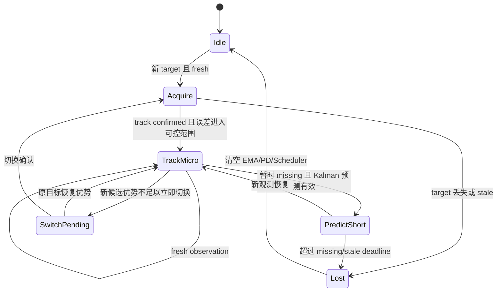

# NovaSight 实时视觉鼠标控制算法审计

文档状态：算法审计产物  
范围：DetectionBatch 之后的目标选择、Tracker/Kalman、预测、角度控制、counts、Scheduler 与 HID/KMBOX 之前的控制语义  
不在本轮范围：DeepStream 具体实现、模型转换、UI、设备驱动、大规模架构重构

## 0. 结论分级

- 确定结论：可由数学、当前代码或已有测试证据支持。
- 暂定结论：当前结构上合理，但需要实现或参数验证。
- 实验项：必须通过 Jetson、真实 HID/KMBOX、真实画面或 A/B 运行数据确定。
- 阻塞项：缺少硬件、运行日志或人工决策，当前不能给出可信结论。

## 1. 证据来源

当前代码证据只用于确认已有算法边界，不代表真实硬件延迟已经验证。

- `DetectionBatch` 已包含 `generation`、`capture_ts_ns`、`publish_ts_ns`、`input_age_ms`、`result_age_ms`、`is_stale`、`clock_domain` 等字段：`novasight/contracts.py:145-162`。
- Runtime 接收 DetectionBatch 前会拒绝 generation 倒退、capture_ts 倒退、`is_stale=true` 和超过新鲜度阈值的批次：`novasight/runtime/service.py:411-437`、`novasight/runtime/service.py:493-522`、`novasight/runtime/service.py:655-670`、`novasight/runtime/service.py:760-798`。
- DetectionBatchMailbox 是 latest-only 单槽：`novasight/runtime/detection_batch_mailbox.py:10-67`。
- Tracker 有 `TENTATIVE`、`CONFIRMED`、`PREDICTING`、`IDENTITY_UNCERTAIN`、`LOST` 等状态：`novasight/runtime/tracker.py:13-34`。
- Kalman 状态为 `x, y, vx, vy`，并带 NIS、协方差、missing time、prediction steps 等硬限制：`novasight/runtime/kalman.py:7-40`、`novasight/runtime/kalman.py:274-320`。
- AimPoint 只对瞄准锚点做 EMA，并按 track 维护状态：`novasight/runtime/aim.py:10-18`、`novasight/runtime/aim.py:119-192`。
- LatencyCompensator 用速度、测量年龄和预计执行延迟做位置补偿，并有速度/置信度/最大补偿门限：`novasight/runtime/aim.py:21-32`、`novasight/runtime/aim.py:212-322`。
- Angular 控制器实际是 P/PD，不是完整 PID；`AngularPDConfig` 没有 I 项状态：`novasight/control/angular.py:67-90`。
- 策略构造参数仍接收 `ki` 和 `integral_limit`，但实际创建的是 `AngularPDConfig`，只传入 Kp/Kd 与 D EMA 参数：`novasight/control/strategy.py:44-56`、`novasight/control/strategy.py:140-181`。
- AngularPDController 使用角度误差、D 项 EMA、近/中/远增益、counts 余量、限幅和 slew limit：`novasight/control/angular.py:266-408`。
- Scheduler 采用 latest pending 语义，会按新帧、轨迹 generation、track、方向变化和 TTL 取消旧 pending：`novasight/control/scheduler.py:22-28`、`novasight/control/scheduler.py:72-184`、`novasight/control/scheduler.py:323-350`。
- 已有测试覆盖 Broker/Mailbox latest-only、stale DetectionBatch 拒绝、generation/capture rollback 拒绝、Scheduler 替换 pending、D 项单位和重置：`tests/test_runtime_pipeline.py:90-147`、`tests/test_runtime_pipeline.py:1038-1215`、`tests/test_hardware_control.py:383-424`、`tests/test_angular_control.py:164-329`。

## 2. 总体控制结构

确定结论：NovaSight 的控制主链应以“新鲜观测 + 最新控制计划”为核心，不应让视觉帧、DetectionBatch 或鼠标命令形成历史债务。

```text
Fresh DetectionBatch
  -> TargetSelector
  -> Tracker / Kalman
  -> AimPoint EMA
  -> LatencyCompensation
  -> AngularErrorMapper
  -> P / small-D controller
  -> counts calibration + residual
  -> Scheduler replace-latest
  -> HID / KMBOX
```

暂定结论：当前最适合的控制器不是完整 PID，而是：

```text
Kalman 估计 + 有界预测前馈 + 分区 P 控制 + 可选小 D 阻尼 + Scheduler 替换式执行
```

原因：

- 视觉控制的主要误差来自帧龄、推理耗时、执行延迟、检测抖动和输出未即时反馈，不是一个干净连续时间闭环。
- I 项容易和预测、pending counts、输出限幅、设备反馈延迟一起 windup。
- 当前代码默认 `kd=0`、`ki=0`，实际 Angular 控制器没有 I 项；这与“先保证低延迟、可截断、可预测”的目标一致。

## 3. 职责关系图

```mermaid
flowchart LR
    DB[DetectionBatch<br/>generation/capture_ts/is_stale] --> Sel[TargetSelector<br/>过滤/锁定/切换确认]
    Sel --> Tr[Tracker<br/>ID/状态/关联/NIS]
    Tr --> K[Kalman<br/>x y vx vy + covariance]
    K --> Aim[AimPoint EMA<br/>只平滑瞄准锚点]
    Aim --> Pred[LatencyCompensation<br/>预测到预计生效时刻]
    Pred --> Map[AngularErrorMapper<br/>px -> rad]
    Map --> PD[Angular P/PD<br/>D EMA/zone gain]
    PD --> Counts[counts mapping<br/>limit/residual/slew]
    Counts --> Sch[Scheduler<br/>replace pending]
    Sch --> Dev[HID/KMBOX]
```



职责边界：

| 机制 | 职责 | 不应承担 |
|---|---|---|
| EMA | 抑制局部噪声；当前适合用于 AimPoint 锚点和 D 项差分后平滑 | 替代 PD/PID；重度平滑 P 项；跨 target 继承状态 |
| Kalman | 估计目标位置、速度、协方差和预测可信度 | 替代控制器；直接输出鼠标 counts |
| 预测 | 把状态外推到预计控制生效时刻 | 当成滤波器；在 stale 输入上无限外推 |
| P/PD | 将角度误差转为控制角度 | 重新做目标状态估计；无约束叠加速度补偿 |
| Scheduler | 分步、限速、替换旧轨迹、处理 TTL 和设备错误 | 保留历史控制债务；决定目标选择 |
| counts calibration | 把角度控制量映射为设备 counts | 修正检测抖动或目标速度 |

## 4. EMA 与 PD/PID

确定结论：EMA 和 PD 不冲突，但 EMA 不能替代 PD。EMA 是信号处理，PD 是控制律。

固定 alpha EMA：

```text
y_k = alpha * x_k + (1 - alpha) * y_{k-1}
```

- `x_k`：当前输入信号，单位由被平滑信号决定，例如 px、rad/s。
- `y_k`：平滑后信号，同单位。
- `alpha`：0 到 1。越小越平滑，延迟越大。

展开形式：

```text
y_k = alpha * x_k
    + alpha * (1 - alpha) * x_{k-1}
    + alpha * (1 - alpha)^2 * x_{k-2}
    + ...
    + (1 - alpha)^n * y_{k-n}
```

时间常数形式：

```text
alpha(dt, tau) = 1 - exp(-dt / tau)
y_k = y_{k-1} + alpha(dt, tau) * (x_k - y_{k-1})
```

- `dt`：两次更新间隔，单位 s。
- `tau`：时间常数，单位 s。
- 推理帧率不稳定时，暂定应优先使用 `tau` 动态 alpha，而不是固定 alpha。

放置规则：

- 确定结论：AimPoint 当前对瞄准锚点位置做 EMA，按 track 独立维护；新 track 没有历史时初始化 EMA。
- 确定结论：AngularPD 当前对 D 项输入的误差差分做 EMA，D 项第一帧为 0。
- 暂定结论：P 项不应做重度 EMA。重度平滑 `error_rad` 会把真实误差滞后化，导致响应慢、接近中心时继续沿旧方向输出。
- 暂定结论：D 项对噪声敏感，应在差分之后做 EMA，或使用 Kalman 速度替代简单差分；如果在差分之前对位置做轻度 EMA，也必须重置 target 切换状态。
- 暂定结论：X/Y 轴应独立维护 EMA。Y 轴如果关闭预测，仍可保留 AimPoint EMA，但不要继承 X 轴速度或横向参数。

## 5. 两阶段控制不是“二阶 PID”

确定结论：首次定位与后续微调是状态策略，不是两个 PID，也不是二阶 PID。

推荐状态机：



确定结论：

- 新目标第一帧不应使用 D 项，因为没有同一目标的上一误差。
- 新目标、目标切换、校准变化、控制几何变化都必须重置 D 记忆和 residual；当前 AngularPD 已覆盖 track/calibration/geometry reset。
- Scheduler 旧轨迹必须在新观测或新 generation 到来后被替换，而不是先执行完。

暂定结论：

- 首次定位可用几何映射或高比例 P，但输出应限幅、可截断，不应一次把理论全量移动排成长队。
- 微调不应限制为只执行一次。动态目标需要连续控制，静态目标也需要因检测抖动、输出量化和设备反馈延迟持续修正。
- 首次定位与微调不应同一帧叠加输出；否则同一误差会被计算两次。
- 距中心很近的新目标可以跳过 Acquire 的大步定位，直接进入 TrackMicro。
- 新目标第二帧不应立即开启满权重预测；至少等速度观测数达到门限，再按 `lambda_pred` 逐步增加。
- 目标 ID 切换时必须清空旧 target 的 AimPoint EMA、D 项、residual 和 Scheduler pending。
- 远距离新目标的首次定位宜移动理论量的一部分，而不是完整误差；比例需要真实 A/B 决定。

## 6. 预测时间轴

时间轴：

```text
capture_ts              infer_done        control_now             actuation
   |------------------------|------------------|----------------------|
   frame age / inference        handoff/control       scheduler/device/game

state_ts_ns -----------------------------------------------------> predict_to_ns
                         horizon = predict_to_ns - state_ts_ns
```

确定结论：

- 控制计算必须在计算前重新读取 `monotonic_ns`，不能复用推理完成时刻。
- 预测应从 Kalman/Tracker 状态时间 `state_ts_ns` 开始，而不是从 wall clock 或 PTS 直接推断。
- stale 帧不应靠加大 prediction horizon 继续使用；当前 Runtime 会在 stale DetectionBatch 进入控制前拒绝。

推荐 horizon：

```text
predict_to_ns = control_now_ns
              + estimated_scheduler_wait_ns
              + estimated_device_send_ns
              + estimated_actuation_delay_ns
              + optional_game_feedback_delay_ns

horizon_s = clamp((predict_to_ns - state_ts_ns) / 1e9, 0, horizon_max_s)
```

当前代码证据：LatencyCompensator 至少使用 `compute_ts_ns + estimated_actuation_delay_ms`，并用 `max_compensation_ms` 限制补偿时长。

位置预测：

```text
p_pred = p + v * horizon
p_used = p + lambda_pred * v * horizon
```

- `p`：当前估计位置，单位 px。
- `v`：目标速度，单位 px/s。
- `horizon`：预测时长，单位 s。
- `lambda_pred`：预测权重，0 到 1。
- 输出 `p_pred` / `p_used`：px。

暂定结论：

- 第一帧目标不应预测；至少需要 2 帧才能有有限差分速度，当前默认要求 `min_velocity_measurements=3` 更保守。
- 加速度模型不应默认启用。视觉检测抖动、目标遮挡和鼠标自身运动会让二阶加速度极不稳定。
- 目标突然反向时，应快速降低 `lambda_pred` 或清空速度 EMA，而不是继续使用旧方向速度。

## 7. 预测与 D 项的重复补偿

核心公式：

```text
u = Kp * e_pred + Kd * v
e_pred = e + v * h

展开：
u = Kp * e + Kp * v * h + Kd * v
u = Kp * e + (Kp * h + Kd) * v
```

其中：

- `e`：角度误差，单位 rad。
- `v`：角速度或误差变化率，单位 rad/s。
- `h`：预测 horizon，单位 s。
- `Kp`：无量纲或控制比例。
- `Kd`：单位 s。
- `u`：控制角度，单位 rad。

确定结论：预测已经包含速度前馈项 `Kp * v * h`。如果 D 项也直接乘同一个速度，就形成速度补偿耦合。

重复补偿示意：

```text
target velocity v
      │
      ├── prediction path: e_pred = e + v*h
      │                       │
      │                       └── P path: Kp*e + Kp*v*h
      │
      └── D path: Kd*v

final velocity-related output = Kp*v*h + Kd*v
```

数值例子：

```text
Kp = 0.35
h = 0.035 s
Kd = 0.020 s
v = 1.0 rad/s

预测速度项：Kp * h * v = 0.01225 rad
D 速度项：Kd * v = 0.02000 rad
总速度补偿：0.03225 rad
```

这时 D 项贡献比预测前馈还大；如果 `Kd` 是在无预测时调出来的，启用预测后通常应降低。

确定结论：

- 预测与 D 项不是绝对冲突，但强耦合。
- 当前 `kd` 默认值为 0，且有 `prediction_d_gain`，这降低了重复速度补偿风险。

暂定结论：

- 当 Kalman 速度可信且 prediction horizon 明确时，可以使用“预测位置 + P 控制”为主。
- 保留小 D 项的合理目的应是闭环阻尼，而不是重复补偿目标速度。
- Tracker 目标速度与误差差分速度不是同一个量。误差差分包含目标运动、鼠标控制造成的画面移动和检测噪声。

## 8. Kalman、EMA、预测与 D 项

确定结论：Kalman 不替代 EMA，也不替代控制器。Kalman 输出状态估计和置信度；EMA 只用于局部信号平滑；PD 负责控制输出。

当前 Kalman 模型：

```text
state = [x, y, vx, vy]^T
x_next = x + vx * dt
y_next = y + vy * dt
```

暂定边界：

- 优先使用 Kalman 速度做位置预测。
- 不建议再对 Kalman 输出位置做重 EMA；这会破坏状态估计的时序含义。
- 如果 Kalman 速度仍抖，可对速度或预测权重轻度平滑，但必须按 track 独立并在切换时重置。
- 不要对两个不同 horizon 的预测位置再做简单差分来当 D 项；horizon 变化会把调度延迟变化误当作目标速度变化。

像素到角度：

```text
focal_px = (roi_width / 2) / tan(FOVX / 2)
error_rad = atan(error_px / focal_px)
```

- `roi_width`：控制/ROI 宽度，单位 px。
- `FOVX`：水平视场角，单位 rad。
- `focal_px`：像素焦距，单位 px。
- `error_px`：目标相对中心的像素误差，右/下为正时需与 axis sign 保持一致。
- `error_rad`：角度误差，单位 rad。

像素速度到角速度，严格公式：

```text
theta = atan(e / f)
dtheta/dt = (1 / (1 + (e / f)^2)) * (v_px / f)
           = f * v_px / (f^2 + e^2)
```

小角度近似：

```text
theta ~= e / f
omega ~= v_px / f
```

暂定结论：小角度近似只适合中心附近；大 FOV 或远离中心时应使用严格公式或直接先预测像素位置再用 `atan` 映射。

## 9. Pending counts 与控制误差

确定结论：Scheduler 当前能报告 pending dx/dy、pending steps、trajectory generation、TTL 和取消原因；但控制器当前没有把 pending/sent/applied counts 作为误差扣除输入。

必须区分：

| 状态 | 含义 | 是否应进入控制器 |
|---|---|---|
| planned counts | 刚算出但尚未交给 Scheduler 的完整计划 | 不直接扣除 |
| queued counts | Scheduler 内未发送的 pending steps | 新观测到达时通常取消，不应继续扣除 |
| sent counts | 已调用设备发送的 counts | 可记录，用于估计未反馈动作 |
| estimated applied counts | 估计已经在游戏/画面中生效的 counts | 不再从当前误差扣除 |
| unobserved counts | 已发送但尚未反映到最新检测帧的 counts | 暂定应从预测误差中扣除或进入 actuation model |

pending counts 转角度：

```text
theta_pending_x = pending_counts_x * 2π / counts_per_360_x
theta_pending_y = pending_counts_y * 2π / counts_per_360_y
```

最终有效误差：

```text
theta_effective = theta_predicted - theta_unobserved_control
```

控制角度转 counts：

```text
counts_x = u_x * counts_per_360_x / 2π
counts_y = u_y * counts_per_360_y / 2π
```

暂定结论：

- 新 DetectionBatch 到达后，旧 queued counts 应废止或截断。当前 Scheduler 已支持按新帧/generation 替换。
- 已发送但未生效的 counts 不能简单等于 Scheduler pending；需要设备发送时间和画面反馈延迟估计。
- 如果完全不扣除 unobserved counts，控制器可能对同一误差重复输出，造成过冲。

pending 未扣除导致过冲：

```text
t0  error = +10 counts worth
t0  scheduler sends +4, queues +6
t1  new frame has not reflected +4 yet, still sees +10
t1  controller calculates another +10
=> if old +6 not cancelled and sent +4 later appears in frame, total motion overshoots
```

## 10. 严格计算顺序

推荐顺序如下；括号内为关键时间语义。

1. 取最新 DetectionBatch。必须是 latest mailbox 输出，不是 FIFO。
2. 检查 `is_stale=false`、`generation` 递增、`capture_ts_ns` 递增。（monotonic ns）
3. 检查 DetectionBatch coordinate space 为 ROI，bbox 合法且在 ROI 内。（px）
4. 用 `capture_ts_ns` 或 FrameContext 时间更新 Tracker/Kalman。（monotonic ns）
5. 目标过滤、质量评分、FOV 检查、class priority、sticky lock。
6. 判断新目标、切换、丢失、identity uncertain、missing/predicting。
7. 如新目标/切换/丢失/校准变化，清空旧 EMA、D 记忆、residual 和 Scheduler pending。
8. 生成 AimPoint 原始锚点。（ROI px）
9. 对 AimPoint 做按 track 的 EMA，处理 anchor jump。
10. 重新读取 `control_now_ns = monotonic_ns()`。
11. 估计 command 生效时间：`control_now + scheduler_wait + device_send + actuation_delay`。
12. 计算 prediction horizon，并做最大值、速度、置信度、测量年龄门限。
13. 使用 Kalman 状态预测目标未来位置。（px）
14. 计算预测像素误差。（px）
15. 转换为角度误差。（rad）
16. 扣除 estimated unobserved/applied control effect。（rad，当前为开放项）
17. 计算误差角速度或使用 Kalman 速度投影角速度。（rad/s）
18. 对 D 项速度做 EMA；不要重度平滑 P 输入。
19. 判断 Acquire/TrackMicro/PredictShort 状态，应用不同 Kp/Kd/prediction gain。
20. 计算 `u = Kp*error + Kd*error_rate`。（rad）
21. 角度限幅、deadzone、最小输出、小数 residual、counts 映射、slew limit。
22. 生成 `trajectory_generation = DetectionBatch.generation`。
23. Scheduler 以新 generation 替换旧 pending，必要时拆步并设置 TTL。
24. 设备执行后记录 sent/error/cooldown。
25. 下一帧到达时重新评估旧命令，取消未执行旧轨迹。

绝对不能调换：

- 不能在 stale/generation 检查前更新 Tracker；否则旧框会污染状态。
- 不能在目标切换前继承 D/EMA/residual；否则新目标第一帧产生反向或过大 D。
- 不能在读取 `control_now` 前固定 prediction horizon；否则控制等待时间没有进入预测。
- 不能先把控制量排队，再让新 DetectionBatch 继续追加在旧队列后；否则形成历史控制债务。
- 不能把 PTS 与 monotonic 直接相减；控制新鲜度必须使用同一时钟域。

## 11. 关系图：误差到控制量

```text
raw detection bbox
  -> Kalman estimate p, v
  -> aim point raw
  -> aim point EMA
  -> p_used = p + lambda * v * horizon
  -> error_px = p_used - center
  -> error_rad = atan(error_px / focal_px)
  -> theta_effective = error_rad - theta_unobserved_control
  -> u = Kp * theta_effective + Kd * theta_rate
  -> counts = u * counts_per_360 / 2π
  -> residual/limit/scheduler
```

## 12. 新帧截断旧 Scheduler 输出

```text
Frame N      -> control plan generation N: [a1, a2, a3, a4]
Scheduler    -> sends a1, holds [a2, a3, a4]

Frame N+1 arrives before a2
Runtime      -> recompute plan generation N+1: [b1, b2]
Scheduler    -> cancel [a2, a3, a4], hold/send [b1, b2]
```

确定结论：当前 Scheduler 测试已覆盖新 frame、trajectory_generation、direction change 的 pending 替换。

## 13. 潜在冲突矩阵

| 组合 | 结论 | 冲突条件 | 典型表现 | 需观察指标 |
|---|---|---|---|---|
| EMA 与 Kalman | 暂定互补 | 对 Kalman 输出位置再重 EMA | 跟随慢、过中心后拖尾 | EMA lag、position_sigma、error sign flips |
| EMA 与 D 项 | 确定互补但耦合 | 差分前后都平滑或 alpha 过小 | D 滞后、反向继续输出 | derivative_raw、derivative_ema、overshoot |
| 预测与 D 项 | 确定强耦合 | `Kp*h` 与 `Kd` 同时补偿同一速度 | 动态目标过冲 | prediction_ms、d_rad、p_velocity_term |
| 首次定位与 PD | 暂定可统一 | 首帧同时大步定位 + PD | 同一误差双算 | acquire_state、first_frame_dx |
| 首次定位与 Scheduler | 暂定冲突风险 | 一次定位拆成长队且新帧不截断 | 历史动作继续执行 | pending_steps、cancel_reason |
| 预测与 pending 补偿 | 暂定必要 | 已发送未反馈 counts 不建模 | 重复输出同一误差 | sent_counts、unobserved_counts、frame_age |
| Kalman 速度与误差差分速度 | 确定不同 | 把误差差分当目标速度 | 鼠标自身运动被当目标速度 | target_v、error_rate、device_sent |
| 死区与 I 项 | 确定冲突风险 | 死区内 I 累积或限幅 windup | 突然跳出死区 | integral_state、deadzone_state |
| 低推理 FPS 与高频 Scheduler | 暂定可行 | Scheduler 不替换旧轨迹 | 控制债务 | observation_fps、scheduler_fps、pending_age |
| 新帧重算与旧命令继续执行 | 确定冲突 | 新 generation 不取消旧 pending | 延迟尾巴 | trajectory_generation、cancelled_pending |
| 目标切换与历史 EMA/PD | 确定冲突 | EMA/D/residual 跨 target | 新目标第一帧抖动/大跳 | derivative_reset_reason、track_id |
| 预测补偿与控制延迟补偿 | 确定同一问题两种表达 | 两处独立加 actuation delay | 预测过量 | compensation_ms、horizon_ms |

## 14. 靠近中心的处理

确定结论：当前 AngularPD 已有近/中/远区增益，near 区默认降低 Kp，D scale 单独配置。

暂定结论：

- 远离中心时可用较强 P 和较强预测，但要限幅并可截断。
- 接近中心时应降低 Kp 和预测权重，避免穿越中心。
- D 项在接近中心可以作为阻尼保留小量，但不应继续做目标速度前馈。
- 误差方向反转时应快速衰减 D EMA 或直接重置相关速度状态。
- 动态死区可参考 bbox 高度、检测抖动和最小有效 counts，但必须用真实数据校准。

## 15. 是否需要完整 PID

确定结论：当前系统不应默认加入 I 项。

原因：

- 预测和 pending counts 已经涉及未来动作估计，I 项会叠加历史误差。
- 输出限幅、deadzone 和 Scheduler 拆步会导致 windup。
- 低推理 FPS 与反馈延迟下，I 项会在过时误差上累积。
- 静态误差可能来自 counts_per_360 标定、axis sign、最小有效 counts、游戏灵敏度、整数残余，而不一定需要 I 项。

暂定结论：只有在完成 counts 标定、最小输出测量、pending/applied 模型和 anti-windup 后，才可以 A/B 测试极小 I 项。

## 16. 典型错误案例

1. 把 EMA 当控制器：目标移动时输出永远滞后。
2. 把预测当滤波器：stale 数据被越预测越远。
3. Kalman 后再重平滑位置：协方差和时间戳语义被破坏。
4. 预测和 D 同时大：速度补偿重复，动态目标过冲。
5. 新目标继承旧 D：第一帧产生无意义反向脉冲。
6. 新帧不取消旧 Scheduler：画面已经更新，鼠标仍执行历史动作。
7. 不区分 queued/sent/applied：误差扣除错误，或者重复扣除。
8. 只看推理 FPS，不看 result_age/control_observation_fps：高吞吐但控制滞后。

## 17. 必须记录的运行时指标

- `frame_id`、`generation`、`source_sequence`
- `capture_ts_ns`、`publish_ts_ns`、`clock_domain`
- `frame_age_ms`、`input_age_ms`、`inference_ms`、`result_age_ms`
- `control_now_ns`、`state_ts_ns`、`prediction_horizon_ms`
- `prediction_confidence`、`position_sigma_px`、`cov_trace`、`nis`
- `target_id`、`target_state`、`switch_committed`、`identity_confidence`
- `aim_raw_px`、`aim_ema_px`、`ema_reset_reason`
- `error_px`、`error_rad`、`error_rate_rad_s`
- `p_rad`、`d_rad`、`prediction_velocity_term_rad`
- `counts_raw`、`counts_residual`、`counts_limited`、`slew_limited`
- `planned_counts`、`queued_counts`、`sent_counts`、`estimated_applied_counts`、`unobserved_counts`
- `scheduler_pending_steps`、`pending_age_ms`、`trajectory_generation`、`cancel_reason`
- `device_send_ts_ns`、`device_sent`、`device_error`
- `control_observation_fps`、`control_emit_fps`、`stale_drop_ratio`

## 18. 结论清单

确定结论：

- EMA 不能替代 PD/PID。
- 当前 Angular 控制实际是 P/PD，不是完整 PID。
- 预测与 D 项有重复速度补偿风险。
- stale 或 generation/capture_ts 倒退的 DetectionBatch 不应进入控制。
- 新目标/切换必须重置 EMA、D、residual 和 Scheduler pending。
- Scheduler 必须替换未执行旧轨迹。
- counts 映射必须经过角度单位，而不是直接 `Kp * pixel_error`。

暂定结论：

- 主控制结构应为 Kalman 估计 + 有界预测 + 分区 P + 小 D 阻尼。
- AimPoint EMA 保留，P 项重 EMA 避免。
- Prediction horizon 应包含控制计算、Scheduler、设备和游戏反馈延迟，但当前只能部分建模。
- pending counts 应拆成 queued/sent/applied/unobserved 后再进入控制器。

实验项：

- `Kp/Kd/prediction_gain` 的实际数值。
- near/center 区域 D 项应增强还是减弱。
- 动态死区与 bbox 高度关系。
- 最小 velocity measurements 取 2、3 还是更多。
- actuation delay 与 game feedback delay。

阻塞项：

- 无真实 Jetson、HID/KMBOX、游戏画面和运行 trace 时，无法确认端到端最佳参数。
- 无设备发送 ACK 或外部运动反馈时，无法精确区分 sent/applied/unobserved counts。
