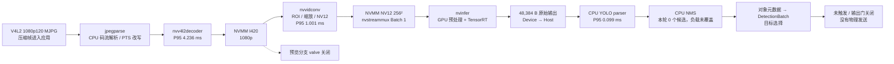

# Jetson 视觉管线基线：2026-09-08

**状态：P0 部分完成，不能据此选择框架或宣称产品提速。** 三轮实机计时证明当前空检测场景下 CPU YOLO parser 约 0.1 ms；尚无证据证明 NMS 是主要瓶颈。当前配置确实将原始推理输出回传 CPU 后处理，不满足关键视觉计算全部硬件执行的目标。

用户随后明确：关键视觉计算硬件执行与完整识别 / 推理 / 控制不弱于 RK3588，是必须同时通过的交付条件。**本报告的 0.1 ms 只用于定位耗时，不豁免 CPU parser / NMS 迁移。** 当前版本未达标；空检测和缺少对照不阻止 GPU 计算的实现与正确性验证，但不能据此通过性能验收。具体判定见[计划第 1 节](pipeline-gpu-optimization-plan.md#1-目标与优先级)。

导航：[测量条件](#测量条件) · [数据通路](#数据通路) · [测量结果](#测量结果) · [执行证据](#执行证据) · [问题与下一步](#问题与下一步) · [复现](#复现)

## 测量条件

| 项目 | 本轮实际条件 |
| --- | --- |
| 设备 / SDK | Orin Nano Super 8GB；L4T 36.5，CUDA 12.6，TensorRT 10.3，DeepStream 7.1 |
| 功耗设置 | 保持既有 MAXN_SUPER；未锁频、超频或改变风扇配置 |
| 源码 | 远端 `4ec8f614b7a464f8d061ca8ca12f4426254105c0`；本地 `350a38f`；源码 SHA 不等于二进制构建证明 |
| 实际程序 | 既有 `out/cargo/debug/novasightd`；本轮不是 release 性能验收 |
| 采集 | 正式配置：1920×1080，120 FPS，MJPG；稳态 pad 实测约 120 buffers/s |
| ROI / 输入 | 源图 ROI `(800,380,320,320)`；模型输入 `[1,3,256,256]` |
| 模型输出 | `[1,9,1344]`，5 类 YOLOv8 raw，无 objectness，输出 float32 |
| 阈值 | confidence 0.65，NMS IoU 0.45；保持原值 |
| 功能状态 | 准星关闭；预览无消费者、valve 关闭；硬件触发未激活 |
| 场景 | 三轮逐帧计时中，parser 候选数及最终检测数全部为零；未保存画面，尚无可复现图像样本身份 |
| 隔离 | 独立临时配置、数据库副本、IPC 和进程；空设备适配器、物理输出关闭 |
| 运行 | 三轮 pad/parser 探针、一次无探针对照、一次独立 CUDA 追踪；各运行请求测量 15 秒 |

所有测试结束后，重新检查未发现 `novasightd` 进程，`/dev/video0` 无占用；远端源码脏文件清单保持原样。未改动原配置、模型、数据库或部署版本。

## 数据通路

下图时间为第一轮 P95 的插件停留时间，包含相应等待，不是单独的硬件执行时间。分段分位数不能相加；总段另按同帧关联测得。



| 数据 / 生命周期 | 已知内容与边界 |
| --- | --- |
| 压缩输入 | V4L2 mmap 路径，队列有界且丢旧；首轮稳态 buffer 字节数中位数 145,777 B；不是 GPU 图像张量 |
| 解码面 | NVMM I420 1920×1080；紧密排列的理论图像载荷 3,110,400 B，实际 pitch / 分配大小未测 |
| 模型前图像 | NVMM NV12 256×256；理论载荷 98,304 B；pad 上 64 B 是表面描述符大小，不能当图像大小 |
| 模型输入 | float32 `[1,3,256,256]`，逻辑大小 786,432 B；由 nvinfer / TensorRT 持有 |
| 模型输出 | float32 `[1,9,1344]`，48,384 B；CUDA 追踪与已安装 SDK 路径共同证明主机回传 |
| 业务结果 | C bridge 拷贝有界对象快照，Rust 形成拥有所有权的 `DetectionBatch`；latest-only 槽传给业务线程 |
| 并发 / 同步 | GStreamer 队列线程、CUDA kernels、event 等待和结果回传已经观察；完整逐帧 stream / 缓冲复用关系尚未闭合 |

`jpegparse` 的码流解析与 JPEG 像素解码是不同工作；YOLO 输出解码又是第三件事。不能把这三个“decode”混作同一个 CPU 瓶颈。

## 测量结果

每轮从首个运行状态样本之后再排除 2 秒，只使用稳态窗口。按相同 PTS 做唯一匹配；拒绝缺失、重复或时间倒序的关联，不按“时间最接近”拼帧。

| 稳态段，单位 ms | 第一轮 P50 / P95 / P99 | 第二轮 P95 | 第三轮 P95 |
| --- | --- | --- | --- |
| JPEG 解析输出 → 检测元数据出现 | 12.193 / **12.399** / 12.578 | **12.356** | **12.409** |
| nvinfer 入口 → 末端 fakesink | 7.012 / 7.134 / 7.222 | 7.087 | 7.121 |
| CPU raw parser，不含 NMS | 0.094 / **0.099** / 0.134 | **0.099** | **0.099** |

第一轮硬件解码插件 P95 为 4.236 ms，裁剪缩放/格式转换插件为 1.001 ms；各单队列 P95 为约 0.02–0.04 ms。总段匹配样本分别为 1,554 / 1,552 / 1,552 帧；本轮总段关联没有缺失、歧义或倒序。三个探针运行都没有 trace 溢出。

**12.4 ms 不是“摄像头/采集卡到控制输出”的完整延迟。** 上游 V4L2 PTS 经 jpegparse 改写，mux 的 batch PTS 与 frame PTS 也不同。当前探针在 jpegparse 输出至检测元数据间能关联帧；V4L2 到该起点尚未建立可靠关联。既有程序的 `latest_inference_duration_ns` 也从 nvinfer 入口开始，原代码明确排除了此前的采集/解码时间，不能改名当完整帧龄。

无探针对照的低频状态样本中，nvinfer 耗时均值为 6.953 ms；三个探针运行对应为 6.962 / 6.932 / 6.969 ms。未观察到明显均值扰动，但每轮只有 13 个稳态状态样本，不能用它证明探针对尾延迟没有影响。软件状态计数差值约 118.5–120.1 batches/s，受快照刷新影响；不是物理控制更新率，也不能证明输入画面有同样多的独立视觉更新。

## 执行证据

单独的 Nsight 运行生成了 CUDA 追踪与 SQLite 结果，记录到：

- TensorRT 卷积实际执行 `sm80_xmma...f16...` kernel，同时存在 FP32 softmax kernel。引擎存在 FP16 计算，不能从 FP32 输入/输出反推整个引擎精度，也不能据此称所有层均为 FP16。
- 精确查询发现 1,931 次 **48,384 B** 的 Device-to-Host 传输，对应每次推理的整个原始输出；另外 4 次仅 64 B。复制总量约 93.430 MB，GPU 上的复制时间中位数 8.576 µs。该时间不包含其前后的 CPU 等待与后处理。
- stream 54 执行 1,931 次 `NvDsInferConvert_CxToP3FloatKernel`，单次平均 46.523 µs，证明模型的颜色通道/float 平面预处理存在 GPU kernel；stream 55 执行 237,513 次模型 kernel，即每次推理 123 次。不能把前置 NV12 到中间图像的所有转换都归入这个 kernel。
- 有 `cudaEventSynchronize`、`cudaStreamAddCallback` 和大量 kernel launch。API 时间可与 GPU 执行重叠，不能把各项总时间相加当逐帧延迟，也不能把这些等待全算作 NMS。
- CPU 原 parser 被探针逐次转发和计时；生成配置使用 `cluster-mode=2`。安装的 DeepStream SDK 源码显示 custom parser 后进入 CPU 阈值/聚类与 NMS 路径。NMS 内部符号没有动态导出，本轮未取得其独立计时。

当前采集确实运行了 NVIDIA 的 `nvv4l2decoder mjpeg=1` 路径并产出 NVMM 表面；官方将该插件列为硬件解码通路。[DeepStream 7.1 插件说明](https://docs.nvidia.com/metropolis/deepstream/7.1/text/DS_plugin_gst-nvvideo4linux2.html)、[Jetson R36 图像加速说明](https://docs.nvidia.com/jetson/archives/r36.4.3/DeveloperGuide/SD/Multimedia/AcceleratedGstreamer.html)。本轮尚未记录专用解码/VIC 引擎的完整活动时间线，因此不能将插件名称当作严格硬件执行验收的全部证据。

## 问题与下一步

1. **已确认的实现问题：当前后处理是 CPU 路径。** 责任落在现有 NovaSight parser + nvinfer 输出/聚类配置组合，不能由此推导 DeepStream 无法接入 GPU 后处理。它违反用户的关键计算执行要求，但本轮 0.1 ms parser 不能解释显著的整链慢速；非空 NMS 仍需测量。
2. **已确认的计量缺口：采集帧龄未贯穿整链。** JPEG 解析改写 PTS，程序用 nvinfer 入口锚定后续时间。下一步补齐可靠帧身份及驱动出帧时间，保留现有推理计时原义，再连到业务消费和输出计划。
3. **缺少真实目标负载。** 用户已收到切换到日常识别场景的请求；尚未回复。不能靠降低阈值、制造候选或打开物理触发来伪造日常基线。准星、预览启用场景及完整控制计算也尚未覆盖。
4. **守护进程退出问题复现。** 五次完成测量的运行均能停止视觉管线，但随后 daemon shutdown 返回退出码 1，日志为 `RUNTIME_SUPERVISOR_EXITED`。首轮旧脚本的 `PASS` 只代表测量及输出检查，不能当生命周期验收；脚本现已将这类结果标成 `MEASURED_WITH_SHUTDOWN_ERROR`。本轮未修改产品停机逻辑。
5. **连接指标有误导性。** 空适配器继承默认 no-op `connect() -> Ok(())`，runtime 因此报告 `device_connected=true`、`device_connection_enabled=true`。这不代表实际连接设备；诊断核验实际生效的 `auto_connect=false`、输出门关闭及零发送记录，不放宽产品输出保护。

后续先完成上述测量边界与有目标负载，并建立 release 对照。随后按[已同意的计划](pipeline-gpu-optimization-plan.md)设计数据所有权/调度，做 DeepStream GPU 后处理与直接 TensorRT 的最小同条件比较。采集格式、预处理、CUDA 提交和同步都需按证据评估；不预先将收益归因于某一框架。没有香橙派的同条件整链数据，仍不承诺 Jetson 的性能倍率或价格价值。

## 复现

诊断脚本只用于独立环境，不是 Python 产品运行时。依赖均为目标机既有工具；本轮没有安装依赖或修改 SDK。

- [pad / parser 探针](../tools/diagnostics/pipeline_probe.cpp)：只读 pad 元数据、转发原 parser；内存中有界记录，退出时写 CSV，无图像映射、逐帧磁盘写入或 GPU 全局同步。
- [隔离运行器](../tools/diagnostics/run_jetson_p0.py)：临时数据库/配置、输出关闭检查、有限运行及进程清理；`--no-probe` 作对照，`--no-probe --profile-cuda` 作独立追踪。
- [分析器](../tools/diagnostics/analyze_pipeline_trace.py)：唯一 PTS 关联、nearest-rank 分位数、未匹配/歧义计数；两个 Python 工具均有 `--self-test`。

在 Jetson 的独立 P0 目录编译探针：

```bash
g++ -std=c++17 -O2 -shared -fPIC pipeline_probe.cpp \
  -I/opt/nvidia/deepstream/deepstream-7.1/sources/includes \
  -I/usr/local/cuda/include \
  -L/opt/nvidia/deepstream/deepstream-7.1/lib \
  -Wl,-rpath,/opt/nvidia/deepstream/deepstream-7.1/lib \
  -lnvdsgst_meta -lnvds_meta -ldl -o libpipeline_probe.so \
  $(pkg-config --cflags --libs gstreamer-1.0)
python3 run_jetson_p0.py --repo /home/nvidia/NovaSight \
  --stage /tmp/novasight-p0-20260908-1404 --seconds 15
python3 analyze_pipeline_trace.py /tmp/novasight-p0-20260908-1404/run-1788849148189264062
```

测量身份（SHA-256）：

| 产物 | SHA-256 |
| --- | --- |
| 实际 daemon | `39af10e1e0707eb5ef886b6a374facc6de00ff41a8f0e92c11f50a95686baaaa` |
| 原 parser | `aadf635b747e392ce442a0634b2676bf7d17c2f54beebeb836d98585e8a46e43` |
| 计时 probe | `47713078a72e24cf7fc0f8774e0b0877ea473776b42c9a10594c60aea7da620b` |
| engine | `0d034825230d8c01a5a451428082cfa01b6e0ad877e812d5c99dc57835187034` |

三轮计时目录后缀为 `1788849148189264062`、`1788849949425031925`、`1788849970495464572`；无探针对照为 `1788849928381406204`，CUDA 追踪为 `1788849556814861055`。远端证据保留在独立 P0 临时目录中；本地副本在被忽略的 `out/diagnostics/jetson-p0-20260908/`，不提交模型资产、画面或私网连接信息。
