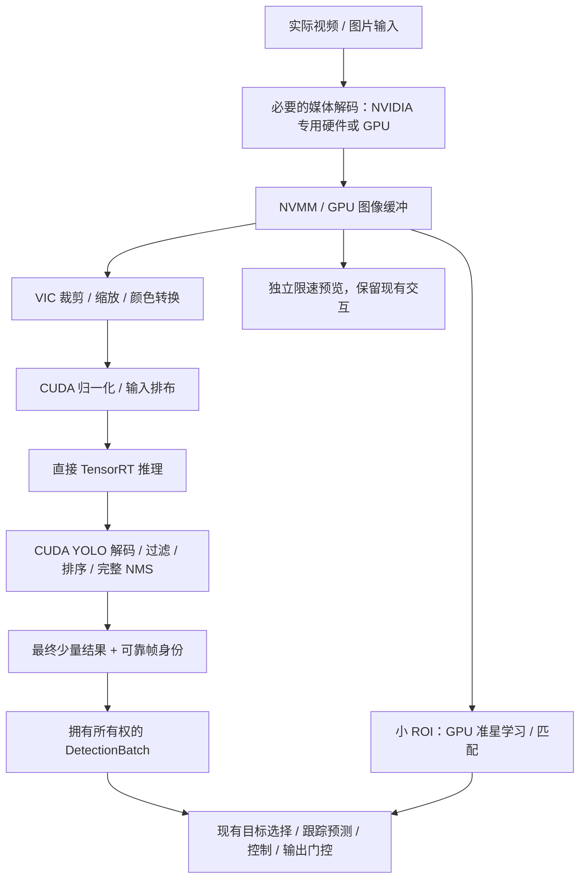

# NovaSight pipeline 提升计划与执行边界

日期：2026-09-08。状态：P0 部分基线、P1 的共享 CUDA 后处理 / TensorRT 设备输出 / NVMM 真实采集候选已有有限实机证据。三轮 release 空检测视觉链 P95 降低约 8%–10%，不能当完整产品收益。DS 7.1 Other 候选仍回传原始输出。随后吞吐补测：同 engine 普通 TensorRT 为 490–495 次/秒、Graph 为 704–707 次/秒；约 240 FPS 采集请求下，纯采集与 GPU 视觉候选均约 202 FPS。Graph 在该负载减少处理时间，未提高受输入限制的结果率；生产精确帧率传递仍有取整问题。生产路径未切换，完整产品尚未验收。

本文件记录用户要求及后续优化的操作边界。每次继续这项工作，先读取本文件、`PROJECT_HEALTH_AUDIT.md` 和工作区当前状态；现场证据变化时更新本文件，不把历史设计当作当前实现。用户后续明确指令优先。用户同意后已开始独立目录中的 P0 真实采集、计时和 CUDA 追踪；物理输出关闭，未替换远端程序。

## 1. 目标与优先级

在保留现有有效功能、模型语义和控制约束的前提下，同时提高完整 pipeline 的持续有效吞吐、降低 P95/P99 延迟和帧龄，并保持持续运行稳定性。用户进一步明确以 RK3588 的 240 FPS 推理表现追问差距：必须分别测量模型持续推理吞吐、输入实际供帧率、完整检测结果率及有效控制更新率。固定 120 FPS 输入下延迟降低 9% 不能回答 240 FPS 的吞吐要求；GPU 占用率和理论算力不能代替实测。

**2026-09-08 用户补充的交付硬条件：完整 YOLO 识别、推理、控制表现不得弱于指定的香橙派 RK3588 实际方案，且关键视觉计算必须使用 GPU / 适用专用硬件。两项必须同时通过。** CPU parser 即使只有 0.1 ms 也必须迁移；耗时小、没有检测目标或缺少 RK3588 对照，都不能成为保留产品 CPU 关键计算的理由。缺少对照只阻止性能验收，不能阻止已明确的 GPU 路径设计、实现和正确性验证。

| 硬条件 | 验收方式 | 不满足时的结论 |
| --- | --- | --- |
| 关键视觉计算硬件执行 | 验证下表全部必需环节的实现、设备缓冲与实际执行；完整 GPU 解码 / 过滤 / NMS，不将原始输出回传 CPU 计算 | 产品候选不达标；拒绝启动该路径，运行中故障先关闭输出再停止视觉处理 |
| 完整性能不弱于 RK3588 | 同功能、同源模型与输入、同阈值和检测质量下，逐帧比较识别结果可用延迟、采集到控制输出计划的 P95/P99 与帧龄；有效控制更新率不得更低，延迟不得更高 | 实测落后即未达标；缺少有效对照或证据不足则未验收，继续优化，不能标记完成 |
| 质量、功能与稳定性保持 | 相同验证集核对检测质量、目标选择及控制行为；预览、准星等启用功能纳入对应场景，覆盖持续负载 | 不得用降低质量、规格或功能的成绩通过前两项 |

跨平台使用同一源模型分别生成适配的 TensorRT / RKNN 产物，不要求二进制 engine 相同。记录双方精度、NPU 核配置、功耗 / 频率策略及温度，保留对方正式运行的优化；精度不同的产品比较必须同时通过相同的检测质量要求。正式测试前固定样本、时长、重复次数和判定方法；波动不足以支持结论时保持未验收。软件输出计划、实际发送和物理响应分开验收，软件成绩不能替代设备响应。

用户已说明对照功能是“从输入源获取视频流 / 图片，运行 YOLO 识别后输出”。双方首先必须完整测量共同路径：视频流 / 图片输入 → 必要的媒体解码 → 图像预处理 → YOLO 推理 → 候选解码 / 过滤 / 完整 NMS → 最终检测结果。视频测稳态帧龄、P95/P99 和有效结果更新率；图片测输入就绪至结果就绪的延迟，并分别记录冷启动和预热后结果。不能把对方整链耗时与本方纯推理耗时比较。

NovaSight 的目标选择、控制计算及输出约束继续保留。当前描述尚未确认对方的“输出”是否包含设备控制，因此检测结果比较和输入至控制计划比较必须分别给出；取得相同控制规则与可比终点的证据前，控制对标保持未验收，不能用检测 FPS 替代，也不能借此取消控制验收。

对照对象以用户所指的香橙派实际方案为准。RK3588 的官方加速栈是 RKNN / RKNPU；TensorRT 是 NVIDIA 平台推理栈。这个名称区别不改变对标要求，也不降低对方基线。目前已经知道上述功能边界，尚缺确切程序 / 模型身份、同条件结果及 RK3588 实机访问。

本轮确定以 **直接 TensorRT + CUDA** 为产品改造的实施路线，保留 GStreamer / NVIDIA 硬件解码、NVMM 和 VIC。复用原 native TensorRT 的设备输出接口及共享 CUDA 后处理，在现有 Rust supervisor 下接入真实产品；实时推理不再经过 nvinfer 的 CPU parser / 聚类。依据是已验证的设备数据通路和完整 GPU 后处理，以及当前 DS 7.1 Other 候选仍回传 raw 的实测缺陷；这是一项实施选择，不是“TensorRT 在所有模型上必胜 DeepStream”的结论。旧 DeepStream 路径保留作隔离对照，不作为严格产品的自动回退。不继续平行建设两套正式推理后端。

关键视觉计算必须在 GPU 或适用的 NVIDIA 专用硬件上执行。选择 VIC 等专用硬件还是 CUDA，以整条管线的实测耗时、转换和同步成本为依据；专用硬件执行不属于 CPU 回退。

| 环节 | 严格产品路径要求 |
| --- | --- |
| 压缩视频 / 图片的像素解码 | 专用硬件或 GPU；已解码像素输入无需此步骤。严格路径不支持的格式明确拒绝，不能回退 CPU；原有有效输入格式仍须按功能保持要求完成支持，不能靠缩减格式范围验收 |
| ROI 裁剪、缩放、颜色转换 | VIC 或 CUDA；避免重复处理和无必要的主机中转 |
| 归一化、模型输入排布 | GPU；遵循模型预处理契约 |
| TensorRT 推理 | GPU |
| YOLO 候选框解码、分数过滤、排序及完整 NMS | GPU；不能只在 GPU 算 IoU、再由 CPU 完成抑制选择 |
| 已启用的准星视觉计算 | 移除内部 JPEG 往返，逐步完成 GPU 图像处理和匹配；未完成前不能宣称全功能严格模式通过 |
| 调度、协议解析、最终少量框的元数据封装、目标状态和控制计算、设备通信、管理界面 | 允许 CPU；不把这些正常工作误判为回退 |

CPU 参考实现可以在隔离、无物理输出的基线和正确性测试中使用；不能成为产品运行时的自动降级路径。CPU 占用率、插件名称、GPU 指针或一个配置布尔值，均不能单独证明完整硬件执行。

### 本轮确定的产品方案与交付顺序

目标数据通路如下。专用硬件负责的计算仍符合“关键视觉计算不走 CPU”的要求；
CPU 保留调度、元数据、原有控制计算和通信职责。

输入已是像素时跳过媒体解码；VIC 与 CUDA 的分工可以按同语义实测融合或调整。
当前生产已有 V4L2 MJPG / NV12 / YUY2；通用图片和其它视频入口尚未完成，必须
按实际目标输入补齐并注明协议/格式支持，不能把 V4L2 验证冒充全部输入支持。
已有有效输入/模型不得因迁移丢失；未知格式暂拒绝不是功能保持已完成。

| 顺序 | 实际改动 | 阶段交付与通过条件 |
| --- | --- | --- |
| 1. 修入口并补齐性能基线 | 设备枚举到模式选择、管线 caps 全程保留精确帧率分数；界面整数仅用于显示/偏好。分别调查信号源、采集卡、V4L2 驱动/传输供帧，记录实际协商值 | 120 模式保持可用；本设备的 `5000000/20833` 模式可正确选择；真实供帧、结果率和丢帧可解释。修正 caps 不冒充已解决约 202 FPS 的供帧限制 |
| 2. 接通正式 GPU 主线 | 复用原 TensorRT device API，补齐 Rust FFI / 会话所有权；接入模型激活、采集、GPU 后处理、DetectionBatch 和既有控制。贯穿帧时间/epoch，原始输出留在 GPU | 先交付当前模型的可运行产品候选及故障停止，再覆盖实际在用模型。运行正式守护进程/打包入口，不能仅交付 capture_device_test |
| 3. 完成图像分支与调度 | 准星学习/匹配移至 GPU 并去掉内部 JPEG 往返；预览独立限速。复用工作缓冲、CUDA stream/event，按证据减少同步和导入开销 | 准星/预览/控制启用后仍满足功能、延迟与吞吐要求。Graph 对支持的模型会话在预热/正确性检查后评估启用；双缓冲和 EGL 注册复用只有实际受限时才引入，保证所有权与有界队列 |
| 4. 产品验收与候选包 | 完成 GPU 路径检查、生命周期/模型切换/故障测试、非空真实负载、长时运行和 RK3588 对照；交付可回退候选包 | 同输入、源模型、阈值及检测质量下满足下表，保留所有业务功能；结果不足则明确未通过 |

第 1 步采集供帧调查与第 2 步产品接入可独立推进；采集不足 240 或暂缺 RK3588
数据不阻止 GPU 主线实施。先交付当前模型的完整产品纵向链路，不能无限追加
隔离微基准而延后正式入口/出口接入。CPU 关键计算拒绝和故障停止随接入一起实现。

| 测量层次 | 判定目标 | 不能代替什么 |
| --- | --- | --- |
| 纯模型推理 | 当前模型 Batch 1 持续吞吐至少 240 次/秒；此前两轮普通 / Graph 已有短时证据 | 不代表含预处理、NMS 或媒体输入 |
| GPU 计算链 | 输入充分供给时，GPU 图像预处理 → 推理 → 完整后处理持续至少 240 次/秒，包含最终结果交付，覆盖非空/密集与日常代表负载 | GPU 就绪图片供给不包含媒体解码；回放结果不能当新采集画面率 |
| 完整视觉产品 | 输入充分供给时，实际媒体解码 → 预处理 → 推理 → 完整 NMS → 正式检测出口持续至少 240 个有效结果/秒，并在同条件下不弱于对方；分别统计独立帧、丢弃、超时和帧龄 | 当前真实源约 202 FPS 时，240 FPS 整链验收仍未通过；不通过重复旧帧或深队列凑数 |
| 完整控制与质量 | 启用相同功能后，检测质量、有效控制更新率、端到端 P95/P99 与帧龄不弱于对方，且当前业务功能与保护不退化 | 单纯调用控制函数的频率不算有效更新率；软件输出计划不能当物理响应 |

240 FPS 是持续吞吐目标，对应平均完成间隔约 4.17 ms，**不是承诺单帧端到端
P95 必须低于 4.17 ms**。双方端到端延迟使用相同起止点实测；缺少对方数据时
如实标为未验收。性能阈值、质量容差、样本、统计窗口和重复次数在正式比较前固定，
先至少三次稳态测试，再至少 30 分钟产品稳定性验证。首轮保持现有模型精度；
量化/重建仅作为有独立质量验证的新产物实验，不覆盖原模型。

本次交付物是本计划、后续接入后的产品候选包、源码提交及完整测试收据。
源码继续通过 git push / git pull 同步；开发、隔离编译和无物理输出验证沿用已有
授权。系统软件/功耗/时钟、实际部署切换及物理发送仍遵循第 5 节既有边界。

## 2. 已确认的起点与未知项

以下保留本次会话最初检查的历史起点；最新吞吐、提交和缺陷证据见文件开头及实机报告。后续操作必须重新核对易变化项。

| 项目 | 2026-09-08 的证据 |
| --- | --- |
| Jetson | Orin Nano Super，8GB；JetPack 6.2.2 / L4T R36.5；MAXN_SUPER |
| SDK | CUDA 12.6、TensorRT 10.3、DeepStream 7.1；已有 nvcc、trtexec、Nsight Systems |
| 采集设备 | Live Gamer Ultra 2.1，`/dev/video0` |
| 部署代码 | 远端 `/home/nvidia/NovaSight`，提交 `4ec8f61`；本地 `350a38f`；远端有既存未跟踪文件，必须保留 |
| 运行状态 | 检查时没有 NovaSight 进程；不能视作后续一直空闲 |
| 最后生成的模型配置 | YOLOv8，输入 `[1,3,256,256]`，输出 `[1,9,1344]`，5 类；不是全部模型的代表 |
| 现有后处理 | `NvDsInferParseNovaSightRaw` CPU 解码 + `cluster-mode=2` CPU NMS；相关源码本地/远端哈希一致 |
| 短时推理测试 | 原引擎、Batch 1、预热 1 秒、测量 5 秒、禁用数据传输；GPU 平均 2.030 ms、P95 2.035 ms |
| GPU 扩展能力 | 安装的 SDK 存在 `disableOutputHostCopy`；`nvdspostprocess` 可加载 |

2.030 ms 不包含采集、数据传输、后处理和控制，不是产品端到端延迟。TensorRT 曾输出跨设备型号使用引擎的提示，需核对引擎构建来源；输入/输出为 FP32 也不能证明所有内部层都在 FP32 执行。

P0 进展见 [2026-09-08 实机基线报告](pipeline-gpu-baseline-20260908.md)：正式配置的 1080p/120 FPS/MJPG 已实跑，取得视频路径分段和 CPU parser 时间，CUDA 追踪确认原始输出回传 CPU。当前画面没有候选框，因此尚未取得有目标时的 NMS/控制负载、完整采集到输出计划的帧龄、所有在用模型清单、持续负载稳定性、物理控制响应和同条件香橙派基线。不能将本轮空检测成绩外推为完整产品成绩。

## 3. 必须保留的功能和责任边界

### 当前代码的入口和出口

2026-09-08 再次核对本地生产构造；此前的“视频 / 图片 → 识别输出”是对标功能边界，不能当成已完成的通用媒体输入实现。现有生产源、检测结果契约和控制出口如下，新 GPU 路径必须接入这些实际边界：

| 接入点 | 当前实现 | GPU 改造必须保持 |
| --- | --- | --- |
| 采集入口 | `CaptureConfig.device` → `v4l2src`；生产构造支持 MJPG / NV12 / YUY2，采用已生效采集规格与 ROI | 设备、采集格式 / FPS、ROI、帧所有权及会话停止 / 切换行为；通用图片文件或 RTSP 输入未在此生产构造实现，不能声称已经支持 |
| 视觉结果出口 | DeepStream 元数据 → C bridge 快照 → `admit_snapshot` → 拥有所有权的 `DetectionBatch` → `PipelineIngress.try_submit` | 检测框 / 类别 / 置信度、坐标空间、epoch / generation、可靠采集时间、有界数量与 latest-only；GPU 借用缓冲不能逃逸到业务层 |
| 产品最终出口 | 目标选择 / 跟踪 → `AimAlgorithm.step` → `OutputPlan` → 触发 / 新鲜度 / 输出门检查 → `PointerDevice.send`，生产适配器为 native kmNet | 控制、预测、准星参考点、压枪、校准、设备状态与输出约束；检测结果交付不能充当物理控制已验收 |

依据：[生产管线](../crates/novasight-platform-jetson/src/deepstream/pipeline.rs)、[结果交付](../crates/novasight-platform-jetson/src/deepstream/session.rs)、[结果类型](../crates/novasight-core/src/perception/types.rs)、[控制与发送](../crates/novasight-pipeline/src/runtime.rs)、[设备组合](../apps/novasightd/src/live_perception.rs)。

共享 GPU raw YOLO 后处理和原 TensorRT 封装的设备输出接口已有独立实机候选，见 [CUDA 模块](../native/yolo-postprocess/README.md)。诊断程序已接入真实 NVMM 采集，但尚未接入生产采集生命周期 / `DetectionBatch` / 控制边界。现有生产代码仍有 CPU raw parser / NMS；准星路径存在 JPEG 编码后再 CPU 解码 / 匹配；采集帧龄关联、完整功能性能和严格硬件执行检查也未完成。故入口 / 出口契约可沿用，不等于 GPU 产品方案已经对接通过，更不能称中间流程已优化到极致。

### 必须保持的业务语义

- 模型导入、检查、语义配置、验证和激活流程；模型指纹、实际 shape/dtype 与类别/objectness 契约。
- 现有真正能导入并运行的模型集合；首个模型试验通过不代表全部支持。代码里有解析分支不等于导入链路已经支持。
- 置信度、NMS IoU、类别感知 NMS、候选上限及坐标裁剪行为；不擅自增加 NMS 前 Top-K 或修改排序规则来缩短测试时间。
- ROI、直接缩放/letterbox、RGB/BGR、归一化及坐标逆变换语义；保留硬件校准参数。
- 准星学习、确认、时效和控制参考点语义，以及预览功能。原有“未学习/观测失效时使用几何中心”属于业务规则；硬件实现失效不能被伪装成正常观测失效并静默关闭功能。
- 目标选择、跟踪预测、触发和压枪等现有控制规则；本轮优化不顺带重写控制算法。
- latest-only、帧身份、单调时钟、新鲜度和 epoch 隔离；模型切换时清理旧帧/旧状态。
- 授权校验、设备 commissioning、输出门控、急停和停止重启行为。
- `RuntimeSupervisor` 保持生命周期和配置事务的唯一入口；Studio 不进入实时计算路径。NVIDIA 借用指针不能逃逸到 Rust 业务层，最终仍形成拥有所有权的 `DetectionBatch`。

## 4. 分阶段实施与通过条件

### P0：建立可比基线，先定位耗时

1. 记录本地/远端 SHA、脏文件、二进制身份、SDK、功耗模式、生效配置、模型和输入样本身份。按用户要求，两端源码通过同一 Git origin 的 `git push` / `git pull --ff-only` 同步，先检查分支与未提交文件；不强制覆盖既有改动。远端候选运行仍使用独立目录、数据目录和 IPC 地址。
2. 先使用关闭物理输出的候选环境。对已安装工具做只读检查和有界测试；若现场已有进程或采集设备被占用，先用只读数据/回放继续，不抢占现有会话。
3. 复用现有帧身份、指标及控制 trace，补齐采集帧到达、视频解码、预处理、推理、YOLO 后处理、业务消费、输出计划各阶段时间。当前 `nvinfer` 入口计时继续保留其原义，不能改名冒充完整帧龄。
4. 分别记录主机排队/等待和 CUDA 执行时间；异步 GPU 操作使用 CUDA event/性能追踪验证，不能拿 enqueue 调用耗时当 GPU 耗时。常驻测量必须有界，避免逐帧同步写日志或为计时引入全设备同步。
5. 形成真实数据流图：每一步的输入/输出格式、尺寸、字节量、缓冲区所有权、执行硬件、线程/stream、队列长度、复制/映射和同步位置。不仅列插件名称。把已启用的准星、预览及控制配置一起纳入基线。

交付：当前管线数据流图、分段耗时表、功能/模型清单和按证据排序的瓶颈。CPU 解码/NMS 即使占比很小也不符合严格产品要求，但不能把它说成最大的速度瓶颈。

通过条件：能按同一帧关联阶段，记录处理/丢弃/超时数量，解释总耗时构成。驱动出帧到输出计划、实际发送到设备、物理生效三种延迟分别标注；没有发送或物理测量时，后两项保持未验证。

### P1：数据通路选型结果与剩余准备

已比较 DeepStream device-output 与直接 TensorRT 两个候选，后者已贯通真实
NVMM 采集和完整 CUDA 后处理。本轮选择直接 TensorRT 为实施路线，旧 DS
用于隔离对照；现有证据范围与不足见第 1 节及实机报告。

1. 按第 1 节顺序修复生产精确帧率传递，定位输入约 202 FPS 的限制。保留
   原有输入规格、模型、精度、阈值与业务行为。
2. 在正式接入中落实采集帧/输入/输出缓冲所有权、GPU event 依赖、latest-only、
   可靠采集时间、epoch、停止和切模型时的旧结果失效，不能直接把诊断类当正式会话。
3. 建立充分供给输入的 GPU 计算链测试，分离模型与完整后处理吞吐；加入非空
   质量和代表性密集负载。复用已有 CUDA 契约检查和计时工具，不另建推理后端。

方向已经确定，可以推进隔离的正式产品接入；“产品接入开始”不代表选型已在
全部模型/功能下通过，更不代表允许切换部署。缺少 RK3588 数据只阻止比较验收。

### P2：完成直接 TensorRT / CUDA 计算与产品接入

1. 实现/采用经过审查的 CUDA 解码、过滤和完整 NMS。确认设备输出生命周期及同步，避免完整原始输出回传主机再送回 GPU；仅最终少量检测结果交给 CPU。对复用实现明确支持范围、阈值行为、排序/数值语义和可维护性。
2. 将现有 native TensorRT device enqueue / finish / 可选 Graph 接口接入 Rust FFI 和会话生命周期，GPU 借用输出只能在本帧完成前使用；最终结果形成有所有权的业务对象。原离线 host API 可继续用于模型检查，不能用于实时 raw 张量回传。
3. 直接接入硬件图像缓冲和 TensorRT，GPU 计算完成后形成拥有所有权的 `DetectionBatch`；保留 supervisor、模型管理、准星/预览及控制边界。通过正式 daemon / packager 构造验证，不能只证明独立诊断程序可运行。
4. 为每个会话持有阈值、模型契约和工作缓冲区，避免跨模型共享可变全局参数；稳定 shape 下复用分配。GPU 错误向上报告，未完成的 GPU 结果不得被读取或发布。
5. 将结果读取、启动就绪判断、模型切换和计时终点放在完整 GPU 后处理完成之后；由同一帧身份贯穿最终结果。
6. 从当前实际模型开始，再覆盖 P0 列出的在用模型集合及其格式/shape/dtype。未知格式明确拒绝；不能根据输出形状或文件名猜测已完成 NMS，也不能丢掉原有有效模型来宣称迁移完成。

通过条件：同一模型和输入下，类别、分数、框、NMS 和上限行为与参考结果对齐；数值容差在对比前记录，覆盖阈值附近、重叠/等分框、空结果及非法输出。实际追踪证明完整 GPU 后处理，目标机证明模型切换、生命周期和结果交付正确。

### P3：优化图像路径与分支

- 对已有硬件裁剪/缩放先测量，不重复实现。发现冗余时，再比较 VIC 路径与融合 CUDA 颜色转换/归一化/排布的路径，选择端到端更快的版本。
- 核对 NVMM/CUDA 映射和实际主机复制；Jetson 共享物理内存不意味着没有复制、映射或同步成本，不预先承诺全程零拷贝。
- 准星从小 ROI 直接计算，去掉实时内部 JPEG 编码/解码；学习和匹配都要核对执行路径。保留独立采样、模板和参考点规则。
- 预览独立限速、队列有界、消费者变慢不阻塞主线；GPU/硬件资源争用仍需测试。不能把关掉预览/准星后的成绩当成完整功能成绩。
- 对采集格式和队列做同规格 A/B。保持 Batch 1 和处理最新帧的原则；移除队列前证明不会引入反压或旧帧堆积。

通过条件：完整功能与单主线均有对照；没有靠降低分辨率、FPS、模型大小、检测频率或算法质量获得“提升”。

### P4：硬件执行约束与故障停止（随 P2/P3 一起接入）

- 启动、切换模型或重建管线时，检查所选关键实现、插件/库身份、配置、缓冲契约和实际运行验证结果。CPU 实现或未经验证的关键路径不允许开启严格模式。
- 在 CPU 后备分支执行前拒绝。出现 CUDA/硬件错误或检测到不合规路径时，先关闭输出通道、使该会话旧帧和待发命令失效，再停止视觉处理；复用已有输出门控和 supervisor，补齐入口与发送竞争的检查。
- 保留 UI、日志和故障原因；禁止无限重启、隐式重开输出或自动降低到 CPU。已经发出的设备命令无法撤回，不能承诺故障发生前的物理动作被取消。
- 产品中不能仅增加 `require_gpu` 字段或将未知状态写成 GPU。对可替换的自定义库，需要版本绑定和验证；对任意第三方代码不能声称有通用实时检测器能识别每条 CPU 指令。

通过条件：缺插件、坏配置、不支持模型/格式、CUDA 失败、切换失败、满队列及急停等场景都有代表性验证；故障后无新的有效输出，旧 epoch 不可复用。CPU 基线仅用于隔离测试，严格产品候选不得自动恢复它。

### P5：完整产品性能与稳定性验收

- 基线和候选都使用可比较的 release 构建、相同模型/输入/配置与硬件模式。固定输入比较语义，真实采集测排队与稳定性；先热身，再做至少三次有界运行，随后至少 30 分钟持续运行检查。长测试分段获取结果和报告状态，不以一个长阻塞命令代替监测。
- 比较软件端到端 P50/P95/P99、各阶段耗时、帧龄、有效更新率、丢帧/超时、内存增长、CPU/GPU/专用引擎负载和温度/功耗。采集 FPS、推理 FPS、有效控制更新率分别记录。
- P95 改善应在重复测试中稳定出现，P99、正确性、功能和停止行为不得出现超出测量波动的退化。只满足 GPU 执行但没有速度收益时，只能报告“执行路径整改”，不能报告“性能提升”。
- 首轮保持模型精度不变。FP16/INT8、重建 engine、融合引擎内 NMS 等作为有证据支撑的独立试验，使用新产物并验证质量/阈值可调性，不覆盖原模型。不能通过设置 nvinfer 的精度配置来声称已改变现有 engine 的内部精度。
- 复核 P1 的选型结论能否在完整产品负载下成立。若出现退化，回到具体数据路径定位，不隐式替换后端或修改测试条件；保留原有业务边界，不顺带重写全项目或迁移到 Python/通用训练框架。
- 包装/启动、目标机视觉验收、实际设备发送和物理响应分别记录。既有 [Jetson 验收](jetson-production-acceptance.md) 保持有效；输出关闭的 CI 结果不能充当物理控制测试。

通过条件：提交身份、产物身份、测试命令/条件、数据、功能/故障检查和可回退产物齐全，且第 1 节的硬件执行、RK3588 整链性能、质量 / 功能三个条件全部通过。未取得同条件香橙派数据前，性能对标保持未验收，不能将项目标为已完成。达到“不弱于”只是最低性能线，不等于证明三倍价格的价值；提升倍率与价格价值另凭实测说明。

## 5. 后续操作能做什么、不能做什么

用户已同意开始本计划；访问、只读诊断、独立目录中的短时真实采集与性能测量已推进。用户随后明确授权两端通过 `git push` / `git pull` 同步代码，包括提交并推送本次相关改动；后续源码同步沿用此方式。本计划不自行扩大为系统升级、生产切换或物理控制授权。下列常规实施步骤按阶段直接推进，不逐步重复征求确认。

| 可以直接推进的优化工作 | 执行边界 |
| --- | --- |
| 本地相关代码、最小必要测试、构建与性能诊断 | 保留脏文件；仅改本计划涉及路径，不夹带 UI 重做和无关重构 |
| Jetson 只读检查、独立候选目录中的编译和短时诊断 | 复用已安装 SDK；不覆盖现有工作区、模型、数据库、配置或运行包 |
| 隔离的真实采集/回放与软件控制计算测试 | 确认设备空闲、使用独立运行状态，物理输出关闭；不抢占用户会话 |
| CUDA 后处理、必要的元数据桥接/计时调整、准星图像路径与执行检查 | 保留上述模型/业务功能；能复用的现有模块不另建一套 |
| 候选包制作、A/B 记录、停止候选进程与回退准备 | 只管理本次创建的进程和产物，不删除对照基线 |

未经用户明确扩展范围，不实施以下动作：

- JetPack、驱动、CUDA、TensorRT、DeepStream、系统服务的升级/替换，刷机、重启，改功耗模式、锁频、超频或持久风扇配置。
- 中断现有产品/采集会话，覆盖或切换实际运行版本、设置开机启动；部署前先准备候选包、测量结果、配置影响和回退方法，供最终决定。
- 开启或绕过物理输出、发送 kmNet/鼠标/按键动作；这需要明确的测试目标和用户授权。既有明确授权有效，不重复请求。
- 放宽 freshness/超时、阈值、设备限制、授权校验或急停保护来掩盖退化；关闭已有功能或降低输入规格作为默认“优化”。
- 删除、清空、原地重建用户模型、数据库、license、准星模板或校准配置；调整模型支持范围和业务规则。
- 在已授权的同分支 Git 源码同步之外，擅自跨分支合并或发布产品；把 SSH 凭据、设备私网地址、模型资产或用户画面提交到仓库/公开报告。

发现 CPU 路径、功能不等价、数据不可信或退化时，应停止该候选进入产品/输出环节，并继续在隔离环境定位修复。不是每次发现问题都结束工作，也不是为通过检查而放松标准。

## 6. 后续会话接续清单

1. 读取本计划，确认用户之后是否调整目标或操作范围。
2. 核对本地/远端版本、脏文件、设备身份、进程、采集占用和生效配置；不假设检查时的空闲状态仍成立。
3. 查看下表及上一阶段的具体证据，继续未完成项，不重启历史架构方案。
4. 每个阶段记录改动、验证范围、性能/正确性结果、遗留问题和下一步。只有真实验证后才更新为完成。
5. 实际运行切换或物理输出测试前，核对已有授权；未授权则先完成独立候选和报告，再说明具体操作影响。

| 阶段 | 状态 | 证据与下一步 |
| --- | --- | --- |
| 现场访问与单模型 GPU 测速 | 已完成有限检查 | 本文第 2 节；不含完整 pipeline / 物理输出 |
| P0 完整基线与计时 | 部分完成，尚未通过 | [实机报告](pipeline-gpu-baseline-20260908.md)；补齐有目标输入、采集时间关联和控制计算，使用可比 release 构建后再选型 |
| P1 数据流设计与可比实验 | 选择直接 TensorRT / CUDA 实施，产品验证未完成 | 当前 fixture 的 GPU 契约、真实采集及吞吐证据见报告；修精确帧率并开始正式产品接入，补齐非空质量/完整功能/帧龄。DS Other 仍回传 raw；Graph 按实际负载验证 |
| P2 GPU 计算与产品接入 | 产品接入未开始 | raw GPU 计算在 P1 候选中验证；正式接入与其余模型覆盖仍需完成 |
| P3 图像路径与准星 | 主线图像仅在 P1 候选中验证，产品迁移未开始 | 候选复用硬件解码 / VIC，并验证 NVMM EGL → CUDA RGB；准星 JPEG 往返、预览和功能保持仍待完成 |
| P4 硬件执行与停止约束 | 未开始 | 随 P2/P3 接入并验证，不留到发布后 |
| P5 产品性能和稳定性验收 | 未开始 | 必须同时满足关键计算硬件执行与整链不弱于 RK3588；对照程序和实测待补，物理输出另需明确授权 |

## 7. 代码与接口依据

- [主线与责任边界](../PROJECT_HEALTH_AUDIT.md)、[模型接入](model-ingress.md)、[准星功能](control/crosshair_control_reference.md)。历史 Python/CPU 主线文档不能覆盖当前 Rust 实现。
- [管线构造](../crates/novasight-platform-jetson/src/deepstream/pipeline.rs)、[会话和计时](../crates/novasight-platform-jetson/src/deepstream/session.rs)、[模型解析契约](../crates/novasight-platform-jetson/src/deepstream/model_contract.rs)。
- [当前 CPU parser](../native/deepstream-parser/src/novasight_parser.cpp)、[准星系统](../crates/novasight-pipeline/src/crosshair.rs)、[supervisor](../crates/novasight-runtime/src/supervisor.rs)。
- NVIDIA [DeepStream 7.1 nvdspostprocess](https://docs.nvidia.com/metropolis/deepstream/7.1/text/DS_plugin_gst-nvdspostprocess.html)：自定义后处理库、tensor meta、关闭 nvinfer 内部解析的接口及 Alpha 状态。
- NVIDIA [NvDsInferContextInitParams](https://docs.nvidia.com/metropolis/deepstream/dev-guide/sdk-api/struct__NvDsInferContextInitParams.html)：`disableOutputHostCopy`；本次同时核对了目标机 7.1 安装头文件，后续以目标 SDK 为准。
- NVIDIA [Jetson 图像加速](https://docs.nvidia.com/jetson/archives/r36.4.3/DeveloperGuide/SD/Multimedia/AcceleratedGstreamer.html)：VIC/CUDA 图像转换路径；文档版本不能替代目标机 R36.5 的实测。
- Rockchip [RKNN-Toolkit2 / RKNN Runtime](https://github.com/airockchip/rknn-toolkit2)：RK3588 的官方 NPU 部署栈；NVIDIA [TensorRT 支持矩阵](https://docs.nvidia.com/deeplearning/tensorrt/latest/getting-started/support-matrix.html)：核对平台支持，不作为跨平台性能结论。
