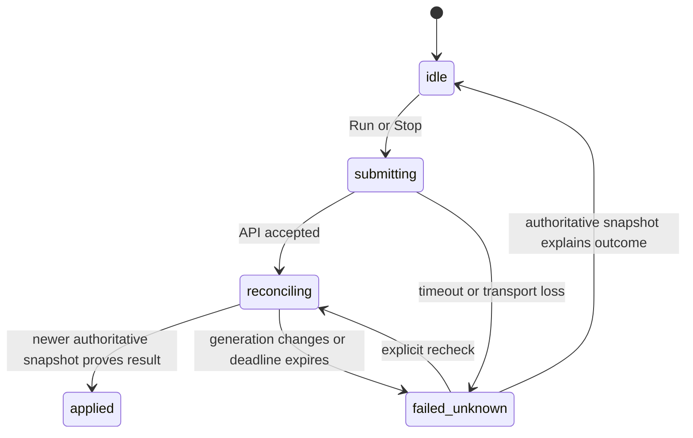

<!-- /autoplan restore point: /Users/zhangxiaoyu/.gstack/projects/xi0yu-NovaSight/develop-alpha-autoplan-restore-20260820-144342.md -->
# NovaSight 主线功能与 WebUI 用户体验整改计划

状态：IMPLEMENTATION_IN_PROGRESS。用户已于 2026-08-20 批准实施 D1A，并追加“粉白清昼”“黑灰红”两套共享语义令牌主题；host 代码与检查已完成，M3a 保持 opt-in，M3b 默认翻转与生产结论等待当前 SHA 的 Jetson build/production 收据。

日期：2026-08-20
分支：`develop-alpha`
实现权威：当前源码、`PROJECT_HEALTH_AUDIT.md`、`TODO.md`、`docs/web-authentication-architecture.md`、`docs/jetson-production-acceptance.md`、`.interface-design/system.md`。历史 `docs/superpowers/specs/` 仅作背景参考。

## 1. 目标与成功定义

这次工作的目标不是再做一轮表面换肤，而是把 NovaSight 当前已存在、会真实交给用户操作的 Web 界面，整理成一条连续、可理解、可恢复、不会误报运行状态的产品流程。

成功时，用户能在一个浏览器会话中完成：

1. 通过每次启动生成的 LAN 接入码验证调用方身份。
2. 使用同一个授权输入流程提交临时授权码或正式签名许可证。
3. 判断当前系统是否具备运行条件，并知道缺少的是设备、模型、配置、许可证还是服务状态。
4. 启动/停止主链，并始终拥有独立的紧急停止入口。
5. 配置采集、模型、控制和硬件输出，明确区分“页面草稿”“已保存配置”“当前运行配置”。
6. 在出现问题时进入对应诊断面，而不是在普通页面被大量协议计数和内部字段淹没。
7. 在桌面和窄屏 LAN 浏览器中完成同一套核心操作，且键盘、屏幕阅读器、慢网络和会话过期路径可用。

## 2. 不可改变的产品边界

```text
Browser
   │ LAN HTTP/HTTPS
   ▼
novasight-web
   ├─ static WebUI
   ├─ authentication
   ├─ server-side session
   ├─ authorization
   ├─ CSRF / Host / Origin protections
   └─ deny-by-default proxy policy
          │ HTTP/1 over Unix socket
          ▼
novasightd
   ├─ runtime/config/license/model/capture/hardware SSOT
   ├─ immutable runtime snapshots
   └─ typed commands and fail-closed output
```

- `novasight-web` 是唯一 TCP/LAN 边界；`novasightd` 不监听 LAN。
- React 不成为第二个运行态权威。所有运行结论来自 daemon 的单一语义状态、单调 revision，以及由 `daemon_instance_id + snapshot_sequence` 标识的新鲜 snapshot。
- 浏览器身份、产品许可证、运行健康和物理输出权限是四个独立闸门，不互相暗示。
- 临时授权与正式激活使用同一个 `POST /api/license/activate` 和同一个前端表单。临时码必须由 debug launcher 每次随机生成、进程内验证、重启失效；前后端禁止固定常量。
- 普通 Run/Stop 是一条路径；Emergency Stop 在所有已认证且具备运行权限的 Studio 页面独立可用。会话或授权丢失后不能绕过认证继续发 mutation，入口必须明确提示“daemon 运行态未被改变”，要求重新认证后立即对账，并给出设备侧物理处置路径。
- WebUI 不进入实时控制环，不推导或伪造 DeepStream、TensorRT、kmNet 的实时状态。
- 不以 macOS/host 构建结果宣称 Jetson 生产就绪。

## 3. 当前主线功能图

```text
Portable launcher / source launcher
  ├─ provision Web access identity
  ├─ provision debug temporary license identity (debug only)
  ├─ start novasightd on run/novasightd.sock
  ├─ start novasight-web
  └─ print authenticated LAN URL

Authenticated operator
  ├─ license gate
  ├─ capture configuration and ROI
  ├─ model catalog / metadata / publish / rollback
  ├─ realtime preview and inference status
  ├─ target selection / prediction / control status
  ├─ staged configuration editing and apply feedback
  ├─ isolated kmNet diagnostic move
  ├─ latency and freshness diagnostics
  └─ start / stop / emergency stop

Production runtime
  DeepStream capture
    -> NVMM ROI crop/resize
    -> TensorRT inference
    -> DetectionBatch latest-only
    -> target selection/tracking/prediction
    -> continuous angular control
    -> recoil composition
    -> fixed X/Y clamp
    -> generation/trigger/output-gate recheck
    -> native kmNet output
```

## 4. 信息架构与全部用户界面

### 4.1 入口闸门

#### A. 浏览器认证页

用户第一眼只看到产品身份、一个接入码输入框、一个主操作和当前 Web/API 可达状态。

- 自动路径：从 `#access=...` 读取启动码，立即清除 fragment，换取 HttpOnly 会话。
- 手动路径：输入本次启动器显示的接入码。
- 错误路径：无效码、频率限制、Web/API 不可达分别说明原因和下一步。
- 安全信息默认折叠；不在主任务前展示 CSRF、IPC、Host/Origin 等实现细节。
- 成功后进入授权闸门；认证成功不显示为“系统已就绪”。

#### B. 授权激活页

临时授权和正式许可证共用一个字段、一个提交按钮、一个响应解释区。

- 验证前不要求用户选择“临时/正式”。后端按同一验证链判断凭据类型。
- 验证后显示授权等级、有效期、功能范围和硬件控制是否允许。
- 临时授权必须明确“随 daemon 重启失效、无硬件控制权限”。
- 正式授权显示签发身份、起止时间和可用功能；不默认暴露不帮助决策的 token 元数据。
- 清除许可证是二次确认动作；清除失败保持当前状态并提供恢复动作。

#### C. 已认证会话条

每个受保护页面持续显示三个互不混淆的事实：浏览器会话、Web/API 网关、daemon IPC。

- 会话到期或 API 401：卸载受保护页面，保留 daemon 运行态，回到认证页。
- CSRF 拒绝：刷新会话令牌并要求用户重试原操作，不自动重复危险 mutation。
- daemon 不可达：保留浏览器会话，禁用后续运行/授权操作，并给出重试。
- 退出：撤销服务端会话和内存 CSRF，不停止 daemon。

### 4.2 Studio 全局壳层

全局壳层由品牌、当前项目、当前采集设备、运行态传输状态、主题、异常中心和侧栏导航组成。

信息优先级：

1. 当前页面名称和本页任务。
2. 主链状态与本页主操作。
3. 项目/设备上下文、连接新鲜度和异常入口。

全局规则：

- 所有普通页面复用一个 `StudioRuntimeBar`；参数页不重复运行控制；控制测试页改为安全诊断提示。
- 页面切换写入 `?page=`，浏览器前进/后退可恢复，切换后滚动到页面顶部。
- 参数页存在未保存草稿时，离开页面必须确认。
- 异常中心集中收纳网络、服务和操作错误；普通页面只显示与当前任务直接相关的内联错误。
- 状态展示必须标注它是实时值、已保存值、当前 effective 值还是诊断证据。

### 4.3 九个 Studio 工作区

#### 0. 运行总览

用户任务：在 5 秒内判断能否运行、主链在做什么、硬件输出是否安全，以及唯一下一动作。

- 默认路由为 `?page=overview`；未知 route 显式回退总览。
- 首屏固定展示当前可信结论、lifecycle/perception/output 三轴、一个普通主动作和独立 Emergency Stop。
- readiness blocker 每次只突出一个 primary 修复动作，并携带返回总览的 deep link。
- 最近结果没有真实样本时显示可行动空态；generation、sequence、protocol evidence 默认折叠。
- 精确 screen contract、truth table、窄屏和安全 mutation 规则见 14.3–14.9。

#### 1. 采集

用户任务：选择实际视频设备和格式、设置中心 ROI、判断采集与推理输入是否健康，然后启动主链。

默认内容：

- Launch Readiness：只列当前阻塞运行的条件，并提供直接修复动作。
- 采集设备：路径、显式能力检测、实际支持格式、保存采集配置。
- ROI：尺寸、快捷档、源尺寸、配置 ROI、运行 ROI 和应用状态。
- 关键指标：采集状态、实际推理输入 FPS、配置 FPS、ROI 应用。

折叠诊断：采集原因、完整 profile 来源、时间窗口和后端当前无法确认的数据。

业务约束：更换设备后不自动探测；运行中禁止不安全的采集重配；保存结果必须说明热更新、epoch reload 或进程重启。

#### 2. 模型推理

用户任务：确认当前模型、调整推理后处理、查看真实 ROI 预览和识别结果，需要时进入模型管理器。

默认内容：

- 当前模型摘要和“管理模型”主入口。
- 置信度与 NMS，显示保存值和当前运行值的应用关系。
- ROI 输入预览、模型输入尺寸、缩放倍率和小目标密度警告。
- 推理 FPS、结果 FPS、新鲜度和最近检测数量。

折叠诊断：调度计数、时间戳关联、输入/输出 tensor 证据、后处理明细。

#### 3. 模型管理

用户任务：选择设备上真实存在的模型，执行后端验证与切换，并确认当前 active artifact 和运行结果。

- 可深链 URL 为 `?page=models`；推理页只保留当前模型摘要和入口。
- 默认流程固定为“选择 -> 验证并切换 -> 确认运行结果”。
- 目录发现、探测、profile、DeepStream 建议、发布 receipt 和回滚证据进入高级诊断。
- 切换结果必须来自后端事务，不允许只改变前端选择。
- 发布/回滚是同步后端事务，不伪装成可查询 job；浏览器离页只结束本地等待，不能取消已提交事务。重新进入后读取 active deployment、artifact 和 runtime 对账。
- `/api/models/jobs` 只表示模型转换任务，不作为发布 receipt。候选已是当前 active artifact 时按 authoritative no-op 成功展示，不报“切换失败”。

#### 4. 控制

用户任务：理解当前目标怎样变成最终设备命令，调整少量高价值控制项，并确认输出是否被安全闸门阻止。

默认链路固定为：

```text
目标选择 -> 速度预测 -> 连续 Atan 控制 -> 压枪合成 -> 固定限幅 -> 输出复核 -> kmNet
```

- 主视图展示当前目标、预测、控制量、限幅和输出结果；不展示第二套公式。
- 没有样本时显示可行动空状态，不用 `0` 冒充测量。
- 视觉准星学习是独立支路：需要真实学习帧，失败回退几何中心，并明确当前控制原点。
- 协议计数、generation、阻断原因和设备 receipt 收入折叠诊断。

#### 5. 参数设置

用户任务：按真实控制链顺序编辑参数，先形成页面草稿，再一次保存并看到每项如何生效。

顺序固定为：触发方式 -> 开火延迟 -> 预测/算法 -> 目标选择与跟踪 -> 压枪 -> 固定限幅 -> 输出门。

- 顶部只保留导入、导出、放弃草稿、保存修改和整体保存状态。
- 弹窗内修改先加入页面草稿，不直接写后端；最终保存以 expected revision 做并发保护。
- 保存反馈区分：已热更新、需 epoch reload、需进程重启、写入失败并已回滚、写入失败且状态未知。
- 高风险/专家字段进入高级区域；普通用户看不到回放分析或内部算法实现常量。
- 导入文件必须走同一 schema 校验和差异摘要，不能绕过页面业务规则。

#### 6. 控制测试

用户任务：在自动主链完全停止时，验证实际 kmNet 配置和一次受控移动。

- 进入页首先展示四个安全前提：主链 stopped、硬件 adapter 可用、物理输出门开启、配置已进入 effective revision。
- 单步测试固定执行“连接 -> 发送一条 signed-16-bit move -> 断开”，不复用主链实时会话。
- 主链未停止、输出门关闭、配置待重启、设备未委任、零位移或越界时 fail closed。
- 地址、端口、UUID 必须来自真实配置；禁止提供可直接复用的示例常量或“推荐配置”按钮。
- 实时会话 connect/disconnect 与单步测试明确分区，避免用户误以为测试前必须启动主链。

#### 7. 延迟分析

用户任务：判断慢在哪里，以及样本是否足够新。

- 先给端到端结论和最慢阶段，再展示采集、预处理、推理、后处理、控制、设备发送的阶段时序。
- 无主链、等待首批统计、状态通道断开分别使用不同空状态。
- 没有真实样本时不展示占位数字，不把配置 deadline/FPS 当作实时测量。
- 累计缓冲、队列、帧龄、跳过/丢弃原因在折叠诊断中提供。

#### 8. 错误中心

用户任务：识别跨页面、重复或危急错误的影响，执行一个明确恢复动作，并保留已解决记录用于诊断。

- 以 `source + code` 聚合，展示 severity、影响、次数、首次/最近时间和当前 resolved 状态。
- 当前页面可恢复的校验错误只内联显示；跨页面、重复、运行安全和状态未知错误进入全局中心。
- 同一错误复发时重开原条目，不制造 toast 风暴；toast 只通知，不作为恢复证明。
- 原始 operation id、trace 和 protocol evidence 默认折叠。

## 5. 页面状态合同

每个页面和对话框必须覆盖以下六种状态：

| 状态 | 用户看到什么 | 业务规则 |
| --- | --- | --- |
| Loading | 稳定骨架或当前内容上的局部 pending | 不清空已有可信状态，不重复提交 |
| Empty | 缺少什么、为什么、一个直接动作 | 不展示虚构指标或默认成功 |
| Error | 具体问题、影响范围、恢复动作 | 保留用户草稿和后端已确认状态 |
| Success | 简短确认和最新 authoritative state | 成功提示不能早于后端确认 |
| Partial | 哪些已成功、哪些仍等待/失败 | 不把部分成功包装成整体成功 |
| Stale | 最近更新时间、状态通道问题和刷新动作 | 禁止把旧 snapshot 当作当前结果 |

交互边界：双击提交、请求进行中再次操作、切页、浏览器后退、慢 LAN、断网、会话过期、CSRF 轮换、revision 冲突、daemon 重启、WebSocket 重连都必须有明确结果。

## 6. 视觉与交互系统

- 定位是安静、紧凑、精确的实时工作台，不是营销页、卡片拼盘、游戏 HUD 或开发者日志查看器。
- 颜色、字号、间距、圆角和状态全部来自语义 token；页面组件禁止散落 raw hex。
- 一个页面最多有一个主要行动焦点。卡片只在它本身代表一个完整操作单元时使用。
- 默认页只展示用户判断下一步所需的信息；协议 receipt、累计计数和内部字段折叠。
- 状态不只依赖颜色，同时使用文字和图标。
- 桌面保持侧栏 + 主工作区；窄屏使用可横向访问或抽屉式导航，运行/紧急停止动作保持可达。
- 键盘焦点可见；对话框有 focus trap、Esc/遮罩关闭规则和返回焦点；危险操作不会因 Enter 或双击误触。
- 正文对比度至少 4.5:1，触控目标至少 44px，表单 label 始终可见。

## 7. 前端业务逻辑整改

### 7.1 单一语义状态

- 所有页面从同一个 runtime snapshot 派生展示状态，并对同一语义结论只做一次稳定化。
- WebSocket heartbeat 只更新传输新鲜度，不触发无意义页面重绘。
- REST fallback 不能覆盖更新的 snapshot；用 snapshot sequence 和本地请求 revision fencing。
- 失败或超时后重新读取 daemon 状态，不相信 optimistic UI。

### 7.2 Mutation 生命周期

```text
idle
  -> validating
  -> submitting
  -> daemon accepted
  -> runtime reconciliation
  -> applied | restart_required | rolled_back | failed_unknown
```

- mutation 有前端本地生成的 stable operation id，按钮 pending、防双击和可恢复错误。本轮不要求修改 daemon 协议；本地 id 只关联 UI 操作、错误中心和请求生命周期，不冒充服务端 receipt。
- 普通 start/stop、emergency stop、配置保存、模型发布/回滚、许可证激活、硬件诊断分别拥有独立状态机。
- 用户离开页面只取消前端等待，不假定后端操作被取消；返回后必须 reconcile。

### 7.3 配置草稿与并发

- 参数页保留 `server config -> page draft -> dialog draft` 三层，禁止弹窗直接绕过页面草稿。
- 以 backend config schema 驱动 label、范围、单位、apply mode 和 restart 要求；前端硬编码只保留产品化布局和解释。
- expected revision 冲突时显示差异并要求刷新/重新应用，不静默覆盖。

### 7.4 权限与功能可用性

- Web role permission 决定按钮是否存在/可用；license feature 决定 daemon 是否接受业务能力；两者分别解释。
- 未知新 daemon route 保持 LAN deny-by-default。
- `/api/v1/daemon/shutdown` 永远不在 WebUI 暴露。

## 8. 后端配合与接口要求

- `novasight-web` 继续拥有认证、session、authz、CSRF、Host/Origin 和安全 header；浏览器凭据不转发到 daemon。
- `novasightd` 的 HTTP/Unix socket 兼容入口必须委托同一个 runtime/config/model/license authority。
- 所有用户可见 mutation 返回稳定错误码、可行动 message、desired/effective revision 和是否 rollback。
- runtime status topic 保持 `summary | capture | infer | control | latency`，只投影页面需要的数据，同时维持单一 snapshot sequence。
- 模型事务、配置事务和硬件诊断必须在后端完成完整验证，前端禁用状态只是体验层，不是安全边界。
- auth/session、license activation、runtime control、config、model、capture、executor 路由继续按 permission allowlist 暴露。

## 9. 测试与验收

### 9.1 静态与构建门

```bash
cargo metadata --locked --format-version 1
cargo fmt --all -- --check
cargo clippy --workspace --all-targets --locked -- -D warnings
cargo test --workspace --locked
pnpm --dir web typecheck
pnpm --dir web visual:audit
pnpm --dir web build
cargo run -p novasight-packager -- --profile release
```

删除 direct dependency 后，manifest、`Cargo.lock`、source use 和 `cargo tree` 必须一致；被删除依赖不得继续作为构建项。

### 9.2 Web 行为覆盖

当前仓库没有 Studio 自动交互套件。本计划要求建立：

- 组件/状态测试：认证、许可证、runtime bar、参数草稿、模型切换、错误中心和空状态。
- API contract 测试：401、403、CSRF、revision conflict、rollback、session expiry、WebSocket 4403。
- 浏览器 E2E：fragment 自动认证、手动认证、临时/正式授权同表单、运行总览与九个工作区导航、Run/Stop、Emergency Stop、参数离页保护、模型事务、断线重连。
- 响应式和可访问性检查：桌面、平板、375px 窄屏、键盘全流程和语义 landmark。

测试框架选择需要在 Engineering Review 中确认，避免仅为测试便利污染生产模块。

### 9.3 Jetson 两级收据

1. `jetson-build`：aarch64 release build、fail-closed startup、Web auth、CSRF、signed license、emergency stop、logout、local-only daemon shutdown。
2. `jetson-production`：受保护环境中的真实 camera、DeepStream metadata、TensorRT model fixture、DetectionBatch、freshness/latency、start/stop/restart 和 output-disabled 零 kmNet 命令收据。

物理 kmNet 移动验收必须使用隔离靶场、人工批准环境和独立 receipt，不进入普通 PR CI。

## 10. 实施顺序

1. 冻结页面/权限/API/配置 schema 合同和页面状态矩阵。
2. 拆分 `StudioConsoleView.tsx` 的页面级 state hook、runtime projection、launch orchestration 和页面视图，但不创建新的状态权威。
3. 完成入口闸门与全局壳层的一致状态、恢复和窄屏行为。
4. 按“采集 -> 模型推理 -> 控制 -> 参数 -> 控制测试 -> 延迟”逐页整改内容层级和业务状态。
5. 建立前端组件/contract/E2E 行为覆盖。
6. 跑 host 静态/构建门并生成 portable release package。
7. 启用并取得 Jetson build receipt；随后在受保护环境取得 production receipt。
8. 仅在上述证据完成后声明生产验收通过。

## 11. NOT in scope

- 不新增没有现成业务/API 契约的 Admin、日志、系统、账号管理或多用户页面。
- 不把浏览器 access code 变成许可证，也不把许可证变成 LAN 调用方身份。
- 不引入第二个 backend、Python runtime 或 React 运行态 authority。
- 不重写目标选择、预测、控制公式或 kmNet 协议。
- 不以 CSS 动画掩盖状态闪烁，不以占位数字掩盖无样本。
- 不在 CI 中驱动物理 kmNet 硬件。
- 不因文件过大而做无语义拆分；只有在相关页面整改时按现有 ownership seam 提取。

## 12. 决策登记

| 决策 | 结论 | 来源 |
| --- | --- | --- |
| 产品主目标 | D1A：安全运行黄金旅程和只读运行总览 | 用户确认 |
| 前端测试结构 | Vitest + React Testing Library + contract fixtures 为主，Playwright 只覆盖关键 E2E；允许新增 devDependencies，不增加生产运行时依赖 | Engineering 自动决策，待 Phase 3 固化版本与命令 |
| 参数字段 | 默认产品字段，其余 schema 字段进入专家区 | CEO 自动决策 |
| 模型管理 | 升级为可深链 `?page=models` 工作区；保留后端事务 | CEO 自动决策 |
| 窄屏导航 | 可关闭抽屉，Emergency Stop 仅在已认证 Studio 内固定可达 | Design taste decision，最终门展示 |
| mutation identity | 前端本地 operation id；不扩展 daemon 协议 | Engineering 自动决策 |
| daemon 重连 fencing | additive `daemon_instance_id` + process-local `snapshot_sequence` 排序；浏览器 `request_generation` 只丢弃旧异步 callback | Engineering 自动决策 |

## 13. CEO Review：战略与范围

### 13.1 已确认的产品前提

用户已选择 D1A。本轮目标不再表述为“把六个页面分别做漂亮”，而是：

> 让操作员从打开 LAN 链接，到完成身份验证、授权、排除阻塞、安全启动、确认感知与物理输出状态、停止或恢复故障，始终得到一个可信结论和一个明确下一步。

具体前提评估：

| 前提 | 评估 | 决定 |
| --- | --- | --- |
| Jetson-first Rust、`novasight-web` 唯一 LAN 边界、Unix socket 到 `novasightd` | 已被当前源码和架构文档证明 | 保持，不重开技术路线 |
| daemon 是 runtime/config/license/model/capture/hardware 唯一权威 | 正确；React 只能投影 snapshot | 保持，运行总览不得引入第二状态源 |
| 临时授权与正式许可证共用验证入口 | 已实现且符合用户要求 | 保持，页面只简化呈现，不拆成两套流程 |
| 一个 `operator` 角色意味着所有工具都应同级展示 | 错误；权限模型与信息架构是两个问题 | 后端角色不变，前端按日常运行、配置换型、诊断验收渐进披露 |
| 新增运行总览需要新的后端 API | 错误；现有 runtime snapshot、readiness 和 `next_action` 已足够 | 复用现有数据，禁止另建聚合权威 |
| 实时设备健康与 Jetson 生产资格是同一件事 | 错误；生产资格需要 workflow、commit、平台版本和 receipt | 实时总览进入本轮；生产资格页面延期 |
| 认证接入码足以支持任意网络暴露 | 错误；直接 HTTP 只支持受控 LAN | 写入部署前提；其他网络必须使用认证 TLS 代理、Secure cookie 和显式 Host |

如果什么都不做，用户仍需在六页之间自行拼装“能否安全运行”的结论；授权页和控制页会继续让普通操作员面对大量追踪字段；任何全站重构也缺少行为回归边界。这是现存产品痛点，不是假设风险。

### 13.2 What already exists

| 子问题 | 现有实现 | 本计划如何复用 |
| --- | --- | --- |
| 浏览器身份 | `AuthGate.tsx`、服务端 session、CSRF、4403 过期关闭 | 保留单一认证门，只改信息层级和恢复动作 |
| 临时/正式授权 | `LicenseActivationForm` 已共用 `saveLicenseKey()` | 收敛展示字段，不创建第二表单或固定临时码 |
| 运行准备 | `launchReadiness.ts`、`LaunchReadinessPanel.tsx` | 从采集页提升为运行总览的阻塞清单与动作路由 |
| 单一运行语义 | runtime snapshot、topic、sequence、`runtimeStatus.ts` | 运行总览和六页共享同一投影，不重复 debounce |
| 普通控制与紧停 | `StudioRuntimeBar.tsx` 和 daemon runtime commands | 总览复用同一 Run/Stop；Emergency Stop 独立常驻 |
| 配置并发 | per-field revision CAS、页面草稿和 canonical reread | 保留事务语义，统一保存反馈和冲突恢复 |
| 模型事务 | catalog、metadata、inspect/profile、publish/rollback | 默认只暴露“选择、验证并切换、确认结果”，高级证据折叠 |
| 采集与预览 | capabilities/select/stop/preview/stream | 总览只给健康摘要，详细配置仍归采集页 |
| 硬件诊断 | executor connect/disconnect/diagnostic move | 保持 stopped/output/config 四重前提与一次性会话 |
| 视觉系统 | token、图标、状态组件、空状态和视觉审计 | 复用现有系统，不另建组件库 |
| Jetson 验收 | `jetson-build`、`jetson-production` 和 receipt 约定 | 保持外部发布门，不由浏览器猜测通过状态 |

### 13.3 Dream state

```text
CURRENT
入口/授权已分离，但六页平铺；用户自己判断运行条件；行为测试缺失
   |
   v
THIS PLAN
可信运行总览 + 任务分层 + 页面渐进披露 + mutation 对账 + 纵向行为测试
   |
   v
12-MONTH IDEAL
首次委任、日常运行、诊断、版本/receipt 形成完整设备生命周期；
所有结论可追溯到 daemon snapshot 或签名发布证据，多设备能力仍不污染单机实时权威
```

Dream state delta：本轮完成单机操作面的可信运行旅程和可测试前端边界，但不完成多设备管理、远程云接入、系统级监控平台或可验证 release receipt UI。它建立后续承载这些能力的信息架构，而不提前发明 API。

### 13.4 实施替代方案

| 方案 | 摘要 | 完整度 | 人工 / CC | 风险 | 优点 | 代价 |
| --- | --- | --- | --- | --- | --- | --- |
| A. 原六页逐页整理 | 保持采集为默认页，只做内容降噪、响应式和交互反馈 | 6/10 | 1–2 周 / 1–2 天 | 中 | 改动小、回退简单 | 运行结论仍碎片化，继续要求用户理解内部模块 |
| B. 安全运行黄金旅程 | 新增只读运行总览，按任务分层；先建立黄金旅程测试，再逐页纵向整改 | 10/10 | 3–4 周 / 4–7 天 | 中 | 直接解决核心体验，复用现有权威和动作图，可分片交付 | 需要建立测试基础设施并调整默认入口、导航和 Studio ownership seam |
| C. 完整设备运营平台 | 在 B 上加入首次委任、系统监控、构建身份和 Jetson receipt | 8/10（本轮） | 4–6 周 / 1–2 周 | 高 | 覆盖完整设备生命周期 | 当前缺少稳定 API，会拖慢本轮并诱发第二状态源 |

选择 B。用户已明确确认 D1A；它在当前产品边界内覆盖最完整，同时遵循 DRY 和单一权威。

### 13.5 SELECTIVE EXPANSION 范围决定

复杂度判断：计划必然触及多个页面，但必须按纵向切片拆分，禁止先拆完整个 `StudioConsoleView.tsx` 再补行为证明。

已接受：

1. 基于现有 snapshot 的默认“运行总览”。
2. 日常运行、配置换型、诊断验收三层渐进披露；不增加后端角色。
3. 黄金旅程行为测试先行，并在每个页面切片中同步补覆盖。
4. 部署安全前提进入入口说明和验收合同；仅在能够确定配置错误时显示警告。
5. 模型和授权默认视图按任务动作收敛，证据字段折叠。
6. 所有阻塞结论提供一个可达的直接修复动作。

延期：

1. 首次委任 wizard：价值明确，但跨越配置、网络、设备生命周期，超出本轮 blast radius。
2. Jetson 生产 receipt 页面：缺少签名构建身份和 receipt API；禁止用实时健康冒充生产资格。
3. Prometheus/Grafana 式系统监控中心：属于运维平台，不是本轮 Studio 黄金旅程的必要条件。
4. 多用户、多角色和账号管理：当前只有单设备 `operator` 合同，不能从信息架构变化推导新安全模型。
5. 云端远程访问和多设备编排：需要独立威胁模型、设备身份和发布设计。

明确跳过：

1. 新 Python/backend 服务或浏览器直连 daemon。
2. 固定临时授权码、前端 license 推断或前端硬件安全边界。
3. 复制已有 runtime/config/model 状态形成“总览专用”状态仓库。

### 13.6 Temporal interrogation

| 阶段 | 现在必须锁定的决定 | 已选答案 |
| --- | --- | --- |
| Hour 1：基础 | 默认入口、导航层级、数据权威、回滚边界 | 默认进入 `overview`；保留当前六个深链并新增 `overview`、`models`；daemon snapshot 唯一权威；旧 `capture` 深链继续有效 |
| Hour 2–3：核心 | readiness 如何映射动作、哪些字段默认展示、mutation 如何恢复 | 每个阻塞项只有一个主动作；证据折叠；失败后 canonical reread，不自动重放危险请求 |
| Hour 4–5：集成 | 会话过期、daemon 重启、WebSocket stale、revision 冲突 | 认证、IPC、业务状态分离；旧 snapshot 不覆盖新 sequence；冲突保留草稿并显示差异 |
| Hour 6+：完善 | 窄屏、键盘、测试选择、Jetson 证据边界 | 抽屉导航；44px 触控；组件/contract 为主、少量关键 E2E；Jetson receipt 独立 |

人工实施约 3–4 周；在现有依赖可解析且设备环境可用的前提下，CC 协作约 4–7 个工作日。测试基础设施与第一条黄金旅程是独立里程碑；第一条可用切片先交付，不等待所有页面同时完成。

### 13.7 Mode selection

模式为 `SELECTIVE EXPANSION`。基线范围保留，D1A 中的运行总览、任务分层和测试先行进入本轮；其余平台化能力延期。不是缩减六页，而是改变交付顺序和信息架构，让每一页服务于同一运行旅程。

### 13.8 Dual voices

#### CLAUDE SUBAGENT（CEO：战略独立审查）

独立审查给出 8 项问题：页面中心而非黄金旅程（critical）；权限角色与用户任务混淆；API 能力清单重新暴露；先大拆分后测试；生产验收页与运行总览混淆；受控 LAN 前提缺失；工作稿目录权威冲突；安全能力无法被普通用户感知。D1A 接受了核心修正。

#### CODEX SAYS（CEO：战略挑战）

`[codex-unavailable]`。本地 CLI 的只读调用需要向外部服务发送私有计划内容，安全审批拒绝；没有绕过，也不把缺失声音伪装为共识。

| 维度 | Claude | Codex | 共识 |
| --- | --- | --- | --- |
| 前提有效 | 部分；需改为黄金旅程 | N/A | N/A，critical 单声部已标记 |
| 问题是否正确 | 原问题是代理问题 | N/A | N/A |
| 范围校准 | 总览应进本轮，平台页延期 | N/A | N/A |
| 替代方案 | 需补三种方案 | N/A | N/A |
| 竞争/市场风险 | 应展示可信运行优势 | N/A | N/A |
| 六个月轨迹 | 先测试再纵向切片 | N/A | N/A |

结论：`[subagent-only]`，0/6 双模型确认；8 项单声部问题均由主审查用源码证据复核，D1A 前提由用户明确确认。

### 13.9 Section 1：Architecture Review

新增的只是前端组合层，不是服务：

```text
Browser session
  -> AuthGate
  -> LicenseGate
  -> StudioShell
       -> RuntimeOverview (new pure projection + callbacks only)
       -> Daily: capture / infer / control
       -> Configure: params / model manager
       -> Diagnose: control-test / latency
       -> RuntimeCommandController (owns Run/Stop/Emergency mutations)
            -> StudioRuntimeBar + authenticated-page Emergency Stop
            |
            v
       shared api client + contract decoders
            |
            v
novasight-web: session/authz/CSRF/Host/Origin
            |
            v  HTTP/1 over Unix socket
novasightd: runtime/config/license/model/capture/hardware SSOT
```

四条数据路径：

| 路径 | Happy | Nil | Empty | Error |
| --- | --- | --- | --- | --- |
| session | restore HttpOnly session | anonymous gate | 无权限集合即拒绝 | 401 卸载受保护 UI |
| runtime snapshot | sequence 更新 overview 和当前页 | daemon 未连接，保留会话 | 无样本显示阻塞/等待 | stale 标记，禁止旧值冒充当前 |
| mutation | validate → submit → reconcile | 缺字段前端和后端拒绝 | 空凭据/空配置拒绝 | canonical reread，显示 applied/rollback/unknown |
| navigation | query 恢复合法页面 | 无 query 进入 overview | 未知值归一为 overview | dirty draft 离页确认 |

总览不是单轴状态机，而是三个独立事实轴加一个显式顶层投影：

```text
lifecycle: stopped | starting | waiting_model | running | standby | stopping | faulted
perception: unavailable | stopped | starting | waiting_model | current | stale | faulted
output: safe | blocked | armed | unknown

priority projection:
  session missing > daemon unavailable > faulted > stopping/starting > stale
  > running+output unknown > running+blocked > running+armed > stopped+safe

transport identity:
  daemon_instance_id is generated once when the daemon API composition starts
  snapshot_sequence is strictly monotonic inside one daemon instance
  request_generation increments for browser reconnect/topic/fallback attempts
  late REST/WS callback from an older request_generation --X--> presentation state
```

`runtime_epoch` 仅表示同一 daemon 内的主链启动代次；`snapshot_sequence` 是同一 daemon process 内严格单调的 publication order；新增 additive `daemon_instance_id` 是 API composition 的 boot nonce，用来识别 daemon 重启。浏览器 `request_generation` 只处理异步 callback 归属，不能允许同一 daemon 的 sequence 倒退，也不能冒充 daemon incarnation。耦合被限制在 `RuntimeOverview` 对纯 presentation model 的依赖；它不得直接拥有模型、采集或硬件 mutation，Run/Stop/Emergency Stop 由 shell 级 `RuntimeCommandController` 管理并以 callbacks 注入。

`buildRuntimeOverview()` 的字段派生 truth table：

| 输入条件（按优先级） | lifecycle | perception | output | 顶层结论 |
| --- | --- | --- | --- | --- |
| 无 session | 保留最近值但不展示为当前 | `unavailable` | `unknown` | 需要认证；daemon 状态未被改变 |
| daemon/transport unavailable | 最近 lifecycle + stale 标记 | `stale` | `unknown` | 当前状态无法确认 |
| `semantic.phase=faulted` | `faulted` | `faulted` | `unknown` | 主链故障，禁止成功态 |
| stopped 且满足统一安全 predicate | `stopped` | `stopped` | `safe` | 可以运行或等待配置 |
| stopped 但安全 tuple 不完整 | `stopped` | `stopped` | `unknown` | 已停止主链，但硬件输出状态未确认 |
| `semantic.phase=starting|stopping` | 同名值 | semantic 原值 | `unknown` | 正在启动/停止 |
| `semantic.phase=waiting_model` | `waiting_model` | `waiting_model` | `blocked` | 主链已建立，等待模型且不会输出 |
| transport 正常且 `detection_data_age_ms > detection_freshness_threshold_ms` | semantic phase | `stale` | `blocked` | 感知数据过旧 |
| `output_trace.state=blocked|waiting|idle` | semantic phase | 映射后的 perception | `blocked` | 当前不能发送；按 next_action 修复或等待 |
| `output_trace.code=ready` 且 kmNet connected | semantic phase | `current` | `armed` | 输出链已具备发送资格；`will_emit` 只说明当前样本是否 eligible，不是设备 receipt |
| 其他或未知组合 | semantic phase + unknown 标记 | 映射后的 perception | `unknown` | 不猜测，展示 detail/诊断入口 |

`perception.current` 只在 semantic perception running、传输新鲜且真实 detection age 未超阈值时成立；`perception.stale` 只由传输 stale 或真实 `statistics.detection_data_age_ms` 超过 `detection_freshness_threshold_ms` 推导。配置 FPS、deadline 或零值不能代替样本。`output.armed` 只说明输出链具备资格；设备真正接收命令仍必须由递增的 `accepted_command_count` / device receipt 证明，本轮 Overview 不显示 `delivering`。

本轮只要求隐藏页不订阅 preview、错误列表有界、旧 generation 响应可丢弃；不为未支持的多租户连接规模新增基础设施。单点故障仍是 daemon；WebUI 只能准确呈现，不能伪造降级运行。

回滚：导航保留 `?page=capture` 深链；Overview 先以 opt-in 路由交付，通过安全验收后再用独立 commit 翻转默认入口。没有数据库迁移；`daemon_instance_id` 是同一 portable package 内的 additive 字段，本轮不承诺旧前端/新 daemon 或新前端/旧 daemon 的 N/N-1 混跑。回滚默认页只需 revert 独立 commit，安全修复不随之撤销。

路由合同：`ConsolePage`/`CONSOLE_PAGES`/metadata 新增 `overview`、`models`，默认值改为 `overview`；当前 `capture|infer|control|params|control-test|latency` 深链全部兼容。status topic 映射保持 `capture→capture`、`infer→infer`、`control→control`、`latency→latency`；`overview|models|params|control-test` 使用 `summary`，模型目录继续按需调用现有 catalog API。

`output_trace.next_action` 的完整用户映射：

| next_action | 用户结论 | 主按钮 | 目标 |
| --- | --- | --- | --- |
| `start_mainline` | 主链尚未运行 | 运行 | shell 级 Run command |
| `check_model` | 模型不可用 | 检查模型 | `?page=models` |
| `check_capture_or_model` | 输入或模型尚未建立 | 按 `active_model` 决定 | `capture` 或 `models` |
| `inspect_runtime_ingress` | 运行输入没有推进 | 查看采集链 | `capture` 诊断折叠区 |
| `check_latency` | 数据过旧或阶段超时 | 查看延迟 | `latency` |
| `check_targeting` | 没有可控制目标 | 查看目标选择 | `control` |
| `inspect_control` | 控制链阻塞/异常 | 查看控制 | `control` |
| `check_license_or_build` | 当前授权或构建不允许硬件输出 | 检查授权 | 会话条可达的 License 管理视图；若授权有效但 build 禁用，只显示构建能力说明，不误导重新激活 |
| `enable_output_gate` | 物理输出门关闭 | 配置输出 | `params` 的输出门区域 |
| `activate_trigger` | 等待用户触发 | 无 mutation | 自动监控，显示触发条件 |
| `connect_kmnet` | kmNet 未连接/未委任 | 检查设备 | `control-test` |
| `wait_next_frame` | 等待下一帧新鲜控制结果 | 无 mutation | 自动监控，提供超时后“查看延迟” |
| `monitor_output` | 输出链正在工作 | 无按钮 | 自动刷新 receipt，证据折叠 |

runtime decoder 继续接受非空 `next_action` 字符串以保持向后兼容；独立的闭合集合 presenter 映射负责按钮。未知值不生成猜测按钮，只显示 daemon detail、错误中心引用和刷新，并由专门 fixture 断言 fail-closed fallback；后端新增动作时更新 presenter contract，而不是让整个状态 WebSocket 因未知字符串断开。

### 13.10 Section 2：Error & Rescue Map

| 方法/路径 | 失败类别 | 已救援 | 救援动作 | 用户看到 |
| --- | --- | --- | --- | --- |
| `GET /api/auth/session` | 401 / network / malformed | 是 | anonymous 或网关不可达；不挂载业务页 | 重新输入接入码或检查 Web/API |
| `POST /api/auth/session` | invalid / rate limited | 是 | 保留输入，给等待时间 | 接入码无效或稍后重试 |
| `POST /api/license/activate` | empty / invalid / 429 / daemon down | 是 | 不清空失败输入；分类提示 | 问题、原因、下一步 |
| runtime WebSocket | close 4403 / disconnect / out-of-order | 是 | 重新认证或 REST reconcile；sequence fencing | 会话过期或状态暂时中断 |
| runtime start/stop | rejected / timeout / partial | 需加强 | 禁止乐观完成；canonical reread | 当前权威状态和可重试动作 |
| emergency stop | request timeout / daemon down | 需加强 | 保持危险提示，持续 reconcile，不宣称已停止 | “尚未确认停止”，提供本地物理处置指引 |
| config save | revision conflict / partial apply / rollback | 是 | 保留未应用草稿并读回 canonical | 已应用项、剩余项和冲突 |
| model switch | inspect/profile/publish failure | 是 | 后端事务停止，旧模型保持 active | 失败阶段和恢复动作 |
| capture preview | unsupported / stream timeout | 是 | 配置与运行状态保留，预览局部失败 | 预览不可用，不误报采集失败 |
| diagnostic move | unsafe precondition / device error | 是 | fail closed，连接后只发一次再断开 | 哪个安全前提未满足 |

关键缺口是 Emergency Stop 的“204 请求完成”不能等同“设备已停”。保持兼容 API：`POST /api/runtime/emergency-stop` 继续返回 204，但后端必须先发出一次立即 stop，再跨过 `lifecycle_lock` barrier，并在 barrier 内再次 stop/验证，防止已经进入配置准备但尚未 enqueue 的 Start 在紧停之后重新启动。前端捕获请求前 `daemon_instance_id/snapshot_sequence/request_generation`，POST 后必须立即 GET `/api/runtime/state`。只有同一 daemon instance、sequence 大于请求前值的新 snapshot 同时满足 `semantic.phase=stopped`、`vision.output_trace.code=runtime_stopped`、`executor.executors.kmnet.runtime_connected=false`、`vision.control.will_emit !== true`，才显示“紧急停止已确认”。若 POST 报错后 tuple 安全，或对账发生在新的 daemon instance，只能显示“当前安全停止已确认，原请求是否送达未知”。`stopping` 和 `faulted` 永远不能直接当作成功。未满足时保持 `EMERGENCY_STOP_UNCONFIRMED`，不显示成功 toast。

### 13.11 Section 3：Security & Threat Model

| 威胁 | 可能性 | 影响 | 决定 |
| --- | --- | --- | --- |
| 总览新增 mutation 绕过权限 | 中 | 高 | 总览只调用既有 allowlisted API；未知 route deny-by-default |
| access fragment 留在历史/日志 | 低 | 高 | 继续立即清除 fragment，不写 storage |
| 临时授权码被固定或可重放 | 低 | 高 | 每次启动随机、进程内 digest、重启失效、release 忽略 |
| HTTP 暴露到非受控网络 | 中 | 高 | 文档和部署验收明确 TLS proxy、Secure cookie、Host allowlist |
| CSRF 过期后危险 mutation 自动重放 | 中 | 高 | 只刷新 token并要求人工重试，Emergency Stop 例外仍需显式请求与对账 |
| UI 隐藏按钮被当作授权 | 中 | 高 | daemon/license/authz 继续强制；渐进披露只降低认知负担 |
| 模型路径或导入配置注入 | 中 | 高 | 复用后端 canonicalization/schema；UI 不拼 shell，不新增路径直通 |
| 诊断字段泄露设备身份 | 中 | 中 | fingerprint/token/key 片段默认折叠，仅按需复制诊断 receipt |

本轮不增加生产运行时依赖或 secret；允许为验证行为增加锁定版本的 devDependencies。敏感 mutation 继续记录前端本地 operation id、后端错误码和受限上下文；日志不得包含完整 access code、license 或 CSRF。

### 13.12 Section 4：Data Flow & Interaction Edge Cases

```text
snapshot/event
  -> contract decode
     [missing/wrong type => reject frame, keep last trusted + stale]
  -> sequence fence
     [older => drop]
  -> semantic projection
     [empty metrics => no-sample, never zero]
  -> overview/page presentation
     [partial => identify unavailable subsystem]
```

| 交互 | 边界情况 | 处理 |
| --- | --- | --- |
| Run/Stop | 双击、慢请求、切页 | stable operation id + pending；切页不取消后端，返回后 reconcile |
| Emergency Stop | 任意已认证 Studio 页、dialog 打开、session 临近过期 | 在 session 仍有效时固定可达且不被普通 busy 锁覆盖；401 后禁止匿名 mutation，回到认证并提示 daemon 状态未改变 |
| 参数保存 | revision 已变化、部分成功 | 显示差异；只保留剩余草稿；禁止静默覆盖 |
| 模型切换 | 用户关 dialog、页面离开、进程重启 | 后端发布事务可能继续；重新进入按 active deployment/artifact/runtime 对账；conversion job 不冒充 publish receipt |
| 认证 | hash 重用 tab、URL 切换 | 应显式处理 fragment/hashchange 或启动 URL 导航，不依赖组件重新挂载 |
| 导航 | 未保存参数、浏览器后退 | 同一离页保护适用于点击和 popstate |
| preview | 页面隐藏、网络慢、无帧 | 停止/降频订阅；局部空状态不清空 runtime 结论 |
| 错误中心 | 重复错误、错误风暴 | 按 source/code 聚合并计数；保留最近可行动上下文 |
| 主动退出会话 | 主链仍在运行 | 二次确认“只退出浏览器，不停止设备”；完成后显示运行态未改变和重新认证/物理处置说明 |
| 清除许可证 | 主链或硬件输出可能活动 | 二次确认明确说明“将先紧急停止设备”；后端在同一 lifecycle lock 内执行 Emergency Stop -> 验证安全 snapshot -> clear credential，任一步失败都不清除凭据 |
| 多标签页 | 一个标签保存配置或退出 | 每个标签独立内存 CSRF；mutation 后按 revision/sequence 对账；401 使所有标签下次请求回到认证 |
| mutation 中刷新 | 后端可能继续执行 | 不承诺取消；刷新恢复 session 后按 authoritative state/revision/deployment 对账 |
| dialog 草稿离开 | 模型元数据、参数、高级配置未提交 | 统一 dirty guard；浏览器后退、Esc、遮罩和导航使用相同确认语义 |

### 13.13 Section 5：Code Quality Review

`StudioConsoleView.tsx` 约 5,764 行，同时拥有页面导航、运行投影、草稿、模型、预览和 mutation orchestration，是主要回归风险。拆分必须按 ownership seam：runtime projection、navigation guard、`RuntimeOverviewView` 和被触达的页面视图；禁止按文件大小制造通用 store 或第二状态机。

执行约束：只在某个纵向切片被触达时迁出该 slice 的 ownership seam；overview 不以旧页面全部拆分完成为前置。`App.tsx` 当前拥有 snapshot sequence 和 WebSocket lifecycle，因此 `daemon_instance_id + snapshot_sequence + request_generation` gate 必须在那里实现，或先迁入专用 `useRuntimeTransport`；只改 presentation helper 不能完成 fencing。

API contract decoder、错误归类、semantic runtime state、config draft 和 model switch workflow 已存在，应复用而不是在 overview 中复制判断。所有新 presentation helper 使用业务语义命名，例如 `buildRuntimeOverview()`，不使用 `getStatus2()` 或 `dashboardUtils`。

分支超过 5 个的 readiness/overview 判断应保持为显式规则表或 discriminated union。空值、无样本、未知状态和旧 sequence 必须是类型层面的不同分支，禁止 `|| 0`、catch-all “系统异常”或吞错继续。

### 13.14 Section 6：Test Review

```text
NEW UX FLOWS
  auth -> license -> overview -> fix blocker -> run -> verify -> stop
  overview -> configure/diagnose deep link -> back
  emergency stop from every protected page
  stale/disconnect/session expiry/revision conflict recovery

NEW DATA FLOWS
  runtime snapshot -> overview projection
  readiness blocker -> single next action -> navigation
  mutation response -> canonical reread -> presentation

NEW CODEPATHS
  default overview route; grouped navigation; diagnostic disclosure;
  pending/partial/stale/failed_unknown presentations

NEW ASYNC WORK
  existing WebSocket + REST reconcile only; no new background service

NEW INTEGRATIONS
  none; existing Web/API -> Unix socket -> daemon
```

覆盖决定：首个独立里程碑引入 Vitest、React Testing Library、`@testing-library/user-event` 和 jsdom，覆盖纯函数/组件/contract fixtures；Playwright 只覆盖黄金旅程、紧停、断线和窄屏键盘流程。脚本至少为 `test:unit`、`test:unit:ci`、`test:e2e`，`quality.yml` 在 build 前运行 unit/contract，在独立浏览器 job 运行关键 E2E。允许新增这些 devDependencies，禁止把测试 seam 放进生产模块或倒置为大量脆弱 E2E。

周五凌晨可发布的关键测试至少覆盖六条 truth-table：停止且无模型；运行并等待模型；感知可用但输出门关闭；设备断开；输出 armed 且当前样本 eligible 但无 receipt；紧停未确认。每条同时断言 lifecycle、perception、output 三轴和顶层结论。敌对 QA 测试：在 session 到期、WebSocket 乱序和参数 revision 冲突同时发生时快速双击 Run/Stop。Chaos 测试：同一 `daemon_instance_id` 的 WebSocket 重连拒绝 sequence 倒退；新的 daemon instance 才允许 sequence 从小值重建基线；旧 `request_generation` 的迟到 REST/WS callback 必须丢弃。

### 13.15 Section 7：Performance Review

本轮没有数据库、N+1 查询或新后台队列。最慢路径预计是 MJPEG preview、模型目录扫描和大 runtime payload；总览不得订阅 detection 数组或启动额外 catalog refresh。

运行总览只消费 `summary` 和已有轻量字段，隐藏页停止 preview，格式化与列表投影 memoize 于 sequence/相关 slice。状态更新继续在后端约 5Hz 语义范围内；CSS 动画不跟随 heartbeat 重启。

多租户或百连接扩展超出单设备受控 LAN 产品目标。本轮只要求有界错误列表、最新值投影、隐藏页停止 preview 和旧 generation 响应丢弃，不引入 Redis/cache 服务。

### 13.16 Section 8：Observability & Debuggability Review

每个用户 mutation 需要前端本地 operation id、开始/接受/对账/完成阶段和稳定错误码，但默认 UI 只显示结论与下一步。错误中心保留 source、code、首次/最近时间和重复计数；完整凭据与 secret 永不记录。

关键指标是：首次 READY 时间、阻塞项到正确修复面的动作次数、mutation `failed_unknown` 数、session expiry 恢复成功率、stale snapshot 丢弃数和 Emergency Stop 未确认时长。项目当前没有稳定监控平台，因此先在结构化日志/测试 receipt 中定义，不为图表新增服务。

本轮可观测性承诺收敛为“当前浏览器会话内可诊断”：本地 operation id、`request_generation`、`daemon_instance_id`、snapshot sequence、runtime epoch、desired/effective revision 和 daemon error code 可在有界 Error Center/脱敏 diagnostic export 中关联。它不冒充跨刷新 daemon receipt，也不承诺三周后重建因果链。本轮只写五份故障恢复说明：daemon unavailable、CSRF rejection、revision conflict、model publish rollback 和 emergency stop unconfirmed；不建设指标采集或展示平台。

### 13.17 Section 9：Deployment & Rollout Review

没有数据库迁移。发布顺序为：先合入兼容的前端 contract/presentation 测试，再加入 overview 与导航，随后按页面切片；后端 API 只在发现真实缺口时以向后兼容字段扩展。

回滚步骤：保留 `?page=capture`；将默认页常量切回 capture；若 overview projection 失败则 Git revert 对应前端切片；daemon 和许可证文件无需回滚。支持窗口仅覆盖同一 portable package 内原子发布的 frontend/Web/API/daemon；fixture 验证该组合和必填字段 fail-closed，不承诺旧前端/新 daemon 或新前端/旧 daemon 混跑。

发布后五分钟检查认证、授权、READY、Run/Stop/Emergency Stop；一小时检查断线恢复、错误中心聚合和 preview 资源。host 门证明静态与契约；Jetson build/production receipt 才证明设备组合，物理移动仍需监督验收。

### 13.18 Section 10：Long-Term Trajectory Review

技术债务风险不是 overview 本身，而是把它写成第二套条件树或继续让 `StudioConsoleView.tsx` 集中所有 ownership。通过纯 projection、现有 contract 和页面 seam 后，可逆性为 4/5；唯一明显路径依赖是新的默认信息架构，但 query 深链降低回退成本。

最终产品合同不能长期只留在历史计划目录。评审批准后，应把稳定信息架构和状态合同发布到 `docs/web-ui-product-contract.md`，并由 README/health ledger 链接；本文件继续作为决策历史。

Phase 2 可扩展首次委任；Phase 3 可接入签名 build identity/receipt；两者都应建立在本轮单机黄金旅程之上，而不是改变 daemon 权威。

### 13.19 Section 11：Design & UX Review

用户首先看到“现在能否安全运行”，其次看到一个主操作或修复动作，第三层才是证据和细节。默认 overview 不做卡片拼盘：顶部是运行结论与 Run/Stop/Emergency Stop，中部是黄金链路阶段，底部是当前阻塞/下一步；配置和诊断通过任务分组进入。

| Feature | Loading | Empty | Error | Success | Partial/Stale |
| --- | --- | --- | --- | --- | --- |
| Auth | 检查现有 session | 手动码输入 | 无效/限流/网关不可达 | 进入 license | daemon 不可达但 session 保留 |
| License | 读取 daemon 状态 | 同一凭据表单 | 验证失败/限流 | 显示等级与功能 | 临时授权/无硬件权限 |
| Overview | 保留上次可信内容并局部 pending | 未配置阻塞清单 | daemon/contract 错误 | READY/RUNNING | 标明不可确认子系统和时间 |
| Mutation | 按钮 pending | N/A | failed/rolled_back/unknown | daemon confirmed | restart_required/partial |
| Preview | 稳定占位 | 无帧原因 | 局部流错误 | 实时 ROI | stale frame 标记 |

用户情绪弧线应是：陌生但安全 → 清楚缺什么 → 有把握地启动 → 能确认系统真的工作 → 出错时知道怎么恢复。当前入口复杂和六页平铺会在第二步打断；D1A 通过总览和渐进披露修复。

响应式选用窄屏抽屉，而非六个顶部横向标签。抽屉关闭后保留页面标题和全局运行条，Emergency Stop 固定可达；这是 taste decision，将在最终门再次展示。键盘、焦点、landmark、4.5:1 对比度、44px 触控目标和 reduced-motion 为验收条件，不是愿望。

全部用户可见 surface 的交付合同：

| Surface | 当前主要问题 | 默认内容 / 渐进披露 | 必测业务行为 |
| --- | --- | --- | --- |
| AuthGate | 错误与安全细节可能抢占主任务 | 单输入、主操作、Web/API 状态；安全说明折叠 | fragment/manual、限流、hash 复用、session restore/expiry |
| LicenseGate/Panel | 追踪字段过多 | 类型、期限、功能、硬件权限；fingerprint/key/token 折叠 | 临时/正式同链、清除确认、运行中禁止清除 |
| SessionBar | 浏览器/Web/daemon 容易混成一个“在线” | 三个独立状态、License 入口、退出 | daemon down 保留 session、logout 不停 daemon、运行中确认 |
| RuntimeOverview | 当前不存在 | 顶层结论、三轴状态、Run/Stop/E-stop、阻塞与单一动作 | truth-table、next_action 映射、stale/generation、紧停 receipt |
| Capture | readiness 与配置细节混杂 | 设备/格式/ROI/关键指标；完整 profile 折叠 | capability、select/stop、运行中重配、preview 局部失败 |
| Infer | 模型管理步骤过密 | 当前模型、阈值、ROI 结果；管理入口 | 无模型、无检测、stale、保存/effective 差异 |
| Models | dialog 不可深链、发布恢复弱 | 独立 workspace；默认选择/验证切换/确认 | refresh、metadata dirty guard、deployment 对账、publish/no-op/rollback |
| Control | 指标和内部公式仍密集 | 目标到命令的六阶段结论；receipt 折叠 | 无样本、target loss、output block、kmNet degrade |
| Params | 草稿、保存值、effective 容易混淆 | 产品字段默认、专家区；统一保存条 | import schema、partial apply、revision conflict、离页保护 |
| Control Test | 易误导为需启动主链 | 四个安全前提、一次诊断 move；实时会话分区 | stopped/output/config/device/zero/range fail-closed |
| Latency | 无样本时容易显示假数字 | 端到端结论和最慢阶段；计数折叠 | no runtime、warming、stale channel、真实 sample only |
| Error Center | 错误风暴与泛化文案 | 按 source/code 聚合；证据按需展开 | dedupe/count、clear、secret redaction、direct recovery |
| Dialogs | Esc/遮罩/后退/dirty 规则不统一 | 统一 focus/close/return contract | pending 禁止误关、dirty confirm、已提交后端事务不承诺取消 |

### 13.20 CEO Error & Failure Registries

| Codepath | Failure mode | Rescued | Test | User sees | Logged |
| --- | --- | --- | --- | --- | --- |
| auth restore | 401/invalid session | 是 | 待新增 | 重新认证 | 是 |
| auth submit | rate limit | 是 | 待新增 | 等待与重试 | 是 |
| license activate | invalid/expired/daemon down | 是 | 待新增 | 原因与下一步 | 是 |
| runtime stream | disconnect/out-of-order | 是 | 待新增 | stale/重连 | 部分 |
| runtime start/stop | timeout/partial | 需补对账测试 | 待新增 | 未确认，不假成功 | 部分 |
| emergency stop | 未确认送达 | 需补强 | 待新增 | CRITICAL：保持危险状态 | 需补 operation context |
| config save | revision conflict/partial | 是 | Rust 有，Web 待新增 | applied/remaining | 是 |
| model switch | publish/no-op/rollback | 是 | Rust 有，Web 待新增 | active deployment 和旧模型保持 | 是 |
| capture preview | 无帧/超时 | 是 | 待新增 | 局部失败 | 部分 |
| overview projection | malformed contract/daemon restart/旧 callback | 需新增 | 待新增 | last trusted + stale | 需补 instance/sequence/request-generation gate |
| diagnostic move | unsafe/device error | 是 | 后端已有，Web 待新增 | 阻塞前提 | 是 |

Critical gap：Emergency Stop 未确认，以及 daemon restart/旧 request callback 的 fencing，目前缺少完整 Web 行为证明。二者在黄金旅程测试前不得被声明为已验收。

### 13.21 CEO Implementation Tasks

- [ ] **CEO-T0 (P1, human: ~1.5d / CC: ~3h)** — Test foundation — 建立 Vitest/Testing Library/jsdom 与最小 Playwright CI 门
  - 来源：Test Review 和独立规格复核。
  - 文件：`web/package.json`、测试配置/fixtures、`.github/workflows/quality.yml`。
  - 验证：`pnpm --dir web test:unit:ci`、`pnpm --dir web test:e2e`，且生产 bundle 不含测试代码。
- [ ] **CEO-T1 (P1, human: ~2d / CC: ~4h)** — Studio IA — 建立运行总览和任务分组导航
  - 来源：问题定义与 Architecture Review。
  - 文件：`StudioNavigation.tsx`、`StudioConsoleView.tsx`、新增 overview projection/view、相关样式。
  - 验证：contract/component 测试、窄屏/键盘和深链检查。
- [ ] **CEO-T2 (P1, human: ~2d / CC: ~4h)** — Safety journey — 为认证、授权、Run/Stop、Emergency Stop 建立黄金旅程测试
  - 来源：Test Review 和 Critical gap。
  - 文件：`web/package.json`、前端测试配置与 auth/runtime 测试。
  - 验证：组件/contract/E2E 分层套件。
- [ ] **CEO-T3 (P1, human: ~1d / CC: ~2h)** — Runtime reconciliation — 明确三轴 projection、stale、daemon instance/sequence/request-generation gate 和紧停未确认状态
  - 来源：Error & Rescue Map。
  - 文件：`web/src/App.tsx` 或新增 `useRuntimeTransport`、runtime contract/presentation、runtime bar、overview、`useMainlineLaunch.ts`。
  - 验证：乱序、daemon restart、timeout fixture。
- [ ] **CEO-T4 (P2, human: ~1d / CC: ~2h)** — Progressive disclosure — 收敛授权、模型和控制默认信息
  - 来源：Design & UX Review。
  - 文件：`LicensePanel.tsx`、模型视图、控制页视图。
  - 验证：默认视图无追踪字段洪流，高级证据可达。
- [ ] **CEO-T5 (P2, human: ~0.5d / CC: ~1h)** — Product contract — 发布稳定 WebUI 产品合同
  - 来源：Long-Term Trajectory。
  - 文件：新增 `docs/web-ui-product-contract.md`，README/health ledger 链接。
  - 验证：文档路径不再被历史计划规则忽略。
- [ ] **CEO-T6 (P1, human: ~5d / CC: ~1d)** — All surfaces — 按 surface inventory 完成九个工作区、会话条、错误中心和 dialogs 的纵向整改
  - 来源：Completeness review。
  - 文件：`web/src/features/auth/`、`license/`、`models/`、`studio/` 与对应样式/测试。
  - 验证：每个 surface 的 loading/empty/error/success/partial/stale 和业务动作均有证据。
- [ ] **CEO-T7 (P1, human: ~1d / CC: ~2h)** — Safety boundary — 补齐 logout、清除授权、多标签与 mutation 中刷新合同
  - 来源：Interaction Edge Cases。
  - 文件：`AuthGate.tsx`、`LicensePanel.tsx`、API/session hooks、导航 guard、`crates/novasight-api/src/control.rs` 及后端测试。
  - 验证：清除许可证先检查 stopped；若活动则先 emergency stop 并确认安全 snapshot，再清除 credential；运行中退出确认、禁止匿名 mutation、刷新后 authoritative reconcile。

### 13.22 CEO Completion Summary

```text
+====================================================================+
| MEGA PLAN REVIEW — CEO COMPLETION SUMMARY                          |
+====================================================================+
| Mode selected         | SELECTIVE EXPANSION                         |
| System Audit          | real Rust/React mainline; dirty tree preserved|
| Step 0                | D1A confirmed; golden journey selected       |
| Section 1  (Arch)     | 3 findings; overview must be projection      |
| Section 2  (Errors)   | 10 paths; 2 critical Web proof gaps          |
| Section 3  (Security) | 8 threats; 3 high-impact constraints         |
| Section 4  (Data/UX)  | 8 interactions; all receive explicit policy |
| Section 5  (Quality)  | 3 findings; ownership seam required          |
| Section 6  (Tests)    | diagram produced; 2 P1 gaps                  |
| Section 7  (Perf)     | 3 slow paths; no new infra                   |
| Section 8  (Observ)   | 5 operational evidence requirements          |
| Section 9  (Deploy)   | 3 rollout risks; reversible by slice         |
| Section 10 (Future)   | reversibility 4/5; 2 deferred platform areas |
| Section 11 (Design)   | 4 findings; drawer is taste decision         |
+--------------------------------------------------------------------+
| NOT in scope          | written; 5 deferred, 3 skipped               |
| What already exists   | written; 11 reuse seams                      |
| Dream state delta     | written                                      |
| Error/rescue registry | 10 paths; 2 critical proof gaps              |
| Failure modes         | 11 rows; 2 critical proof gaps               |
| TODOS.md updates      | 5 deferred candidates for Eng phase          |
| Scope proposals       | 6 accepted, 5 deferred                       |
| CEO plan              | written; 3 review rounds, final 9.4/10       |
| Outside voice         | subagent-only; Codex blocked by privacy gate |
| Lake Score            | 10/10 in-scope approach selected             |
| Diagrams produced     | system, data, state, dream                    |
| Stale diagrams found  | 0 authoritative; historical specs excluded  |
| Unresolved decisions  | 1 taste: mobile drawer vs tabs               |
+====================================================================+
```

**Phase 1 complete.** Codex unavailable; Claude subagent提出 8 项问题。双模型共识 0/6（Codex 缺席），单声部 critical 已复核；D1A 前提由用户确认。进入 Phase 2。

<!-- AUTONOMOUS DECISION LOG -->
## Decision Audit Trail

| # | Phase | Decision | Classification | Principle | Rationale | Rejected |
| --- | --- | --- | --- | --- | --- | --- |
| 1 | CEO | 选择安全运行黄金旅程 | User confirmed | D1A | 直接解决认证到安全运行的核心结果 | 原六页仅换皮 |
| 2 | CEO | 运行总览只投影现有 snapshot | Mechanical | DRY / explicit | 避免第二状态权威 | 新聚合服务/store |
| 3 | CEO | 前端任务分层不增加后端角色 | Mechanical | Explicit | 权限与信息架构分离 | 多角色扩展 |
| 4 | CEO | 测试先行、按纵向切片实施 | Mechanical | Completeness | 先建立安全回归边界 | 全站拆完再测 |
| 5 | CEO | 生产 receipt UI 延期 | Mechanical | Blast radius | 当前无稳定签名 evidence API | 实时健康推断资格 |
| 6 | CEO | 首次委任/系统监控/多设备延期 | Mechanical | Scope | 不阻塞本轮黄金旅程 | 平台化扩张 |
| 7 | CEO | 默认模型/授权信息渐进披露 | Mechanical | Explicit | API 能力不等于默认用户步骤 | 平铺全部字段 |
| 8 | CEO | 窄屏采用抽屉导航 | Taste | Hierarchy | 保留六页可达且不拥挤 | 横向滚动标签 |
| 9 | CEO | 紧停保持 204 API，POST 后强制 GET 对账 | Mechanical | Compatibility | 不扩大 daemon 协议即可得到新 snapshot 证明 | 改 endpoint 返回体 |
| 10 | CEO | 三轴 truth table 使用现有 semantic/statistics/output trace | Mechanical | SSOT | 不制造第二状态源 | 线性 READY/BLOCKED 状态机 |
| 11 | CEO | 模型管理成为 `?page=models` 深链 | Taste | Explicit | 后端发布事务可由 active deployment/runtime 对账，浏览器后退语义清楚 | 仅 modal |
| 12 | CEO | 测试栈为 Vitest/RTL/jsdom + 少量 Playwright | Mechanical | Completeness | 单元/契约为主，关键旅程 E2E | 浏览器 E2E 为主 |
| 13 | CEO | 清除许可证前先安全停止 | Mechanical | Fail closed | 避免 credential 已清除但 runtime 停止失败 | 先 clear 再 stop |

## 14. Design Review：界面合同与完整旅程

### 14.1 Phase setup 与独立评审

- Design generator：全局工具存在，但外部图像生成因会发送 NovaSight 私有运行与安全语义，被安全策略拒绝；本阶段没有重试或绕过。
- 安全回退：使用项目内 HTML/CSS 制作三种完全本地的运行总览线框，并用本机无头浏览器在 `1500x1000` 与 `390x844` 渲染验证。
- 设计权威：`.interface-design/system.md` 是产品交互方向；`docs/novasight-frontend-visual-system.md` 与 `web/src/design/tokens.css` 是 token 和资产词汇。此阶段只扩充现有词汇，不创建第二套设计系统。
- Outside voice：Claude subagent 独立阅读第 1–12 节后给出 `5.8/10`，识别 7 个批准阻塞项；Codex 因隐私门不可用，故本阶段标记为 `[subagent-only]`。

独立评审的 7 个阻塞项均已在本节闭合：

1. `RuntimeOverview` 精确 screen contract：见 14.3。
2. Run / Stop / Emergency Stop 可见状态机：见 14.6。
3. lifecycle / perception / output 组合与顶层结论：沿用 13.9.3 truth table，展示合同见 14.3。
4. 逐 surface 六态：见 14.5。
5. 窄屏紧停、抽屉、dialog、键盘和 safe-area：见 14.9。
6. 精确 token、组件和 layout 合同：见 14.8。
7. 端到端黄金旅程与修复返回路径：见 14.7。

### 14.2 What already exists

| 可复用资产 | 当前证据 | 设计决定 |
| --- | --- | --- |
| 分组导航 | `StudioNavigation.tsx` 已有运行工作台/配置管理/排查工具 | 保留组件边界，增加 Overview、Models、Error Center，改成任务词汇 |
| URL 深链 | `?page=` 已是现有切页语义 | 默认改为 `overview`；所有原 deep link 继续有效 |
| 品牌与图标 | `web/src/assets/brand/`、`NovaIcon` | 复用，不为每页新增装饰性插画 |
| 视觉 token | `web/src/design/tokens.css` | 只补语义别名和组件 token，不在页面散落 raw hex |
| 状态组件 | Status badge/card/global status bar 已有方向 | 顶层结论不用 pill；badge 仅用于紧凑枚举 |
| 异常中心 | 当前壳层已有入口概念 | 增加聚合和严重级别合同，不重复页内可恢复错误 |
| Auth/License gates | 已是独立入口闸门 | 收敛信息，不把认证与授权合并成同一含义 |
| Runtime snapshot | `App.tsx` 已拥有 REST/WS 状态接入 | 所有页面只消费纯 projection，不在组件内再拼一套状态 |

### 14.3 Runtime Overview screen contract

默认路由固定为 `?page=overview`。未知 page 不静默跳到采集页：回退 Overview，并以一次可关闭的内联提示说明原链接不可用。Overview 不是第二个运行引擎，只展示 `RuntimeOverviewProjection(snapshot, transport, mutation)` 的纯投影。

#### 桌面骨架

```text
┌─────────────────────────────────────────────────────────────────────┐
│ NovaSight · device/transport                     [紧急停止] [会话] │
├──────────────┬──────────────────────────────────────────────────────┤
│ 运行         │ 运行 / 总览                         [停止] [运行]   │
│  · 总览      │ 当前可信结论：设备已就绪，可以安全启动             │
│  · 采集      │ ┌─────────────────────────────────────────────────┐ │
│  · 推理      │ │ 链路停止，输出安全 │ 下一动作：启动主链        │ │
│  · 控制      │ └─────────────────────────────────────────────────┘ │
│ 配置         │ 生命周期 │ 感知 │ 硬件输出                         │
│  · 模型      │ 阻塞项/准备条件（每项只有一个修复动作）            │
│  · 参数      │ 最近结果 / 当前任务内容                            │
│  · 控制测试  │ ▸ 折叠诊断：generation、sequence、protocol evidence│
│ 诊断         │                                                      │
│  · 延迟      │                                                      │
│  · 错误中心  │                                                      │
└──────────────┴──────────────────────────────────────────────────────┘
```

首屏顺序不可变：

1. **当前可信结论**：先说结果，再说原因；同时显示 snapshot 新鲜度。
2. **普通运行操作**：Run 或 Stop 只能有一个是当前 primary；不可同时高亮。
3. **独立 Emergency Stop**：属于全局安全层，不放进普通 Run/Stop 按钮组。
4. **三轴状态带**：lifecycle、perception、output 各显示文字、图标、短解释；颜色仅作辅助。
5. **唯一下一安全动作**：如果有 blocker，只展示最高优先级 blocker 的 primary action，其余列为次级事实。
6. **最近结果或可行动空态**：没有运行样本时不显示零值或假图表。
7. **折叠证据**：generation、sequence、协议计数、raw trace 默认关闭。

三轴合成 copy 由一个穷举 presenter 输出。示例：

| lifecycle | perception | output | 顶层结论 | 允许的主动作 |
| --- | --- | --- | --- | --- |
| stopped | stopped | safe | 链路停止，输出安全 | Run（readiness 通过时） |
| stopped | stopped | unknown | 主链已停，硬件输出尚未确认 | 重新检查 / 现场处置 |
| starting | starting/unavailable | unknown | 正在启动，等待首个可信样本 | 无；可 Stop / E-stop |
| running | current | armed | 主链运行，感知新鲜，输出链已 armed | Stop；E-stop 独立 |
| running | stale | blocked/unknown | 感知异常，输出安全性待处置 | Stop 为 primary；必要时 E-stop |
| running | current | blocked | 主链运行，但硬件输出被阻止 | 打开 Control/Params 修复 |
| stopping | any | unknown | 正在停止，尚未确认输出安全 | 只保留 E-stop |
| faulted | any | unknown | 系统故障，输出状态未确认 | E-stop / 现场处置 |

不在表内的组合编译/fixture 失败，不回退到泛化“异常”。

### 14.4 全局壳层与导航 taxonomy

固定任务分组与顺序：

| 分组 | 路由 | 用户任务 |
| --- | --- | --- |
| 运行 | `overview`, `capture`, `infer`, `control` | 判断、启动、观察、停止主链 |
| 配置 | `models`, `params`, `control-test` | 换型、保存参数、执行隔离硬件测试 |
| 诊断 | `latency`, `errors` | 定位慢点和集中处理跨页面错误 |

- 当前项目与采集设备本轮均为只读上下文；不存在时显示“未选择/未连接”，不放伪默认值。
- 超长项目/设备名使用单行截断，并保留 `title` 与完整 accessible name；上下文变化必须使 readiness 重算并触发 draft guard。
- Theme 若已经存在则移入会话菜单；本轮不新增主题功能，不占顶栏注意力。
- 页面切换后焦点移动到 `main > h1`；抽屉关闭返回触发按钮；dialog 关闭返回原触发点。
- 每个 blocker deep link 携带 `return=overview`。修复成功后先 reconcile，再显示“返回运行总览”；用户无需记住原路径。

普通工作区统一信息顺序，禁止自行发明首页：

```text
任务结论 -> 本页唯一主操作 -> 核心事实/内容 -> 配置或预览 -> 折叠证据
```

### 14.5 全 surface 展示与状态合同

| Surface | 默认主层 | 次层 | 折叠/高级 | 特有状态与恢复 |
| --- | --- | --- | --- | --- |
| AuthGate | 产品身份、接入码、验证 | API 可达状态 | LAN/会话安全说明 | rate-limited 显示重试时间；成功后说明“已验证访问者，下一步验证设备授权” |
| LicenseGate | 单一凭据字段、激活 | 验证后 tier/期限/硬件权限 | issuer、token evidence | 临时/正式走同一 pending；无效、过期、hardware mismatch 各给唯一恢复动作 |
| SessionBar | 会话、API、daemon 三个事实 | 最近可信时间 | transport evidence | 401 卸载受保护 UI；daemon 断开但保留会话和旧 snapshot+stale age |
| RuntimeOverview | 顶层结论、三轴、主动作 | blockers、最近结果 | generation/sequence/trace | reconnect 前禁 mutation；unknown combination fail closed |
| Capture | 输入、格式、ROI、readiness | 实际 FPS/应用状态 | profile/采集原因 | 设备丢失保留选择并标 stale；重新检测不自动保存 |
| Inference | 当前模型、后处理、ROI 预览 | FPS、新鲜度、检测摘要 | tensor/scheduler evidence | 无帧、无 detection、stale result 分开；不以 0 冒充样本 |
| Models | artifact 选择、验证/切换 | active/effective 双轨 | probe/receipt/rollback | local submitting/reconciling/applied/no-op/failed_unknown；离页后以 active deployment + runtime 对账；转换 jobs 单独展示 |
| Control | 目标到输出链、输出结论 | 少量高价值控制 | protocol/generation | 无目标、输出 blocked、adapter lost、learning fallback 分开 |
| Params | 页面草稿、保存、apply result | 分组字段和差异 | 专家字段/import evidence | revision conflict 显示 diff，保留草稿；逐字段 applied/restart/failed，不整体重试覆盖成功项 |
| Control Test | 四项安全前提、一次受控移动 | 当前 kmNet 配置 | request/receipt evidence | precondition blocked、connecting、sent、disconnecting、unconfirmed；主链变化立即 fail closed |
| Latency | 端到端结论、最慢阶段 | 阶段时序 | queue/drop/window | no-runtime、warming、insufficient、stale、transport-lost 分开 |
| Error Center | severity 分组、影响、恢复 | source+code 聚合、次数 | 原始 operation/trace | resolved 保留历史；复发重开；页内可恢复错误不重复制造 toast |
| Dialogs | 明确任务、影响、主次按钮 | 字段错误/差异 | destructive evidence | pending 禁止遮罩/Esc 关闭；危险确认不由 Enter 默认触发 |

全局六态在每个 surface 上仍遵循 5 节，但以下语义不得泛化：

- **Loading**：保留 last trusted content，并把 pending 限定到变化区域。
- **Empty**：说明缺什么与一个动作；禁止假数字、假曲线、默认成功。
- **Error**：说明系统是否已改变；草稿和已确认状态均保留。
- **Success**：必须绑定新的 authoritative revision / snapshot / active artifact。
- **Partial**：逐项展示 applied / waiting / failed；禁止整体绿色成功。
- **Stale**：显示最后可信值及 age；不清空成 skeleton，不允许 mutation。

guard 优先级固定为：`Emergency/Safety > Authentication loss > in-flight mutation > dirty draft > ordinary navigation`。系统强制退出时只允许把非敏感 draft 暂存到当前浏览器会话；授权码、接入码和许可证正文不得持久化。

### 14.6 安全 mutation 的可见状态机

#### Run / Stop



- `failed_unknown` 的 copy 必须是“请求结果未确认”，不能写“启动失败/停止成功”。
- transport 尚未取得通过 `daemon_instance_id + snapshot_sequence + request_generation` gate 的新 snapshot 前，Run/Stop 禁用；Emergency Stop 仍保留可见，但其结果可能进入未确认态。
- mutation 成功使用持久 inline confirmation；toast 只作补充，不是证明。

#### Emergency Stop

```text
available
  -> submitting
  -> reconciling
      -> daemon_confirmed_safe
      -> unconfirmed
      -> auth_lost
      -> transport_lost
```

| 状态 | 页面必须显示 | 允许动作 |
| --- | --- | --- |
| submitting | 正在发送紧停，禁止重复普通控制 | 等待；不隐藏按钮位置 |
| daemon_confirmed_safe | 已由更新 snapshot 确认停止，带确认时间 | 返回总览/查看证据 |
| unconfirmed | CRITICAL：紧停结果未确认；最后可信 output 状态 | 重新检查、再次紧停、设备侧物理处置说明 |
| auth_lost | 会话失效，未能完成服务器确认 | 重新认证；认证后自动 reconcile，不自动重发 |
| transport_lost | 无法连接 Web/API 或 daemon，输出状态未知 | 重连、现场物理停止流程 |

只有满足 13.9.5 的同 `daemon_instance_id`、更高 sequence、安全 output tuple 才显示因果明确的 `daemon_confirmed_safe`。新的 daemon instance 最多证明“当前安全”，不能证明原 POST 的送达。`stopping`、`faulted`、旧 snapshot 和 HTTP 204 均不等于安全确认。

运行中“清除许可证”复用同一安全 presentation：确认文案明确先执行 Emergency Stop；任何 stop/verify/clear 子步骤失败都显示未清除，不出现部分成功的绿色状态。

### 14.7 黄金旅程 storyboard 与情绪弧

| 步骤 | 用户目的 | 可信结论 | 唯一主动作 | 失败/恢复 | 离开条件 | 期望感受 |
| --- | --- | --- | --- | --- | --- | --- |
| 1 Auth | 证明谁在访问 | 接入者已验证；设备尚未授权 | 验证接入码 | 无效/限流/API 不可达分别处理 | HttpOnly session 已建立 | 边界清楚 |
| 2 License | 证明设备允许做什么 | tier、期限与硬件权限来自同一验证链 | 激活授权 | invalid/expired/mismatch；不区分临时/正式入口 | authoritative license state | 理解第二次验证的必要性 |
| 3 Overview | 判断能否运行 | 顶层结论 + 三轴 + freshness | 修复最高 blocker 或 Run | stale/daemon lost 时禁 mutation | readiness 通过 | 一眼知道现在是什么 |
| 4 Fix blocker | 一次解决一个缺口 | 当前页说明 saved/effective/runtime 差异 | 本页修复动作 | 保留 draft；失败说清是否已改变系统 | reconcile 后 blocker 消失 | 不被大量细节淹没 |
| 5 Run | 启动主链 | 新 snapshot 证明 running | 等待/Stop | timeout 进入 failed_unknown | lifecycle=running 且 generation/sequence 合法 | 有证据而非乐观 |
| 6 Observe | 确认感知和输出受控 | current perception + output axis | 保持观察或打开唯一异常面 | stale/blocked/unknown 指向对应页 | 用户主动停止或异常处置 | 稳定、可预期 |
| 7 Stop | 安全结束 | stopped + output_trace/runtime_connected/will_emit 共同证明安全 | 返回总览 | unconfirmed 保持 critical | daemon-confirmed safe snapshot | 明确结束 |
| 8 Recover | 在失联/故障中处置 | 明确“最后确认”和“当前未知” | reconcile / E-stop / 现场处置 | 不用绿色或 toast 安抚 | 新权威 snapshot 或人工接管 | 紧张但不迷失 |

认证与授权之间固定说明：**“接入码验证谁可以访问；许可证验证这台设备允许使用哪些能力。”**

熟练操作员效率目标：进入 Overview 后 5 秒内，无需展开诊断即可回答：是否可运行、主链是否正在运行、硬件输出是否 active/armed、唯一下一动作是什么。

### 14.8 设计系统实现合同

#### Token 绑定

| 角色 | 必须使用 | 禁止 |
| --- | --- | --- |
| App/surface | `--bg-app`, `--bg-surface`, `--bg-subtle`, `--bg-sidebar` | 页面 raw hex、渐变背景 |
| Text | `--text-primary`, `--text-secondary`, `--text-tertiary` | 用低对比 gray 隐藏必要说明 |
| Action | `--brand-primary`, `--brand-primary-hover`, `--brand-primary-active` | 多个竞争 accent |
| Realtime | `--realtime-primary`, `--realtime-soft`, `--realtime-border` | 把 realtime cyan 当通用装饰 |
| Status | normal/running/waiting/warning/error/disabled semantic tokens | 仅颜色、到处使用彩色 pill |
| Focus | 2px semantic focus ring + 2px offset | 移除 outline |
| Type | `--font-ui`, `--font-heading`, `--font-mono` | metrics 之外滥用 mono |

现有 visual-system 的 14px Body 只用于紧凑数据行和 metadata；新的说明正文、表单 label、错误和操作解释以 `16px/24px` 为默认，12px 只用于非关键时间/ID。实时值使用 tabular numeral；中文标题权重 `600–650`。

#### Layout 与组件

- Desktop：顶栏 `64px`；侧栏 `224px`；主内容 gutter `24–32px`；工作台允许全宽，参数表单正文最大 `960px`。
- Tablet：侧栏收为图标/短标签或 drawer trigger；证据区落到主内容之后。
- Narrow：单列、`16px` gutter、无横向滚动；危险与普通按钮至少 `12px` 间距。
- operational panel radius `8–12px`；depth 只用 1px border 与轻微 surface shift；不嵌套 card。
- ROI/preview 保持声明的 aspect ratio 和最小高度，并提供数值字段作为等价输入；不能只靠拖拽 canvas。

实现组件合同固定为：

| Component | 唯一职责 |
| --- | --- |
| `RuntimeConclusion` | 展示一个权威结论、原因、新鲜度 |
| `RuntimeAxes` | 展示三轴纯投影，不发 mutation |
| `RuntimeCommandController` | Run/Stop mutation 与 reconcile |
| `EmergencyStopControl` | 全局紧停及未确认恢复 |
| `NextAction` | 一个 blocker 对应一个可执行深链 |
| `MutationStatus` | pending/partial/applied/failed_unknown 持久反馈 |
| `EvidenceDisclosure` | 收纳 protocol/sequence/generation/raw evidence |
| `InlineError` | 当前任务可恢复错误 |
| `ErrorCenter` | 跨页面/重复/危急错误聚合 |
| `ConfirmDialog` | 危险确认、影响说明和返回焦点 |

统一 copy 只回答：**现在是什么、为什么、下一步做什么。** 禁用无对象的“查看详情”“发生异常”“处理中”。

### 14.9 Responsive 与 accessibility 硬约束

- 窄屏使用 navigation drawer；drawer 只承载导航，不承载 Emergency Stop。
- Emergency Stop 固定在主视图可见的安全区，使用 `env(safe-area-inset-top/right)`；优先级高于 drawer、toast 和普通 dialog。虚拟键盘打开时仍不得被遮挡。
- safety/auth dialog 可以阻止普通导航，但不得覆盖紧停入口；紧停确认/结果层为最高业务 z-layer。
- 必测：`320 CSS px`、`375px`、平板、桌面、横竖屏、`200% zoom`，不出现双向滚动。
- 可见 icon 小于 44px 时，interactive hit area 仍至少 `44x44px`；危险与普通操作不相邻贴合。
- route 后焦点到 `h1`；错误提交后焦点到错误摘要或首个无效字段；drawer/dialog 恢复原触发点。
- async 语义状态变化使用合适的 `aria-live`；5Hz 指标、帧数和 heartbeat 不播报，只有 lifecycle/perception/output 的语义变化播报。
- 状态图形同时提供结构化文本；ROI 有数值等价操作；preview 提供当前 ROI、源尺寸和检测摘要文本。
- 文案支持 150% 膨胀；单位跟随数值；状态不使用单字母或仅图标。
- 所有 motion 只用 transform/opacity，遵守 `prefers-reduced-motion`；heartbeat 不得重启动画。

本地 390px 首次渲染确实发现紧停被顶栏挤出。线框已改为窄屏顶栏绝对安全区定位；该回归必须进入 Playwright viewport 验收，不能只靠 CSS review。

### 14.10 AI-slop litmus 与视觉锚点

| Litmus | 评审后结论 | 证明 |
| --- | --- | --- |
| 首屏品牌是否不可混淆 | Yes | NovaSight 品牌 + Jetson/runtime/safety 真实语义，不是通用 KPI dashboard |
| 是否只有一个强视觉锚点 | Yes | `RuntimeConclusion`，不是 hero banner 或四宫格卡片 |
| 只扫标题能否理解 | Yes | 当前结论、三轴、下一动作、最近结果、诊断证据 |
| 每个 section 是否一个 job | Yes | 结论/动作/事实/证据分层 |
| Cards 是否必要 | Yes/limited | 仅完整操作单元；轴使用同一 status strip，数据用 row |
| Motion 是否帮助层级 | Yes/limited | 只在语义状态变化；可完全 reduced |
| 无阴影是否仍显得完整 | Yes | border、surface、type 和 spacing 构成层级 |

明确禁止：generic card grid、营销 hero、装饰渐变、彩色图标圆、霓虹 HUD、厚阴影、每个状态都做 pill、无意义插画、所有元素同时动画。

### 14.11 本地线框比较与选择

本地产物：`docs/superpowers/designs/2026-08-20-runtime-overview-wireframes.html`。

| 方案 | 结构 | 优点 | 风险 | 决定 |
| --- | --- | --- | --- | --- |
| A | 左侧任务导航 + 结论优先 + 三轴 status strip | deep link、日常效率、状态与动作同屏；最贴近现有可复用壳层 | 需要严格避免内容继续堆叠 | **推荐并作为实施基线** |
| B | 实时画面 + 命令侧栏 | 运行中沉浸感强 | 配置/诊断深链弱，窄屏 rail 退化明显 | 只借用运行中 preview 比例 |
| C | 步骤式安全旅程 | 首次启动与故障恢复最清楚 | 第 100 次使用过重 | 只用于 onboarding/恢复态，不做永久首页 |

最终批准门只需确认方案 A 的视觉方向；功能、安全和状态语义不作为 taste 选项重新打开。

### 14.12 七轮 Design pass 评分

| Pass | Before | After | 改善证据 |
| --- | ---: | ---: | --- |
| Information Architecture | 6.0 | 9.4 | 默认 Overview、精确首屏顺序、导航 taxonomy、deep-link 返回 |
| Interaction State Coverage | 5.0 | 9.3 | 全 surface 矩阵、Run/Stop/E-stop、job/draft/transport 语义 |
| User Journey & Emotional Arc | 5.0 | 9.2 | 8 步 storyboard、失败分支、5 秒效率目标 |
| AI Slop Risk | 7.0 | 9.4 | cardless 锚点、禁止模式、utility copy |
| Design System Alignment | 3.0 | 9.1 | token/type/layout/component 合同 |
| Responsive & Accessibility | 6.0 | 9.2 | drawer/E-stop 安全区、320/200%、aria-live/ROI 等价输入 |
| Unresolved Design Decisions | 4.0 | 9.3 | 方案 A、抽屉、route、error/mutation/copy 语义全部冻结 |

### 14.13 Design consensus table

| 问题 | Claude subagent | Codex | 双模型确认 | 处理 |
| --- | --- | --- | --- | --- |
| Overview 缺少可实施 screen contract | Blocker | N/A | No | 已独立复核并在 14.3 闭合 |
| 紧停未确认状态与窄屏可达性 | Blocker | N/A | No | 本地 390px 渲染复现一项，14.6/14.9 闭合 |
| 三轴组合必须只有一个 presenter | Blocker | N/A | No | 13.9.3 + 14.3 冻结 |
| 六态需逐 surface 落地 | Blocker | N/A | No | 14.5 闭合 |
| 设计系统需具体 token/layout/component | Blocker | N/A | No | 14.8 闭合 |
| 黄金旅程需写失败/返回路径 | Blocker | N/A | No | 14.7 闭合 |

双模型确认 `0/6`，原因是 Codex 被隐私门阻止，不代表反对。没有产生“两模型都同意”的 User Challenge；机械缺口均已用当前源码/设计系统/本地渲染独立验证。

### 14.14 Design NOT in scope

- 不在本轮新增 dark theme；存在即复用并降到会话菜单。
- 不做营销型 dashboard、欢迎页、强制教程或虚构运行图表。
- 不把 Jetson 生产 receipt 伪装成实时健康页面。
- 不重新设计底层 daemon 状态协议；UI 只投影现有 authoritative snapshot。
- 不在模型/参数/控制页引入新的后端 RBAC 角色。
- 不把控制测试变成可连续输出的第二条运行链。

### 14.15 Design implementation tasks

- [ ] **DESIGN-T0 (P1, human: ~1d / CC: ~3h)** — Shell contract — 实现 Overview 默认路由、任务导航、drawer、focus/return 语义。
- [ ] **DESIGN-T1 (P1, human: ~1.5d / CC: ~4h)** — Runtime presentation — 实现 `RuntimeConclusion`、三轴 presenter、NextAction 和 exhaustiveness fixtures。
- [ ] **DESIGN-T2 (P1, human: ~1.5d / CC: ~4h)** — Safety mutation UI — 实现 Run/Stop/E-stop 的 pending/reconcile/unconfirmed/auth/transport 状态。
- [ ] **DESIGN-T3 (P1, human: ~2d / CC: ~5h)** — Surface states — 将 14.5 的六态与恢复动作落实到全部用户 surface。
- [ ] **DESIGN-T4 (P2, human: ~1d / CC: ~3h)** — Design-system components — 收敛 token、type、layout、dialog、mutation、evidence、error 组件。
- [ ] **DESIGN-T5 (P1, human: ~1d / CC: ~3h)** — Responsive/a11y — 验证 320/375/tablet/desktop、200% zoom、keyboard、screen reader 与安全区。
- [ ] **DESIGN-T6 (P2, human: ~0.5d / CC: ~1h)** — Copy lexicon — 为 daemon semantic state 建立唯一用户词汇和中英文映射。

### 14.16 Design Completion Summary

```text
+======================================================================+
| DESIGN REVIEW COMPLETION                                             |
+======================================================================+
| Setup                  | design/browse ready; external generation    |
|                        | blocked by privacy gate; local fallback used |
| Outside voice          | subagent-only; baseline 5.8/10              |
| Blockers found         | 7                                            |
| Blockers closed        | 7 in plan contracts                          |
| Screen contract        | Overview + 12 surface state matrix           |
| Safety state machines  | Run/Stop + Emergency Stop                    |
| Journey                | 8-step golden storyboard                     |
| Local design study     | 3 variants; A selected                       |
| Viewports rendered     | desktop 1500x1000; narrow attempt exposed     |
|                        | macOS Chrome CLI minimum-viewport limitation  |
| Render defects found   | 1 narrow E-stop risk; CSS contract corrected, |
|                        | exact 390px proof remains a Playwright gate   |
| Litmus checks          | 7/7                                          |
| Pass scores >= 9       | 7/7                                          |
| Design tasks           | 7                                            |
| Unresolved decisions   | final taste approval of variant A only       |
+======================================================================+
```

**Phase 2 complete.** 方案 A 是推荐实施基线；它将完整状态与安全逻辑收进一个安静、结论优先、可深链的工作台骨架。进入 Phase 3 Engineering Review。

### Design Decision Audit Additions

| # | Phase | Decision | Classification | Principle | Rationale | Rejected |
| --- | --- | --- | --- | --- | --- | --- |
| 14 | Design | 默认 `?page=overview`，未知 route 显式回退 | Mechanical | Explicit | D1A 首屏必须稳定可恢复 | 默认 capture |
| 15 | Design | 选择本地线框方案 A | Taste | Hierarchy | 结论、动作、三轴与 deep link 最清楚 | B 全屏画面；C 永久向导 |
| 16 | Design | 窄屏使用 drawer，紧停留在主安全区 | Mechanical | Safety | 导航不能遮挡安全动作 | 横向 tabs；紧停进 drawer |
| 17 | Design | stale 保留 last trusted snapshot 和 age | Mechanical | Honesty | 不清空事实，也不冒充 current | skeleton；继续显示绿色 current |
| 18 | Design | 全 surface 共享 presentation contract、保留独立业务状态机 | Mechanical | Cohesion | 统一反馈而不混淆语义 | 一个万能 mutation 状态机 |
| 19 | Design | ROI 同时提供视觉与数值输入 | Mechanical | Accessibility | 鼠标、触控、键盘能力等价 | 仅 canvas 拖拽 |
| 20 | Design | safety mutation 使用持久 inline status | Mechanical | Proof | toast 不能作为安全结果证明 | 仅瞬时 toast |
| 21 | Design | 设计系统只扩充现有 token 词汇 | Mechanical | Consistency | 避免第二套近义 token 漂移 | 页面级 raw values |

## 15. Engineering Review：权威状态、安全竞态与可回滚实施

### 15.1 Scope challenge 与评审结论

当前范围确实超过 8 个文件，但原因是用户明确要求覆盖全部 Web surface。解决办法不是删掉必要页面，而是冻结少数共享合同，再按纵向 slice 逐个迁移；禁止在一个 commit 中同时重写 5,764 行 `StudioConsoleView.tsx`、翻默认页并改变后端安全语义。

独立 Engineering outside voice 只读审查后给出产品方向 `8.5/10`、工程可执行成熟度 `4/10`，识别 7 个最终批准阻塞项和 5 个 P2 问题。Codex 因隐私门不可用，本阶段为 `[subagent-only]`。阻塞项闭合位置：

| Outside voice blocker | 计划闭合 |
| --- | --- |
| 三轴类型与 copy 不一致 | 13.9.3 已统一；15.3 增加唯一 projection 类型 |
| `will_emit` 被误报为 delivering | 13.9.3 已删除 delivering；15.3 固定 receipt 边界 |
| connection generation 混淆 daemon identity | 13.9.3 改为 daemon instance + sequence + request generation；15.4 给出 gate 算法 |
| Stop/E-stop 在 auth unmount 后丢失 | 15.5 将 safety operation 提升到 AuthGate 外层 |
| license clear 顺序不安全 | 15.6 规定后端 stop/verify/clear 事务 |
| CEO/Design task 重复且不可回滚 | 15.13 合并为唯一里程碑 DAG |
| 测试 harness 不可执行 | 15.9 固定 Rust gateway、Vitest/RTL、Playwright、Jetson 四层 |

Step 0 最小改动结论：

- 不新增状态库、聚合服务、数据库表或 Web BFF；继续使用 React state、现有 api client、Axum Router 和 daemon snapshot。
- 新增一个 additive `daemon_instance_id` 协议字段，因为 WebSocket 重连并不等于 daemon 重启；它是同一事实源的 transport identity，不是第二 runtime state。
- `RuntimeOverview` 只需要一个纯 projector、一个 temporal gate 和现有 mutation hook 的重构；不建立万能 store。
- 后端只增加紧停 barrier、统一 safe-stop predicate 和 license clear orchestration；不改控制算法、DeepStream 或 kmNet 协议。
- 当前 `TODO.md` 已覆盖单一状态权威、Jetson receipt、行为测试和集中 ownership；本阶段不重复追加 TODO，Engineering tasks 是本计划唯一执行清单。

Search check（2026-08-20，官方资料）：

- **[Layer 1]** Vitest + jsdom 适合纯函数与 React 组件，`userEvent.setup()` 用于真实交互序列；不采用仍需额外成熟度评估的 Vitest Browser Mode。
- **[Layer 1]** Playwright 原生支持固定 viewport、HTTP/WebSocket mocking、local webServer 与 ARIA snapshot，用于少量真实浏览器验收。
- **[Layer 1]** Axum Router 可直接作为 Tower Service `oneshot`，适合 gateway/API contract integration tests。
- **[Layer 3]** NovaSight 的安全结果不能依赖通用 toast/retry 模式；必须用 daemon snapshot tuple 做因果与当前状态分离，这是本产品的第一性约束。

### 15.2 What already exists 与替换清单

| Existing owner | 保留 | 需要替换/删除 |
| --- | --- | --- |
| `App.tsx` REST/WS 接入 | license gating、topic 选择、last trusted runtime | 手写全局 sequence refs 改用 `runtimeSnapshotGate`；旧 callback fencing 删除 |
| `useMainlineLaunch.ts` | Start/Stop/E-stop API 调用入口 | `runtimeAcceptedEmergencyStop(stopping|faulted)` 删除；所有 mutation 改为 always-reconcile |
| `runtimeStatus.ts` | 已有真实 counters/freshness/output trace 解析 | readiness 单轴不再被 RuntimeBar/Overview 各自二次组合 |
| `launchReadiness.ts` | 后端 `next_action` 的入口 | `check_latency -> capture` 修正为 latency；closed presenter 显式处理 wait/monitor/unknown |
| `StudioRuntimeBar.tsx` | 全页普通运行入口 | 只消费 projection + callbacks，不自己推导安全状态 |
| `StudioNavigation.tsx` | `?page=`、三组导航和 metadata | 增加 overview/models/errors；默认翻转在独立 commit |
| `StudioConsoleView.tsx` | 现有业务状态与已验证交互 | 页面级 slice 逐步移出；新 owner 落地时同步删除旧 owner，禁止双写 |
| `AuthGate.tsx` | fragment 清除、session/CSRF、401/4403 处理 | 外层接入 safety-operation context；不保存 runtime state |
| `LicensePanel.tsx` | 临时/正式同一激活链 | 默认 trace 收折叠；clear 使用安全事务结果，不先显示“已退出” |
| model publish backend | lifecycle lock + active deployment transaction | UI 不冒充 publish job；active no-op 视为成功 |
| `apps/novasight-web` auth/proxy | session/authz/CSRF/Host/Origin/Unix socket | 扩充真实 Router + fake Unix daemon tests，不增加生产 test seam |
| Jetson acceptance script | 两级 receipt 和真实 gateway/daemon | 加强 safe-stop tuple 与 Web behavior gate，不增加真实 kmNet movement |

### 15.3 Canonical types 与 ownership

唯一 presentation model：

```ts
type RuntimeOverviewProjection = {
  lifecycle: "stopped" | "starting" | "waiting_model" | "running" |
    "standby" | "stopping" | "faulted";
  perception: "unavailable" | "stopped" | "starting" | "waiting_model" |
    "current" | "stale" | "faulted";
  output: "safe" | "blocked" | "armed" | "unknown";
  conclusion: { code: string; title: string; detail: string };
  nextAction: KnownNextAction | null;
  freshness: { stale: boolean; receivedAt: number; snapshotUpdatedAtMs: number };
};
```

- `buildRuntimeOverviewProjection()` 是唯一三轴合成器，位于 `web/src/features/runtime/runtimeProjection.ts`；它必须是纯函数和穷举 union。
- `RuntimeOverview`、`StudioRuntimeBar`、各页 header、Error Center 只能消费它，不能再次判断 `running && ...`。
- `will_emit=true` 只允许显示“当前样本 eligible”；`output=armed` 说明链路具备发送资格。只有递增 device receipt/accepted count 才能写“最近已发送”，本轮 Overview 不展示该结论。
- `KnownNextAction` 是 closed UI mapping；decoder 仍接受非空 string 保持 additive compatibility。未知 action 只显示 detail/diagnostic，不猜按钮。
- `start_mainline` 由普通 Run 控制承担；`wait_next_frame`、`monitor_output` 是显式无按钮 presentation；`check_latency` 必须路由 `?page=latency&return=overview`。

Ownership 图：

```text
SafetyOperationProvider (AuthGate 外；只存 operation evidence，不存 runtime)
          |
AuthGate / LicenseGate
          |
App.tsx transport owner
  REST + WS decoder
          |
runtimeSnapshotGate(instance, sequence, request generation)
          |
Authoritative RuntimeState ------------------------------+
          |                                               |
          v                                               v
pure RuntimeOverviewProjection                 useMainlineLaunch
          |                                    command/reconcile owner
          +-> RuntimeBar                                 |
          +-> Overview                                   +-> POST
          +-> page headers                               +-> canonical GET
          +-> Error routing                              +-> safe predicate
                                                           |
                                                           v
                                         Web/API -> Unix client -> novasightd SSOT
```

新 owner 落地的删除规则：

1. `runtimeSnapshotGate` 接管时删除 `latestRuntimeSequenceRef` 的直接比较，不保留双 fence。
2. `buildRuntimeOverviewProjection` 接管时，RuntimeBar/Overview 不得继续调用 `getRuntimeMainlineStatus` 再拼第二结论；后者可留给页内原始指标直到迁移。
3. `useMainlineLaunch` 升级为唯一 command owner，不另建并行 `RuntimeCommandController` hook；组件只包 UI。
4. Models workspace 落地时复用现有 catalog/publish callbacks，并移除只属于旧 dialog 的 open/close owner。

### 15.4 Transport identity 与乱序 gate

协议增加：

```text
RuntimeSemanticState
  daemon_instance_id: non-empty random boot nonce
  snapshot_sequence: strictly monotonic publication order in that instance
  epoch: mainline start/reload generation inside that instance

Browser-only
  request_generation: callback ownership for WS connect/topic/REST fallback
```

`daemon_instance_id` 在 `novasight-api::ControlState` composition 时生成一次，并投影到 REST、WS full frame 与 heartbeat。它不改变 runtime 决策，也不持久化。当前 package 只支持前端与 daemon 同版本；decoder 对缺失 instance id fail closed 并给出 package mismatch，而不是猜测。

Gate 算法：

```text
begin request/WS attempt -> capture request_generation

incoming callback
  ├─ generation != current --------------------------> DROP
  ├─ decode invalid ---------------------------------> keep last trusted + incident
  ├─ heartbeat before first full frame --------------> freshness only; cannot activate
  ├─ same daemon id, sequence < last_applied --------> DROP
  ├─ same daemon id, sequence == last_applied -------> allow topic-complete replacement
  ├─ same daemon id, sequence > last_applied --------> APPLY
  └─ new daemon id + first authoritative full/REST --> reset baseline, APPLY, mark restarted
```

- Heartbeat 的 observed sequence 与 last applied state sequence 分开记录；heartbeat 不能让等 sequence 的后续 full snapshot 被丢弃。
- Topic change/reconnect 不允许 sequence 归零；只有新的 daemon instance 可以。
- 新 transport attempt 首帧到达前保留 last trusted snapshot 并显示 stale，Run/Stop 禁用；E-stop 仍可发送但结果可能 unconfirmed。
- REST fallback 和 WebSocket 使用同一个 gate；旧 request generation 的响应即使 sequence 更大也丢弃。

### 15.5 Runtime mutation、安全 predicate 与重新认证恢复

统一安全 predicate：

```ts
isDaemonConfirmedSafeStop(runtime) =
  runtime.semantic.phase === "stopped" &&
  runtime.vision.output_trace.code === "runtime_stopped" &&
  runtime.executor.executors.kmnet.runtime_connected === false &&
  runtime.vision.control.will_emit !== true
```

普通 Stop、Emergency Stop、运行中清除许可证和 Jetson receipt 都复用相同语义；Rust 使用等价 snapshot predicate，字段层级可不同但必须由 fixtures 证明同义。

每次 lifecycle command 保存：

```text
SafetyOperationRecord
  id, kind, started_at
  pre_daemon_instance_id, pre_snapshot_sequence
  request_generation
  request_result: pending | accepted | failed | unknown
  reconciliation: pending | current_safe_causality_known |
                  current_safe_causality_unknown | unconfirmed
```

- `SafetyOperationProvider` 位于 `AuthGate` 外层，受保护 UI unmount 时记录不丢失；只允许 session-memory，必要时以不含 access/license/CSRF 的最小 JSON 写 `sessionStorage`，tab 关闭即失效。
- 401/4403 后 Auth 页继续显示“安全操作结果未确认”和最后可信 output，不展示可绕过认证的控制。重新认证后自动 GET/reconcile，绝不自动重发 mutation。
- Start/Stop/E-stop 无论 POST 成功或失败都进入 reconcile；POST 成功不是最终 `applied`。
- Start 的 `starting` 只表示 accepted/reconciling；`running|waiting_model|standby` 的新 snapshot 才是最终业务结果。
- Stop/E-stop 只有 safe predicate 为真才是当前安全。若同 daemon id 且 sequence 更高，可确认因果；daemon id 改变或 POST 报错时只能确认“当前安全、原请求因果未知”。
- Emergency Stop 抢占本地普通 mutation：旧 UI callback 通过 operation id/request generation 丢弃；后端用 15.6 的 barrier 防止晚到 Start 重新启动。

### 15.6 后端安全 orchestration

#### Emergency Stop barrier

当前 Web endpoint 没有 `lifecycle_lock`，而 Start 在锁内可能先做配置准备、稍后才 enqueue runtime start。仅发一次 stop 存在“stop 后晚到 start”的窗口。统一两个 emergency endpoint 到一个 helper：

```text
emergency_stop_with_barrier(state)
  1. runtime.emergency_stop() immediately
  2. acquire lifecycle_lock (wait for in-flight lifecycle mutation)
  3. runtime.emergency_stop() again while holding lock
  4. verify safe RuntimeSnapshot predicate
  5. return; Web compatibility endpoint maps receipt to 204
```

已经持有 lifecycle lock 的调用者使用 `emergency_stop_locked()`，避免递归锁。测试必须制造 Start 停在 prepare 阶段，同时发 E-stop，并证明 E-stop 返回后 runtime 仍 stopped。

#### License clear transaction

```text
DELETE /api/license
  acquire lifecycle_lock
  ├─ runtime active? -> emergency_stop_locked
  ├─ verify safe RuntimeSnapshot
  ├─ repository.clear
  ├─ clear license session cookie
  └─ return LicenseStatus + operation outcome
```

- stop 或 verify 失败：credential 和 cookie 均保持，返回明确失败。
- repository clear 失败：runtime 已安全停止、credential 仍保留；响应必须说明 partial outcome，UI 不得写“系统未变化”。
- clear 成功后才清 cookie。当前 `repository.clear() -> stop_if_license_disallows_runtime()` 顺序必须删除。
- license activation 继续共用现有正式/临时 verifier；临时授权仍不持久化、无 hardware control。

### 15.7 Models、Params 与 Error Center 的工程合同

#### Models

- `/api/models/jobs` 仅属于 conversion jobs；发布/回滚继续使用同步 lifecycle transaction。
- 浏览器离页/abort 不能证明服务端事务取消；重新进入读取 catalog active deployment、artifact 和 runtime active model。
- `report.applied=false` 且 candidate 已是 active artifact 是 authoritative no-op success；当前 `useModelSwitchWorkflow` 抛错逻辑需修正。
- publish 成功但 refresh 失败进入 `failed_unknown`，旧/新模型谁 effective 只由 reread 决定。

#### Params

- 保留 `server config -> page draft -> dialog draft` 三层和 expected revision。
- revision conflict 显示 server-vs-draft diff，用户逐项重新应用；不提供“覆盖全部”。
- partial save 按字段保留 applied/restart_required/failed，重试只带失败字段与最新 revision。
- runtime phase 在编辑期间变化时，保存前重新校验 apply mode；不会把 process_restart 字段包装成 hot update。

#### Error Center

有界 `ClientIncident` 仅是当前会话解释层：

```text
key = source + code + resource(optional) + operation_id(optional)
severity, impact, count, first_seen_at, last_seen_at
acknowledged_at != resolved_at
last_authoritative_evidence
```

- 用户只能 acknowledge/dismiss；只有 authoritative reread 或 transport recovery 可以自动 `resolved`。
- 同 code 不同 resource/operation 不合并；复发时重开并累加。
- 复用当前 20 条内存上限；不建设 daemon error ledger。安全 unconfirmed record 由 SafetyOperationProvider 独立保留，不因普通 notice 淘汰而消失。
- 提供脱敏 diagnostic export，包含 ids/revisions/error codes，不含 access code、license、cookie、CSRF、模型绝对路径。

### 15.8 Code quality 与渐进 extraction

当前集中 ownership：`App.tsx` 827 行、`StudioConsoleView.tsx` 5,764 行、`useMainlineLaunch.ts` 267 行。行数本身不是重写理由；以下提取只在对应业务 slice 被修改时发生：

| Slice | 新/调整模块 | 同步删除 |
| --- | --- | --- |
| temporal state | `features/runtime/runtimeSnapshotGate.ts` | `App.tsx` sequence/revision 分散 refs |
| semantic state | `features/runtime/runtimeProjection.ts` | RuntimeBar/Overview 重复 readiness 组合 |
| overview | `features/overview/RuntimeOverview.tsx` | Console 巨文件内 overview 条件 |
| models | `features/models/ModelWorkspace.tsx` | dialog-only page owner |
| errors | `features/errors/ErrorCenterView.tsx` | 多处重复 list/render/filter |
| command UI | existing `useMainlineLaunch.ts` + `EmergencyStopControl.tsx` | 旧 accepted-stop helper 与局部 emergency state |

不建立“所有页面一个万能 reducer”。Auth、license、model transaction、config draft、runtime mutation 各保留独立业务状态机，但共享 `MutationStatus` presentation vocabulary。

Retrospective：近期提交 `dd76ff3`、`fd93169`、`6d20e29`、`14f470a` 分别修复 Studio config、render workload、partial save 和 status topic。当前计划再次触及这些 seam，因此先加行为 fixture 再迁移 owner；禁止结构重写与默认行为翻转同 commit。

### 15.9 Test review 与可执行 harness

当前 `web/package.json` 没有 test scripts/devDependencies，Studio behavior coverage 为零；Rust auth service、gateway login 和 runtime DTO 有局部 tests，但 `novasight-api` 没有 router contract tests。测试分四层：

1. **Rust gateway/API integration**：Tower `oneshot` + test-local Unix socket daemon，覆盖真实 session、CSRF、Host/Origin、deny-by-default、proxy strip、4403、runtime endpoints、E-stop barrier、license clear。
2. **Vitest contracts**：jsdom 环境；decoder、snapshot gate、projection、next action、safe predicate、draft/revision、incident reducer。
3. **RTL interactions**：`userEvent.setup()`；Auth/License/Overview/Run/Stop/E-stop/dirty guard/model no-op/focus/aria-live。
4. **Playwright**：Vite `webServer` + HTTP/WebSocket routes 只验证浏览器 UI；安全 gateway 真实性由 Rust integration 和 Jetson curl receipt 证明，mock E2E 不冒充网络安全证明。

测试栈只增加 devDependencies：Vitest、React Testing Library、`@testing-library/user-event`、jsdom、Playwright。production dependencies 不变，lockfile 使用 frozen install，已删除依赖不得继续出现在 package manifest、lockfile direct importer、脚本或 CI 构建项。

#### Coverage diagram

```text
CODE PATHS                                                   USER FLOWS
[+] novasight-web auth/proxy                                [+] Access -> License
  ├─ [★★★ EXISTING] session/CSRF/route auth                  ├─ [GAP → E2E] fragment login + fragment cleared
  ├─ [★★ EXISTING] login cookie contract                     ├─ [GAP → E2E] manual/rate-limit recovery
  └─ [GAP] fake Unix daemon: strip/4403/proxy errors          └─ [GAP → E2E] same activation form temp/formal

[+] Runtime temporal gate                                  [+] Safe runtime journey
  ├─ [GAP] same instance: lower/equal/higher sequence        ├─ [GAP → E2E] Overview blocker -> fix -> return
  ├─ [GAP] new instance resets baseline                      ├─ [GAP → E2E] Run accepted -> authoritative state
  ├─ [GAP] old request generation callback dropped           ├─ [GAP → E2E] ordinary Stop proof
  ├─ [GAP] heartbeat cannot activate/full-frame fence        └─ [GAP → E2E] E-stop unconfirmed -> re-auth -> safe
  └─ [GAP] invalid contract keeps last trusted

[+] Runtime projection                                     [+] Surface/navigation
  ├─ [★★★ EXISTING] backend DTO output trace branches        ├─ [GAP] current six deep links remain
  ├─ [GAP] lifecycle/perception/output exhaustive union       ├─ [GAP] overview/models/errors and unknown fallback
  ├─ [GAP] eligible != delivered                              ├─ [GAP] dirty draft vs auth/safety precedence
  ├─ [GAP] known/unknown next_action                          └─ [GAP → E2E] drawer + E-stop at 320/375/200%
  └─ [GAP] stale transport vs stale detection age

[+] Safety backend                                         [+] Model/config/error recovery
  ├─ [GAP] start prepare race + double-stop barrier           ├─ [GAP] active model no-op success
  ├─ [GAP] already-stopped idempotence                        ├─ [GAP] publish refresh failed -> reconcile
  ├─ [GAP] stop/verify failure preserves credential           ├─ [GAP] revision conflict preserves draft
  ├─ [GAP] clear failure reports stopped+credential kept      └─ [GAP] incident ack != authoritative resolved
  └─ [GAP] clear success removes cookie last

SELECTED REVIEW COVERAGE: 10/33 paths have existing evidence (30%)
QUALITY: existing ★★★=9, ★★=1 | GAPS=23 (8 browser E2E, 15 unit/integration)
```

这是边界路径审查，不是行覆盖率。所有 23 个 gap 都进入实现任务验收；无 LLM/prompt 改动，不需要 eval suite。

#### Required test files and assertions

| Test | 类型 | 必须断言 |
| --- | --- | --- |
| `web/src/features/runtime/runtimeSnapshotGate.test.ts` | unit | instance/sequence/request-generation/heartbeat/invalid frame 全分支 |
| `web/src/features/runtime/runtimeProjection.test.ts` | unit | canonical unions、unknown、eligible != receipt、next_action exhaustiveness |
| `web/src/features/studio/useMainlineLaunch.test.tsx` | RTL hook | 204 后仍 GET；stopping/faulted 不成功；double click；unmount/re-auth recovery |
| `web/src/features/auth/AuthGate.test.tsx` | RTL | fragment 清除、401/CSRF、未确认 safety banner、重新认证只 reread |
| `web/src/features/license/LicensePanel.test.tsx` | RTL | 临时/正式同路径；运行中 clear 文案；partial outcome 不误报 |
| `web/src/features/models/ModelWorkspace.test.tsx` | RTL | active no-op、abort/refresh reconcile、conversion job 分区 |
| `web/src/features/studio/runtimeConfigPersistence.test.ts` | unit | revision conflict、partial retry 只带失败字段 |
| `web/src/features/errors/clientIncident.test.ts` | unit | 聚合 key、ack/resolved、bounded eviction、安全记录不被淘汰 |
| `apps/novasight-web` inline/integration tests | Rust integration | Host/Origin/session/CSRF/Unix proxy/header strip/4403/deny unknown |
| `crates/novasight-api/tests/control_contract.rs` | Rust integration | E-stop race barrier、safe predicate、license stop/verify/clear 顺序 |
| `web/e2e/golden-journey.spec.ts` | Playwright | Auth→License→Overview→Run→Observe→Stop；WS reconnect/乱序 |
| `web/e2e/responsive-safety.spec.ts` | Playwright | 320/375/drawer/dialog/keyboard/focus/ARIA/E-stop bounding box 可见 |

CI scripts：`test:unit`, `test:unit:ci`, `test:e2e`。Unit/contract 在 Studio build 前；Playwright Chromium 使用独立 job，失败上传 trace/screenshot，`webServer` 生命周期由 runner 管理。Jetson build script 至少运行 `test:unit:ci`，浏览器 mock E2E 不在 Jetson 重复。

### 15.10 Performance review

现有 5Hz snapshot 与 summary topic 是正确基础；heartbeat 不应触发 React state。验收预算：

- summary frame decode + gate + projection P95 `< 8ms`（release browser profile，1000-frame fixture）。
- 60 秒 5Hz Overview 运行中，主线程 `>50ms` long task 数为 0。
- `summary` topic 不包含 detection arrays；Infer/Control 的 100 与 1000 detection fixtures 不造成横向溢出或连续 long task。
- hidden/inactive preview consumer 在一次 unsubscribe/reconcile 周期内降为 0；装饰 animation 在隐藏页停止。
- Error Center 保持 20 条上限；diagnostic export 按需生成，不在每帧序列化。
- projection 使用 `useMemo`，但 memo key 不能只用 sequence 而忽略 daemon instance/topic-complete frame。

性能证据以 Vitest benchmark fixture + Playwright performance entry/React Profiler 手工 receipt 组合；不为此引入 telemetry 平台。

### 15.11 Observability、security 与 failure handling

- local operation id 只关联当前浏览器会话；不新增转发 header，不把不可信浏览器 id 写成 daemon receipt。
- Rust 结构化日志增加 emergency barrier phase、license clear phase、daemon instance、snapshot sequence、result code；禁止记录 access/license/CSRF/cookie。
- diagnostic export 使用 allowlist；模型仅输出 artifact id/相对标识，不含绝对路径。
- SafetyOperationProvider 中 `current_safe_causality_unknown` 与 `daemon_confirmed_safe` 文案严格分开。
- Error Center 的 resolved 必须来自 authoritative state，不允许用户 dismiss 改写真实健康。
- 浏览器始终经 `novasight-web`；daemon 不新增 TCP listener。Direct HTTP 仍只适用于 controlled LAN，untrusted/routed network 需要既定 TLS proxy/secure cookie/allowed host。

### 15.12 Failure-mode registry

| New/changed path | Production failure | Test | Handling | User-visible |
| --- | --- | --- | --- | --- |
| daemon identity | restart sequence reset | unit chaos | new instance rebuilds baseline | “daemon 已重启，正在对账” |
| request generation | late REST overwrites WS | unit chaos | callback dropped | no flicker; diagnostic count |
| heartbeat | higher seq before full frame | unit | observed/applied split | old state stays stale |
| Start | 204 but GET timeout | RTL/E2E | failed_unknown | “启动结果未确认” |
| E-stop | Start prepare completes after first stop | Rust integration | double-stop barrier | endpoint not complete until safe |
| E-stop auth | 401 unmount | RTL/E2E | shell-owned record + re-auth reread | critical unconfirmed banner |
| safe predicate | stopping/faulted | unit/Rust | reject success | only E-stop/recheck/physical action |
| license clear | stop/verify fail | Rust integration | credential/cookie preserved | clear failed; system unchanged |
| license clear | repository clear fail | Rust integration | runtime stopped, credential retained | partial outcome stated |
| model publish | client leaves/refresh fails | RTL | reread active deployment/runtime | no cancellation promise |
| model no-op | active artifact selected | RTL | no-op success | “已是当前模型” |
| params | multi-tab revision conflict | unit/RTL | preserve diff/draft | reapply selected changes |
| next_action | unknown additive string | unit | no guessed button | detail + diagnostics |
| narrow shell | E-stop clipped/covered | Playwright | safe-area layer | test fails on bounding box |
| incidents | error storm | unit | source/code/resource aggregation + cap | one counted incident |
| CI fixture | fake UI state mistaken for hardware proof | review/receipt | label E2E mocked; Jetson separate | production stays UNKNOWN |

当前源码存在 3 个 critical silent/false-success gaps：`stopping|faulted` 被当停止成功、无 daemon incarnation fence、license 先 clear 后 stop。计划中的 P1 tests 与实现必须同 commit 闭合；在此之前不翻默认页。

### 15.13 Migration、rollout、rollback 与 parallelization

CEO/Design tasks 是发现来源，不再作为可并行执行单元。以下 ENG milestones 是唯一 canonical DAG：

| Milestone | 目录/模块 | Depends on | Default behavior |
| --- | --- | --- | --- |
| M0 Contract & tests | `web` test infra, runtime contracts, API tests | — | capture 仍默认 |
| M1 Safety repair | `web` auth/runtime hooks; `novasight-api` license/E-stop | M0 | capture 仍默认 |
| M2 Opt-in Overview | navigation/runtime/overview/design tokens | M1 | `?page=overview` 可用，capture 仍默认 |
| M3a Golden gate | web E2E, CI, package/Jetson build | M2 | opt-in SHA 通过 host behavior + Jetson build |
| M3b Default flip | navigation default only | M3a | 独立 commit 翻 default=overview；新 SHA 再跑 host behavior + Jetson safe-start |
| M4 Surface slices | capture/infer/control/params/control-test/latency | M3b | 每页独立验收/commit |
| M5 Models & Errors | models workspace, Error Center | M3b | 两个独立 slice |
| M6 Release receipt | docs, workflow, Jetson production | M4+M5 | D1A 完整交付 |

Parallel lanes：

- **Lane A（Web foundation，顺序）**：M0 web tests → M1 transport/command/auth → M2 Overview → M3a gate → M3b flip/re-gate。
- **Lane B（Rust safety，和 Lane A 前半并行）**：M0 API harness → M1 E-stop barrier/license clear。
- **Lane C（M3b 后可并行）**：M4 每个 surface 只有在不共享 `StudioConsoleView.tsx` owner 后才分 worktree；否则顺序提取。
- **Lane D（M3b 后可并行）**：M5 Models 与 Error Center；二者不得同时修改同一旧 dialog/error owner。
- **Lane E（收口）**：等待 A+B+C+D 后执行 M6。

冲突规则：`App.tsx`、`StudioConsoleView.tsx`、`styles.css`、runtime contracts 仍是共享热点；M0–M3 不跨 worktree 并行改同一文件。默认页翻转是独立 commit，可单独 revert；安全修复、协议字段和 tests 不随 UI rollback 撤销。

兼容窗口：只支持同一 portable package 的 frontend/Web/API/daemon。`daemon_instance_id` additive 变更在 package 内原子发布，不承诺 N/N-1 混跑。Jetson build receipt 通过后才翻默认页；production receipt 仍是单独硬件门。

### 15.14 Engineering NOT in scope

- 不新增 Redux/Zustand、event sourcing、后台 job 系统或监控平台。
- 不新增设备发送 receipt 协议来支持 `delivering` 文案；本轮直接删除误报。
- 不承诺 N/N-1 frontend/daemon 混跑；只支持同一 package。
- 不把 browser operation id 传给 daemon 作为可信因果 id。
- 不重写整个 `StudioConsoleView.tsx`；只随 slice 提取 semantic owner。
- 不把真实 kmNet movement 放入普通 CI。
- 不扩展多 operator、云端、多设备或首次委任。

### 15.15 TODOS.md decision

Engineering outside voice 的 P2 建议——ClientIncident schema、当前会话 diagnostic export、5Hz 性能预算、同 package compatibility——全部已成为本计划 M0–M6 的验收，不再追加重复 TODO。跨刷新/三周级 operation correlation、真实 delivery receipt、N/N-1 compatibility 明确列入 NOT in scope；本阶段向 `TODO.md` 新增 `0` 项。

### 15.16 Engineering implementation tasks

- [ ] **ENG-T0 (P1, human: ~2d / CC: ~5h)** — Test foundation — 添加 Vitest/RTL/user-event/jsdom/Playwright、scripts、fixtures 和 CI jobs。
  - Surfaced by: Test Review — Studio 无行为测试且安全 harness 未定义。
  - Files: `web/package.json`, `web/pnpm-lock.yaml`, `web/vitest.config.ts`, `web/playwright.config.ts`, `.github/workflows/quality.yml`。
  - Verify: `pnpm --dir web test:unit:ci`; `pnpm --dir web test:e2e`。
- [ ] **ENG-T1 (P1, human: ~2d / CC: ~5h)** — Runtime identity — 增加 daemon instance id 和统一 snapshot gate。
  - Surfaced by: State/Data Flow — WebSocket reconnect 不能代表 daemon restart。
  - Files: `crates/novasight-api/src/control.rs`, `crates/novasight-api/src/dto/runtime_status.rs`, `web/src/contracts/runtime.ts`, `web/src/App.tsx`, new runtime gate tests。
  - Verify: same-instance rollback/new-instance reset/old callback/heartbeat fixtures 全通过。
- [ ] **ENG-T2 (P1, human: ~1.5d / CC: ~4h)** — Canonical projection — 建立唯一三轴 union、safe predicate 和 next-action mapping。
  - Surfaced by: Architecture — 现有 readiness 与计划词汇会产生双事实。
  - Files: new `web/src/features/runtime/runtimeProjection.ts`, `runtimeStatus.ts`, `launchReadiness.ts`, fixtures。
  - Verify: exhaustive truth table；eligible 不得显示 delivered；unknown action 无猜测按钮。
- [ ] **ENG-T3 (P1, human: ~2d / CC: ~5h)** — Backend safety — 实现 double-stop lifecycle barrier 与 stop/verify/clear license transaction。
  - Surfaced by: Security/Concurrency — late Start 与 credential-first clear。
  - Files: `crates/novasight-api/src/control.rs`, `crates/novasight-api/tests/control_contract.rs`, Jetson acceptance script。
  - Verify: blocked-start race、stop/verify/clear failures、cookie ordering、安全 tuple。
- [ ] **ENG-T4 (P1, human: ~2d / CC: ~5h)** — Recoverable commands — 重构现有 `useMainlineLaunch` 并增加 shell-owned SafetyOperationProvider。
  - Surfaced by: Error/Recovery — 204 未对账、stopping/faulted false success、auth unmount 丢 state。
  - Files: `web/src/features/studio/useMainlineLaunch.ts`, `web/src/features/auth/AuthGate.tsx`, `web/src/App.tsx`, new safety context/tests。
  - Verify: always-reconcile、re-auth reread、no auto-resubmit、E-stop preempts old callback。
- [ ] **ENG-T5 (P1, human: ~2d / CC: ~5h)** — Overview shell — 以 opt-in route 实现方案 A、任务导航、return/focus/drawer，不立即翻默认页。
  - Surfaced by: Architecture/Design — 默认行为需要独立可回滚 commit。
  - Files: navigation, new Overview, RuntimeBar, tokens/CSS, route tests。
  - Verify: old deep links；unknown fallback；320/375 E-stop visibility；no second projection。
- [ ] **ENG-T6 (P1, human: ~1d / CC: ~3h)** — Golden gate — 完成浏览器黄金旅程后独立翻转 default=overview，并对翻转后的新 SHA 重新取证。
  - Surfaced by: Rollout — 安全修复与默认页不能交织回滚。
  - Files: Playwright specs, `StudioNavigation.tsx`, `quality.yml`, package/Jetson build checks。
  - Verify: M3a opt-in SHA 通过 host behavior + Jetson build；M3b default flip 单独 commit，且新 SHA 再通过 host behavior + Jetson safe-start。
- [ ] **ENG-T7 (P1, human: ~5d / CC: ~1.5d)** — Surface slices — 按 14.5 逐页迁移 Capture/Infer/Control/Params/Control Test/Latency。
  - Surfaced by: Code Quality/Design — 全 surface 需要状态/恢复，但不能 big bang。
  - Files: each feature module; only one slice per commit。
  - Verify: surface-specific six states、draft/apply semantics、topic/preview lifecycle。
- [ ] **ENG-T8 (P1, human: ~2d / CC: ~5h)** — Models workspace — 实现 deep link、active deployment reconcile、no-op success、conversion jobs 分区。
  - Surfaced by: Source mismatch — publish transaction 不是 conversion job。
  - Files: model feature modules, `useModelSwitchWorkflow.ts`, API contracts/tests。
  - Verify: active no-op、publish refresh failure、back/re-enter、rollback。
- [ ] **ENG-T9 (P2, human: ~1.5d / CC: ~4h)** — Client incidents — 实现有界 Error Center、authoritative resolve 和脱敏 export。
  - Surfaced by: Observability — 当前 toast 模型不足但不能变成第二 SSOT。
  - Files: `web/src/lib/toast.ts`, new error feature, tests。
  - Verify: grouping/ack/resolve/reopen/cap/redaction。
- [ ] **ENG-T10 (P1, human: ~1d / CC: ~3h)** — Production gates — 接入所有 behavior tests，增强 Jetson safe tuple 和 release receipt 文档。
  - Surfaced by: Deployment — workflow 已存在但无成功 receipt，Web behavior 尚未成为 gate。
  - Files: `.github/workflows/quality.yml`, `scripts/ci/jetson-production-acceptance.sh`, acceptance docs。
  - Verify: workflow URL/SHA/Jetson identity/profile/final receipt；无物理 movement。

### 15.17 Engineering Completion Summary

```text
+======================================================================+
| ENGINEERING REVIEW COMPLETION                                        |
+======================================================================+
| Step 0                | scope retained, execution reduced to seams    |
| Outside voice         | subagent-only; 12 findings, baseline 4/10     |
| Architecture issues   | 7 P1, closed as explicit contracts            |
| Code quality issues   | 2 concentrated owners, strangler extraction   |
| Test review           | diagram; 23 selected path gaps                 |
| Existing critical gaps| 3 false/silent safety risks                    |
| Performance issues    | 1; quantitative 5Hz budgets added              |
| Failure modes         | 16 paths; each assigned test/handling/copy     |
| NOT in scope          | written; 7 exclusions                          |
| What already exists   | written; 11 reuse/replacement seams            |
| TODOS.md updates      | 0; deduplicated into canonical tasks           |
| Parallelization       | 5 lanes; only Rust/Web foundations parallel    |
| Canonical milestones  | M0-M6; default flip isolated                   |
| Implementation tasks  | 11                                             |
| Lake Score            | 12/12 findings chose complete in-scope closure |
| Unresolved Eng choices| 0                                              |
+======================================================================+
```

**Phase 3 complete.** 当前计划不再依赖 `will_emit` 冒充 receipt，不再把 WebSocket reconnect 当 daemon restart，也不允许 auth unmount 或后端 lifecycle 竞态抹掉紧停结论。进入 Phase 4 DX Review。

### Engineering Decision Audit Additions

| # | Phase | Decision | Classification | Principle | Rationale | Rejected |
| --- | --- | --- | --- | --- | --- | --- |
| 22 | Eng | 增加 additive daemon instance id | Mechanical | Correctness | process sequence 重置必须有明确 incarnation | WS reconnect 允许 sequence reset |
| 23 | Eng | 删除 delivering，统一 safe/blocked/armed/unknown | Mechanical | Runtime honesty | `will_emit` 不是 device receipt | current sample eligible => delivered |
| 24 | Eng | request generation 只取消旧 callback | Mechanical | Explicit | transport attempt 不拥有 daemon ordering | 一个 generation 同时表示连接和进程 |
| 25 | Eng | safety operation owner 位于 AuthGate 外 | Mechanical | Recovery | 401 unmount 后仍能提示并重新对账 | hook-local state/session secret persistence |
| 26 | Eng | E-stop 使用 immediate stop + lifecycle barrier + final stop | Mechanical | Fail closed | 防 late Start 在 stop 后启动 | 只 stop 一次；只等待 lock |
| 27 | Eng | license clear 为 stop/verify/clear | Mechanical | Atomicity | 失败时保留 credential | clear 后 stop |
| 28 | Eng | 同一 package compatibility | Scope | Small blast radius | additive protocol 可原子发布 | N/N-1 兼容矩阵 |
| 29 | Eng | Playwright mock UI 不冒充 gateway security proof | Mechanical | Evidence honesty | Rust gateway + Jetson receipt 承担真实边界 | 全部安全靠 page.route |
| 30 | Eng | 默认 Overview 在黄金门后独立翻转 | Mechanical | Reversibility | UI rollback 不撤销安全修复 | 首个结构 commit 同时翻默认 |
| 31 | Eng | CEO/Design tasks 归并为 M0-M6 canonical DAG | Mechanical | Execution clarity | 避免共享文件重复抢占 | 三套任务清单分别执行 |

## 16. DX Review：从计划到可信收据

### 16.1 Phase setup 与目标开发者

本阶段按 D1A 已确认前提自动采用 **DX POLISH**：不扩展 NovaSight 的产品范围，只把 M0–M6 变成新维护者可发现、可执行、可诊断、可审计的交付路径。Codex outside voice 因私有计划数据不可外发而不可用；独立审查由 subagent-only outside voice 完成，基线 `5.1/10`，状态 `DONE_WITH_CONCERNS`，8 项问题全部转成下方合同和任务。

```text
TARGET DEVELOPER PERSONA
========================
Who:       维护 NovaSight Rust/React/Jetson 主线的工程师
Context:   在已有脏工作区中实现并评审 D1A 安全运行黄金旅程
Tolerance: 5 分钟内得到本地静态反馈；15 分钟内知道 host 行为门结果
Expects:   一个权威 runbook、精确平台边界、可复制命令、可留存 receipt、失败后的下一步
```

开发者视角：

> 我先打开 README。它清楚告诉我 NovaSight 是 Jetson-first，daemon 是唯一运行权威，也给了打包、源码启动和现有静态检查命令。但 README 又说 `docs/superpowers/` 不是实现权威，而 D1A 的完整计划正放在那里。我能理解架构，却不知道从 M0 的哪条命令开始、macOS 可以证明什么、哪一个 CI job 是进入下一里程碑的门。继续往下看，Jetson 文档列出了两级 receipt，但成功证据只存在 job stdout；脚本退出会删除临时日志。若生产 job 红了，我可能知道“metadata timeout”，却拿不到绑定 SHA、package、模型 fixture 与平台身份的一份文件。最危险的是默认页翻转：翻转生成新 SHA，旧 SHA 的 Jetson receipt 不能证明它。我需要的不是更多背景文档，而是一张执行卡：平台、命令、预期输出、产物、失败恢复、是否允许进入下一 milestone。拿到绑定当前 SHA 的脱敏 receipt 时，我才知道这次改动真的被验证过，而不是“有人跑过类似命令”。

### 16.2 What already exists

| Existing seam | Reuse | Missing DX contract |
| --- | --- | --- |
| `README.md` | 产品边界、包结构、source/package run、现有检查 | D1A runbook 的权威链接、Node/pnpm 安装与按平台验证矩阵 |
| `PROJECT_HEALTH_AUDIT.md` | YES/PARTIAL/UNKNOWN 证据语义 | 每个 milestone 完成时更新哪一行、附哪份 receipt |
| `.github/workflows/quality.yml` | host Rust、Studio static、RustSec、两级 Jetson job | behavior jobs、Job Summary、成功/失败 artifact、required gate 名称 |
| `scripts/ci/jetson-production-acceptance.sh` | 环境 preflight、清晰失败前缀、真实 auth/license/runtime 路径 | phase/error code、失败日志留存、JSON receipt、fixture manifest |
| `docs/jetson-production-acceptance.md` | build 与 production 证据边界 | receipt schema、artifact 路径、失败恢复矩阵、fixture identity |
| `web/package.json` | pnpm pin、typecheck/visual/build scripts | Node engine、unit watch/CI/E2E scripts 和 expected output |
| Engineering M0–M6 | 正确依赖顺序和 owner 边界 | 每个 milestone 的可执行卡与 dirty-worktree/staging 规则 |

稳定产品合同不得只停留在本历史计划。M0 新建 `docs/d1a-implementation-runbook.md`，由 README 与健康台账链接；本文件继续保留评审历史和决策原因。

### 16.3 Competitive target 与 magical moment

本轮不是公共 SDK 的“安装后 Hello World”，而是内部平台的“首次可信验证”。不为私有计划发起外部竞争搜索；使用同类成熟仓库的可执行性基线：一条可发现入口、按平台分层、失败可取证、产物绑定提交。

| Evidence tier | Current | Target | Developer sees |
| --- | ---: | ---: | --- |
| Local static feedback | 命令分散；约 10–20 分钟 | `≤5 分钟` | 不改 runtime 的 format/type/contract 结果 |
| Linux host behavior | 尚无测试脚本/成功 CI | `≤15 分钟` | unit + gateway + mocked browser receipt |
| Jetson build/safe-start | 条件 job，当前无成功 receipt | `≤90 分钟` | package composition + safe-start receipt |
| Jetson production | 当前 UNKNOWN | `≤120 分钟` | real DeepStream/current commit production receipt |

**Magical moment**：工程师触发一个明确 gate，最终拿到可点击、脱敏、绑定 commit SHA、package SHA256、Jetson identity、fixture identity 和 strict safe tuple 的 receipt；它准确说明“证明了什么”和“仍未证明什么”。这个 moment 通过 CI Job Summary + downloadable JSON/log artifact 交付，不新增独立平台。

### 16.4 M0–M6 execution card contract

`docs/d1a-implementation-runbook.md` 对每个 milestone 使用同一模板：

```text
Milestone / owner / depends on
Allowed platform: macOS static | Linux CI behavior | Jetson build | Jetson production
Preconditions: exact tools, fixtures, variables, clean/dirty assumptions
Commands: copy-paste complete, in required order
Expected output: stable PASS line/job/artifact name
Failure: phase code, likely cause, exact next command or document anchor
Artifacts: path, retention, redaction, SHA binding
Review checkpoint: changed files, tests, evidence, rollback policy
Exit criterion: may or may not enter next milestone
```

平台边界固定为：

- macOS 仅用于编辑、diff、格式与前端 type/contract 快反馈；不得作为 Jetson build/runtime 证明。
- Linux hosted CI 承担 frontend unit/interaction、gateway/API contract 和 mocked browser journey；mock 必须标记为 UI evidence。
- Jetson build job 承担 aarch64 release package、gateway security 与 strict safe-start tuple。
- Jetson production job 承担真实模型、camera、DeepStream freshness 和最终安全停止；物理 kmNet movement 仍是独立监督验收。

M3 使用两份提交证据：M3a 的 opt-in Overview SHA 先过 host behavior + Jetson build；M3b 仅翻默认页并产生新 SHA，该新 SHA 必须再次通过 host behavior + Jetson safe-start。旧 SHA receipt 不得替代新 SHA。

### 16.5 Deterministic fixtures 与 dependency sync

- Web fixtures 固定存放在 `web/src/test/fixtures/`，按 auth、runtime、model、config 分类；每个 contract fixture 标注 schema/daemon instance/sequence。
- Rust gateway fixture 使用 test-local Unix socket 和确定性 daemon script/state；禁止依赖当前用户的 `run/`、`data/` 或端口 7351。
- Jetson production runner 提供 checkout 外的 fixture manifest。manifest 固定 engine 相对路径、SHA256、metadata identity、目标 JetPack/L4T/TensorRT、capture device identity；零个、多个未指定 engine 或 checksum 不符均 fail closed。
- 依赖变更必须在任务卡附 reverse-use 证据：Rust 运行 `cargo tree -i <crate>` 并 `rg` source/manifests；Web 运行 `pnpm --dir web why --prod <package>` 并检查 lockfile direct importer、scripts、workflow。已删除依赖不得继续作为 direct dependency、importer、script 或 CI build item。

### 16.6 Error and receipt contract

Jetson/host gate 使用稳定阶段名，例如 `preflight|dependencies|build|gateway|license|runtime_start|perception|ordinary_stop|emergency_stop|receipt`。失败输出至少为：

```text
NOVASIGHT_ACCEPTANCE_FAILED phase=<phase> code=<stable_code> cause=<short> fix=<next_action> artifact=<path>
```

CI 失败时不得先删除唯一日志。脚本把脱敏日志与版本化 JSON receipt 写入 `out/acceptance/<mode>-<sha>/`；workflow 无论成功失败都上传 artifact，并把摘要写入 GitHub Job Summary。JSON 至少包含：schema version、workflow/job URL、commit SHA、package SHA256、mode、timestamps/durations、L4T/JetPack/TensorRT、Rust/Node/pnpm、fixture manifest hash、daemon instance、最终 snapshot sequence、strict safe tuple、阶段结果和未证明项。access code、license、cookie、CSRF、绝对 secret 路径禁止写入。

三条错误恢复样例：

| Current developer output | Required output and recovery |
| --- | --- |
| raw `pnpm`/Cargo exit | 标记 `phase=dependencies|contract`，保留原 stderr artifact，指向锁文件/测试名 |
| `real DeepStream metadata/freshness receipt timed out` | 记录模型/camera/platform identity 和最后脱敏 runtime state；指向 fixture 或 pipeline 诊断 |
| `release package is incomplete` | 列出缺失相对路径、packager log artifact 和重新运行的 exact command |

### 16.7 Dirty worktree、commit 与 rollback ergonomics

实现开始前把 `git status --short` 保存为只读 baseline，并在 runbook 维护 accepted-file ledger。不得 `git add -A`；每个 milestone 只按显式路径暂存，在 commit 前核对 `git diff --cached --name-only`。用户现有待提交文件继续归用户所有；计划实现不得假设新 worktree 会包含未提交更改，也不得把它们复制进隔离 worktree。

提交边界：M0 contracts/tests、M1 Rust safety、M1 Web recovery、M2 opt-in Overview、M3b default flip、M4 每个 surface、M5 Models、M5 Error Center、M6 receipts 分离。默认页只需 revert M3b；安全/API contract 只能 roll forward，不能为了 UI 回滚而撤销。package 回滚使用已记录 package identity，不通过替换用户 `data/` 回滚。

### 16.8 Developer journey map 与 confusion report

| Stage | Developer does | Friction resolution | Exit evidence |
| --- | --- | --- | --- |
| Discover | README → D1A runbook | 历史计划不再作为入口权威 | runbook + health ledger link |
| Prepare | 读取平台/工具/fixture preflight | Node 22、pnpm pin、Jetson labels/vars 精确列出 | preflight PASS |
| M0/M1 | 建 contract 与安全 tests | execution card 给 exact command/output/failure | host behavior receipt |
| M2/M3a | opt-in Overview + golden journey | 不翻默认；同 SHA 取 host/Jetson build 证据 | opt-in SHA receipts |
| M3b | 独立翻默认 | 新 SHA 重新取证 | default SHA receipts |
| M4/M5 | 按 surface slice 交付 | accepted-file ledger + per-slice tests | per-commit checklist |
| M6 | 运行两级 Jetson gate | fixture manifest + retained receipt | build + production artifacts |
| Debug/rollback | 读 phase code/Job Summary | 日志不丢；UI rollback 与 safety roll-forward 分开 | restored default or fixed forward |

```text
FIRST-TIME DEVELOPER CONFUSION REPORT
=====================================
T+0:00  README 说历史计划不是权威；通过新的 runbook 链接消除。
T+1:00  不知道 Mac/host/Jetson 各证明什么；通过平台矩阵消除。
T+3:00  不知道 M0 完成命令和预期输出；通过 execution card 消除。
T+5:00  发现当前测试 scripts 尚不存在；M0 明确先建 test harness，不伪称可运行。
T+15:00 CI 失败但日志将被清理；通过 retained failure artifact 消除。
T+90:00 旧 SHA 的 Jetson pass 不能证明 default flip；通过 M3a/M3b re-gate 消除。
```

### 16.9 Eight-pass DX scorecard

| Pass | Initial | Plan after review | Closure |
| --- | ---: | ---: | --- |
| Getting Started | 3.0 | 8.5 | README authority link、execution cards、四层时间目标 |
| API/UI Contract | 8.0 | 9.0 | 命名/脚本/fixture 契约与现有三轴合同一致 |
| Error & Debugging | 6.0 | 9.0 | phase code、cause/fix、retained logs/receipt |
| Documentation | 4.0 | 8.5 | root-level runbook、恢复说明、health ledger backlinks |
| Upgrade & Rollback | 6.0 | 8.5 | M3a/M3b SHA re-gate；UI revert、安全 roll-forward |
| Dev Environment | 4.0 | 8.5 | Node/pnpm/平台/fixture preflight 与 exact commands |
| Community/Ecosystem | 5.0 | 7.0 | 内部仓库不建设公共社区；owner/runbook/receipt 可发现 |
| Measurement & Feedback | 5.0 | 9.0 | duration、阶段结果、CI artifact、UNKNOWN 边界可追踪 |

计划级 Overall DX 从 `5.1/10` 提升到 `8.6/10`。这里评价的是计划可执行性，不是当前实现健康；当前 host behavior 和 Jetson production 仍保持 `UNKNOWN/BLOCKED`，直到对应 receipt 实际产生。

### 16.10 DX NOT in scope 与 TODOS.md

- 不建设公共开发者门户、论坛、SDK、playground 或 telemetry 服务；NovaSight 当前是内部 Jetson 产品仓库。
- 不为 macOS 增加伪 Jetson runtime 或用 host mock 替代 DeepStream。
- 不把真实物理 movement 放入自动 CI。
- 不承诺 N/N-1 package 混跑或跨版本 migration framework。
- 不自动清理、暂存或提交当前脏工作区。
- 不将 receipt 上传到新的外部 SaaS；使用现有 GitHub Actions artifact/summary。

上述 DX 债务全部属于 M0/M3/M6 的交付条件；`TODO.md` 新增 `0` 项，避免形成第二执行清单。

### 16.11 DX implementation tasks

- [ ] **DX-T0 (P1, human: ~0.5d / CC: ~2h)** — Runbook — 发布 root-level D1A implementation runbook 与 README/health backlinks。
  - Surfaced by: Getting Started — 历史计划目录被明确声明为非实现权威。
  - Files: `docs/d1a-implementation-runbook.md`, `README.md`, `PROJECT_HEALTH_AUDIT.md`。
  - Verify: M0–M6 每项含平台、前置、命令、输出、失败、artifact、exit criterion。
- [ ] **DX-T1 (P1, human: ~0.5d / CC: ~2h)** — Web feedback loop — 固定 Node/pnpm 和 unit watch/CI/E2E 脚本、fixture 目录与预期输出。
  - Surfaced by: Dev Environment — 当前只有 typecheck/visual/build。
  - Files: `web/package.json`, lockfile, test configs, runbook。
  - Verify: frozen install；三个 test scripts 名称与 CI 完全一致；production deps 不变。
- [ ] **DX-T2 (P1, human: ~0.5d / CC: ~2h)** — Milestone cards — 为 M0–M6 写完整 execution cards 和依赖/回滚检查点。
  - Surfaced by: Journey — DAG 不能直接执行。
  - Files: D1A runbook, quality workflow docs。
  - Verify: 新维护者无需读取历史评审即可选择正确平台和 gate。
- [ ] **DX-T3 (P1, human: ~1d / CC: ~3h)** — Retained receipts — 输出版本化脱敏 JSON、Job Summary 和 success/failure artifacts。
  - Surfaced by: Error & Measurement — 当前 stdout 与临时日志不可留存。
  - Files: acceptance script, `quality.yml`, Jetson acceptance docs。
  - Verify: failure injection 后 phase/code/fix/log/receipt 可下载；secret scan 为零。
- [ ] **DX-T4 (P1, human: ~0.5d / CC: ~2h)** — Deterministic fixtures — 增加 Web/Rust fixture layout 和 Jetson signed manifest identity。
  - Surfaced by: Credibility — 第一个 `.engine` 选择不可重复。
  - Files: test fixture docs/helpers, acceptance script/docs。
  - Verify: zero/multiple/hash/platform mismatch fail closed；receipt 记录 manifest hash。
- [ ] **DX-T5 (P1, human: ~0.5d / CC: ~2h)** — SHA-correct rollout — 实施 M3a/M3b 两次 gate。
  - Surfaced by: Upgrade/Rollback — 翻转后的新 SHA 必须重新证明。
  - Files: navigation default commit, workflow/runbook evidence checklist。
  - Verify: opt-in SHA 与 default SHA 各自拥有 host + Jetson safe-start receipt。
- [ ] **DX-T6 (P2, human: ~0.5d / CC: ~1h)** — Change hygiene — 记录 dirty baseline、accepted-file ledger、显式 staging 和 dependency reverse-use 检查。
  - Surfaced by: Tooling — 当前大量用户修改不能混入 milestone。
  - Files: D1A runbook/review checklist。
  - Verify: staged file list 与 task Files 一致；无 `git add -A`；删除依赖有 reverse-use evidence。

DX tasks 是 M0/M3/M6 的验收补充，不创建另一条 milestone DAG：DX-T0/T1/T2/T4/T6 并入 M0，DX-T5 并入 M3a/M3b，DX-T3 并入 M6。

### 16.12 DX Completion Summary

```text
+======================================================================+
| DX REVIEW COMPLETION                                                 |
+======================================================================+
| Mode                 | DX POLISH                                     |
| Outside voice        | subagent-only; baseline 5.1/10                |
| Developer persona    | NovaSight Rust/React/Jetson maintainer        |
| Plan DX score        | 5.1 -> 8.6                                    |
| TTHW targets         | local 5m; host 15m; Jetson 90m/120m           |
| Magical moment       | commit-bound retained production receipt      |
| Critical findings    | 7; all mapped to execution contracts/tasks    |
| Canonical DAG        | M0-M6 retained; M3 split into M3a/M3b gates    |
| Implementation tasks | 7, folded into M0/M3/M6                       |
| TODOS.md updates     | 0                                             |
| Unresolved choices   | 0                                             |
+======================================================================+
```

**Phase 4 complete.** 计划现在不仅说明“要做什么”，还规定新维护者如何在正确平台执行、如何判断通过、失败后去哪里取证，以及为什么某份 receipt 只对某个 SHA 和硬件组合有效。

### DX Decision Audit Additions

| # | Phase | Decision | Classification | Principle | Rationale | Rejected |
| --- | --- | --- | --- | --- | --- | --- |
| 32 | DX | root-level D1A runbook 成为实施入口 | Mechanical | Findability | 历史计划目录不是实现权威 | 让工程师直接执行 review history |
| 33 | DX | 四层验证时间与证据边界 | Mechanical | Fight uncertainty | host/mock/Jetson 各自只证明明确范围 | 一个 build 结果宣称 production |
| 34 | DX | M3a opt-in gate + M3b new-SHA re-gate | Mechanical | Evidence identity | receipt 只证明自身 SHA | 用翻转前 receipt 证明翻转后 commit |
| 35 | DX | success/failure 都保留脱敏 JSON/log artifact | Mechanical | Debuggability | stdout 与临时目录不足以复盘 | 失败即删除唯一日志 |
| 36 | DX | Jetson fixture manifest 固定 engine/hash/platform | Mechanical | Reproducibility | 第一个 engine 选择不确定 | 遍历目录取首项 |
| 37 | DX | dirty baseline + explicit staging ledger | Mechanical | Change isolation | 保护用户现有待提交文件 | `git add -A` 或假设 worktree 继承脏改动 |
| 38 | DX | dependency deletion 需要 reverse-use evidence | Mechanical | Build hygiene | manifest/lock/script/CI 必须同步 | 只删源码 import 或只看 lockfile |
| 39 | Implementation | 粉白清昼与黑灰红只覆盖 primitive/semantic token | User approved | System coherence | 共享组件状态和安全色语义，不复制组件体系 | 为每套配色派生平行组件 |

## GSTACK REVIEW REPORT

| Review | Trigger | Why | Runs | Status | Findings |
| --- | --- | --- | ---: | --- | --- |
| CEO Review | `/plan-ceo-review` via `/autoplan` | Scope & strategy | 1 | CLEAR | D1A golden journey selected; 8 findings folded into M0–M6 |
| Codex Review | `/codex review` | Independent external model | 0 | UNAVAILABLE | privacy gate rejected exporting private NovaSight plan data |
| Eng Review | `/plan-eng-review` via `/autoplan` | Architecture & tests | 1 | CLEAR | baseline 4/10; 12 findings closed; 23 selected path gaps assigned |
| Design Review | `/plan-design-review` via `/autoplan` | UI/UX gaps | 1 | CLEAR | baseline 5.8/10; Variant A selected; 7 blockers closed |
| DX Review | `/plan-devex-review` via `/autoplan` | Developer execution gaps | 1 | CLEAR | score 5.1/10 -> 8.6/10; TTHW targets 5m/15m/90m/120m |

**CROSS-MODEL:** Independent subagents and the primary review converged on one state authority, receipt-backed safety language, staged default rollout, and retained Jetson evidence; Codex external review did not run because private plan data could not be exported.

**VERDICT:** CEO + DESIGN + ENG + DX PLAN REVIEWS CLEARED — D1A implementation approved and in progress; current host evidence does not replace Jetson receipts.

NO UNRESOLVED DECISIONS
